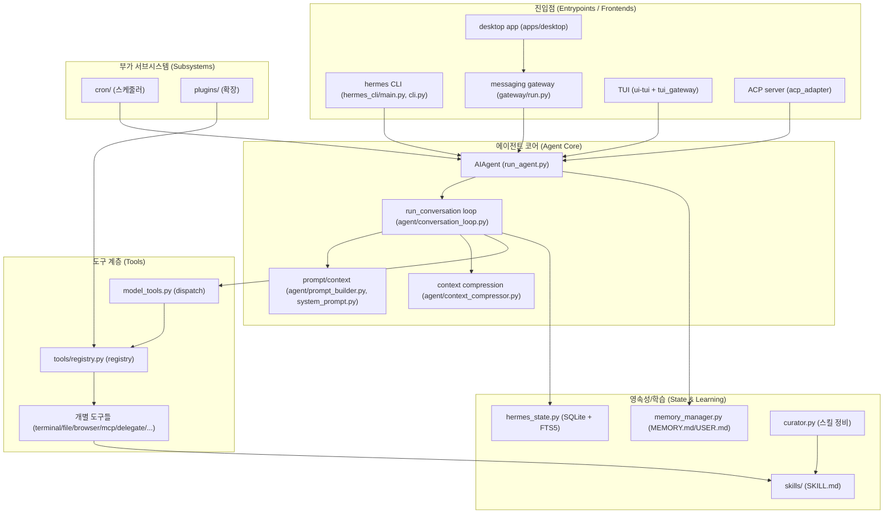
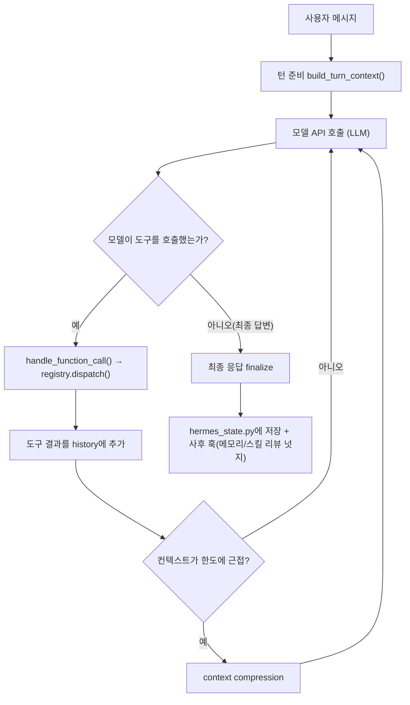

# Hermes Agent 학습자료 — 최상위 목차 (00_index)

> 이 문서는 `hermes-agent-gyu100` 리포지토리 전체를 "숲 → 나무 → 잎사귀" 순서로
> 이해하기 위한 학습자료의 **출발점(인덱스)** 입니다. 코드를 바꾸는 것이 목적이
> 아니라, 코드를 **읽고 이해**하는 것이 목적입니다. 모든 하위 문서는 한국어로
> 작성되었고, 초보자도 따라올 수 있도록 전문 용어가 처음 나올 때마다 쉬운 말로
> 풀어서 정의합니다.

---

## 0. 이 학습자료를 읽는 방법 (큰 맥락)

이 리포지토리는 **Hermes Agent** 라는 이름의 "스스로 학습하는 개인용 AI 에이전트"
프로젝트입니다. 여기서 몇 가지 용어를 먼저 아주 쉽게 풀어보겠습니다.

- **AI 에이전트(agent)**: 사람이 던진 목표를 받아, LLM ([용어사전](../dict/01_llm_basics.md#llm))(대형 언어 모델)에게
  "무엇을 할지" 물어보고, 그 답에 따라 **실제 행동(도구 사용)** 을 반복해서
  목표를 달성하는 프로그램입니다. 챗봇이 "말만" 한다면, 에이전트는 "터미널에서
  명령을 실행하고, 파일을 읽고 쓰고, 웹을 검색하는" 등 실제 일을 합니다.
- **LLM(Large Language Model)**: ChatGPT/Claude/Gemini 같은 대형 언어 모델.
  Hermes는 특정 모델에 묶이지 않고 여러 제공자(provider)를 바꿔가며 씁니다.
- **도구(tool) / 도구 호출 ([용어사전](../dict/02_agent_core.md#tool-calling))(tool-calling)**: LLM이 "이 함수를 이런 인자로
  불러줘"라고 요청하면, 프로그램이 그 함수를 실제로 실행하고 결과를 다시 LLM에게
  돌려주는 방식. Hermes의 핵심 동작 방식입니다. (자세한 배경은
  [tech_background/01_tool_calling.md](tech_background/01_tool_calling.md))

**읽는 순서 추천**: 처음이라면 `01 → 02 → 03 → 04` 순서로 읽어 전체 그림을
잡은 뒤, 관심 있는 서브시스템(05~10)으로 내려가는 것을 권합니다. 각 문서는
독립적으로도 읽을 수 있게 상단에 "이 문서에서 다루는 큰 맥락" 요약을 둡니다.

### 0-1. 학습 로드맵 — 나에게 맞는 경로 고르기

모든 문서에는 (1) 문서 첫머리에 **"들어가기 전에"**(이 문서를 읽는 데 필요한
최소 배경과 쉬운 비유), (2) 문서 끝에 **"정리 — 스스로 점검 질문"** 이 있습니다.
점검 질문에 답하지 못하면 다음 문서로 넘어가지 말고 해당 절을 다시 읽으세요.
모르는 용어는 언제든 본문 옆 "(용어사전)" 링크로 [dict/](../dict/README.md)에서
확인할 수 있습니다.

| 트랙 | 대상 | 경로 |
|------|------|------|
| A. 완전 처음 | 프로그래밍/AI 경험이 거의 없음 (중·고등학생 포함) | **[000_absolute_basics.md](000_absolute_basics.md)** → 01 → tech_background/01 → 04 → 05 → 06 → 07 → 나머지 |
| B. 개발 경험 있음 | 코드는 읽을 수 있지만 LLM 에이전트는 처음 | 01 → 02 → 03 → 04 → 05 → 06 → 07 → 08 → 09 → 10, 막히는 배경지식은 tech_background/에서 보충 |
| C. 주제별 골라 읽기 | 특정 서브시스템만 궁금함 | 아래 목차 표에서 해당 문서로 직행 (각 문서는 독립적으로 읽히도록 작성됨) |

난이도 감각 (★ 쉬움 ~ ★★★ 어려움):
000·01·02 ★ / 03·06·08·10 ★★ / 04·05·07·09 및 tech_background 대부분 ★★★
— ★★★ 문서는 앞의 ★·★★ 문서를 먼저 읽으면 훨씬 쉬워집니다.

---

## 1. 전체 목차 (대주제 → 하위 문서)

### 주제 1. 소스코드 이해

| 문서 | 대응 소주제 | 다루는 내용 |
|------|------------|------------|
| [000_absolute_basics.md](000_absolute_basics.md) | (기초 워밍업) | 프로그램·파이썬·API·JSON·LLM·토큰·프롬프트·에이전트·DB·Git — 사전지식 0에서 시작하는 10가지 기초 개념 |
| [01_source_overview.md](01_source_overview.md) | 1-A 전체 구조 개요 | 디렉토리 지도, 최상위 단일 모듈 vs 패키지, 진입점, 사용 언어(Python 3.11~3.13, 보조 JS/TS/Nix) |
| [02_modules_and_stack.md](02_modules_and_stack.md) | 1-B 모듈/기술 스택 | `pyproject.toml` 의존성 분류(LLM SDK/HTTP/CLI/검증/스케줄링/웹서버/프로세스), 정확 고정(exact pinning)·지연 설치(lazy deps) 설계 원칙 |
| [03_entrypoints.md](03_entrypoints.md) | 1-C-(1) 진입점 | `hermes_cli/main.py` → `cli.py`의 `HermesCLI`, `[project.scripts]` |
| [04_agent_loop.md](04_agent_loop.md) | 1-C-(2) 에이전트 두뇌 | `run_agent.py`의 `AIAgent` → `agent/conversation_loop.py`의 `run_conversation` 루프(모델 호출/도구 디스패치/재시도·폴백/압축/사후 훅) |
| [05_tools.md](05_tools.md) | 1-C-(3) 도구 계층 | `tools/registry.py` → `model_tools.py` → 대표 개별 도구들의 자기등록·디스패치 |
| [06_state.md](06_state.md) | 1-C-(4) 상태/영속성 | `hermes_state.py`의 SQLite 스키마, WAL 모드, FTS5 전체 텍스트 검색, `parent_session_id` 압축 세션 분할 |
| [07_prompt_context.md](07_prompt_context.md) | 1-C-(5) 프롬프트/컨텍스트 | `agent/prompt_builder.py`, `agent/system_prompt.py`, `agent/context_compressor.py`, `agent/context_engine.py` |
| [08_gateway.md](08_gateway.md) | 1-C-(6) 게이트웨이 | `gateway/run.py`의 `GatewayRunner` → `session.py` → `delivery.py` → `platforms/*` 및 `ADDING_A_PLATFORM.md` |
| [09_self_improvement.md](09_self_improvement.md) | 1-C-(7) 자기개선 루프 | `agent/curator.py`, `agent/learn_prompt.py`, `agent/learning_graph.py`, `agent/memory_manager.py`, `skills/`의 SKILL.md 구조 |
| [10_subsystems.md](10_subsystems.md) | 1-C-(8) 부가 서브시스템 | `cron/`, `plugins/`, `acp_adapter/`, 프론트엔드(`ui-tui/`, `apps/desktop/`, `web/`), 실행 환경 추상화(`tools/environments/`), 연구용 러너(`batch_runner.py` 등) |

### 주제 2. 관련 기술 학습 (배경지식)

| 문서 | 다루는 개념 |
|------|------------|
| [tech_background/01_tool_calling.md](tech_background/01_tool_calling.md) | Tool-calling / function-calling LLM 에이전트 |
| [tech_background/02_self_improving_agents.md](tech_background/02_self_improving_agents.md) | Self-improving agent(스킬 자동 생성·개선 루프) |
| [tech_background/03_context_compression.md](tech_background/03_context_compression.md) | Context compression(컨텍스트 압축) |
| [tech_background/04_moa.md](tech_background/04_moa.md) | Mixture-of-Agents (MoA) |
| [tech_background/05_mcp_and_acp.md](tech_background/05_mcp_and_acp.md) | Model Context Protocol(MCP), Agent Client Protocol(ACP) |
| [tech_background/06_retrieval_fts5.md](tech_background/06_retrieval_fts5.md) | Retrieval / FTS5 기반 세션 검색 |
| [tech_background/07_honcho_dialectic.md](tech_background/07_honcho_dialectic.md) | Honcho 변증법적(dialectic) 사용자 모델링 |
| [tech_background/08_cdp_browser.md](tech_background/08_cdp_browser.md) | Chrome DevTools Protocol(CDP) 기반 브라우저 제어 |
| [tech_background/09_execution_environments.md](tech_background/09_execution_environments.md) | 실행 환경 격리(local/Docker/SSH/Modal/Daytona/Singularity) |

---

## 2. 리포지토리 아키텍처 다이어그램

> 색상은 사용하지 않고, 모든 라벨은 큰따옴표로 감쌌습니다.

### 2-1. 큰 그림 — "하나의 에이전트 코어, 여러 개의 얼굴"

Hermes의 핵심 아이디어는 **동일한 에이전트 코어(`AIAgent`)** 를 CLI·메시징
게이트웨이 ([용어사전](../dict/07_gateway_interfaces.md#gateway))·TUI ([용어사전](../dict/07_gateway_interfaces.md#tui))·데스크톱·ACP ([용어사전](../dict/08_protocols.md#acp)) 등 여러 진입점(프론트엔드)이 공유한다는 것입니다.

### 2-2. 한 턴(turn)의 데이터 흐름

사용자가 메시지 하나를 보냈을 때(= 한 "턴") 내부에서 일어나는 반복 루프입니다.

---

## 3. 전문 용어집 (Glossary)

아래 용어들은 하위 문서에서 반복적으로 등장합니다. 처음 보는 용어는 여기서 먼저
개념을 잡고, 실제 코드에서의 의미는 각 하위 문서에서 라인 단위로 확인하세요.

- **Tool-calling loop (도구 호출 루프 ([용어사전](../dict/02_agent_core.md#tool-calling-loop)))**: LLM에게 물어보고 → 모델이 요청한 도구를
  실행하고 → 결과를 다시 모델에게 주고 → 다시 물어보는 반복. 모델이 더 이상 도구를
  호출하지 않고 최종 답을 낼 때까지 돕니다. Hermes에서는
  `agent/conversation_loop.py`의 `run_conversation`이 이 루프입니다.
- **Skill (스킬)**: 에이전트가 특정 작업을 잘 하도록 적어둔 **절차적 지식**입니다.
  `SKILL.md` 라는 마크다운 파일(맨 위 frontmatter + 본문 설명)로 저장되며,
  필요할 때만 본문을 읽어들여 토큰을 아낍니다(progressive disclosure). Hermes는
  경험에서 새 스킬을 **자동 생성**하고 사용 중 개선합니다.
- **Gateway (게이트웨이)**: Telegram·Discord·Slack 등 여러 메시징 플랫폼을 하나의
  프로세스에서 받아 에이전트로 연결하는 상시 실행 서비스. `gateway/run.py`의
  `GatewayRunner`가 중심입니다.
- **Curator ([용어사전](../dict/05_memory_self_improvement.md#curator)) (큐레이터)**: 백그라운드에서 에이전트가 만든 스킬들을 주기적으로
  점검(핀 고정/보관/통합/패치)하는 보조 작업. `agent/curator.py`.
- **Context compression (컨텍스트 압축 ([용어사전](../dict/04_prompt_context.md#context-compression)))**: 대화가 길어져 모델의 토큰 한도에
  가까워지면, 중간 내용을 요약본으로 갈아끼워 대화를 이어가는 기법.
  `agent/context_compressor.py`.
- **FTS5 ([용어사전](../dict/06_state_retrieval.md#fts5)) (Full-Text Search ([용어사전](../dict/06_state_retrieval.md#fts)) 5)**: SQLite ([용어사전](../dict/06_state_retrieval.md#sqlite))에 내장된 전체 텍스트 검색 엔진. Hermes는
  과거 대화 전체를 여기에 색인해 빠르게 검색합니다. `hermes_state.py`.
- **WAL (Write-Ahead Logging ([용어사전](../dict/06_state_retrieval.md#wal)))**: SQLite의 동시성 모드. 여러 읽기 + 한 개의
  쓰기를 동시에 허용해, 게이트웨이가 여러 플랫폼을 다뤄도 DB가 막히지 않게 합니다.
- **MCP ([용어사전](../dict/08_protocols.md#mcp)) (Model Context Protocol)**: 외부 "도구 서버"를 표준 프로토콜로 연결해
  에이전트가 그 서버의 도구를 자기 도구처럼 부르게 하는 규격. `tools/mcp_tool.py`.
- **MoA (Mixture-of-Agents ([용어사전](../dict/02_agent_core.md#moa)))**: 하나의 응답을 만들기 위해 여러 LLM을 조합/합의시키는
  기법. `agent/moa_loop.py`.
- **CDP ([용어사전](../dict/08_protocols.md#cdp)) (Chrome DevTools Protocol)**: 크롬 브라우저를 프로그램적으로 제어하는
  저수준 프로토콜. Hermes의 브라우저 도구가 이를 활용합니다. `tools/browser_cdp_tool.py`.
- **Delegation ([용어사전](../dict/02_agent_core.md#delegation)) (위임)**: 부모 에이전트가 하위 목표를 **격리된 자식 에이전트
  (subagent)** 에게 맡기는 것. 자식의 중간 과정은 부모 컨텍스트를 오염시키지 않고,
  요약 결과만 돌아옵니다. `tools/delegate_tool.py`.
- **ACP (Agent Client Protocol)**: 코드 에디터 같은 클라이언트가 에이전트와
  주고받는 표준 프로토콜. Hermes를 에디터에 붙일 때 사용. `acp_adapter/`.
- **Lazy deps (지연 설치 의존성 ([용어사전](../dict/09_execution_infra.md#lazy-deps)))**: 모든 세션이 쓰는 건 아닌 무거운/선택적
  패키지를 처음 필요할 때 설치하는 전략. `tools/lazy_deps.py`. 공급망 공격의
  피해 범위(blast radius)를 줄이는 보안 설계이기도 합니다.
- **Narrow waist (좁은 허리)**: "코어 도구 ([용어사전](../dict/03_tool_system.md#core-tools)) 스키마는 최소로, 기능은 가장자리(스킬/
  플러그인/CLI)로" 라는 설계 철학. 모든 도구가 매 API 호출마다 전송되므로 코어에
  도구를 추가하는 비용이 크기 때문입니다. (`AGENTS.md`)
- **Profile ([용어사전](../dict/07_gateway_interfaces.md#profile)) (프로파일)**: 서로 독립된 설정·상태를 갖는 격리된 환경. 기본 프로파일과
  작업용 프로파일을 나눠 쓸 수 있습니다.
- **YOLO mode**: 위험한 명령의 수동 승인 과정을 건너뛰는 설정.
- **Hardline blocklist**: 우회 불가능한(파괴적 명령을 막는) 보안 필터.

---

## 4. 근거/작성 원칙

- 이 학습자료는 **실제 리포지토리 파일을 직접 열어 라인 단위로 확인한 내용**을
  바탕으로 작성했습니다. 파일 경로와 라인 번호를 함께 표기하니, 항상 실제 코드와
  대조해가며 읽으세요.
- **라인 번호 주의**: 문서의 라인 번호는 작성 시점의 `main` 브랜치 기준입니다.
  코드가 계속 변하므로 시간이 지나면 몇 줄씩 어긋날 수 있습니다. 라인이 맞지 않으면
  함께 표기된 **함수/클래스/상수 이름**으로 검색(`grep -n "이름" 파일`)해서 찾으세요.
- 각 코드 인용은 GitHub에서 바로 열리도록 상대 링크(`../파일#L시작-L끝`)로 걸어
  두었습니다.
- Hermes 코어(특히 `cli.py`, `run_agent.py`, `hermes_state.py`,
  `agent/conversation_loop.py`)는 각각 수천~1만 라인이 넘는 매우 큰 파일입니다.
  이 문서들은 "전체 그림 → 핵심 함수/구조 → 대표 라인" 순서로 안내하며, 모든
  라인을 빠짐없이 옮겨 적기보다 **핵심 경로를 이해하고 스스로 읽어나갈 수 있도록**
  이정표를 제공하는 데 초점을 둡니다.
