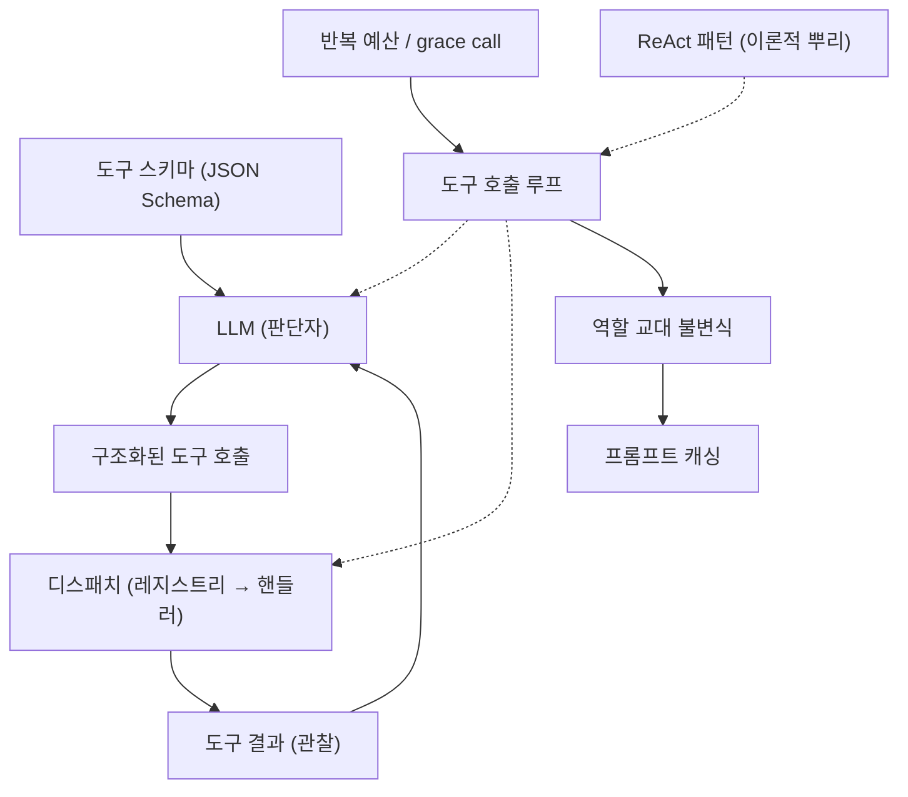

# 배경기술 01. Tool-calling / Function-calling LLM 에이전트

## 이 문서에서 다루는 큰 맥락

이 문서는 Hermes의 동작 원리 그 자체인 **도구 호출 ([용어사전](../../dict/02_agent_core.md#tool-calling))(tool-calling / function-calling)**
을 깊이 있게 다룹니다. 먼저 개념을 아주 쉬운 비유부터 정의하고, 이 개념을 이해하는
데 필요한 하위 개념들(스키마, 디스패치 ([용어사전](../../dict/03_tool_system.md#dispatch)), ReAct 패턴 ([용어사전](../../dict/02_agent_core.md#react)), 에이전트 루프, 반복 예산 ([용어사전](../../dict/02_agent_core.md#iteration-budget)) 등)을
하나씩 풀어낸 뒤, 개념들 사이의 관계를 그림으로 정리합니다. 마지막으로 이 기술이
어떤 논문·기술 문서에 근간을 두고 발전해 왔는지 연대기로 살펴보고, Hermes 코드와
연결합니다.

### 소목차
- [1. 핵심 정의: 말만 하는 챗봇에서 행동하는 에이전트로](#1-핵심-정의-말만-하는-챗봇에서-행동하는-에이전트로)
- [2. 하위 개념 상세](#2-하위-개념-상세)
- [3. 개념 간 관계 지도](#3-개념-간-관계-지도)
- [4. 히스토리와 근간 논문 (연대기)](#4-히스토리와-근간-논문-연대기)
- [5. 실무의 난제와 대응 기법](#5-실무의-난제와-대응-기법)
- [6. 이 저장소에서의 구현 연결](#6-이-저장소에서의-구현-연결)
- [7. 근간 문헌 및 참고자료](#7-근간-문헌-및-참고자료)

---

## 1. 핵심 정의: 말만 하는 챗봇에서 행동하는 에이전트로

**LLM ([용어사전](../../dict/01_llm_basics.md#llm))(대형 언어 모델)** 은 본질적으로 "다음 단어를 예측하는" 텍스트 생성기입니다.
그 자체로는 계산기도 못 두드리고, 파일도 못 읽고, 오늘 날씨도 모릅니다.

**함수 호출(function calling)** 혹은 **도구 호출(tool calling)** 은 이 한계를 깨는
장치입니다. 모델에게 미리 "너는 이런 함수들을 부를 수 있어"라고 **함수 목록(스키마)**
을 알려주면, 모델은 자연어 답변 대신 다음과 같은 **구조화된 요청**을 내놓을 수
있습니다:

```json
{"name": "terminal", "arguments": {"command": "ls -la"}}
```

프로그램(에이전트 런타임)은 이 요청을 받아 **실제로 그 함수를 실행**하고, 결과
문자열을 다시 모델에게 돌려줍니다. 모델은 결과를 읽고 다음 행동을 결정합니다.

비유하자면: LLM은 **지시만 내리는 감독**이고, 도구는 **손발**입니다. 감독은 "카메라
2번을 켜라"라고 말할 뿐, 실제로 카메라를 켜는 것은 스태프(런타임)입니다. 감독이
화면(도구 결과)을 보고 다음 지시를 내리는 반복 — 이것이 에이전트입니다.

이 반복 구조를 정리하면:

```
목표 수신 → [생각 → 도구 호출 → 결과 관찰] × N회 → 최종 답변
```

이 대괄호 부분의 반복을 **도구 호출 루프 ([용어사전](../../dict/02_agent_core.md#tool-calling-loop))(tool-calling loop)** 라고 부르며, Hermes
에서는 `agent/conversation_loop.py`의 `run_conversation`이 이 루프입니다
([04_agent_loop.md](../04_agent_loop.md)).

---

## 2. 하위 개념 상세

tool-calling 하나를 제대로 이해하려면 아래 하위 개념들이 필요합니다.

### 2-1. 도구 스키마 (tool schema)

모델에게 "이런 함수가 있다"고 알려주는 **JSON 명세**입니다. 보통 세 요소로 구성됩니다:

- `name` — 함수 이름 (예: `read_file`)
- `description` — 언제/왜 쓰는지 자연어 설명. **모델이 도구를 고르는 유일한 단서**
  이므로 사실상 "도구용 프롬프트"입니다.
- `parameters` — 인자들의 이름·타입·설명을 담은 **JSON Schema ([용어사전](../../dict/03_tool_system.md#json-schema))**. JSON Schema는
  "이 JSON은 이런 모양이어야 한다"를 기술하는 표준 규격입니다.

중요한 비용 특성: **스키마 전체가 매 API 호출마다 모델에게 전송**됩니다. 도구가
50개면 50개의 스키마가 매번 프롬프트에 실립니다. 이것이 Hermes의 "narrow waist
(좁은 허리)" 설계 — 코어 도구를 최소로 유지 — 의 직접적 이유입니다
([05_tools.md](../05_tools.md) 2절).

### 2-2. 디스패치 (dispatch)

모델이 내놓은 `{"name": ..., "arguments": ...}`를 받아 **실제 함수를 찾아 실행**하는
과정입니다. 하위 요소:

- **레지스트리(registry)**: 이름 → (스키마, 핸들러 ([용어사전](../../dict/03_tool_system.md#handler))) 매핑을 보관하는 자료구조.
- **핸들러(handler)**: 실제로 일하는 파이썬 함수.
- **결과 정규화 ([용어사전](../../dict/03_tool_system.md#result-normalization))(result normalization)**: 핸들러가 무엇을 반환하든(문자열/딕셔너리/
  이미지) 모델에게 돌려줄 일관된 형태로 변환.
- **오류 봉투(error envelope)**: 도구가 예외를 던져도 루프가 죽지 않도록
  `{"error": "..."}` JSON으로 감싸 모델에게 "실패했음"을 알려주는 관례. 모델은
  이 오류를 읽고 다른 방법을 시도할 수 있습니다.

### 2-3. ReAct 패턴 (Reasoning + Acting)

"생각(Thought) → 행동(Action) → 관찰(Observation)"을 명시적으로 번갈아 수행하게
하는 프롬프트/에이전트 패턴입니다 (Yao et al., 2022). 핵심 통찰은 두 가지:

- **생각만** 하는 모델(Chain-of-Thought)은 외부 정보가 없어 환각(hallucination)에
  취약하고,
- **행동만** 하는 모델은 계획 없이 헤맵니다.
- 둘을 **교차(interleave)** 시키면 행동이 생각을 접지(grounding)시키고, 생각이
  행동을 조직화합니다.

오늘날의 네이티브 함수 호출 에이전트는 사실상 ReAct의 구조화된 후예입니다 —
"Thought"는 모델의 (보이거나 숨겨진) 추론이 되고, "Action"은 구조화된 도구 호출이,
"Observation"은 도구 결과 메시지가 되었습니다.

### 2-4. 역할 교대 (role alternation)와 메시지 프로토콜

대화는 `system` / `user` / `assistant` / `tool` 역할의 메시지 배열로 표현됩니다.
도구 호출이 있는 대화에는 엄격한 순서 규칙이 있습니다:

```
assistant(tool_calls 포함) → tool(각 호출의 결과) → assistant(다음 응답) → ...
```

- 같은 역할이 연속으로 두 번 오면 안 되고(역할 교대 불변식 ([용어사전](../../dict/02_agent_core.md#role-alternation))), `tool` 메시지는 반드시
  대응하는 `tool_call_id`를 가져야 합니다.
- 이 규칙이 깨지면 API가 요청을 거부하거나, **프롬프트 캐시**(아래)가 무효화됩니다.
- Hermes의 `AGENTS.md`가 역할 교대를 "불변식(invariant)"으로 못 박는 이유입니다.

### 2-5. 프롬프트 캐싱 (prompt caching)

LLM 제공자는 **같은 프리픽스(앞부분)로 시작하는 요청**의 연산을 캐시해 비용/지연을
크게 줄여 줍니다. 도구 호출 루프는 매 반복마다 "이전 대화 전체 + 새 결과 한 개"를
보내므로, 앞부분이 바이트 단위로 동일하면 캐시가 적중합니다. 반대로 시스템 프롬프트를
중간에 조금이라도 바꾸면 캐시 전체가 무효화됩니다. Hermes가 "시스템 프롬프트는
세션 동안 바이트 고정"을 신성한 원칙으로 삼는 배경입니다
([07_prompt_context.md](../07_prompt_context.md)).

### 2-6. 반복 예산 (iteration budget)과 long-horizon 제어

루프는 이론상 무한히 돌 수 있으므로 상한이 필요합니다. 하위 개념:

- **최대 반복 횟수(max iterations)**: 한 턴에서 모델을 부를 수 있는 상한 (Hermes
  기본 90).
- **공유 예산(shared budget)**: 부모 에이전트가 자식(서브에이전트)에게 일을
  위임(delegation)할 때, 자식의 호출도 같은 예산에서 차감 — 자식 폭주로 인한
  비용 폭발을 구조적으로 차단.
- **grace call**: 예산이 바닥나도 "마무리 정리"를 위해 딱 한 번 더 허용되는 호출.
  예산 소진 시 결과가 통째로 사라지는 것을 막는 안전장치.

### 2-7. 병렬 도구 호출 (parallel tool calls)

모델이 한 응답에서 **여러 도구 호출을 동시에** 요청하는 기능. 서로 독립적인 읽기
작업(파일 3개 읽기 등)을 병렬화해 지연을 줄입니다. 런타임은 각 호출의 결과를
각각의 `tool_call_id`에 대응시켜 돌려줘야 합니다.

---

## 3. 개념 간 관계 지도



- **ReAct**는 루프의 *이론적 조상*이고, **함수 호출 API**는 그것의 *구조화된 구현*
  입니다.
- **스키마**는 모델의 입력 쪽, **디스패치**는 출력 쪽을 담당하며, 루프가 둘을
  반복적으로 잇습니다.
- **역할 교대**와 **프롬프트 캐싱 ([용어사전](../../dict/01_llm_basics.md#prompt-caching))**은 루프가 길어질수록 중요해지는 "운영 불변식"
  이며, **반복 예산**은 루프의 "브레이크"입니다.
- 이 문서의 루프 개념은 [03_context_compression.md](03_context_compression.md)
  (루프가 길어지면 컨텍스트가 넘침)와 [09_execution_environments.md](09_execution_environments.md)
  (도구 실행을 어디서 하는가)로 이어집니다.

---

## 4. 히스토리와 근간 논문 (연대기)

1. **2017 — Transformer ([용어사전](../../dict/01_llm_basics.md#transformer))** (Vaswani et al., "Attention ([용어사전](../../dict/01_llm_basics.md#attention)) Is All You Need"): 오늘날
   모든 LLM의 아키텍처 기반. 도구 호출 자체와는 무관하지만 전제 조건입니다.
2. **2021.12 — WebGPT** (OpenAI): GPT-3에게 텍스트 브라우저 명령("검색", "클릭",
   "인용")을 내리게 학습시켜, LLM이 **외부 도구로 사실성을 높일 수 있음**을 초기
   대규모로 입증했습니다.
3. **2022.01 — Chain-of-Thought** (Wei et al.): "단계적으로 생각하기"가 추론 성능을
   끌어올림을 보임. ReAct의 "Thought" 부분의 토대.
4. **2022.05 — MRKL Systems** (AI21 Labs): "LLM은 라우터, 전문 모듈(계산기, DB,
   API)이 실제 일을 한다"는 **모듈형 신경-기호(neuro-symbolic) 아키텍처**를 제안.
   현대 에이전트의 레지스트리+디스패치 구조의 개념적 원형입니다.
5. **2022.10 — ReAct** (Yao et al.): Thought/Action/Observation 교차 패턴을 정식화.
   이 시기의 구현은 모델이 뱉은 **일반 텍스트를 파싱**해 도구를 실행하는 방식이라
   형식이 조금만 어긋나도 깨지는 취약함이 있었습니다.
6. **2023.02 — Toolformer** (Schick et al., Meta): 모델이 **스스로 학습 데이터에
   API 호출을 삽입**해 도구 사용법을 배우게 함 — "도구 사용은 학습 가능한 능력"
   임을 보임.
7. **2023.05 — Gorilla** (Patil et al., Berkeley): 대규모 API 호출 정확도를 측정/
   개선. 이 연구진이 이후 **Berkeley Function Calling Leaderboard(BFCL)** 를 만들어
   함수 호출 능력의 표준 벤치마크가 됩니다.
8. **2023.06 — OpenAI 네이티브 함수 호출**: `gpt-4-0613`/`gpt-3.5-turbo-0613`에서
   API 수준의 함수 호출 도입. 모델이 JSON Schema에 맞는 호출을 **구조적으로**
   반환하게 되어 텍스트 파싱 취약성이 사라졌습니다. 이후 Anthropic(tool use),
   Google(function calling) 등 모든 주요 제공자가 채택했고, **병렬 도구 호출 ([용어사전](../../dict/02_agent_core.md#parallel-tool-calls))**
   (2023.11, OpenAI)도 표준이 되었습니다.
9. **2023.10 — SWE-bench** (Jimenez et al.): 실제 GitHub 이슈를 해결하는 능력을
   측정하는 벤치마크 ([용어사전](../../dict/13_model_learning.md#benchmark)). 도구 호출 에이전트의 **long-horizon 실전 능력**을 재는 사실상
   표준이 되었으며, 오늘날의 코딩 에이전트 붐(Hermes 같은 프로젝트 포함)을
   가속했습니다.
10. **2024~ — 에이전트 프레임워크의 성숙**: 다중 에이전트, 위임(delegation), 컨텍스트
    압축, MCP ([용어사전](../../dict/08_protocols.md#mcp))([05_mcp_and_acp.md](05_mcp_and_acp.md)) 같은 표준 프로토콜이 등장하며
    "루프 자체"보다 **루프 주변의 운영 문제**(비용, 캐시, 보안, 관측)가 연구/공학의
    중심이 되었습니다.

---

## 5. 실무의 난제와 대응 기법

논문이 아니라 운영에서 드러나는 문제들과, 업계의 일반적 대응입니다.

| 난제 | 설명 | 일반적 대응 |
|------|------|------------|
| 환각 도구 호출 | 존재하지 않는 도구/인자를 호출 | 레지스트리에서 조회 실패 시 오류 JSON 반환 → 모델이 스스로 교정 |
| 인자 손상 | JSON이 잘리거나 문법 오류 | 인자 복구(repair) 시도 후 실패 시 오류 반환 |
| 무한 루프 | 같은 실패를 무한 반복 | 반복 예산 + grace call |
| 도구 결과 폭주 | 한 결과가 수십만 토큰 | 결과 크기 상한(truncation) + 오버플로 파일 저장 |
| 프롬프트 인젝션 | 도구 결과(웹 페이지 등)에 악성 지시 포함 | 결과 살균(sanitization), 신뢰 경계 구분, 축소된 도구 집합 |
| 캐시 무효화 | 과거 메시지 변경으로 비용 폭증 | append-only 히스토리, 시스템 프롬프트 바이트 고정 |

---

## 6. 이 저장소에서의 구현 연결

Hermes는 위 개념들을 정면으로 구현합니다.

- **도구 호출 루프**: [04_agent_loop.md](../04_agent_loop.md)에서 본
  `agent/conversation_loop.py`의 `while` 루프가 곧 tool-calling loop입니다.
  [`agent/conversation_loop.py` 1009행](../../agent/conversation_loop.py#L1009)
- **반복 예산으로 long-horizon 제어**: `max_iterations=90`(`run_agent.py` 434행)과
  `IterationBudget`(부모/자식 공유), `_budget_grace_call`이 2-6절의 개념 그대로
  입니다.
- **스키마와 좁은 허리**: [05_tools.md](../05_tools.md)의 `toolsets.py`
  `_HERMES_CORE_TOOLS`가 2-1절의 "스키마 비용" 문제에 대한 답입니다.
- **디스패치와 오류 봉투**: `tools/registry.py`의 `dispatch`(614-644행)가 2-2절의
  구조를 그대로 구현 — 미등록 도구는 `{"error": "Unknown tool"}`, 모든 예외는
  살균된 오류 JSON으로 변환됩니다.
- **역할 교대와 캐시**: `AGENTS.md`의 두 불변식("role alternation", "prompt caching
  is sacred")이 2-4/2-5절에 해당하며, 사용자 중간 개입(redirect)조차 이 불변식을
  지키며 끼워 넣습니다([04](../04_agent_loop.md) 5절).
- **프롬프트 인젝션 ([용어사전](../../dict/10_security.md#prompt-injection)) 방어**: 웹훅용 축소 도구 집합 `_HERMES_WEBHOOK_SAFE_TOOLS`
  ([05](../05_tools.md) 2절)와 컨텍스트 파일 ([용어사전](../../dict/04_prompt_context.md#context-file)) 위협 스캔([07](../07_prompt_context.md))
  이 5절의 보안 난제에 대한 Hermes의 답입니다.

---

## 7. 근간 문헌 및 참고자료

이 문서의 내용이 근간을 두는 1차 자료들입니다.

**논문 (연대순)**
- Vaswani et al., "Attention Is All You Need" (2017) — <https://arxiv.org/abs/1706.03762>
- Nakano et al., "WebGPT: Browser-assisted question-answering" (2021) — <https://arxiv.org/abs/2112.09332>
- Wei et al., "Chain-of-Thought Prompting" (2022) — <https://arxiv.org/abs/2201.11903>
- Karpas et al., "MRKL Systems" (2022) — <https://arxiv.org/abs/2205.00445>
- Yao et al., "ReAct: Synergizing Reasoning and Acting in Language Models" (2022) — <https://arxiv.org/abs/2210.03629>
- Schick et al., "Toolformer: Language Models Can Teach Themselves to Use Tools" (2023) — <https://arxiv.org/abs/2302.04761>
- Patil et al., "Gorilla: Large Language Model Connected with Massive APIs" (2023) — <https://arxiv.org/abs/2305.15334>
- Jimenez et al., "SWE-bench" (2023) — <https://arxiv.org/abs/2310.06770>

**기술 문서 / 벤치마크**
- OpenAI Function Calling 가이드 — <https://platform.openai.com/docs/guides/function-calling>
- Anthropic Tool Use 문서 — <https://docs.anthropic.com/en/docs/build-with-claude/tool-use>
- Berkeley Function Calling Leaderboard — <https://gorilla.cs.berkeley.edu/leaderboard.html>
- JSON Schema 규격 — <https://json-schema.org/>

다음 문서: 이 루프를 "경험에서 배우는" 방향으로 확장한
[02_self_improving_agents.md](02_self_improving_agents.md)
