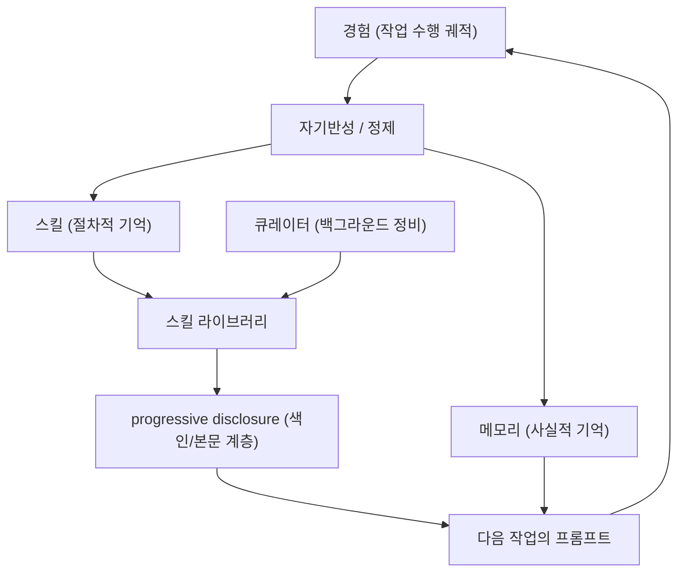

# 배경기술 02. Self-improving Agent (자기개선 에이전트)

## 이 문서에서 다루는 큰 맥락

보통의 챗봇은 대화가 끝나면 모든 것을 잊습니다. 이 문서는 에이전트가 경험에서
**스스로 능력을 늘려가는** 아이디어 — Hermes의 정체성인 "스스로 학습하는 에이전트"
의 이론적 배경 — 를 다룹니다. 핵심 정의부터 시작해, 이를 구성하는 하위 개념들
(절차적 기억 vs 사실적 기억, 스킬 라이브러리, progressive disclosure, 큐레이션,
자기반성)을 상세히 풀고, 개념 간 관계와 근간 논문(Voyager, Reflexion, Generative
Agents 등)의 히스토리를 정리한 뒤 Hermes 코드와 연결합니다.

### 소목차
- [1. 핵심 정의](#1-핵심-정의)
- [2. 하위 개념 상세](#2-하위-개념-상세)
- [3. 개념 간 관계 지도](#3-개념-간-관계-지도)
- [4. 히스토리와 근간 논문 (연대기)](#4-히스토리와-근간-논문-연대기)
- [5. 실무의 난제](#5-실무의-난제)
- [6. 이 저장소에서의 구현 연결](#6-이-저장소에서의-구현-연결)
- [7. 근간 문헌 및 참고자료](#7-근간-문헌-및-참고자료)

---

## 들어가기 전에 — 필요한 배경과 비유

**필요한 배경**: [01_tool_calling.md](01_tool_calling.md)의 도구 호출 루프.

**비유**: 매일 기억이 초기화되는 직원이라도, 퇴근 전에 오늘 배운 것을 **업무 일지와
매뉴얼**로 남기면 회사는 계속 똑똑해집니다. 자기개선 에이전트는 모델 가중치를 바꾸지
않고(재학습 없이), **경험을 글(스킬·메모리)로 바꿔 다음 세션에 재사용**하는 방식으로
똑똑해집니다. "학습 = 가중치 수정"이 아니라 "학습 = 문서 축적"이라는 발상의 전환이
이 문서의 핵심입니다.

**학습 목표**: Voyager·Reflexion 같은 연구가 보여준 아이디어와 Hermes의 스킬/큐레이터
구현을 연결해 설명할 수 있게 됩니다.

---

## 1. 핵심 정의

**자기개선 에이전트 ([용어사전](../../dict/05_memory_self_improvement.md#self-improving-agent))(self-improving agent)** 란, 작업을 수행하며 얻은 경험을
**재사용 가능한 지식**으로 축적하고, 그 지식을 다음 작업에 활용해 **시간이 지날수록
더 잘하게 되는** 에이전트입니다.

중요한 구분: 여기서 말하는 "학습"은 대부분 **모델 가중치를 바꾸는 학습(파인튜닝 ([용어사전](../../dict/13_model_learning.md#fine-tuning)))이
아닙니다**. 모델은 그대로 두고, 모델에게 주는 **프롬프트와 외부 저장소(파일, DB)**
를 개선하는 방식입니다. 이를 흔히 **in-context learning 기반의 지속 학습**이라
부릅니다. 장점은:

- **즉시성**: 배운 것이 다음 턴부터 바로 적용됩니다 (학습 파이프라인 불필요).
- **저비용**: GPU 학습이 필요 없습니다.
- **투명성**: 배운 내용이 사람이 읽을 수 있는 마크다운/텍스트로 남습니다.
- **가역성**: 잘못 배운 것은 파일을 고치거나 지우면 됩니다.

인지과학의 기억 분류를 빌리면, 자기개선은 두 축으로 나뉩니다:

| 축 | 인지과학 용어 | 내용 | Hermes에서 |
|----|-------------|------|-----------|
| "어떻게 하는가" | **절차적 기억(procedural memory)** | 작업 수행 절차, 요령, 함정 | 스킬(`SKILL.md`) |
| "무엇이 사실인가" | **의미적/일화적 기억(semantic/episodic)** | 사용자 취향, 환경 사실, 과거 사건 | `MEMORY.md`/`USER.md`, 세션 DB |

---

## 2. 하위 개념 상세

### 2-1. 스킬 (skill)과 스킬 라이브러리 (skill library)

**스킬**은 "특정 작업을 잘 하는 법"을 담은 재사용 가능한 지식 단위입니다. 형태는
시스템마다 다릅니다 — Voyager(2023)에서는 검증된 **자바스크립트 코드**였고, 요즘
에이전트(Hermes, Claude Skills 등)에서는 **마크다운 문서 + 선택적 스크립트**입니다.

**스킬 라이브러리**는 이런 스킬들의 축적입니다. 핵심 설계 질문 세 가지:

1. **획득(acquisition)**: 스킬을 언제/어떻게 만드는가? (성공 경험의 정제, 사용자
   지시(`/learn`), 문서 요약)
2. **검색(retrieval)**: 지금 작업에 맞는 스킬을 어떻게 찾는가? (색인, 임베딩 검색,
   이름/설명 매칭)
3. **유지보수(maintenance)**: 낡거나 중복된 스킬을 어떻게 관리하는가? (큐레이션)

### 2-2. Progressive disclosure (점진적 공개)

스킬이 수십~수백 개가 되면 전부를 프롬프트에 넣을 수 없습니다(토큰 비용).
**점진적 공개 ([용어사전](../../dict/05_memory_self_improvement.md#progressive-disclosure))**는 이를 해결하는 계층화 전략입니다:

- **1단계 — 색인(index)**: 모든 스킬의 "이름 + 한 줄 설명"만 시스템 프롬프트에 상주.
- **2단계 — 본문(body)**: 모델이 관련 있다고 판단한 스킬만 도구 호출 ([용어사전](../../dict/02_agent_core.md#tool-calling))(`skill_view`)로
  본문을 로드.
- **3단계 — 자원(resources)**: 스킬에 딸린 스크립트/데이터는 실행할 때만 접근.

이 구조 때문에 **1단계 설명의 품질이 결정적**입니다 — 설명이 나쁘면 모델이 스킬의
존재를 알아도 꺼내 쓰지 않습니다(라우팅 실패). Hermes가 frontmatter 설명을 "60자
이내 한 문장"으로 강제하는 이유입니다(6절).

### 2-3. 큐레이션 (curation)

지식이 쌓이기만 하면 **오염**됩니다: 중복 스킬, 낡은 정보, 서로 모순되는 항목.
**큐레이터 ([용어사전](../../dict/05_memory_self_improvement.md#curator))**는 백그라운드에서 라이브러리를 정비하는 프로세스입니다. 안전한 큐레이션의
원칙(Hermes가 불변식으로 채택):

- **비파괴(non-destructive)**: 삭제 대신 보관(archive) — 잘못 지운 지식은 복구가
  어렵기 때문.
- **범위 제한**: 자동 생성된 지식만 건드리고, 사람이 만든 것은 손대지 않음.
- **핀 고정(pinning)**: 사용자가 중요 표시한 항목은 자동 정비에서 제외.

### 2-4. 자기반성 (self-reflection)

실패한 시도에서 "무엇이 잘못됐는지"를 언어로 정리해 다음 시도에 주입하는 기법
(Reflexion, 2023). 가중치 업데이트 없이 **언어적 피드백을 기억으로** 쓰는 것이
핵심이며, "경험 → 언어화된 교훈 → 재사용"이라는 구조는 스킬 획득과 동형입니다.
Self-Refine(2023)은 같은 아이디어를 단일 응답 개선에 적용했습니다.

### 2-5. 장기 기억 시스템 (long-term memory)

대화에서 사실을 추출·요약해 저장하고, 이후 세션의 프롬프트에 주입하는 시스템.
Generative Agents(2023)가 "기억 스트림 + 중요도 기반 회상 + 주기적 반성(reflection)"
구조로 유명해졌고, MemGPT(2023)는 운영체제의 가상 메모리처럼 "메인 컨텍스트 ↔ 외부
저장소" 사이를 페이징하는 구조를 제안했습니다. 상용/오픈소스 구현으로 mem0,
Honcho ([용어사전](../../dict/05_memory_self_improvement.md#honcho))([07_honcho_dialectic.md](07_honcho_dialectic.md)), supermemory 등이 있습니다.

---

## 3. 개념 간 관계 지도

- 전체가 **순환 루프**입니다: 경험 → 지식 → 더 나은 수행 → 새 경험.
- 이 루프는 [01_tool_calling.md](01_tool_calling.md)의 도구 호출 루프 ([용어사전](../../dict/02_agent_core.md#tool-calling-loop)) **바깥**을
  도는 더 느린 루프입니다 (안쪽 루프: 초 단위, 자기개선 루프: 세션~일 단위).
- 메모리 주입은 [03_context_compression.md](03_context_compression.md)의 컨텍스트
  예산 문제와 직결되고, 사용자 모델링 ([용어사전](../../dict/05_memory_self_improvement.md#user-modeling)) 축은
  [07_honcho_dialectic.md](07_honcho_dialectic.md)로 이어집니다.

---

## 4. 히스토리와 근간 논문 (연대기)

1. **2023.03 — Reflexion** (Shinn et al.): 실패 후 "언어적 자기반성"을 에피소드
   기억에 저장해 재시도 성능을 크게 올림. **가중치 업데이트 없는 강화**라는 관점을
   정립했습니다.
2. **2023.03 — Self-Refine** (Madaan et al.): 모델이 자기 출력을 스스로 비평하고
   고치는 반복 루프. "생성자와 비평자가 같은 모델"이어도 개선됨을 보임.
3. **2023.04 — Generative Agents** (Park et al., Stanford): 가상 마을의 25개
   에이전트가 **기억 스트림 → 회상 → 반성 → 계획**의 인지 구조로 장기간 일관된
   행동을 유지. 장기 기억 아키텍처의 교과서적 설계가 되었습니다.
4. **2023.05 — Voyager** (Wang et al., NVIDIA): 마인크래프트에서 **평생 학습
   (lifelong learning)** 에이전트를 구현. 성공한 행동을 검증된 코드로 저장하는
   **skill library**를 도입했고, 이것이 "스킬 축적형 자기개선"의 원형입니다.
5. **2023.10 — MemGPT** (Packer et al.): LLM ([용어사전](../../dict/01_llm_basics.md#llm)) 컨텍스트를 OS 메모리 계층처럼 관리 —
   메인 컨텍스트(RAM)와 외부 저장소(디스크) 사이를 에이전트 스스로 페이징. 이후
   Letta로 발전했습니다.
6. **2024~ — 제품화 단계**: mem0, Honcho 같은 메모리 서비스, Anthropic의 Claude
   Skills(마크다운 스킬 + progressive disclosure) 등 연구 아이디어가 표준 제품
   패턴으로 정착했습니다. Hermes의 스킬/메모리/큐레이터 구조는 이 세대에
   속합니다.

---

## 5. 실무의 난제

- **지식 오염(knowledge drift)**: 잘못 배운 스킬이 이후 작업을 계속 오염 → 큐레이션
  과 비파괴 원칙으로 완화.
- **라우팅 실패**: 좋은 스킬이 있어도 모델이 안 꺼내 씀 → 색인 설명 품질 관리
  (60자 규칙), 관련 스킬 링크.
- **평가의 어려움**: "장기적으로 더 나아졌는가"는 단일 벤치마크로 재기 어려워,
  실사용 궤적 분석과 스킬 사용 횟수 같은 대리 지표에 의존합니다.
- **보안**: 외부에서 온 문서를 스킬로 정제할 때 악성 지시가 절차적 기억에 심어질
  수 있음(promptware) → 위협 스캔([07_prompt_context.md](../07_prompt_context.md)).

---

## 6. 이 저장소에서의 구현 연결

[09_self_improvement.md](../09_self_improvement.md)가 코드를 라인 단위로 다룹니다.
개념 → 코드 대응:

- **스킬 라이브러리 + progressive disclosure**: `SKILL.md`의 frontmatter 60자 설명만
  시스템 프롬프트에 색인되고 본문은 `skill_view`로 지연 로드 — 2-2절의 3계층
  구조 그대로입니다. 실물 예:
  [`skills/creative/ascii-art/SKILL.md`](../../skills/creative/ascii-art/SKILL.md)
- **스킬 획득(`/learn`)**: `agent/learn_prompt.py`가 경험/문서/코드를 스킬로 정제하는
  표준 프롬프트를 생성. 별도 증류 엔진이나 새 코어 도구 ([용어사전](../../dict/03_tool_system.md#core-tools)) 없이 기존 도구
  (`skill_manage`)로 수행(18-22행) — 자기개선조차 "narrow waist" 원칙을 지킵니다.
- **큐레이션**: `agent/curator.py`가 유휴 시(inactivity-triggered) 포크된 에이전트로
  스킬을 정비하되, **에이전트 생성 스킬만 / 삭제 없이 보관만 / 핀 고정 존중 /
  메인 세션 프롬프트 캐시 불침해**의 불변식(15-19행)을 지킴 — 2-3절의 안전 원칙
  그대로입니다.
- **장기 기억**: `agent/memory_manager.py`가 파일 기반 `MEMORY.md`/`USER.md`와
  외부 provider(Honcho/mem0/supermemory 플러그인)를 단일 지점에서 오케스트레이션 ([용어사전](../../dict/02_agent_core.md#orchestration)).
  외부 provider는 동시에 하나만 허용됩니다.
- **학습 가시화**: `agent/learning_graph.py`가 학습된 스킬과 메모리 청크를 노드로,
  선언된 관련성(`related_skills`)과 어휘 중첩을 엣지로 하는 그래프를 만들어
  데스크톱 앱에서 "배움"을 눈으로 보여줍니다.

---

## 7. 근간 문헌 및 참고자료

**논문 (연대순)**
- Shinn et al., "Reflexion: Language Agents with Verbal Reinforcement Learning" (2023) — <https://arxiv.org/abs/2303.11366>
- Madaan et al., "Self-Refine: Iterative Refinement with Self-Feedback" (2023) — <https://arxiv.org/abs/2303.17651>
- Park et al., "Generative Agents: Interactive Simulacra of Human Behavior" (2023) — <https://arxiv.org/abs/2304.03442>
- Wang et al., "Voyager: An Open-Ended Embodied Agent with Large Language Models" (2023) — <https://arxiv.org/abs/2305.16291>
- Packer et al., "MemGPT: Towards LLMs as Operating Systems" (2023) — <https://arxiv.org/abs/2310.08560>

**기술 문서**
- Anthropic, "Agent Skills" 문서 (마크다운 스킬 + progressive disclosure 패턴) — <https://docs.anthropic.com/en/docs/agents-and-tools/agent-skills>
- mem0 — <https://mem0.ai/> / Letta(구 MemGPT) — <https://www.letta.com/>

---

## 정리 — 스스로 점검 질문

1. "가중치 재학습 없는 학습"이 가능한 이유를 컨텍스트/프롬프트 관점에서 설명할 수 있는가?
2. Voyager의 스킬 라이브러리와 Hermes의 SKILL.md 체계는 무엇이 같고 무엇이 다른가?
3. 자기개선 루프에서 "잘못된 교훈이 축적되는" 위험은 무엇으로 관리되는가? (힌트: 큐레이터·표준)
4. 절차적 기억(스킬)과 의미적 기억(메모리)의 차이는?

다음 문서: 축적된 지식과 대화가 컨텍스트 한도를 넘을 때의 대응 —
[03_context_compression.md](03_context_compression.md)
