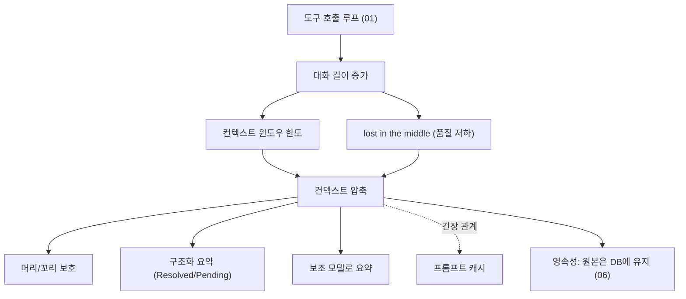

# 배경기술 03. Context Compression (컨텍스트 압축)

## 이 문서에서 다루는 큰 맥락

LLM ([용어사전](../../dict/01_llm_basics.md#llm))은 한 번에 처리할 수 있는 텍스트 양(**컨텍스트 윈도우 ([용어사전](../../dict/01_llm_basics.md#context-window))**)에 한계가 있습니다.
에이전트는 도구 호출 루프를 돌며 대화가 빠르게 길어지므로 이 한계에 자주
부딪힙니다. 이 문서는 그 대응 기법인 **컨텍스트 압축 ([용어사전](../../dict/04_prompt_context.md#context-compression))**을 다룹니다 — 토큰/컨텍스트
윈도우/프롬프트 캐시 같은 전제 개념부터, 압축 전략의 종류(삭제/요약/머리·꼬리
보호), "lost in the middle" 현상, 그리고 압축과 프롬프트 캐시의 근본적 긴장 관계
까지 하위 개념을 상세히 풀고, 근간 논문과 Hermes 구현을 연결합니다.

### 소목차
- [1. 핵심 정의와 전제 개념](#1-핵심-정의와-전제-개념)
- [2. 하위 개념 상세](#2-하위-개념-상세)
- [3. 개념 간 관계 지도](#3-개념-간-관계-지도)
- [4. 히스토리와 근간 논문](#4-히스토리와-근간-논문)
- [5. 압축 정책 설계의 트레이드오프](#5-압축-정책-설계의-트레이드오프)
- [6. 이 저장소에서의 구현 연결](#6-이-저장소에서의-구현-연결)
- [7. 근간 문헌 및 참고자료](#7-근간-문헌-및-참고자료)

---

## 1. 핵심 정의와 전제 개념

### 토큰 (token)

LLM이 텍스트를 처리하는 최소 단위. 대략 영어 단어의 3/4, 한국어 1~2글자 정도가
토큰 하나입니다. 모델 사용 요금도, 컨텍스트 한도도 토큰 단위로 계산됩니다.

### 컨텍스트 윈도우 (context window)

모델이 **한 번의 호출에서 볼 수 있는 토큰의 최대 개수**입니다 (수만~수백만).
중요한 것은, 대화형 API는 상태가 없어서(stateless) **매 호출마다 지금까지의 대화
전체를 다시 보내야** 한다는 점입니다. 즉 대화가 길어질수록:

1. 매 호출 비용이 선형으로 증가하고,
2. 언젠가 윈도우 한도를 초과하며,
3. 한도 내라도 성능이 떨어질 수 있습니다(아래 "lost in the middle").

### 컨텍스트 압축 (context compression / compaction)

한도에 근접했을 때 **오래된 대화를 요약본으로 대체**해, 핵심 정보는 유지하면서
토큰 수를 줄이는 기법입니다. "요약은 정보 손실을 동반한다"는 근본 트레이드오프
때문에, **무엇을 요약하고 무엇을 원문 그대로 남길지의 정책**이 품질을 좌우합니다.

---

## 2. 하위 개념 상세

### 2-1. 압축 전략의 스펙트럼

간단한 것부터 정교한 것 순으로:

1. **잘라내기(truncation) / 슬라이딩 윈도우**: 오래된 메시지를 그냥 삭제.
   구현이 가장 쉽지만, 맨 앞의 **작업 정의**(사용자가 원래 뭘 시켰는지)가 사라지는
   치명적 문제가 있습니다.
2. **요약 기반 압축 ([용어사전](../../dict/04_prompt_context.md#summarization))(summarization)**: 중간 대화를 LLM으로 요약해 한 덩어리로 대체.
   정보 보존이 훨씬 좋지만 요약 자체에 모델 호출 비용이 듭니다.
3. **머리/꼬리 보호 ([용어사전](../../dict/04_prompt_context.md#head-tail-protection))(head/tail protection)**: 맨 앞(시스템 프롬프트 ([용어사전](../../dict/01_llm_basics.md#system-prompt)), 초기 작업 정의)과
   맨 뒤(최근 맥락)는 원문 유지하고 **중간만** 요약. 현재의 사실상 표준입니다.
4. **구조화 요약 ([용어사전](../../dict/04_prompt_context.md#structured-summary))(structured summary)**: 산문 대신 "해결된 것/미해결인 것/열린 질문"
   같은 템플릿으로 요약 — 후속 작업에 필요한 정보의 누락을 구조적으로 줄입니다.
5. **토큰 수준 압축(예: LLMLingua)**: 문장을 남기되 덜 중요한 토큰을 제거하는
   프롬프트 압축 연구 계열.
6. **대안 컨텍스트 엔진 ([용어사전](../../dict/04_prompt_context.md#context-engine))**: 요약 대신 그래프/외부 메모리 페이징(MemGPT 방식) 등으로
   컨텍스트를 관리하는 접근.

### 2-2. "Lost in the middle" 현상

Liu et al.(2023)의 유명한 발견: 긴 컨텍스트에서 모델은 **맨 앞과 맨 뒤의 정보는 잘
쓰지만 중간의 정보는 놓치는** U자형 성능 곡선을 보입니다. 시사점 두 가지:

- 컨텍스트가 커도 "다 넣으면 다 본다"는 보장이 없다 → 압축은 한도 문제만이 아니라
  **품질 문제**에 대한 대응이기도 합니다.
- 중간을 요약으로 대체하는 head/tail 보호 전략은 이 현상과 방향이 일치합니다 —
  어차피 모델이 잘 못 보는 구간을 압축하는 셈입니다.

### 2-3. 프롬프트 캐시와의 긴장 관계

[01_tool_calling.md](01_tool_calling.md) 2-5절의 프롬프트 캐싱을 떠올려 보세요.
캐시는 "앞부분이 바이트 단위로 동일"할 때 적중하는데, **압축은 정확히 그 앞부분을
바꿉니다**. 즉:

- 압축 직후 첫 호출은 캐시 전체 미스 → 일시적 비용 급증.
- 하지만 압축하지 않으면 매 호출이 점점 비싸지고 결국 한도 초과.

그래서 실무 원칙은 **"가능한 드물게, 하지만 필요해지기 전에"** 압축하는 것입니다.
압축 임계값(예: 한도의 70~80%)과 압축 후 목표 크기의 선택이 이 균형을 조절합니다.

### 2-4. 보조 모델 (auxiliary model)

요약 자체도 LLM 호출입니다. 메인 모델(비싸고 똑똑함)로 요약하면 낭비이므로,
**값싸고 빠른 보조 모델 ([용어사전](../../dict/01_llm_basics.md#auxiliary-model))**로 요약을 수행하는 것이 일반적입니다. 보조 모델은 요약
외에도 제목 생성, 백그라운드 정비([02](02_self_improving_agents.md)의 큐레이터 ([용어사전](../../dict/05_memory_self_improvement.md#curator)))
같은 "본 대화가 아닌 잡무"에 쓰입니다.

### 2-5. 요약의 안전성 문제 (filter-safe summarization)

과거 대화를 요약할 때 미묘한 함정이 있습니다: 요약자가 과거의 지시문("~해라")을
요약에 그대로 옮기면, 메인 모델이 그것을 **지금 실행해야 할 활성 지시**로 오인할
수 있습니다. 그래서 요약 프롬프트에 "이것은 과거 기록이다"를 명확히 하는
프리앰블을 넣고, 요약 결과를 구조적으로 구분하는 방어가 필요합니다.

### 2-6. 압축과 영속성의 분리

압축은 **모델에게 보내는 것**을 줄이는 일이지, **기록을 지우는 일**이 아닙니다.
잘 설계된 시스템은 원본 메시지를 DB에 그대로 남기고(검색/감사 가능), "현재 활성
컨텍스트에 포함되는가"만 플래그로 관리합니다.

---

## 3. 개념 간 관계 지도

- 압축은 [01](01_tool_calling.md)의 루프가 만들어내는 문제에 대한 해법이고,
  [06_retrieval_fts5.md](06_retrieval_fts5.md)의 세션 검색 ([용어사전](../../dict/06_state_retrieval.md#session-search))(원본은 남아 있으므로
  검색 가능)과 상보적입니다.
- "무엇을 기억으로 승격시킬 것인가"라는 관점에서
  [02_self_improving_agents.md](02_self_improving_agents.md)의 메모리 시스템과도
  연결됩니다 — 압축은 단기적 대응, 메모리/스킬은 장기적 대응입니다.

---

## 4. 히스토리와 근간 논문

1. **초기 (2020~2022)**: 컨텍스트가 2K~4K 토큰이던 시절, 챗봇들은 슬라이딩 윈도우나
   "대화 요약을 프롬프트에 넣기"(LangChain의 ConversationSummaryMemory 류)로
   버텼습니다.
2. **2023.07 — "Lost in the Middle ([용어사전](../../dict/04_prompt_context.md#lost-in-the-middle))"** (Liu et al.): 긴 컨텍스트의 U자형 성능 곡선을
   정량화. "윈도우를 키우는 것만으로는 부족하다"는 인식을 확산시켰습니다.
3. **2023.10 — MemGPT** (Packer et al.): 컨텍스트를 OS 가상 메모리처럼 계층화하고
   에이전트가 스스로 페이징하게 함 — "압축"을 넘어 "컨텍스트 관리"라는 더 큰 틀을
   제시했습니다.
4. **2023.10 — LLMLingua** (Jiang et al., Microsoft): 작은 모델로 프롬프트의 덜
   중요한 토큰을 제거하는 토큰 수준 압축 계열의 대표작.
5. **2024~ — 에이전트 시대의 컴팩션**: 코딩 에이전트들이 수백 턴짜리 세션을 다루게
   되면서, head/tail 보호 + 구조화 요약 + 보조 모델 조합이 사실상의 표준 패턴으로
   수렴했습니다. "context engineering"이라는 용어가 프롬프트 엔지니어링을 대체하는
   흐름도 이 시기입니다. 컨텍스트 윈도우가 백만 토큰급으로 커졌지만 **비용·지연·
   품질** 때문에 압축의 필요는 사라지지 않았습니다.

---

## 5. 압축 정책 설계의 트레이드오프

| 결정 | 한쪽 극단 | 반대 극단 | 균형점 |
|------|----------|----------|--------|
| 언제 압축? | 매 턴 (캐시 항상 미스) | 한도 초과 직전 (실패 위험) | 임계값 기반 (예: 70~80%) |
| 얼마나 남김? | 요약만 (정보 손실 큼) | 거의 안 줄임 (금방 또 압축) | 토큰 예산 기반 꼬리 보호 |
| 무엇을 보호? | 아무것도 | 전부 | 머리(작업 정의) + 꼬리(최근 맥락) |
| 도구 출력은? | 원문 유지 (낭비) | 전부 삭제 (근거 소실) | 요약 전 사전 정리(pruning) |
| 실패하면? | 무한 재시도 | 즉시 포기 | 쿨다운 + 폴백 전략 |

---

## 6. 이 저장소에서의 구현 연결

[07_prompt_context.md](../07_prompt_context.md)가 코드를 상세히 다룹니다.
개념 → 코드 대응:

- **압축기**: `agent/context_compressor.py`가 **보조 모델**(2-4절)로 중간 턴을
  요약하고 **머리/꼬리를 보호**(2-1절 3번)합니다.
  [`agent/context_compressor.py` 1-17행](../../agent/context_compressor.py#L1-L17)
  - 구조화된 요약 템플릿(Resolved/Pending — 2-1절 4번, 7-8행)
  - 필터-안전 프리앰블(2-5절, 9행)
  - 토큰 예산 기반 꼬리 보호 ([용어사전](../../dict/04_prompt_context.md#token-budget-tail))(13행), 도구 출력 사전 정리(14행), 반복 압축 시 기존
    요약 보존(12행)
- **압축이 유일한 프롬프트-캐시 예외**: `agent/system_prompt.py` 1-9행이 "시스템
  프롬프트는 세션당 한 번 만들고, 오직 컨텍스트 압축만 재빌드를 유발한다"고 명시 —
  2-3절의 긴장 관계에 대한 Hermes의 답입니다. `AGENTS.md`도 이를 최상위 설계
  원칙("prompt caching is sacred, the one exception is context compression")으로
  못 박습니다.
- **압축 엔진 교체 가능**: `agent/context_engine.py`가 ABC로 lifecycle
  (`should_compress`/`compress` 등)을 정의해, 요약 외 전략(2-1절 6번)을
  `config.yaml`의 `context.engine`으로 갈아끼울 수 있습니다(1-26행).
- **압축과 영속성의 분리**(2-6절): 압축된 원본 메시지는 삭제되지 않고
  `messages.active=0`/`compacted=1`로 표시되며, 세션은 `parent_session_id` 체인으로
  분할됩니다([06_state.md](../06_state.md)). 덕분에 압축 후에도 과거 대화를
  검색([06_retrieval_fts5.md](06_retrieval_fts5.md))할 수 있습니다.
- **실패 대비**: `sessions` 테이블의 `compression_failure_cooldown_until`,
  `compression_fallback_streak`, `compression_ineffective_count` 컬럼
  ([06](../06_state.md) 스키마)이 5절 표의 "실패하면?" 행에 해당하는 방어입니다.

---

## 7. 근간 문헌 및 참고자료

**논문**
- Liu et al., "Lost in the Middle: How Language Models Use Long Contexts" (2023) — <https://arxiv.org/abs/2307.03172>
- Packer et al., "MemGPT: Towards LLMs as Operating Systems" (2023) — <https://arxiv.org/abs/2310.08560>
- Jiang et al., "LLMLingua: Compressing Prompts for Accelerated Inference" (2023) — <https://arxiv.org/abs/2310.05736>

**기술 문서**
- Anthropic, "Prompt caching" 문서 — <https://docs.anthropic.com/en/docs/build-with-claude/prompt-caching>
- OpenAI, "Prompt caching" 문서 — <https://platform.openai.com/docs/guides/prompt-caching>

다음 문서: 여러 모델을 조합해 응답 품질을 높이는
[04_moa.md](04_moa.md)
