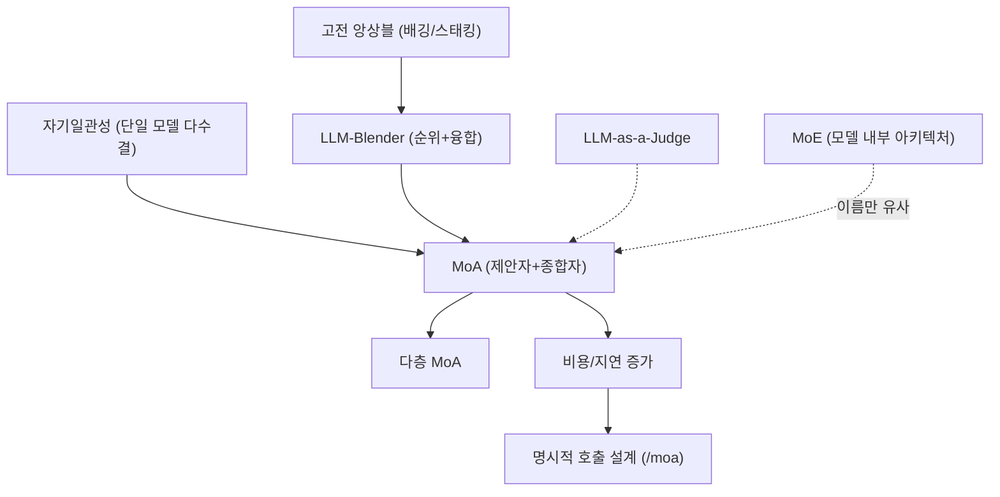

# 배경기술 04. Mixture-of-Agents (MoA)

## 이 문서에서 다루는 큰 맥락

하나의 답을 만들 때 **여러 LLM ([용어사전](../../dict/01_llm_basics.md#llm))을 조합**해 품질을 높이는 기법인 Mixture-of-Agents ([용어사전](../../dict/02_agent_core.md#moa))를
다룹니다. 핵심 정의와 함께, 이를 이해하는 데 필요한 하위 개념들(앙상블 ([용어사전](../../dict/02_agent_core.md#ensemble)), 제안자/
종합자 구조, 계층(layer), MoE와의 구분, 자기일관성 ([용어사전](../../dict/02_agent_core.md#self-consistency)) 샘플링, LLM 심판 ([용어사전](../../dict/02_agent_core.md#llm-as-judge)))을 상세히 풀고,
근간이 되는 앙상블 학습의 역사와 MoA 논문 계보를 정리한 뒤 Hermes의 `/moa` 구현과
연결합니다.

### 소목차
- [1. 핵심 정의](#1-핵심-정의)
- [2. 하위 개념 상세](#2-하위-개념-상세)
- [3. 개념 간 관계 지도](#3-개념-간-관계-지도)
- [4. 히스토리와 근간 논문](#4-히스토리와-근간-논문)
- [5. 비용-품질 트레이드오프](#5-비용-품질-트레이드오프)
- [6. 이 저장소에서의 구현 연결](#6-이-저장소에서의-구현-연결)
- [7. 근간 문헌 및 참고자료](#7-근간-문헌-및-참고자료)

---

## 들어가기 전에 — 필요한 배경과 비유

**필요한 배경**: LLM 호출 개념. "모델마다 장단점이 다르다"는 감각이면 충분합니다.

**비유**: 중요한 결정을 한 사람에게만 묻지 않고 **위원회**를 엽니다. 여러 위원(제안자
모델들)이 각자 초안을 내고, 위원장(집계자 모델)이 초안들을 종합해 더 나은 최종안을
만드는 것이 Mixture-of-Agents입니다. 품질은 오르지만 회의 비용(호출 수×요금)도
같이 오릅니다 — 이 트레이드오프가 이 문서의 핵심입니다.

**학습 목표**: MoA·앙상블·self-consistency·MoE의 차이를 구별하고, Hermes에서 MoA 턴이
어떻게 동작하는지 말할 수 있게 됩니다.

---

## 1. 핵심 정의

**Mixture-of-Agents (MoA)** 는 여러 개의 LLM(서로 다른 제공자/모델일 수 있음)에게
같은 질문을 주고, 그 답들을 **다시 다른 LLM이 종합(aggregate)** 해 최종 답을 만드는
**추론 시점(inference-time) 조합 기법**입니다.

가장 흔한 구조:

```
질문 → [제안자 A] → 초안 A ┐
     → [제안자 B] → 초안 B ├→ [종합자] → 최종 답
     → [제안자 C] → 초안 C ┘
```

핵심 직관 두 가지:

1. **상보성(complementarity)**: 모델마다 강점이 다릅니다(코드/수학/글쓰기/사실성).
   여러 관점을 모으면 개별 약점이 상쇄됩니다.
2. **LLM의 협업성(collaborativeness)**: MoA 논문의 핵심 발견 — LLM은 다른 모델의
   답변을 참고 자료로 받으면, 그 답변들이 자기보다 못한 모델의 것이라도 **더 나은
   답을 생성하는 경향**이 있습니다.

---

## 2. 하위 개념 상세

### 2-1. 앙상블 (ensemble)

여러 모델의 예측을 결합해 단일 모델보다 나은 결과를 얻는 고전적 머신러닝 기법
(배깅, 부스팅, 스태킹 등). 분류 문제에서는 "다수결"이나 "평균"으로 결합이 쉽지만,
**자유 형식 텍스트 생성은 평균을 낼 수 없다**는 문제가 있습니다. MoA는 이 결합
연산을 "LLM에게 읽고 종합하게 시키기"로 대체한, **생성 태스크용 앙상블**입니다.

### 2-2. 제안자(proposer)와 종합자(aggregator)

- **제안자**: 초안을 생성하는 모델들. 다양성이 중요하므로 서로 다른 계열의 모델을
  섞는 것이 유리합니다.
- **종합자**: 초안들을 읽고 하나의 개선된 답으로 합치는 모델. "여러 답변을 비판적
  으로 평가하고 통합하라"는 지시를 받습니다. 종합자의 능력이 최종 품질의 병목이
  되는 경우가 많습니다.

### 2-3. 계층 (layer)

MoA 논문의 구조는 여러 층으로 반복될 수 있습니다: 1층의 종합 결과들을 다시 2층
제안자들의 입력으로 주는 식입니다. 층이 깊어질수록 품질이 오르지만 비용·지연이
곱으로 늘어, 실무에서는 1~2층이 일반적입니다.

### 2-4. Mixture-of-Experts(MoE)와의 구분 — 자주 혼동되는 개념

이름이 비슷하지만 완전히 다른 것입니다:

| | MoE | MoA |
|--|-----|-----|
| 위치 | **모델 내부** 아키텍처 | 완성된 모델들의 **외부** 조합 |
| 시점 | 학습 시 설계 | 추론 시 기법 |
| 단위 | 레이어 안의 전문가(FFN 서브네트워크) | 독립적인 LLM 전체 |
| 예 | Mixtral, DeepSeek-V3 | MoA 파이프라인, `/moa` |

MoE는 토큰마다 일부 파라미터만 활성화해 **한 모델을 싸게 키우는** 기법이고, MoA는
**여러 모델의 답을 합쳐 품질을 올리는** 기법입니다.

### 2-5. 관련 추론 시점 기법들

MoA를 이해하면 같이 알아두면 좋은 이웃 개념들:

- **자기일관성(self-consistency)**: 같은 모델에서 여러 답을 샘플링해 다수결.
  "여러 모델" 대신 "여러 시도"를 쓰는 단순 버전 (Wang et al., 2022).
- **LLM-as-a-Judge**: 강한 LLM에게 후보 답변들을 채점/선택하게 하는 것. 종합자
  대신 "심판"을 쓰는 변형이며, 평가 벤치마크 ([용어사전](../../dict/13_model_learning.md#benchmark))(MT-Bench 등)에서도 널리 쓰입니다.
- **LLM-Blender** (2023): 후보들을 쌍대 비교(pairwise ranking)로 순위 매긴 뒤
  상위 후보들을 융합(fusion) — MoA의 직접적 선행 연구입니다.
- **라우팅(routing)**: 질문을 보고 "가장 적합한 한 모델"에게만 보내는 기법.
  조합 대신 선택으로 비용을 아낍니다.

---

## 3. 개념 간 관계 지도



- MoA는 [01_tool_calling.md](01_tool_calling.md)의 루프와 **직교**합니다: 루프의
  "모델 호출" 한 스텝을 여러 모델의 조합으로 바꾸는 것입니다.
- 여러 provider를 오가는 능력은 Hermes의 provider 추상화([04_agent_loop.md](../04_agent_loop.md)
  1절의 `provider`/`api_mode`)가 전제 조건입니다.

---

## 4. 히스토리와 근간 논문

1. **1990s~ — 앙상블 학습**: 배깅(Breiman, 1996), 부스팅, 스태킹 등 "여러 약한
   학습기의 결합이 강한 학습기를 만든다"는 이론이 정립됨. MoA의 지적 뿌리입니다.
2. **2022.03 — Self-Consistency** (Wang et al.): 같은 모델에서 여러 추론 경로를
   샘플링해 다수결하면 추론 정확도가 크게 오름을 보임 — "추론 시점에 계산을 더
   쓰면 품질이 오른다"는 방향의 초기 대표작.
3. **2023.06 — LLM-Blender** (Jiang et al.): 서로 다른 오픈 LLM들의 출력을 쌍대
   비교로 순위 매기고 상위 답변들을 융합하는 프레임워크. "이종 모델 조합"을 정식화
   했습니다.
4. **2024.06 — Mixture-of-Agents** (Wang et al., Together AI): 오픈소스 모델만을
   계층적 제안자/종합자로 조합해 당시 GPT-4o를 능가하는 AlpacaEval 2.0 점수를
   보고. "LLM의 협업성" 개념을 제시하며 MoA라는 이름을 대중화했습니다.
5. **2024~ — 실용화와 반성**: 후속 연구들은 비용 대비 효과, 종합자가 나쁜 초안에
   끌려가는 문제, 자기일관성 대비 우위가 태스크 의존적이라는 점 등을 검토 중입니다.
   실무에서는 "항상 켜는 기본값"이 아니라 **명시적 고급 기능**으로 배치하는 흐름이
   일반적입니다 — Hermes의 `/moa`도 그 예입니다.

---

## 5. 비용-품질 트레이드오프

MoA의 비용 구조를 구체적으로 보면:

- 제안자 N개 + 종합자 1개 = 최소 **N+1배의 API 호출** (다층이면 층수만큼 곱).
- 지연도 "가장 느린 제안자 + 종합자" 순서로 직렬 구간이 생깁니다.
- 도구 호출 루프 ([용어사전](../../dict/02_agent_core.md#tool-calling-loop)) 안에서 매 스텝 MoA를 쓰면 비용이 루프 길이만큼 곱해지므로,
  보통 **단발성 질문/최종 답변 생성**에만 씁니다.

그래서 설계 선택지는: (a) 항상 켬(품질 최우선), (b) 라우팅으로 선별 적용,
(c) **사용자 명시 호출** — Hermes는 (c)를 택했습니다.

---

## 6. 이 저장소에서의 구현 연결

- **명시적 호출**: Hermes는 `/moa <prompt>`로 MoA를 호출합니다. 대화 루프 진입부에서
  MoA 설정을 분리합니다.
  [`agent/conversation_loop.py` 881-892행](../../agent/conversation_loop.py#L881-L892)
  (`run_conversation`이 `moa_config`를 받고, `decode_moa_turn`으로 사용자 메시지에서
  MoA 설정을 디코드.)
- **설정 CLI**: `hermes moa`(list/configure/delete)로 MoA에 쓸 provider/model 슬롯을
  구성합니다 — 2-2절의 제안자/종합자 ([용어사전](../../dict/02_agent_core.md#proposer-aggregator)) 구성에 해당합니다.
  [`hermes_cli/main.py` 14403-14416행](../../hermes_cli/main.py#L14403-L14416)
- 실제 MoA 실행 로직은 `agent/moa_loop.py`, 설정 인코딩/디코딩은
  `hermes_cli/moa_config.py`에 있습니다.
- **왜 명시적 호출인가 (설계 트레이드오프)**: 5절의 비용 구조 때문에 기본 경로가
  아니라 사용자가 `/moa`로 명시할 때만 켜지는 "필요할 때 쓰는 고급 기능"으로
  배치되어 있습니다. 이는 [05](../05_tools.md)의 좁은 허리 철학(비싼 것은 기본
  경로에 넣지 않는다)과 일관됩니다.
- **전제 조건**: 여러 provider/model을 같은 루프에서 다루는 Hermes의 provider
  추상화([04](../04_agent_loop.md) 1절)가 있기에, 서로 다른 회사의 모델을 제안자로
  섞는 MoA가 자연스럽게 구현됩니다.

---

## 7. 근간 문헌 및 참고자료

**논문 (연대순)**
- Breiman, "Bagging Predictors" (1996) — 앙상블 학습의 고전
- Wang et al., "Self-Consistency Improves Chain of Thought Reasoning" (2022) — <https://arxiv.org/abs/2203.11171>
- Jiang et al., "LLM-Blender: Ensembling LLMs with Pairwise Ranking and Generative Fusion" (2023) — <https://arxiv.org/abs/2306.02561>
- Wang et al., "Mixture-of-Agents Enhances Large Language Model Capabilities" (2024) — <https://arxiv.org/abs/2406.04692>
- Zheng et al., "Judging LLM-as-a-Judge with MT-Bench and Chatbot Arena" (2023) — <https://arxiv.org/abs/2306.05685>

**기술 문서**
- Together AI의 MoA 구현/블로그 — <https://www.together.ai/blog/together-moa>

---

## 정리 — 스스로 점검 질문

1. MoA의 제안자/집계자 구조를 위원회 비유 없이 기술적으로 설명할 수 있는가?
2. MoA와 MoE(Mixture-of-Experts)는 이름이 비슷한데 무엇이 근본적으로 다른가?
3. self-consistency(같은 모델 여러 번)와 MoA(다른 모델 여러 개)는 각각 언제 유리한가?
4. MoA 턴의 비용은 일반 턴 대비 대략 몇 배인가? (제안자 수로 계산해 보기)

다음 문서: 에이전트를 외부 도구·클라이언트와 표준으로 잇는
[05_mcp_and_acp.md](05_mcp_and_acp.md)
