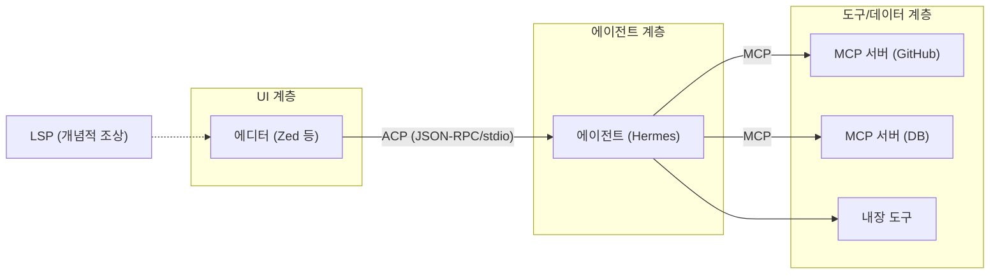

# 배경기술 05. MCP와 ACP — 에이전트 상호운용 프로토콜

## 이 문서에서 다루는 큰 맥락

에이전트가 **외부 도구/데이터**와 연결되는 방식(MCP ([용어사전](../../dict/08_protocols.md#mcp)))과, 에이전트가 **클라이언트
(에디터 등)** 에 연결되는 방식(ACP ([용어사전](../../dict/08_protocols.md#acp)))을 다룹니다. 두 프로토콜 모두 "표준 프로토콜로
결합을 느슨하게"라는 같은 철학을 가지며, 그 뿌리는 LSP ([용어사전](../../dict/08_protocols.md#lsp))(Language Server Protocol)의
성공에 있습니다. 프로토콜을 이해하는 데 필요한 하위 개념(JSON-RPC, 전송 계층,
N×M 문제, 클라이언트/서버/호스트 역할, 도구·리소스·프롬프트 프리미티브)을 상세히
풀고, 둘의 관계와 히스토리, 보안 문제, Hermes 구현을 연결합니다.

### 소목차
- [1. 공통 전제: N×M 문제와 프로토콜 표준화](#1-공통-전제-nm-문제와-프로토콜-표준화)
- [2. 하위 개념 상세](#2-하위-개념-상세)
- [3. MCP 상세](#3-mcp-상세)
- [4. ACP 상세](#4-acp-상세)
- [5. 개념 간 관계 지도](#5-개념-간-관계-지도)
- [6. 히스토리](#6-히스토리)
- [7. 보안 고려사항](#7-보안-고려사항)
- [8. 이 저장소에서의 구현 연결](#8-이-저장소에서의-구현-연결)
- [9. 근간 문헌 및 참고자료](#9-근간-문헌-및-참고자료)

---

## 들어가기 전에 — 필요한 배경과 비유

**필요한 배경**: JSON과 API([../000_absolute_basics.md](../000_absolute_basics.md) 3~4절),
그리고 도구 호출([01_tool_calling.md](01_tool_calling.md)).

**비유**: 프로토콜은 **표준 콘센트 규격**입니다. 나라마다 콘센트 모양이 다르면 제조사는
나라별 충전기를 만들어야 합니다(N×M 문제). 표준 하나를 정하면 어떤 기기도 어느 콘센트에든
꽂힙니다(N+M).
- **MCP** = 에이전트가 외부 도구/데이터에 꽂는 콘센트 (에이전트 ← 도구).
- **ACP** = 에디터 같은 클라이언트가 에이전트에 꽂는 콘센트 (클라이언트 → 에이전트).
둘 다 속은 JSON-RPC(JSON으로 함수를 부르는 약속)로 돌아갑니다.

**학습 목표**: N×M 문제를 자기 말로 설명하고, MCP와 ACP가 각각 어느 방향의 표준인지,
Hermes가 양쪽에서 각각 어떤 역할(호스트/서버)인지 구별할 수 있게 됩니다.

---

## 1. 공통 전제: N×M 문제와 프로토콜 표준화

에이전트 N개와 도구 M개가 있다고 합시다. 표준이 없으면 각 에이전트가 각 도구마다
통합 코드를 짜야 하므로 **N×M개의 통합**이 필요합니다. 표준 프로토콜이 있으면
각자가 표준만 구현하면 되므로 **N+M개**로 줄어듭니다.

이 패턴의 대표적 성공 사례가 **LSP(Language Server Protocol)** 입니다(Microsoft,
2016). 예전에는 에디터마다 언어마다 자동완성 플러그인을 따로 만들어야 했지만
(에디터×언어), LSP 이후 언어 서버 하나를 만들면 모든 에디터에서 쓸 수 있게
되었습니다. **MCP와 ACP는 이 아이디어를 에이전트 세계에 이식한 것**입니다:

- **MCP**: "에이전트 ↔ 도구/데이터" 방향의 표준 (도구 서버 하나 → 모든 에이전트).
- **ACP**: "UI(에디터) ↔ 에이전트" 방향의 표준 (에이전트 하나 → 모든 에디터).

---

## 2. 하위 개념 상세

### 2-1. JSON-RPC

두 프로그램이 "함수 호출처럼 보이는 메시지"를 JSON으로 주고받는 경량 원격 호출
규격입니다. 요청은 `{"jsonrpc": "2.0", "method": "...", "params": {...}, "id": 1}`,
응답은 같은 `id`로 돌아옵니다. LSP, MCP, ACP 모두 JSON-RPC 2.0 ([용어사전](../../dict/08_protocols.md#json-rpc)) 위에 만들어져
있습니다 — 표준 프로토콜들이 같은 밑바탕을 공유하는 셈입니다.

### 2-2. 전송 계층 (transport)

JSON-RPC 메시지를 실제로 나르는 통로입니다:

- **stdio**: 서버를 자식 프로세스로 띄우고 stdin/stdout으로 통신. 로컬에서 가장
  간단하고, 네트워크 노출이 없어 안전합니다. 단, **stdout은 프로토콜 전용**이
  되므로 로그는 stderr로 보내야 합니다(이 규칙을 어기면 프로토콜이 깨집니다).
- **HTTP / Streamable HTTP ([용어사전](../../dict/08_protocols.md#streamable-http))**: 원격 서버용. 요청-응답에 스트리밍 응답을 결합.
- **SSE ([용어사전](../../dict/08_protocols.md#sse))(Server-Sent Events)**: 서버→클라이언트 단방향 스트림. MCP 초기 원격
  전송이었고 이후 Streamable HTTP로 대체되는 흐름입니다.

### 2-3. 역할 용어: 호스트 / 클라이언트 / 서버

MCP 사양의 용어가 처음엔 헷갈립니다:

- **호스트(host)**: 사용자를 마주하는 애플리케이션 (Claude Desktop, 에디터, Hermes).
- **클라이언트(client)**: 호스트 안에서 서버와의 연결 하나를 관리하는 컴포넌트.
- **서버(server)**: 도구/데이터를 광고하고 실행하는 쪽 (파일시스템 서버, GitHub
  서버 등).

즉 Hermes는 MCP에서는 **호스트/클라이언트**이고, ACP에서는 **에이전트(서버 쪽)**
입니다. 같은 프로그램이 프로토콜에 따라 다른 역할을 맡습니다.

### 2-4. MCP의 3대 프리미티브

MCP 서버가 광고할 수 있는 것은 도구만이 아닙니다:

1. **도구(tools)**: 모델이 호출하는 함수 (JSON Schema ([용어사전](../../dict/03_tool_system.md#json-schema)) 포함 — [01](01_tool_calling.md)
   2-1절과 같은 형식). 가장 널리 쓰입니다.
2. **리소스(resources)**: 읽기 전용 데이터(파일, DB 레코드)를 URI로 노출.
3. **프롬프트(prompts)**: 재사용 가능한 프롬프트 템플릿.

이 밖에 **샘플링(sampling)** — 서버가 거꾸로 호스트의 LLM ([용어사전](../../dict/01_llm_basics.md#llm))에게 생성을 요청하는
역방향 프리미티브 — 도 사양에 있습니다.

### 2-5. 능력 협상 (capability negotiation)

연결 초기에 클라이언트와 서버가 "나는 이런 기능을 지원한다"를 교환하는 단계.
프로토콜이 진화해도 구버전 구현과 공존할 수 있게 하는 장치이며, LSP에서 검증된
패턴을 그대로 잇습니다.

---

## 3. MCP 상세

**MCP(Model Context Protocol)** 는 Anthropic이 2024년 11월 공개한 개방형 표준으로,
LLM 애플리케이션이 외부 도구/데이터 서버에 연결하는 방식을 표준화합니다.

동작 흐름:

```
1. 호스트가 설정에 등록된 MCP 서버에 접속 (stdio/HTTP/SSE)
2. initialize — 능력 협상
3. tools/list — 서버가 자기 도구 목록(이름/설명/스키마)을 광고
4. 호스트가 이 도구들을 모델의 도구 목록에 합류시킴
5. 모델이 호출하면 호스트가 tools/call로 서버에 전달, 결과를 모델에 반환
```

핵심 효과: **에이전트 입장에서 MCP 도구는 내장 도구와 구별되지 않습니다.** 이것이
Hermes가 MCP 도구를 자기 레지스트리에 그대로 등록하는 이유입니다(8절).

생태계: 파일시스템, GitHub, 데이터베이스, Slack 등 수천 개의 공개 서버가 존재하며,
OpenAI(2025.03), Google 등 경쟁사들도 클라이언트 지원을 발표해 사실상 업계 표준이
되었습니다.

---

## 4. ACP 상세

**ACP(Agent Client Protocol)** 는 Zed 에디터 팀이 2025년 공개한 표준으로, 코드
에디터 같은 **클라이언트 UI**와 **코딩 에이전트** 사이의 통신을 표준화합니다.

- 에디터가 에이전트를 자식 프로세스로 띄우고 **stdio 위의 JSON-RPC**로 대화합니다
  (LSP와 같은 배치 구조 — "language server 자리에 agent가 들어간 LSP"로 이해하면
  쉽습니다).
- 세션 생성, 사용자 메시지 전달, 에이전트의 스트리밍 응답/도구 호출 ([용어사전](../../dict/02_agent_core.md#tool-calling)) 표시, 권한
  요청(파일 수정 승인 등)을 표준 메시지로 정의합니다.
- 효과: 에이전트 하나를 만들면 ACP를 지원하는 모든 에디터(Zed, Neovim 플러그인
  등)에서 쓸 수 있고, 사용자는 같은 에디터 UI에서 에이전트를 갈아끼울 수 있습니다.

> **주의 — 이름 충돌**: "ACP"는 IBM/Linux Foundation의 "Agent Communication
> Protocol"(에이전트 간 통신)의 약자로도 쓰입니다. 이 문서와 Hermes의 ACP는
> **Agent Client Protocol**(Zed)입니다.

---

## 5. 개념 간 관계 지도



- 둘은 **보완적**입니다: ACP는 에이전트의 "얼굴" 쪽, MCP는 "손발" 쪽 표준.
- 둘 다 JSON-RPC(2-1절) + stdio(2-2절) 조합이라는 공통 기반을 공유합니다.
- MCP 도구는 결국 [01_tool_calling.md](01_tool_calling.md)의 도구 스키마 ([용어사전](../../dict/03_tool_system.md#tool-schema))/디스패치 ([용어사전](../../dict/03_tool_system.md#dispatch))
  개념으로 수렴합니다 — 프로토콜은 "도구가 어디서 오는가"만 바꿉니다.

---

## 6. 히스토리

1. **2016 — LSP** (Microsoft): 에디터×언어의 N×M 문제를 프로토콜 표준화로 해결.
   이후 DAP(Debug Adapter Protocol) 등 후속 표준의 본보기가 됩니다.
2. **2023 — 각사 플러그인 시대**: ChatGPT Plugins, 각 프레임워크(LangChain 등)의
   독자 도구 규격이 난립 — 통합 비용 문제가 심화됩니다.
3. **2024.11 — MCP 공개** (Anthropic): 개방형 사양 + SDK + 레퍼런스 서버로 출시.
4. **2025 — MCP의 사실상 표준화**: OpenAI, Google Gemini 등이 잇달아 지원 발표,
   서버 생태계 폭발적 성장. 원격 전송이 SSE에서 Streamable HTTP로 개편되고 인증
   (OAuth) 사양이 보강됩니다.
5. **2025 — ACP 공개** (Zed): Gemini CLI 등과 함께 발표. 에디터-에이전트 결합의
   표준화 시작.

---

## 7. 보안 고려사항

표준화는 통합을 쉽게 하지만, **신뢰 경계**를 흐리게 합니다:

- **악성/오염된 MCP 서버 ([용어사전](../../dict/08_protocols.md#mcp-server))**: 서버가 광고하는 도구 설명 자체가 프롬프트 인젝션을
  담을 수 있습니다(tool poisoning). 도구 결과도 신뢰할 수 없는 입력입니다.
- **혼동된 대리인 문제(confused deputy)**: 에이전트가 A 서버에서 읽은 악성 지시로
  B 서버의 강력한 도구를 호출하게 유도될 수 있습니다.
- 대응: 서버 화이트리스트, 도구별 승인 게이트, 결과 살균, 최소 권한. Hermes의
  `AGENTS.md`도 "외부 파일·메모리 provider·MCP 서버·도구 결과는 잠재적으로 신뢰할
  수 없는 입력"으로 규정합니다.

---

## 8. 이 저장소에서의 구현 연결

- **MCP 클라이언트 ([용어사전](../../dict/08_protocols.md#mcp-client))**: `tools/mcp_tool.py`가 외부 MCP 서버에 stdio/HTTP/StreamableHTTP/
  SSE(2-2절)로 접속해 도구를 발견하고, **Hermes 도구 레지스트리에 등록**해 내장
  도구처럼 부르게 합니다(3절의 "구별되지 않음"의 구현).
  [`tools/mcp_tool.py` 2-11행](../../tools/mcp_tool.py#L2-L11)
  - 설정은 `~/.hermes/config.yaml`의 `mcp_servers` 키(9행). `mcp` 패키지는 **선택
    의존성**이라 없으면 no-op(10-11행) — [02](../02_modules_and_stack.md)의 지연
    의존성 철학과 일치.
  - keepalive/유휴 재활용/병렬 호출 허용 등 실운영 옵션이 config로 노출됩니다
    (22-35행).
  - MCP 도구는 정적 자기등록이 아닌 런타임 동적 등록이므로
    `discover_builtin_tools`에서 의도적으로 제외됩니다([05](../05_tools.md) 8절).
- **Footprint Ladder에서의 위치**: `AGENTS.md`는 새 기능이 코어 도구가 되기 전에
  "MCP 서버로 만들어 카탈로그에 넣는" 선택지를 먼저 검토하라고 규정합니다 —
  1절의 N×M 논리로 코어 스키마 비용을 0으로 만드는 경로입니다.
- **ACP 서버(어댑터)**: `acp_adapter/`가 Hermes를 ACP 에이전트로 노출합니다.
  진입점 `acp_adapter/entry.py`는 **stdout을 JSON-RPC 통로로 예약하고 로깅을
  stderr로 분리**합니다 — 2-2절 stdio 규칙의 정석적 구현입니다
  ([10](../10_subsystems.md) 3절). 실행: `hermes-acp` / `hermes acp`.

---

## 9. 근간 문헌 및 참고자료

**사양 / 공식 문서**
- MCP 사양과 문서 — <https://modelcontextprotocol.io/>
- MCP 발표 글 (Anthropic, 2024.11) — <https://www.anthropic.com/news/model-context-protocol>
- ACP 사양 — <https://agentclientprotocol.com/>
- LSP 사양 (개념적 조상) — <https://microsoft.github.io/language-server-protocol/>
- JSON-RPC 2.0 사양 — <https://www.jsonrpc.org/specification>

---

## 정리 — 스스로 점검 질문

1. N×M 문제가 무엇이고, 표준 프로토콜이 이를 어떻게 N+M으로 바꾸는가?
2. MCP에서 Hermes는 호스트인가 서버인가? ACP에서는?
3. stdio·SSE·Streamable HTTP 전송 방식은 각각 언제 쓰이는가?
4. 외부 MCP 서버를 붙일 때 생기는 보안 위험(도구 중독 등)은 무엇이며 어떻게 완화하는가?

다음 문서: 과거 대화를 빠르게 찾아오는 검색 기술 —
[06_retrieval_fts5.md](06_retrieval_fts5.md)
