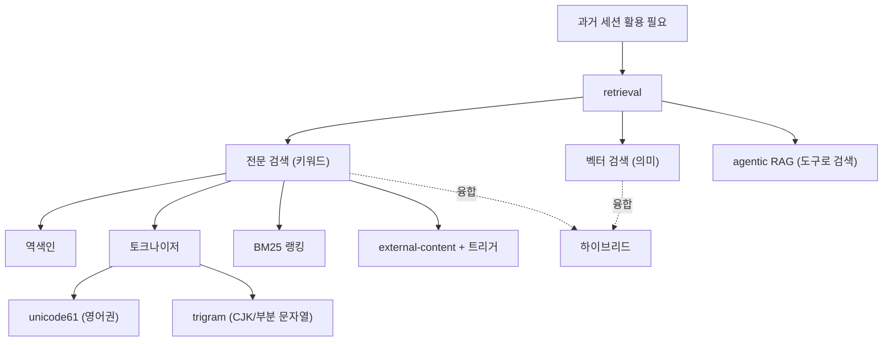

# 배경기술 06. Retrieval / FTS5 기반 세션 검색

## 이 문서에서 다루는 큰 맥락

과거 대화 전체에서 관련 내용을 **빠르게 찾아오는** 검색(retrieval)과, 그 구현
수단인 SQLite **FTS5**를 다룹니다. 정보검색(IR)의 기초 개념(역색인, 토크나이저,
BM25)부터, RAG와의 관계, CJK(한중일) 텍스트 검색의 특수한 어려움과 트라이그램
해법까지 하위 개념을 상세히 풀고, IR의 오랜 역사와 근간 문헌을 정리한 뒤 Hermes의
세션 검색 구현과 연결합니다.

### 소목차
- [1. 핵심 정의: 왜 검색이 필요한가](#1-핵심-정의-왜-검색이-필요한가)
- [2. 하위 개념 상세](#2-하위-개념-상세)
- [3. 개념 간 관계 지도](#3-개념-간-관계-지도)
- [4. 히스토리와 근간 문헌](#4-히스토리와-근간-문헌)
- [5. 키워드 검색 vs 벡터 검색 트레이드오프](#5-키워드-검색-vs-벡터-검색-트레이드오프)
- [6. 이 저장소에서의 구현 연결](#6-이-저장소에서의-구현-연결)
- [7. 근간 문헌 및 참고자료](#7-근간-문헌-및-참고자료)

---

## 1. 핵심 정의: 왜 검색이 필요한가

에이전트는 수백 개의 과거 세션을 쌓지만, 그 내용을 전부 컨텍스트에 넣을 수는
없습니다([03](03_context_compression.md)의 토큰 한계). 해법은 **"지금 필요한 부분만
찾아서 가져오기"** — 이것이 **검색 증강(retrieval)** 입니다.

- **전문 검색(full-text search, FTS)**: 문서 안의 단어를 미리 **색인(index)** 해
  두고, 질의어가 포함된 문서를 빠르게 찾는 기술. 색인 없이 `LIKE '%단어%'`로 전체를
  훑으면 데이터가 커질수록 선형으로 느려지지만, 색인이 있으면 질의어에 해당하는
  문서 목록을 바로 꺼낼 수 있습니다.
- **FTS5**: SQLite에 내장된 전문 검색 확장(5세대). 별도 검색 서버(Elasticsearch 등)
  없이 **파일 하나짜리 DB**로 색인·검색·랭킹(BM25 내장)을 모두 처리합니다.

---

## 2. 하위 개념 상세

### 2-1. 역색인 (inverted index)

전문 검색의 심장입니다. 일반 색인이 "문서 → 단어들"이라면, 역색인은 거꾸로
**"단어 → 그 단어가 나오는 문서들"** 의 매핑입니다:

```
"고양이" → [문서3, 문서17, 문서42]
"우유"   → [문서17, 문서99]
```

"고양이 우유"를 검색하면 두 목록의 교집합(문서17)을 즉시 얻습니다. 책 뒤의
"찾아보기"와 같은 원리이며, 구글부터 SQLite FTS5까지 모든 텍스트 검색의 기반입니다.

### 2-2. 토크나이저 (tokenizer)

문서를 색인 단위(토큰)로 쪼개는 규칙입니다. 검색 품질을 좌우하는 숨은 주역:

- **unicode61** (FTS5 기본): 공백/문장부호 기준으로 단어를 나눔. 영어처럼 공백으로
  단어가 구분되는 언어에 적합합니다.
- **문제 — CJK(한중일) 텍스트**: 한국어/중국어/일본어는 공백이 단어 경계가 아니거나
  조사가 붙어("고양이가", "고양이를") 단순 분리로는 같은 단어를 다르게 색인하게
  됩니다. 구(phrase) 검색이 특히 깨집니다.
- **트라이그램(trigram)**: 언어 지식 없이 텍스트를 **겹치는 3글자 조각**으로 쪼개는
  해법. "고양이우유" → "고양이", "양이우", "이우유". 질의어도 같은 방식으로 쪼개
  매칭하므로 어떤 언어든 **부분 문자열 검색**이 됩니다. 대가: 색인 크기가 원문의
  수 배로 커집니다.

### 2-3. 랭킹: BM25

검색 결과가 수백 건이면 **관련도 순 정렬**이 필요합니다. **BM25**(Best Matching 25,
Robertson 등, 1990년대 Okapi 시스템에서 유래)는 다음 직관을 수식화한 고전적 랭킹
함수입니다:

- 질의어가 문서에 **자주** 나올수록 관련도 ↑ (단, 수확 체감)
- **희귀한** 단어의 매칭일수록 관련도 ↑ (IDF: "the"보다 "trigram" 매칭이 값짐)
- **짧은 문서**에서의 매칭일수록 관련도 ↑ (길이 정규화)

FTS5는 BM25를 내장하고 있어 `ORDER BY rank`만으로 관련도 정렬이 됩니다. 벡터
검색 시대에도 BM25는 여전히 강력한 기본기로, 하이브리드 검색의 절반을 담당합니다.

### 2-4. External-content 테이블과 트리거 동기화

FTS5의 운영 세부지만 중요한 개념입니다. 기본 FTS 테이블은 원문을 자체 보관해
**데이터가 이중 저장**됩니다. `content=` 옵션(external-content)을 쓰면 FTS 테이블은
색인만 갖고 원문은 원래 테이블에서 읽어, 저장 공간을 절약합니다. 대신 원본 테이블의
INSERT/UPDATE/DELETE 때마다 색인을 손수 갱신해야 하는데, 이를 SQL **트리거**로
자동화하는 것이 표준 패턴입니다.

### 2-5. RAG와의 관계

**RAG(Retrieval-Augmented Generation)** 는 "생성 전에 관련 문서를 검색해 프롬프트에
넣는" 패턴의 총칭입니다(Lewis et al., 2020). 보통 벡터 검색과 함께 언급되지만,
검색 수단은 무엇이든 됩니다. 에이전트가 `session_search` 같은 도구로 **스스로 검색
시점과 질의를 결정**하는 방식은 "agentic RAG"라고 부르며, 고정 파이프라인 RAG보다
유연합니다 — Hermes가 이 방식입니다.

### 2-6. 벡터(의미) 검색과 하이브리드

- **벡터 검색**: 텍스트를 임베딩(숫자 벡터)으로 바꿔 **의미적 유사도**로 찾음.
  단어가 달라도("자동차"↔"차량") 찾을 수 있지만, 임베딩 계산·저장 비용이 들고
  정확한 문자열(에러 메시지, 함수명) 매칭에는 오히려 약합니다.
- **하이브리드 검색**: BM25(정확 매칭에 강함) + 벡터(의미 매칭에 강함)를 병행하고
  결과를 융합(RRF 등). 순수 벡터보다 견고하다는 보고가 많습니다.

---

## 3. 개념 간 관계 지도



- retrieval은 [03_context_compression.md](03_context_compression.md)과 **상보적**
  입니다: 압축이 "버리는" 정보를, 검색이 "필요할 때 되찾아" 옵니다. 원본이 DB에
  남아 있어야 하는 이유이기도 합니다([06_state.md](../06_state.md)의
  `active`/`compacted` 플래그).
- `session_search`는 [01_tool_calling.md](01_tool_calling.md)의 도구 개념으로
  노출되므로, 검색 시점 결정은 모델의 판단에 맡겨집니다(agentic RAG).

---

## 4. 히스토리와 근간 문헌

1. **1970s~ — 정보검색(IR)의 정립**: 역색인, TF-IDF, 확률적 랭킹 모델 등 검색의
   기초 이론이 확립됩니다 (Salton의 SMART 시스템 등).
2. **1994~ — Okapi BM25**: Robertson과 동료들의 Okapi 시스템에서 BM25 랭킹 함수가
   나와 이후 30년간 검색의 표준 기본기가 됩니다.
3. **2000s — 오픈소스 검색 엔진**: Lucene(이후 Elasticsearch/Solr의 기반)이 역색인
   검색을 대중화합니다.
4. **2015 — SQLite FTS5**: SQLite 3.9.0에 FTS5가 포함되어, 서버 없는 임베디드
   전문 검색이 보편화됩니다 (FTS3/4의 개선판; BM25 내장, external-content 지원).
5. **2020 — RAG** (Lewis et al.): "검색 + 생성" 결합을 정식화. LLM 시대의 검색
   르네상스를 엽니다.
6. **2022~ — 벡터 DB 붐과 하이브리드로의 수렴**: 임베딩 검색이 각광받았다가,
   "BM25를 버리면 안 된다"는 실증이 쌓이며 하이브리드가 실무 표준으로 수렴합니다.
7. **2024~ — 에이전트 메모리로서의 검색**: 에이전트가 자기 과거 궤적을 검색하는
   agentic RAG 패턴이 확산 — Hermes의 `session_search`가 이 세대입니다.

---

## 5. 키워드 검색 vs 벡터 검색 트레이드오프

Hermes가 **FTS5(키워드)** 를 택한 이유를 트레이드오프 표로 정리하면:

| 기준 | FTS5 (키워드) | 벡터 검색 |
|------|--------------|----------|
| 인프라 | SQLite 파일 하나 (서버 불필요) | 임베딩 모델 + 벡터 저장소 필요 |
| 오프라인 | 완전 로컬 동작 | 임베딩 API가 필요하면 불가 |
| 비용 | 색인은 쓰기 시 즉시, 무료 | 모든 메시지에 임베딩 비용 |
| 정확 문자열(에러/함수명) | 강함 | 약함 |
| 동의어/의미 매칭 | 약함 | 강함 |
| CJK | 트라이그램으로 해결 가능 | 모델 의존 |

"어디서든 돈다(로컬-우선)"는 Hermes의 목표에서는 FTS5가 자연스러운 선택이고,
의미 검색이 꼭 필요한 메모리 축은 외부 provider 플러그인
([07_honcho_dialectic.md](07_honcho_dialectic.md))으로 보완합니다.

---

## 6. 이 저장소에서의 구현 연결

[06_state.md](../06_state.md)가 라인 단위로 다룹니다. 개념 → 코드 대응:

- **FTS5 external-content 테이블**(2-4절): `messages_fts`가 모든 세션 메시지를
  색인하되 `content='messages'`로 원본 중복 저장을 피합니다.
  [`hermes_state.py` 1245-1251행](../../hermes_state.py#L1245-L1251)
- **트리거 자동 동기화**(2-4절): `messages`의 INSERT/DELETE/UPDATE에 트리거가 걸려
  색인이 자동 갱신됩니다(1253-1286행). 대량 재색인 중의 중복을 막는 high-water/
  progress 마커 같은 운영 디테일도 트리거 조건에 들어 있습니다.
- **트라이그램 색인으로 CJK 검색**(2-2절): 기본 토크나이저가 한글 구 검색을 깨므로
  `messages_fts_trigram`(1309행~)이 3바이트 조각 색인으로 부분 문자열 검색을
  지원합니다. 트라이그램 색인은 원문의 약 2.6배 크기라, 잡음 많은 `role='tool'`
  행은 뷰로 제외해 비용을 통제합니다(1289-1307행) — 2-2절의 "크기 대가"에 대한
  실전 대응입니다.
- **에이전트 노출(agentic RAG, 2-5절)**: `session_search` 도구([05](../05_tools.md)의
  `_HERMES_CORE_TOOLS`)로 에이전트가 검색 시점과 질의를 스스로 결정합니다.
- **압축과의 상보성**: 압축된 메시지도 원본이 DB에 남아(`active=0`) 검색 가능 —
  3절 관계 지도의 "압축이 버린 것을 검색이 되찾는" 구조입니다.

---

## 7. 근간 문헌 및 참고자료

**논문 / 고전**
- Robertson & Zaragoza, "The Probabilistic Relevance Framework: BM25 and Beyond" (2009) — BM25의 표준 해설
- Lewis et al., "Retrieval-Augmented Generation for Knowledge-Intensive NLP Tasks" (2020) — <https://arxiv.org/abs/2005.11401>

**기술 문서**
- SQLite FTS5 공식 문서 (external content, trigram, BM25 포함) — <https://sqlite.org/fts5.html>
- SQLite WAL 공식 문서 — <https://sqlite.org/wal.html>

다음 문서: 사실 나열을 넘어 사용자를 "모델링"하는 메모리 —
[07_honcho_dialectic.md](07_honcho_dialectic.md)
