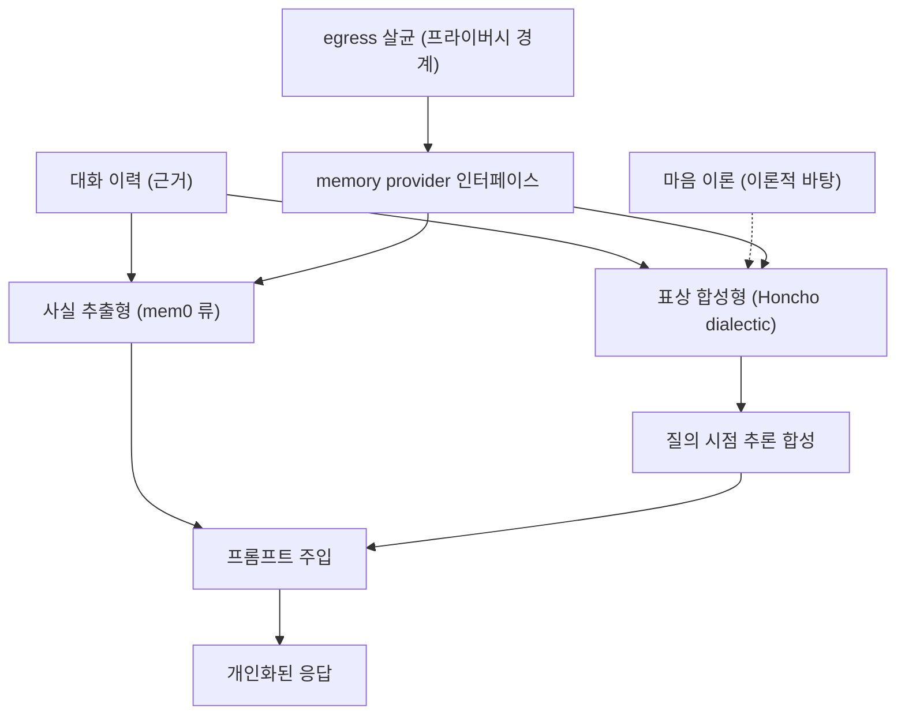

# 배경기술 07. Honcho 변증법적(dialectic) 사용자 모델링

## 이 문서에서 다루는 큰 맥락

에이전트가 사용자를 **이해하고 개인화**하기 위한 사용자 모델링을 다룹니다. 특히
"사실을 나열해 저장"하는 전통적 메모리를 넘어, **필요할 때 근거로부터 추론을
합성**하는 Honcho ([용어사전](../../dict/05_memory_self_improvement.md#honcho))의 변증법적(dialectic) 접근을 봅니다. 사용자 모델링 ([용어사전](../../dict/05_memory_self_improvement.md#user-modeling))/마음 이론 ([용어사전](../../dict/05_memory_self_improvement.md#theory-of-mind))/
표상 학습 같은 하위 개념을 상세히 풀고, 개인화 기술의 히스토리와 근간 아이디어,
그리고 Hermes에서 Honcho가 "플러그인"이라는 위치에 놓인 설계 이유를 연결합니다.

### 소목차
- [1. 핵심 정의](#1-핵심-정의)
- [2. 하위 개념 상세](#2-하위-개념-상세)
- [3. 개념 간 관계 지도](#3-개념-간-관계-지도)
- [4. 히스토리와 근간 아이디어](#4-히스토리와-근간-아이디어)
- [5. 트레이드오프와 프라이버시](#5-트레이드오프와-프라이버시)
- [6. 이 저장소에서의 구현 연결](#6-이-저장소에서의-구현-연결)
- [7. 근간 문헌 및 참고자료](#7-근간-문헌-및-참고자료)

---

## 1. 핵심 정의

**사용자 모델링(user modeling)** 은 대화 이력으로부터 "이 사용자는 누구이고, 무엇을
알고, 무엇을 선호하는가"에 대한 **표상(representation)** 을 만들어 응답을 개인화
하는 기술입니다.

**Honcho**는 Plastic Labs가 만든 에이전트용 장기 기억/사용자 표상 서비스입니다.
차별점은 저장 방식이 아니라 **질의 방식**입니다:

- 전통적 메모리: "사용자는 파이썬을 쓴다", "사용자는 간결한 답을 좋아한다" 같은
  **사실 목록**을 저장하고, 프롬프트에 그대로 주입.
- Honcho의 **dialectic(변증법적) API**: "이 사용자는 지금 어떤 설명 수준을 원할까?"
  같은 **자연어 질문**을 던지면, 축적된 대화 근거로부터 **그 시점에 답(추론)을
  합성**해 돌려줍니다.

"변증법적"이라는 이름은 문답을 통해 결론을 다듬는 철학적 방법(소크라테스 문답법,
정-반-합)에서 왔습니다: 고정된 프로필 ([용어사전](../../dict/07_gateway_interfaces.md#profile)) 필드를 읽는 게 아니라, **질문 ↔ 근거의
대화**로 사용자에 대한 이해를 그때그때 구성한다는 뜻입니다.

---

## 2. 하위 개념 상세

### 2-1. 명시적 프로필 vs 암묵적 모델링

- **명시적(explicit)**: 사용자가 직접 입력한 정보 (설정 폼의 이름/언어/직업).
  정확하지만 빈약합니다 — 사람들은 폼을 잘 안 채우고, 미묘한 취향은 폼에 담기지
  않습니다.
- **암묵적(implicit)**: 행동/대화에서 **드러나는** 정보를 시스템이 추론. "이 사용자는
  코드 예시를 주면 항상 따라 해본다" 같은 관찰은 누구도 폼에 쓰지 않지만 개인화에는
  결정적입니다. 사용자 모델링 연구의 초점은 오래전부터 암묵적 쪽입니다.

### 2-2. 사실 추출형 메모리 (fact extraction)

현재 가장 흔한 구현: 보조 LLM ([용어사전](../../dict/01_llm_basics.md#llm))이 대화에서 "기억할 가치가 있는 사실"을 추출해
저장하고(mem0 등), 다음 세션 프롬프트에 주입합니다. 한계:

- **표면적**: "무엇을 말했는가"는 담지만 "왜/어떤 사람이라서"는 못 담습니다.
- **정적**: 저장 시점의 해석으로 고정됩니다. 맥락이 바뀌면 낡습니다.
- **주입 비용**: 사실이 쌓일수록 프롬프트가 커집니다([03](03_context_compression.md)
  의 토큰 문제).

### 2-3. 표상 합성형 메모리 (dialectic / representation synthesis)

Honcho의 접근: 원본 대화를 근거(evidence) 저장소에 쌓아두고, **질의 시점에** 근거를
종합해 답을 만듭니다. 데이터베이스로 비유하면, 사실 추출형이 "미리 계산된 뷰"라면
dialectic은 "질의 시점 집계"입니다. 장점:

- 질문에 맞는 **맞춤 추론**이 가능 ("지금 이 주제에 대해 사용자가 아는 수준은?")
- 새 근거가 쌓이면 같은 질문의 답이 **자연히 갱신**됨
- 프로필 스키마를 미리 설계할 필요가 없음

대가: 질의마다 LLM 추론 비용/지연이 들고, 합성된 추론은 **틀릴 수 있습니다**(환각).

### 2-4. 마음 이론 (Theory of Mind)

타인의 믿음·의도·지식 상태를 추론하는 인지 능력. Plastic Labs는 Honcho의 이론적
바탕으로 이를 내세웁니다 — 에이전트가 사용자에 대한 "심적 모델(mental model)"을
유지해야 진짜 개인화가 된다는 주장입니다. LLM의 마음 이론 능력 자체가 활발한
연구 주제(기계 마음 이론, machine theory of mind)이며, dialectic API는 그 능력을
사용자 모델링에 응용한 것입니다.

### 2-5. 메모리 provider 아키텍처

애플리케이션 관점의 하위 개념: 메모리 백엔드가 여럿(파일, mem0, Honcho, ...)일 때
각각을 **provider 인터페이스** 뒤에 숨기고, 오케스트레이터가 표준 훅(프롬프트 주입,
턴 전 prefetch, 턴 후 sync)으로 부르는 구조입니다. 백엔드 교체가 코어 수정 없이
가능해집니다 — [05_mcp_and_acp.md](05_mcp_and_acp.md) 1절의 N×M 논리와 같은
패턴입니다.

---

## 3. 개념 간 관계 지도

- 사용자 모델링은 [02_self_improving_agents.md](02_self_improving_agents.md)의
  기억 축(사실적 기억) 중 "사용자에 대한 기억"의 심화입니다.
- 외부 서비스로의 데이터 유출 경계(egress)는 보안 주제
  ([05](05_mcp_and_acp.md) 7절의 신뢰 경계와 동일한 사고방식)와 연결됩니다.

---

## 4. 히스토리와 근간 아이디어

1. **1980s~ — 고전 사용자 모델링**: 지능형 튜터링 시스템(ITS)과 적응형 하이퍼미디어
   연구에서 "학습자/사용자 모델"이 정립됩니다. UMAP 같은 전문 학회가 생길 만큼
   오래된 분야입니다.
2. **2000s~ — 협업 필터링/추천**: 행동 로그 기반의 암묵적 모델링이 상용화됩니다
   (추천 시스템). 단, 대화형이 아니라 클릭/구매 신호 기반이었습니다.
3. **2023 — LLM 메모리 시스템**: Generative Agents(2023)의 기억 스트림, MemGPT의
   계층 메모리 등으로 "대화에서 기억을 만드는" 구조가 정립됩니다
   ([02](02_self_improving_agents.md) 4절).
4. **2023~ — Plastic Labs와 Honcho**: 튜터링 앱(Bloom)을 만들며 "사실 저장을 넘어선
   사용자 표상"의 필요를 겪고, 이를 일반화한 Honcho를 공개합니다. dialectic API,
   peer 표상, 결론(conclusions) 같은 개념이 이 과정에서 나왔습니다.
5. **2024~ — 메모리 서비스 생태계**: mem0, supermemory, Letta 등과 함께 "에이전트
   메모리"가 독립된 인프라 상품군으로 자리잡고, 에이전트 프레임워크들은 이들을
   provider 플러그인으로 수용하는 구조(2-5절)로 수렴합니다 — Hermes가 정확히 이
   구조입니다.

---

## 5. 트레이드오프와 프라이버시

| 관점 | 사실 추출형 | 표상 합성형 (dialectic) |
|------|-----------|----------------------|
| 표현력 | 표면적 사실 | 함축적 선호/상태까지 |
| 비용 | 저장 시 1회 | 질의마다 추론 비용 |
| 신선도 | 저장 시점에 고정 | 질의 시점에 재합성 |
| 오류 양상 | 누락 | 환각(그럴듯한 오추론) |
| 구현 | 단순 | 외부 서비스/모델 의존 |

**프라이버시**가 특히 중요합니다: 사용자 모델링은 본질적으로 민감한 데이터
(대화 전체)를 다루며, 외부 서비스 provider를 쓰면 그 데이터가 **밖으로 나갑니다**.
그래서 (a) 옵트인, (b) egress 시점의 민감정보 살균, (c) 로컬 기본값이 실무
원칙입니다 — Hermes의 배치가 그대로 이 원칙을 따릅니다(6절).

---

## 6. 이 저장소에서의 구현 연결

- **오케스트레이션 ([용어사전](../../dict/02_agent_core.md#orchestration))**: Hermes의 메모리는 `agent/memory_manager.py`가 단일 지점에서
  관리합니다([09_self_improvement.md](../09_self_improvement.md)). 기본은
  `MEMORY.md`/`USER.md` **파일 기반(로컬 기본값)** 이고, **외부 provider는 한 번에
  하나만** 허용됩니다(6-8행) — 스키마 비대와 백엔드 충돌 방지.
- **Honcho는 플러그인**: `plugins/memory/honcho/`가 provider로 붙습니다. 플러그인
  docstring이 "cross-session user modeling with **dialectic Q&A**, semantic search,
  peer cards, and conclusions"를 명시하고, 자연어로 peer(사용자)에 대해 묻는
  dialectic 질의 도구를 제공합니다
  ([`plugins/memory/honcho/__init__.py` 1-8행](../../plugins/memory/honcho/__init__.py#L1-L8)).
  이 위치는 Footprint Ladder의 "service-gated / plugin" 단계와 일치합니다 —
  강력하지만 모두에게 필수는 아니므로 코어가 아닌 가장자리에, 옵트인으로 둡니다.
- **provider 인터페이스**(2-5절): 메모리 provider는 `MemoryProvider`
  (`agent/memory_provider.py`)를 구현하며, 매니저가 시스템 프롬프트 ([용어사전](../../dict/01_llm_basics.md#system-prompt)) 주입
  (`build_system_prompt`)·턴 전 prefetch·턴 후 sync를 표준 훅으로 호출합니다.
  Honcho 같은 dialectic provider도 이 훅 위에서 "질의→추론"을 수행합니다.
- **egress 살균**(5절): provider 컨텍스트는 경계에서 살균됩니다
  (`context_engine.sanitize_memory_context`,
  [07_prompt_context.md](../07_prompt_context.md)) — 외부로 나가는 사용자 데이터의
  민감정보를 가리는 프라이버시 방어입니다. 동시에 `AGENTS.md`는 **들어오는** 메모리
  provider 데이터도 신뢰할 수 없는 입력으로 취급하라고 규정합니다(양방향 경계).

---

## 7. 근간 문헌 및 참고자료

**프로젝트 / 기술 문서**
- Honcho 프로젝트와 문서 — <https://honcho.dev/> (Plastic Labs)
- Plastic Labs 블로그 (dialectic API, 마음 이론 배경 설명) — <https://blog.plasticlabs.ai/>

**관련 논문 (배경)**
- Park et al., "Generative Agents" (2023) — 기억 스트림/반성 구조 — <https://arxiv.org/abs/2304.03442>
- Packer et al., "MemGPT" (2023) — 계층적 에이전트 메모리 — <https://arxiv.org/abs/2310.08560>

다음 문서: 에이전트가 실제 브라우저를 조작하는 기반 —
[08_cdp_browser.md](08_cdp_browser.md)
