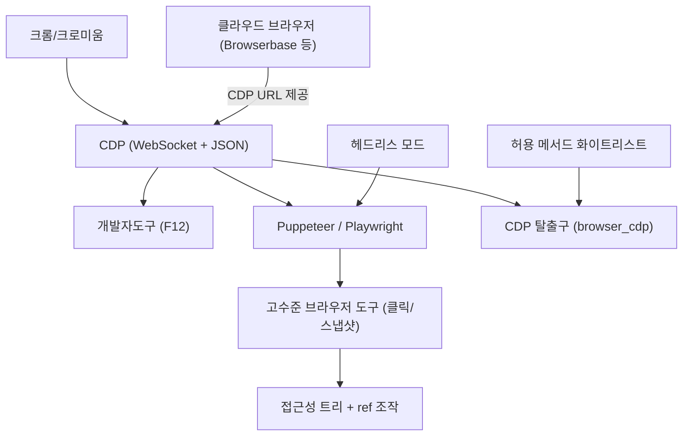

# 배경기술 08. Chrome DevTools Protocol (CDP) 기반 브라우저 제어

## 이 문서에서 다루는 큰 맥락

에이전트가 실제 웹 브라우저를 조작하는 기반 기술인 **CDP**를 다룹니다. 웹 자동화의
계보(Selenium/WebDriver → CDP → Puppeteer/Playwright)와, CDP를 이해하는 데 필요한
하위 개념들(WebSocket, 도메인/명령/이벤트, 헤드리스 브라우저, 접근성 트리, 클라우드
브라우저)을 상세히 풀고, LLM 에이전트가 브라우저를 "보는" 방식의 발전과 보안
트레이드오프, 그리고 Hermes의 고수준 도구 + CDP 탈출구 구조를 연결합니다.

### 소목차
- [1. 핵심 정의](#1-핵심-정의)
- [2. 하위 개념 상세](#2-하위-개념-상세)
- [3. 개념 간 관계 지도](#3-개념-간-관계-지도)
- [4. 히스토리](#4-히스토리)
- [5. 에이전트 브라우저 제어의 트레이드오프](#5-에이전트-브라우저-제어의-트레이드오프)
- [6. 이 저장소에서의 구현 연결](#6-이-저장소에서의-구현-연결)
- [7. 근간 문헌 및 참고자료](#7-근간-문헌-및-참고자료)

---

## 1. 핵심 정의

**CDP(Chrome DevTools Protocol)** 는 크롬/크로미움 브라우저를 프로그램으로
제어·검사하기 위한 프로토콜입니다. 브라우저를 디버깅 모드로 띄우면 **WebSocket
엔드포인트**가 열리고, 거기에 JSON 명령을 보내면 페이지 탐색·클릭·DOM 읽기·
스크린샷·네트워크 감청/차단·쿠키 조작까지 브라우저의 거의 모든 것을 할 수 있습니다.

친숙한 예: 크롬 개발자도구(F12)가 바로 이 프로토콜의 **첫 번째 클라이언트**입니다.
개발자도구 UI가 하는 모든 일(요소 검사, 네트워크 탭, 콘솔)은 CDP 메시지로
이루어집니다. Puppeteer, Playwright 같은 자동화 라이브러리도 내부적으로 CDP(또는
유사 프로토콜)를 씁니다.

---

## 2. 하위 개념 상세

### 2-1. WebSocket과 메시지 형식

CDP는 HTTP처럼 "요청-응답 후 끊기"가 아니라 **WebSocket** — 한 번 연결하면 양방향
으로 계속 메시지를 주고받는 통로 — 위에서 동작합니다. 메시지는 세 종류:

- **명령(command)**: 클라이언트 → 브라우저. `{"id": 1, "method": "Page.navigate", "params": {"url": "..."}}`
- **응답(response)**: 같은 `id`로 결과 반환.
- **이벤트(event)**: 브라우저 → 클라이언트로 **자발적으로** 통지 (페이지 로드 완료,
  콘솔 로그, 다이얼로그 열림 등). 이벤트가 있어서 "기다렸다 반응하기"가 가능합니다.

[05_mcp_and_acp.md](05_mcp_and_acp.md) 2-1절의 JSON-RPC와 닮은 구조입니다(같은
"id로 짝짓는 JSON 메시지" 패턴).

### 2-2. 도메인 (domain)

CDP의 수백 개 명령은 기능별 **도메인**으로 묶여 있습니다: `Page`(탐색/스크린샷),
`DOM`(요소 트리), `Runtime`(JS 실행), `Network`(요청 감청/차단), `Input`(마우스/
키보드 주입), `Target`(탭/프레임 관리) 등. `Domain.method` 형태의 이름만 봐도
무슨 일을 하는지 짐작할 수 있습니다.

### 2-3. 헤드리스 브라우저 (headless)

화면(UI) 없이 도는 브라우저. 서버에서 자동화를 돌릴 때 필수입니다. 크롬은 2017년
헤드리스 모드를 내장했고, 이것이 CDP 기반 자동화(Puppeteer)의 기폭제가 됐습니다.
"헤드리스 = 눈에 안 보일 뿐 완전한 브라우저"라서, 렌더링·JS 실행이 진짜 브라우저와
동일합니다(과거의 가짜 브라우저 시뮬레이터 대비 결정적 장점).

### 2-4. 접근성 트리 (accessibility tree)와 에이전트의 "눈"

LLM 에이전트가 페이지를 "보는" 방식에는 스펙트럼이 있습니다:

1. **원시 HTML/DOM**: 정보는 다 있지만 잡음(스크립트, 스타일)이 커서 토큰 낭비.
2. **스크린샷(비전)**: 사람처럼 보지만 비전 모델 필요 + 좌표 클릭은 깨지기 쉬움.
3. **접근성 트리**: 스크린리더용으로 브라우저가 이미 만들어 두는 **의미 요약 트리**
   (역할/이름/상태만 남음). 잡음이 적고, 각 요소에 **참조(ref)** 를 붙여 "ref=e17을
   클릭해"처럼 좌표 없이 조작할 수 있어 현재 사실상의 표준입니다.

Playwright의 `ariaSnapshot`이 3번의 대표 구현이고, Hermes의 브라우저 도구도 이
방식입니다.

### 2-5. 클라우드 브라우저

브라우저를 로컬이 아닌 원격 서비스(Browserbase 등)에서 띄우고 CDP URL만 받아
연결하는 방식. 확장성(동시 세션 다수)·격리(에이전트가 내 브라우저 프로필을 못
건드림)·차단 회피 인프라를 서비스가 대신합니다. **CDP가 표준 통로이기 때문에**
로컬/원격을 같은 코드로 다룰 수 있습니다.

### 2-6. 탈출구 (escape hatch) 패턴

고수준 도구(클릭/입력/스냅샷)는 안전하지만 모든 경우를 못 덮습니다(네이티브
다이얼로그, iframe 내부 평가, 네트워크 차단 규칙 등). 이때 "저수준 프로토콜을
직접 쏘는 단일 도구"를 제한적으로 열어두는 것이 탈출구 패턴입니다. 힘이 세므로
허용 메서드 화이트리스트 같은 통제를 함께 둡니다 — Hermes의 `browser_cdp`가
정확히 이 패턴입니다(6절).

---

## 3. 개념 간 관계 지도

- 브라우저 도구는 [01_tool_calling.md](01_tool_calling.md)의 도구 스키마/디스패치
  위에 올라가는 하나의 도구군일 뿐입니다 — CDP는 그 도구의 **구현 세부**입니다.
- 웹 페이지 내용은 신뢰할 수 없는 입력(프롬프트 인젝션 벡터)이라는 점에서
  [05](05_mcp_and_acp.md) 7절의 보안 경계 논의와 연결됩니다.

---

## 4. 히스토리

1. **2004 — Selenium**: 웹 자동화의 시조. 브라우저 안에 JS를 주입해 조작.
2. **2011~ — WebDriver 표준**: Selenium의 접근을 W3C 표준 프로토콜로 정리. 다만
   HTTP 기반 요청-응답이라 이벤트 구독이 없고 상대적으로 느렸습니다.
3. **2010s — CDP 공개**: 크롬 개발자도구의 내부 프로토콜이 외부 클라이언트에
   개방되며, 표준보다 훨씬 풍부한 제어(네트워크 감청, 성능 프로파일링)가 가능해짐.
4. **2017 — 헤드리스 크롬 + Puppeteer**: 구글이 헤드리스 모드와 CDP 공식 클라이언트
   Puppeteer를 내놓으며 고속 자동화가 대중화됩니다.
5. **2020 — Playwright**: Puppeteer 팀 출신들이 MS에서 다중 브라우저(크로미움/
   파이어폭스/웹킷) 지원으로 확장. 자동 대기(auto-wait), ariaSnapshot 등 현대적
   기능의 표준을 세웁니다. (한편 W3C는 WebDriver의 후속으로 CDP의 장점을 흡수한
   **WebDriver BiDi** 표준화를 진행 중입니다.)
6. **2023~ — LLM 에이전트의 브라우저 사용**: WebArena 같은 벤치마크, 접근성 트리
   기반 조작, OpenAI Operator/Computer-Use류 제품까지 — "모델이 웹을 조작"하는
   패턴이 정립됩니다.
7. **2024~ — 클라우드 브라우저 인프라**: Browserbase, Browser Use 등이 에이전트
   전용 원격 브라우저를 상품화합니다.

---

## 5. 에이전트 브라우저 제어의 트레이드오프

| 결정 | 선택지 A | 선택지 B | Hermes의 답 |
|------|---------|---------|------------|
| 페이지 인식 | 스크린샷(비전) | 접근성 트리 | 접근성 트리 + ref |
| 조작 방식 | 픽셀 좌표 | 요소 참조 | 요소 참조 (좌표는 깨지기 쉬움) |
| 도구 표면 | CDP 전부 노출 | 고수준만 | 고수준 기본 + CDP 탈출구 |
| 실행 위치 | 로컬 브라우저 | 클라우드 | 둘 다 (같은 인터페이스) |

저수준 CDP 직접 노출이 위험한 이유: 임의 CDP 명령이면 **쿠키/저장소/모든 탭**에
접근할 수 있어, 프롬프트 인젝션에 걸린 에이전트가 로그인 세션을 유출하는 경로가
될 수 있습니다. 그래서 탈출구에는 통제(화이트리스트)가 필수입니다.

---

## 6. 이 저장소에서의 구현 연결

[05_tools.md](../05_tools.md)의 브라우저 도구가 여기에 해당합니다.

- **고수준 브라우저 도구**: `tools/browser_tool.py`가 로컬 크로미움/Browserbase/
  Browser Use(2-5절의 클라우드 브라우저)를 **동일한 인터페이스**로 노출하고,
  접근성 트리(`ariaSnapshot`)와 ref 선택자(2-4절)로 조작합니다.
- **저수준 CDP 탈출구**(2-6절): `tools/browser_cdp_tool.py`가 단일 도구
  `browser_cdp`로 임의 CDP 명령을 전달합니다.
  [`tools/browser_cdp_tool.py` 2-16행](../../tools/browser_cdp_tool.py#L2-L16)
  - CDP URL은 `/browser connect`(→ `BROWSER_CDP_URL`) 또는 `config.yaml`의
    `browser.cdp_url`, 또는 CDP 기반 클라우드 세션에서 옵니다(6-9행).
  - 네이티브 다이얼로그, iframe 범위 평가, 쿠키/네트워크 제어, 저수준 탭 관리 등
    고수준 도구가 못 다루는 경우 전용입니다(11-14행).
- **안전 장치**(5절): `_CDP_PRIVATE_PAGE_ALLOWED_METHODS`(31행~)처럼 차단된
  페이지에서는 페이지 본문/쿠키/DOM/스토리지를 읽지 않는 검사(inspection) 메서드만
  허용해, 저수준 힘을 통제합니다 — "escape hatch는 제한적으로"라는 원칙의 실제
  구현입니다.

---

## 7. 근간 문헌 및 참고자료

**사양 / 공식 문서**
- CDP 메서드 레퍼런스 — <https://chromedevtools.github.io/devtools-protocol/>
- Playwright — <https://playwright.dev/> / Puppeteer — <https://pptr.dev/>
- W3C WebDriver BiDi (차세대 표준) — <https://w3c.github.io/webdriver-bidi/>

**논문 (에이전트 웹 조작)**
- Zhou et al., "WebArena: A Realistic Web Environment for Building Autonomous Agents" (2023) — <https://arxiv.org/abs/2307.13854>

다음 문서: 에이전트가 명령을 안전하게 실행하는 곳 —
[09_execution_environments.md](09_execution_environments.md)
