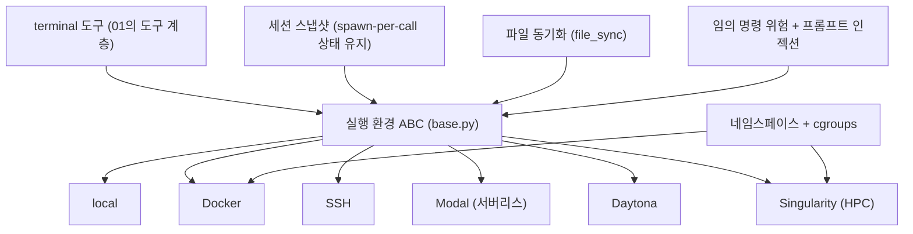

# 배경기술 09. 실행 환경 격리 (local / Docker / SSH / Modal / Daytona / Singularity)

## 이 문서에서 다루는 큰 맥락

에이전트가 셸 명령을 실행하는 **격리된 실행 환경 ([용어사전](../../dict/09_execution_infra.md#execution-environment))(execution environment)** 들을
다룹니다. "임의 명령을 실행하는 에이전트"의 위험을 다스리는 샌드박싱 개념부터,
격리 기술의 계보(가상머신 → 컨테이너 → 서버리스/원격 개발 환경)와 각 기술의 하위
개념(네임스페이스, cgroups ([용어사전](../../dict/09_execution_infra.md#cgroups)), 이미지, 루트리스 컨테이너 ([용어사전](../../dict/09_execution_infra.md#rootless))), 그리고 "어떤 백엔드든
에이전트에게는 똑같아 보이게" 만드는 추상화 설계까지 상세히 풀고, Hermes의
`tools/environments/` 구현과 연결합니다.

### 소목차
- [1. 핵심 정의: 왜 격리가 필요한가](#1-핵심-정의-왜-격리가-필요한가)
- [2. 하위 개념 상세](#2-하위-개념-상세)
- [3. 백엔드별 개요](#3-백엔드별-개요)
- [4. 개념 간 관계 지도](#4-개념-간-관계-지도)
- [5. 히스토리](#5-히스토리)
- [6. 트레이드오프](#6-트레이드오프)
- [7. 이 저장소에서의 구현 연결](#7-이-저장소에서의-구현-연결)
- [8. 근간 문헌 및 참고자료](#8-근간-문헌-및-참고자료)

---

## 들어가기 전에 — 필요한 배경과 비유

**필요한 배경**: 터미널에서 명령을 실행한다는 개념, 그리고 [../05_tools.md](../05_tools.md)의
terminal 도구.

**비유**: 에이전트에게 터미널을 주는 것은 신입사원에게 회사 서버실 열쇠를 주는 일과
같습니다. 그래서 위험한 작업은 본관이 아니라 **별도 실험실**에서 하게 합니다:
재활용 컨테이너(Docker), 옛 건물(SSH 원격 서버), 임대 실험실(Modal·Daytona 클라우드),
공유 실험실(Singularity, HPC) 등 종류는 달라도 "명령을 보내면 결과가 온다"는
출입구(인터페이스)는 똑같이 맞추는 것이 실행 환경 추상화입니다.

**학습 목표**: 격리가 필요한 이유(보안·재현성), 각 백엔드의 트레이드오프,
`tools/environments/`의 공통 인터페이스를 설명할 수 있게 됩니다.

---

## 1. 핵심 정의: 왜 격리가 필요한가

에이전트의 `terminal` 도구는 **임의의 셸 명령**을 실행합니다. 이는 에이전트의 가장
강력한 능력이자 가장 큰 위험입니다:

- 실수/환각으로 호스트 파일을 지우거나 설정을 망가뜨릴 수 있고,
- 프롬프트 인젝션 ([용어사전](../../dict/10_security.md#prompt-injection))([05](05_mcp_and_acp.md) 7절)에 걸리면 악의적 명령의 통로가 되며,
- 호스트의 민감정보(SSH 키, 브라우저 쿠키)에 접근할 수 있습니다.

**샌드박스(sandbox)** 는 이 위험을 담는 울타리입니다 — 명령이 볼 수 있는 파일,
쓸 수 있는 자원, 나갈 수 있는 네트워크를 제한한 실행 공간. 동시에 요구되는 것이
**추상화**입니다: 어디서 돌리든(내 노트북, 컨테이너, 클라우드) 에이전트 코어는
**동일한 인터페이스**로 명령을 보내야 합니다. 그래야 백엔드를 갈아끼워도 코어가
바뀌지 않습니다.

---

## 2. 하위 개념 상세

### 2-1. 격리의 스펙트럼: 프로세스 → 컨테이너 → VM

격리 강도 순으로:

1. **프로세스 권한 분리**: 같은 OS에서 별도 사용자/제한된 권한으로 실행. 가볍지만
   커널과 파일시스템을 공유해 경계가 얇습니다.
2. **컨테이너**: 커널은 공유하되 **네임스페이스**(프로세스가 보는 세계 — 파일시스템,
   프로세스 목록, 네트워크 — 를 분리)와 **cgroups**(CPU/메모리 사용량 제한)로
   "자기만의 작은 OS처럼 보이는" 공간을 만듦. 시작이 수 초 이내로 빠릅니다.
3. **가상머신(VM)**: 하드웨어부터 통째로 에뮬레이션. 경계가 가장 두껍지만 무겁고
   느립니다. (Firecracker 같은 microVM은 이 간극을 좁힌 절충안입니다.)

### 2-2. 컨테이너 이미지와 재현성

컨테이너의 또 다른 가치는 격리만이 아니라 **재현성 ([용어사전](../../dict/09_execution_infra.md#reproducibility))**입니다. **이미지(image)** 는
"파일시스템 + 설치된 패키지"의 불변 스냅샷이라서, 같은 이미지에서 띄운 컨테이너는
어디서든 같은 환경입니다. 에이전트 관점에서는 "실험을 깨끗한 환경에서 반복"할 수
있다는 뜻이며, SWE-bench류 평가 러너들이 컨테이너를 쓰는 이유입니다.

### 2-3. 루트리스 컨테이너와 HPC

Docker 데몬은 전통적으로 루트 권한이 필요해, 여러 사용자가 공유하는 연구
클러스터(HPC)에서는 쓰기 어려웠습니다. **Singularity(현 Apptainer)** 는 루트 권한
없이 사용자 권한으로 컨테이너를 돌리도록 설계되어 HPC의 표준이 됐습니다.
"컨테이너 = Docker"가 아니라, 같은 개념의 다른 런타임이 환경별로 존재한다는 예입니다.

### 2-4. 서버리스 컴퓨트와 원격 개발 환경

- **서버리스(serverless)**: 서버를 상시 유지하지 않고, 함수/작업 단위로 클라우드가
  즉석에서 컨테이너를 띄웠다 없애는 모델. **Modal**은 파이썬 함수에 데코레이터를
  붙이면 원격 컨테이너에서 돌려주는 서비스로, 에이전트의 "필요할 때만 빌리는
  샌드박스"에 잘 맞습니다.
- **원격 개발 환경**: GitHub Codespaces, **Daytona**처럼 표준화된 개발 워크스페이스를
  프로비저닝하는 플랫폼. 에이전트에게는 "미리 셋업된 원격 작업장"이 됩니다.

### 2-5. 상태 유지 문제: spawn-per-call vs 장수 셸

에이전트 터미널 구현의 숨은 난제입니다. 셸은 상태(현재 디렉토리, 환경변수, alias)를
가지는데, 이를 유지하는 두 방식이 있습니다:

- **장수 셸(long-lived shell)**: 셸 프로세스 하나를 계속 띄워두고 명령을 흘려보냄.
  상태가 자연히 유지되지만, 원격/컨테이너에서 연결이 끊기면 상태가 통째로 날아가고,
  멈춘 명령 하나가 셸 전체를 붙듭니다.
- **spawn-per-call**: 명령마다 새 `bash -c` 프로세스를 띄움. 견고하지만(명령 하나의
  죽음이 다음에 영향 없음) 상태가 매번 초기화됩니다. 해법: 초기에 세션 스냅샷 ([용어사전](../../dict/09_execution_infra.md#session-snapshot))
  (env/함수/alias)을 캡처해 매 명령 전에 다시 source하고, CWD는 명령 출력에 심은
  마커나 임시 파일로 추적 — **상태를 "셸 프로세스"가 아니라 "데이터"로 유지**하는
  발상입니다. Hermes가 이 방식입니다(7절).

### 2-6. 파일 가시성과 동기화

원격 백엔드에서는 에이전트가 만든 파일이 호스트에 없고, 그 반대도 마찬가지입니다.
`read_file` 같은 다른 도구가 터미널과 **같은 파일 세계**를 봐야 하므로, 마운트나
**파일 동기화**가 백엔드 추상화의 일부가 됩니다. Hermes `AGENTS.md`의 rubric —
"원격 백엔드의 파일 가시성이 문제라면 마운트를 고쳐라, 새 도구를 만들지 말라" —
가 바로 이 지점을 가리킵니다.

---

## 3. 백엔드별 개요

| 백엔드 | 무엇인가 | 격리 | 적합한 경우 |
|--------|---------|------|------------|
| **local** | 호스트에서 직접 실행 | 없음 | 개인 머신, 신뢰된 작업 |
| **Docker** | 로컬 컨테이너 (2013~, 사실상 표준) | 중 | 재현성, 의존성 격리 |
| **SSH** | 원격 머신에서 실행 | 호스트와 분리 | GPU 서버, 별도 호스트 |
| **Modal** | 서버리스 클라우드 컨테이너 | 강 | 온디맨드 대량/격리 실행 |
| **Daytona** | 개발 환경 프로비저닝 플랫폼 | 강 | 표준화된 원격 워크스페이스 |
| **Singularity** | 루트리스 HPC 컨테이너 | 중 | 공유 연구 클러스터 |

---

## 4. 개념 간 관계 지도

- 실행 환경은 [01_tool_calling.md](01_tool_calling.md)의 도구 계층 아래에 있는
  **구현 세부**입니다 — 모델은 백엔드의 존재를 모릅니다.
- ABC 하나 + 여러 구현이라는 구조는 [07](07_honcho_dialectic.md) 2-5절의 memory
  provider, [08](08_cdp_browser.md)의 로컬/클라우드 브라우저와 같은 반복 패턴입니다
  (`AGENTS.md`의 "같은 카테고리는 ABC + 오케스트레이터로" 원칙).

---

## 5. 히스토리

1. **1979~ — chroot, 2000s — jail/zones**: "프로세스가 보는 파일시스템을 가두는"
   격리의 원형들.
2. **2006~2008 — cgroups와 LXC**: 리눅스 커널에 자원 제한(cgroups)과 네임스페이스가
   들어오며 컨테이너의 커널 기반이 완성됩니다.
3. **2013 — Docker**: 이미지 포맷 + 레지스트리 + 간편한 CLI로 컨테이너를 대중화.
   이후 OCI 표준으로 이어집니다.
4. **2015~ — Singularity**: HPC용 루트리스 컨테이너 런타임 등장(후에 Apptainer로
   개명, Linux Foundation 산하).
5. **2018 — Firecracker** (AWS): microVM으로 "VM급 격리 + 컨테이너급 속도"를 달성,
   서버리스 인프라의 기반이 됩니다.
6. **2020s — 서버리스 컴퓨트 ([용어사전](../../dict/09_execution_infra.md#serverless))/원격 개발 환경 상품화**: Modal, Codespaces, Daytona 등.
7. **2023~ — 에이전트 샌드박스 시대**: 코드를 실행하는 LLM ([용어사전](../../dict/01_llm_basics.md#llm)) 에이전트가 보편화되며
   "에이전트에게 안전한 실행 공간"이 독립된 인프라 상품군(E2B, Modal Sandboxes 등)
   으로 성장합니다. SWE-bench 평가 러너들도 컨테이너 격리를 표준으로 씁니다.

---

## 6. 트레이드오프

핵심 축은 **격리 강도 ↔ 속도/편의**입니다:

- local은 지연 0이지만 울타리도 0. 컨테이너는 안전하지만 이미지 준비·시작 비용이
  있고, 원격은 네트워크 지연과 파일 가시성 문제(2-6절)가 더해집니다.
- **상태 유지 방식**(2-5절)도 트레이드오프입니다: 장수 셸은 자연스럽지만 깨지기
  쉽고, spawn-per-call은 견고하지만 상태를 데이터로 재구성하는 복잡성을 감수합니다.
- 백엔드 다양성 자체의 비용: 백엔드마다 코어가 분기하면 유지보수가 폭발합니다.
  그래서 **공통 ABC로 차이를 흡수**하고, 코어는 백엔드를 모른 채 동작하게 하는
  것이 정답입니다.

---

## 7. 이 저장소에서의 구현 연결

- 모든 백엔드는 `tools/environments/` 아래에 있고, 공통 추상 기반 클래스
  `tools/environments/base.py`를 상속합니다.
  [`tools/environments/base.py` 1-7행](../../tools/environments/base.py#L1-L7)
  - **통일된 spawn-per-call 모델**(2-5절, 3-6행): 모든 명령이 새 `bash -c`
    프로세스를 띄우고, init 시 캡처한 세션 스냅샷(env/함수/alias)을 매 명령 전에
    다시 source하며, CWD는 원격은 stdout 마커, 로컬은 임시 파일로 유지합니다.
- 파일 목록(실제 존재하는 백엔드): `local.py`, `docker.py`, `ssh.py`,
  `modal.py`(+`managed_modal.py`, `modal_utils.py`), `daytona.py`,
  `singularity.py`, 그리고 원격 파일 동기화용 `file_sync.py`(2-6절).
- 에이전트가 쓰는 도구는 [05_tools.md](../05_tools.md)의 `terminal`/`process`
  등이며, 어떤 백엔드가 활성이든 동일하게 동작합니다. 백엔드 선택은 설정으로
  결정됩니다.
- **설계 의도(ABC로 통일)**: `AGENTS.md`의 "같은 카테고리는 하나의 ABC +
  오케스트레이터로" 원칙의 적용입니다. 새 격리 백엔드는 `base.py`의 인터페이스만
  구현하면 코어를 건드리지 않고 추가됩니다. "파일 가시성이 문제면 마운트를 고치지
  새 도구를 만들지 말라"는 rubric도 이 계층을 겨냥한 것입니다.
- 연구용 러너([10](../10_subsystems.md) 5-2절)의 `mini_swe_runner.py`도 이
  local/docker/modal 백엔드를 재사용합니다 — 2-2절의 "평가는 재현 가능한 격리
  환경에서"의 실례입니다.

---

## 8. 근간 문헌 및 참고자료

**기술 문서**
- Docker 공식 문서 — <https://docs.docker.com/>
- Apptainer(Singularity) — <https://apptainer.org/>
- Modal — <https://modal.com/docs> / Daytona — <https://www.daytona.io/>
- Firecracker microVM — <https://firecracker-microvm.github.io/>
- 리눅스 네임스페이스 ([용어사전](../../dict/09_execution_infra.md#namespace)) 매뉴얼 — <https://man7.org/linux/man-pages/man7/namespaces.7.html>

**논문 (배경)**
- Kurtzer et al., "Singularity: Scientific containers for mobility of compute" (2017, PLOS ONE)
- Agache et al., "Firecracker: Lightweight Virtualization for Serverless Applications" (2020, NSDI)

---

---

## 정리 — 스스로 점검 질문

1. 에이전트의 명령 실행을 격리해야 하는 이유 두 가지(보안, 재현성)는 각각 무엇인가?
2. 컨테이너(Docker)와 VM의 격리 수준 차이는?
3. Singularity가 HPC 환경에서 선호되는 이유는? (힌트: 루트 데몬)
4. 백엔드를 공통 인터페이스로 추상화해 둔 덕분에 Hermes 코어는 무엇을 몰라도 되는가?

이것으로 **주제 2(배경기술)** 을 마칩니다. 전체 목차로 돌아가려면
→ [00_index.md](../00_index.md)
