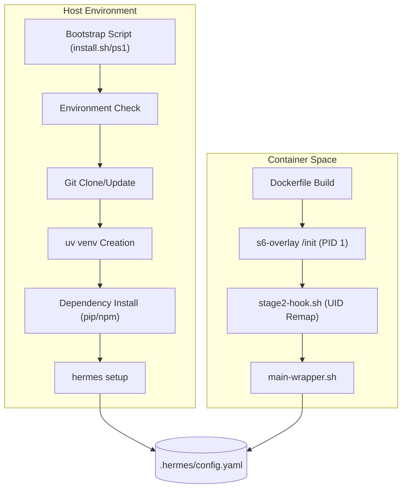
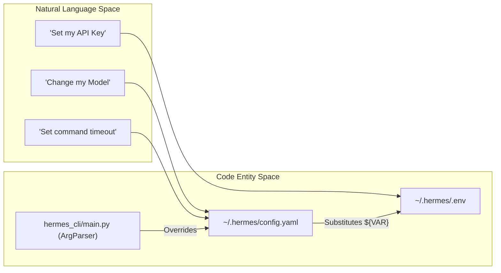
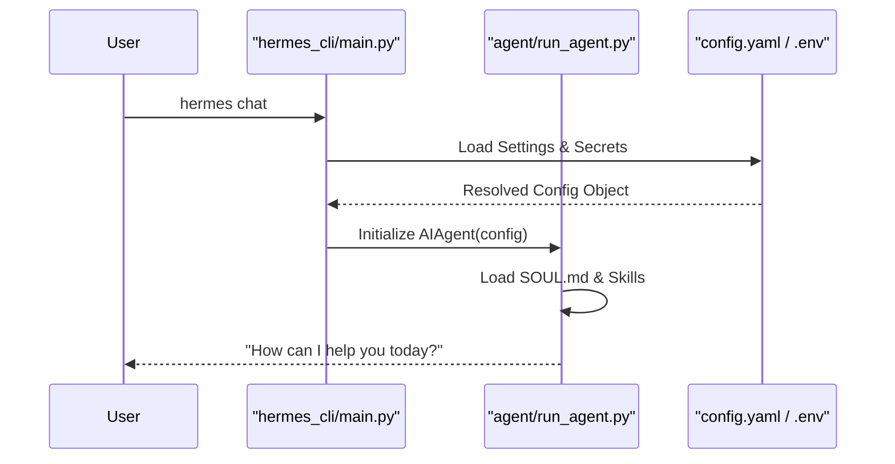

# Getting Started & Installation

Relevant source files

The following files were used as context for generating this wiki page:

- [.dockerignore](../.dockerignore)
- [.envrc](../.envrc)
- [.gitignore](../.gitignore)
- [.hadolint.yaml](../.hadolint.yaml)
- [CONTRIBUTING.md](../CONTRIBUTING.md)
- [Dockerfile](../Dockerfile)
- [README.ur-pk.md](../README.ur-pk.md)
- [README.zh-CN.md](../README.zh-CN.md)
- contributors/emails/lucaskvasir@duck.com
- [docker-compose.yml](../docker-compose.yml)
- [docker/SOUL.md](../docker/SOUL.md)
- [docker/entrypoint.sh](../docker/entrypoint.sh)
- [docker/main-wrapper.sh](../docker/main-wrapper.sh)
- [docker/stage2-hook.sh](../docker/stage2-hook.sh)
- [flake.lock](../flake.lock)
- [flake.nix](../flake.nix)
- [hermes_cli/default_soul.py](../hermes_cli/default_soul.py)
- [hermes_cli/managed_uv.py](../hermes_cli/managed_uv.py)
- [nix/checks.nix](../nix/checks.nix)
- [nix/desktop.nix](../nix/desktop.nix)
- [nix/devShell.nix](../nix/devShell.nix)
- [nix/hermes-agent.nix](../nix/hermes-agent.nix)
- [nix/lib.nix](../nix/lib.nix)
- [nix/nixosModules.nix](../nix/nixosModules.nix)
- [nix/overlays.nix](../nix/overlays.nix)
- [nix/packages.nix](../nix/packages.nix)
- [nix/python.nix](../nix/python.nix)
- [nix/tui.nix](../nix/tui.nix)
- [nix/web.nix](../nix/web.nix)
- [scripts/capture-cage-terminal.sh](../scripts/capture-cage-terminal.sh)
- [scripts/docker_rebootstrap_nous_session.py](../scripts/docker_rebootstrap_nous_session.py)
- [scripts/install.ps1](../scripts/install.ps1)
- [scripts/install.sh](../scripts/install.sh)
- [setup-hermes.sh](../setup-hermes.sh)
- [setup.py](../setup.py)
- [tests/docker/test_immutable_install_permissions.py](../tests/docker/test_immutable_install_permissions.py)
- [tests/hermes_cli/test_cmd_update.py](../tests/hermes_cli/test_cmd_update.py)
- [tests/hermes_cli/test_cron_parser_builder.py](../tests/hermes_cli/test_cron_parser_builder.py)
- [tests/hermes_cli/test_gui_command.py](../tests/hermes_cli/test_gui_command.py)
- [tests/hermes_cli/test_lazy_refresh_venv_repair.py](../tests/hermes_cli/test_lazy_refresh_venv_repair.py)
- [tests/hermes_cli/test_managed_uv.py](../tests/hermes_cli/test_managed_uv.py)
- [tests/hermes_cli/test_run_with_idle_timeout.py](../tests/hermes_cli/test_run_with_idle_timeout.py)
- [tests/hermes_cli/test_tui_npm_install.py](../tests/hermes_cli/test_tui_npm_install.py)
- [tests/hermes_cli/test_update_autostash.py](../tests/hermes_cli/test_update_autostash.py)
- [tests/hermes_cli/test_update_interrupted_recovery.py](../tests/hermes_cli/test_update_interrupted_recovery.py)
- [tests/hermes_cli/test_verify_core_dependencies.py](../tests/hermes_cli/test_verify_core_dependencies.py)
- [tests/hermes_cli/test_web_ui_build.py](../tests/hermes_cli/test_web_ui_build.py)
- [tests/hermes_cli/test_windows_native_docs.py](../tests/hermes_cli/test_windows_native_docs.py)
- [tests/test_install_ps1_native_stderr_eap.py](../tests/test_install_ps1_native_stderr_eap.py)
- [tests/test_install_ps1_uv_powershell_host.py](../tests/test_install_ps1_uv_powershell_host.py)
- [tests/tools/test_docker_find.py](../tests/tools/test_docker_find.py)
- [tests/tools/test_docker_rebootstrap_nous_session.py](../tests/tools/test_docker_rebootstrap_nous_session.py)
- [tests/tools/test_dockerfile_node_modules_perms.py](../tests/tools/test_dockerfile_node_modules_perms.py)
- [tests/tools/test_dockerfile_pid1_reaping.py](../tests/tools/test_dockerfile_pid1_reaping.py)
- [website/docs/developer-guide/contributing.md](../website/docs/developer-guide/contributing.md)
- [website/docs/developer-guide/creating-skills.md](../website/docs/developer-guide/creating-skills.md)
- [website/docs/getting-started/installation.md](../website/docs/getting-started/installation.md)
- [website/docs/getting-started/nix-setup.md](../website/docs/getting-started/nix-setup.md)
- [website/docs/getting-started/quickstart.md](../website/docs/getting-started/quickstart.md)
- [website/docs/getting-started/termux.md](../website/docs/getting-started/termux.md)
- [website/docs/getting-started/updating.md](../website/docs/getting-started/updating.md)
- [website/docs/integrations/providers.md](../website/docs/integrations/providers.md)
- [website/docs/reference/cli-commands.md](../website/docs/reference/cli-commands.md)
- [website/docs/reference/environment-variables.md](../website/docs/reference/environment-variables.md)
- [website/docs/reference/slash-commands.md](../website/docs/reference/slash-commands.md)
- [website/docs/user-guide/cli.md](../website/docs/user-guide/cli.md)
- [website/docs/user-guide/configuration.md](../website/docs/user-guide/configuration.md)
- [website/docs/user-guide/features/fallback-providers.md](../website/docs/user-guide/features/fallback-providers.md)
- [website/docs/user-guide/features/skills.md](../website/docs/user-guide/features/skills.md)
- [website/docs/user-guide/messaging/index.md](../website/docs/user-guide/messaging/index.md)
- [website/docs/user-guide/security.md](../website/docs/user-guide/security.md)
- [website/docs/user-guide/windows-native.md](../website/docs/user-guide/windows-native.md)
- [website/i18n/zh-Hans/docusaurus-plugin-content-docs/current/developer-guide/contributing.md](../website/i18n/zh-Hans/docusaurus-plugin-content-docs/current/developer-guide/contributing.md)
- [website/i18n/zh-Hans/docusaurus-plugin-content-docs/current/getting-started/installation.md](../website/i18n/zh-Hans/docusaurus-plugin-content-docs/current/getting-started/installation.md)
- [website/i18n/zh-Hans/docusaurus-plugin-content-docs/current/user-guide/windows-native.md](../website/i18n/zh-Hans/docusaurus-plugin-content-docs/current/user-guide/windows-native.md)

This page provides a technical overview of the Hermes Agent installation ecosystem, the initial setup state machine, and the configuration hierarchy. Hermes is designed to be portable across local environments (CLI/TUI), containerized deployments (Docker), and declarative systems (Nix).

## 1. Installation Methods

Hermes utilizes `uv` for high-performance Python environment management and `npm` for its frontend components (TUI and Web Dashboard). The installation scripts are designed to be idempotent and handle system-level dependencies automatically.

### Shell Scripts (Linux, macOS, Windows)
The primary installation vector is the platform-specific bootstrap script. These scripts perform environment detection, clone the repository, and initialize a managed virtual environment.

*   **Unix (`install.sh`):** Detects Linux, macOS, or Termux. It resolves an FHS-style layout when run as root, placing code in `/usr/local/lib/hermes-agent` and linking the binary to `/usr/local/bin/hermes` [scripts/install.sh:62-66](../scripts/install.sh#L62-L66). It also handles `PYTHONPATH` isolation to prevent module shadowing [scripts/install.sh:22-25](../scripts/install.sh#L22-L25).
*   **Windows (`install.ps1`):** A PowerShell script that uses `uv` for Python provisioning. It includes specific fixes for 8.3 short-path normalization to prevent build failures when user profiles contain spaces [scripts/install.ps1:94-107](../scripts/install.ps1#L94-L107).

### Docker Deployment
The `Dockerfile` implements a multi-stage build to produce a production-ready image based on Debian 13 (Trixie).

*   **Supervision:** Uses `s6-overlay` as PID 1 to manage the main agent process, the web dashboard, and per-profile messaging gateways [Dockerfile:25-28](../Dockerfile#L25-L28).
*   **Stage 2 Hook:** The `docker/stage2-hook.sh` script runs at container boot to handle UID/GID remapping (supporting `PUID`/`PGID` conventions) and ensures the `hermes` user has access to the Docker socket for containerized tool execution [docker/stage2-hook.sh:104-116](../docker/stage2-hook.sh#L104-L116), [docker/stage2-hook.sh:118-135](../docker/stage2-hook.sh#L118-L135).

### Nix Flake
For users of the Nix ecosystem, the project provides a `flake.nix` that exports packages for the agent, TUI, and web components, along with a NixOS module for system-level service management.

**Installation Flow Diagram**

Sources: [scripts/install.sh:1-60](../scripts/install.sh#L1-L60), [Dockerfile:1-32](../Dockerfile#L1-L32), [docker/stage2-hook.sh:1-17](../docker/stage2-hook.sh#L1-L17), [website/docs/getting-started/quickstart.md:49-67](../website/docs/getting-started/quickstart.md#L49-L67)

---

## 2. Initial Setup Wizard

The `hermes setup` command [website/docs/reference/cli-commands.md:47-47](../website/docs/reference/cli-commands.md#L47) triggers an interactive state machine defined in the CLI layer. It offers three distinct paths for initializing the agent's capabilities.

| Mode | Scope | Key Behavior |
| :--- | :--- | :--- |
| **Quick Setup** | Nous Portal | Uses OAuth for zero-config model and Tool Gateway access [website/docs/getting-started/quickstart.md:101-101](../website/docs/getting-started/quickstart.md#L101). |
| **Full Setup** | Comprehensive | Step-by-step configuration of all providers, tools, and messaging platforms [website/docs/getting-started/quickstart.md:102-102](../website/docs/getting-started/quickstart.md#L102). |
| **Blank Slate** | Minimalist | Disables all non-essential tools; only File Ops and Terminal are enabled by default [website/docs/getting-started/quickstart.md:103-103](../website/docs/getting-started/quickstart.md#L103). |

### The "Nous Portal" Path
Running `hermes setup --portal` is the recommended path for new users. It automates:
1.  OAuth2 authentication with the Nous Portal [website/docs/integrations/providers.md:68-68](../website/docs/integrations/providers.md#L68).
2.  Selection of a default model (e.g., Claude, GPT, or Llama).
3.  Configuration of the "Tool Gateway" for web search and image generation [website/docs/user-guide/configuration.md:11-13](../website/docs/user-guide/configuration.md#L11-L13).

Sources: [website/docs/getting-started/quickstart.md:98-106](../website/docs/getting-started/quickstart.md#L98-L106), [website/docs/integrations/providers.md:63-75](../website/docs/integrations/providers.md#L63-L75)

---

## 3. Configuration Architecture

Hermes separates configuration into three primary tiers: **Settings** (`config.yaml`), **Secrets** (`.env`), and **State** (SQLite/Markdown).

### Configuration Precedence
When resolving a setting, the system follows this hierarchy (highest priority first):
1.  **CLI Arguments:** (e.g., `hermes chat --model ...`) [website/docs/user-guide/configuration.md:57-57](../website/docs/user-guide/configuration.md#L57).
2.  **`~/.hermes/config.yaml`:** Primary non-secret settings [website/docs/user-guide/configuration.md:58-58](../website/docs/user-guide/configuration.md#L58).
3.  **`~/.hermes/.env`:** Fallback for environment variables and secrets [website/docs/user-guide/configuration.md:59-59](../website/docs/user-guide/configuration.md#L59).
4.  **Built-in Defaults:** Hardcoded values in the codebase [website/docs/user-guide/configuration.md:60-60](../website/docs/user-guide/configuration.md#L60).

### Environment Mapping
**Natural Language to Code Entity Mapping**

### Key Configuration Files
*   **`config.yaml`**: Contains `terminal` backends, `updates` policies, and `provider` model mappings [website/docs/user-guide/configuration.md:19-19](../website/docs/user-guide/configuration.md#L19). It supports environment variable substitution using `${VAR_NAME}` syntax [website/docs/user-guide/configuration.md:74-74](../website/docs/user-guide/configuration.md#L74).
*   **`.env`**: Stores sensitive keys like `OPENROUTER_API_KEY`, `ANTHROPIC_API_KEY`, or `GOOGLE_API_KEY` [website/docs/reference/environment-variables.md:15-73](../website/docs/reference/environment-variables.md#L15-L73).
*   **`auth.json`**: Managed by the `hermes auth` command; stores OAuth tokens for providers like Nous Portal or OpenAI Codex [website/docs/user-guide/configuration.md:21-21](../website/docs/user-guide/configuration.md#L21).

Sources: [website/docs/user-guide/configuration.md:15-86](../website/docs/user-guide/configuration.md#L15-L86), [website/docs/reference/environment-variables.md:7-9](../website/docs/reference/environment-variables.md#L7-L9), [website/docs/reference/cli-commands.md:51-51](../website/docs/reference/cli-commands.md#L51)

---

## 4. First-Run Experience

After installation and setup, the user typically interacts with the `hermes chat` or `hermes chat --tui` entrypoints.

1.  **Identity Assembly:** The agent loads its "Soul" from `~/.hermes/SOUL.md` to define its persona [website/docs/user-guide/configuration.md:22-22](../website/docs/user-guide/configuration.md#L22).
2.  **Tool Discovery:** The agent scans enabled toolsets (Local Terminal, Docker, etc.) based on the `terminal.backend` setting in `config.yaml` [website/docs/user-guide/configuration.md:120-121](../website/docs/user-guide/configuration.md#L120-L121).
3.  **Session Initialization:** A new SQLite session is created in `~/.hermes/sessions/` to track conversation history [website/docs/user-guide/configuration.md:26-26](../website/docs/user-guide/configuration.md#L26).
4.  **Messaging Check:** If the user intends to use a bot, `hermes gateway start` launches the background service that connects to platforms like Telegram or Discord [website/docs/user-guide/messaging/index.md:151-151](../website/docs/user-guide/messaging/index.md#L151).

**Execution Flow Diagram**

Sources: [website/docs/user-guide/configuration.md:18-28](../website/docs/user-guide/configuration.md#L18-L28), [website/docs/reference/cli-commands.md:40-40](../website/docs/reference/cli-commands.md#L40), [website/docs/user-guide/messaging/index.md:144-155](../website/docs/user-guide/messaging/index.md#L144-L155)

---
