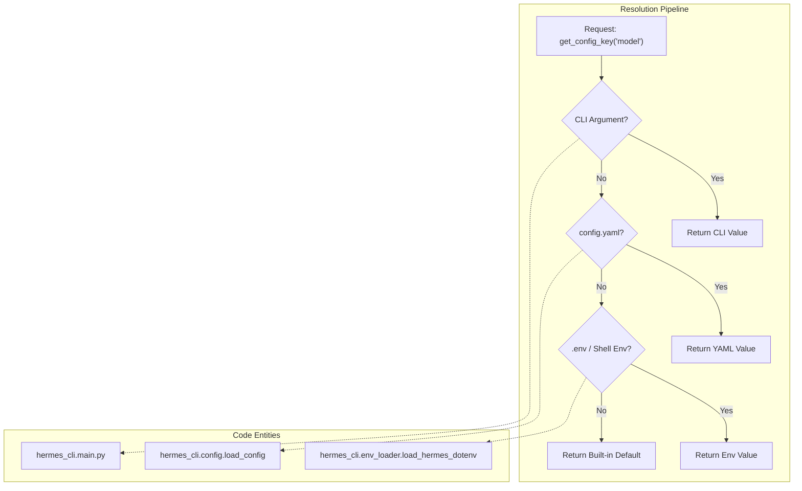
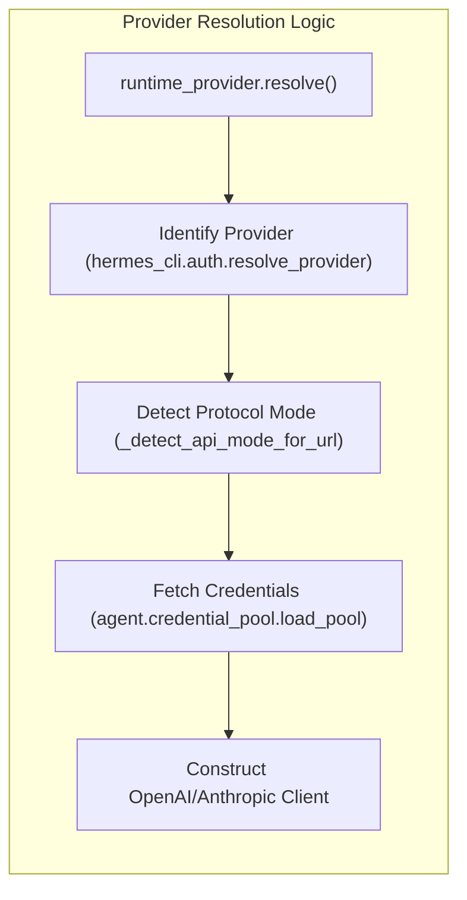

# Configuration Reference

Relevant source files

The following files were used as context for generating this wiki page:

- [CONTRIBUTING.md](../CONTRIBUTING.md)
- [README.ur-pk.md](../README.ur-pk.md)
- [README.zh-CN.md](../README.zh-CN.md)
- [agent/auxiliary_client.py](../agent/auxiliary_client.py)
- [agent/credential_pool.py](../agent/credential_pool.py)
- [apps/desktop/src/lib/runtime-readiness.test.ts](../apps/desktop/src/lib/runtime-readiness.test.ts)
- [apps/desktop/src/lib/runtime-readiness.ts](../apps/desktop/src/lib/runtime-readiness.ts)
- [apps/desktop/src/store/onboarding.test.ts](../apps/desktop/src/store/onboarding.test.ts)
- [apps/desktop/src/store/onboarding.ts](../apps/desktop/src/store/onboarding.ts)
- contributors/emails/phixxation@gmail.com
- [gateway/status.py](../gateway/status.py)
- [hermes_cli/_subprocess_compat.py](../hermes_cli/_subprocess_compat.py)
- [hermes_cli/auth.py](../hermes_cli/auth.py)
- [hermes_cli/auth_commands.py](../hermes_cli/auth_commands.py)
- [hermes_cli/doctor.py](../hermes_cli/doctor.py)
- [hermes_cli/gateway.py](../hermes_cli/gateway.py)
- [hermes_cli/gateway_windows.py](../hermes_cli/gateway_windows.py)
- [hermes_cli/main.py](../hermes_cli/main.py)
- [hermes_cli/models.py](../hermes_cli/models.py)
- [hermes_cli/profiles.py](../hermes_cli/profiles.py)
- [hermes_cli/proxy/adapters/base.py](../hermes_cli/proxy/adapters/base.py)
- [hermes_cli/proxy/adapters/nous_portal.py](../hermes_cli/proxy/adapters/nous_portal.py)
- [hermes_cli/runtime_provider.py](../hermes_cli/runtime_provider.py)
- [hermes_cli/setup.py](../hermes_cli/setup.py)
- [hermes_cli/status.py](../hermes_cli/status.py)
- [tests/agent/test_auxiliary_client.py](../tests/agent/test_auxiliary_client.py)
- [tests/agent/test_credential_pool.py](../tests/agent/test_credential_pool.py)
- [tests/agent/test_credential_pool_oauth_writethrough.py](../tests/agent/test_credential_pool_oauth_writethrough.py)
- [tests/gateway/test_discord_document_handling.py](../tests/gateway/test_discord_document_handling.py)
- [tests/gateway/test_discord_send.py](../tests/gateway/test_discord_send.py)
- [tests/gateway/test_document_cache.py](../tests/gateway/test_document_cache.py)
- [tests/gateway/test_gateway_command_line_matcher.py](../tests/gateway/test_gateway_command_line_matcher.py)
- [tests/gateway/test_runner_startup_failures.py](../tests/gateway/test_runner_startup_failures.py)
- [tests/gateway/test_send_image_file.py](../tests/gateway/test_send_image_file.py)
- [tests/gateway/test_status.py](../tests/gateway/test_status.py)
- [tests/gateway/test_telegram_documents.py](../tests/gateway/test_telegram_documents.py)
- [tests/hermes_cli/test_auth_commands.py](../tests/hermes_cli/test_auth_commands.py)
- [tests/hermes_cli/test_auth_nous_provider.py](../tests/hermes_cli/test_auth_nous_provider.py)
- [tests/hermes_cli/test_auth_profile_fallback.py](../tests/hermes_cli/test_auth_profile_fallback.py)
- [tests/hermes_cli/test_config_validation.py](../tests/hermes_cli/test_config_validation.py)
- [tests/hermes_cli/test_doctor.py](../tests/hermes_cli/test_doctor.py)
- [tests/hermes_cli/test_gateway.py](../tests/hermes_cli/test_gateway.py)
- [tests/hermes_cli/test_gateway_linger.py](../tests/hermes_cli/test_gateway_linger.py)
- [tests/hermes_cli/test_gateway_proc_fallback.py](../tests/hermes_cli/test_gateway_proc_fallback.py)
- [tests/hermes_cli/test_gateway_service.py](../tests/hermes_cli/test_gateway_service.py)
- [tests/hermes_cli/test_gateway_windows.py](../tests/hermes_cli/test_gateway_windows.py)
- [tests/hermes_cli/test_model_validation.py](../tests/hermes_cli/test_model_validation.py)
- [tests/hermes_cli/test_profiles.py](../tests/hermes_cli/test_profiles.py)
- [tests/hermes_cli/test_proxy.py](../tests/hermes_cli/test_proxy.py)
- [tests/hermes_cli/test_runtime_provider_resolution.py](../tests/hermes_cli/test_runtime_provider_resolution.py)
- [tests/hermes_cli/test_web_oauth_dispatch.py](../tests/hermes_cli/test_web_oauth_dispatch.py)
- [tests/hermes_cli/test_windows_native_docs.py](../tests/hermes_cli/test_windows_native_docs.py)
- [tests/tools/test_windows_native_support.py](../tests/tools/test_windows_native_support.py)
- [website/docs/developer-guide/contributing.md](../website/docs/developer-guide/contributing.md)
- [website/docs/developer-guide/creating-skills.md](../website/docs/developer-guide/creating-skills.md)
- [website/docs/getting-started/installation.md](../website/docs/getting-started/installation.md)
- [website/docs/getting-started/quickstart.md](../website/docs/getting-started/quickstart.md)
- [website/docs/getting-started/updating.md](../website/docs/getting-started/updating.md)
- [website/docs/integrations/providers.md](../website/docs/integrations/providers.md)
- [website/docs/reference/cli-commands.md](../website/docs/reference/cli-commands.md)
- [website/docs/reference/environment-variables.md](../website/docs/reference/environment-variables.md)
- [website/docs/reference/profile-commands.md](../website/docs/reference/profile-commands.md)
- [website/docs/reference/slash-commands.md](../website/docs/reference/slash-commands.md)
- [website/docs/user-guide/cli.md](../website/docs/user-guide/cli.md)
- [website/docs/user-guide/configuration.md](../website/docs/user-guide/configuration.md)
- [website/docs/user-guide/features/fallback-providers.md](../website/docs/user-guide/features/fallback-providers.md)
- [website/docs/user-guide/features/skills.md](../website/docs/user-guide/features/skills.md)
- [website/docs/user-guide/messaging/index.md](../website/docs/user-guide/messaging/index.md)
- [website/docs/user-guide/profile-distributions.md](../website/docs/user-guide/profile-distributions.md)
- [website/docs/user-guide/profiles.md](../website/docs/user-guide/profiles.md)
- [website/docs/user-guide/security.md](../website/docs/user-guide/security.md)
- [website/docs/user-guide/windows-native.md](../website/docs/user-guide/windows-native.md)
- [website/i18n/zh-Hans/docusaurus-plugin-content-docs/current/developer-guide/contributing.md](../website/i18n/zh-Hans/docusaurus-plugin-content-docs/current/developer-guide/contributing.md)
- [website/i18n/zh-Hans/docusaurus-plugin-content-docs/current/getting-started/installation.md](../website/i18n/zh-Hans/docusaurus-plugin-content-docs/current/getting-started/installation.md)
- [website/i18n/zh-Hans/docusaurus-plugin-content-docs/current/user-guide/windows-native.md](../website/i18n/zh-Hans/docusaurus-plugin-content-docs/current/user-guide/windows-native.md)

This page provides a comprehensive technical reference for the Hermes Agent configuration system. Hermes uses a multi-layered configuration architecture that balances user-friendly defaults with deep customizability for enterprise and power-user workflows.

## Configuration Directory Structure

The agent centralizes all state and configuration within the `HERMES_HOME` directory (defaulting to `~/.hermes/`). This directory serves as the root for profiles and persistent state.

| File/Directory | Role |
| :--- | :--- |
| `config.yaml` | Primary behavior settings (model, terminal, TUI, etc.) |
| `.env` | Sensitive secrets and API keys |
| `auth.json` | Persisted OAuth tokens and provider state |
| `SOUL.md` | The primary agent identity prompt |
| `memories/` | Persistent conversation memory stores |
| `skills/` | Agent-created procedural skills |
| `sessions/` | SQLite databases for conversation history |

**Sources:** `[website/docs/user-guide/configuration.md:15-28](../website/docs/user-guide/configuration.md#L15-L28)`

## Configuration Precedence Hierarchy

Hermes resolves configuration values using a strict precedence hierarchy. If a key exists in multiple layers, the higher-priority layer overrides the lower ones.

### Precedence Order (Highest to Lowest)

1.  **CLI Flags/Arguments:** Explicit overrides provided during invocation (e.g., `hermes chat --model ...`).
2.  **`config.yaml`:** The user-defined configuration file.
3.  **`.env`:** Environment variables and secrets.
4.  **Built-in Defaults:** Hardcoded safe fallbacks defined in `hermes_cli/config.py`.

**Sources:** `[website/docs/user-guide/configuration.md:53-64](../website/docs/user-guide/configuration.md#L53-L64)`

### Precedence Data Flow

The following diagram illustrates how the `Config` system resolves a requested setting across these layers.

**Sources:** `[website/docs/user-guide/configuration.md:53-64](../website/docs/user-guide/configuration.md#L53-L64)`, `[hermes_cli/main.py:79-88](../hermes_cli/main.py#L79-L88)`

## Core Configuration Files

### config.yaml (Behavioral Settings)
This file uses standard YAML syntax. It supports environment variable substitution using the `${VAR_NAME}` syntax `[website/docs/user-guide/configuration.md:72-86](../website/docs/user-guide/configuration.md#L72-L86)`.

Key sections include:
*   **`model`**: Defines the `default` model and `provider` `[hermes_cli/setup.py:36-43](../hermes_cli/setup.py#L36-L43)`.
*   **`terminal`**: Configures the execution backend (local, docker, ssh, etc.) and `timeout` `[website/docs/user-guide/configuration.md:115-125](../website/docs/user-guide/configuration.md#L115-L125)`.
*   **`auxiliary`**: Overrides for side-tasks like `vision`, `compression`, and `web_extract` `[agent/auxiliary_client.py:32-34](../agent/auxiliary_client.py#L32-L34)`.

### .env (Secrets & API Keys)
API keys are never stored in `config.yaml`. They are managed in `.env` to prevent accidental exposure when sharing configurations. The `hermes config set` command automatically routes keys to `.env` and behavior to `config.yaml` `[website/docs/user-guide/configuration.md:49-51](../website/docs/user-guide/configuration.md#L49-L51)`.

**Common Secret Keys:**
*   `OPENROUTER_API_KEY`
*   `ANTHROPIC_API_KEY`
*   `OPENAI_API_KEY`
*   `GOOGLE_API_KEY`

**Sources:** `[website/docs/reference/environment-variables.md:11-80](../website/docs/reference/environment-variables.md#L11-L80)`, `[hermes_cli/doctor.py:32-57](../hermes_cli/doctor.py#L32-L57)`

## LLM Provider Resolution

The `runtime_provider.py` module is responsible for translating configuration strings into active API clients. It handles model aliases, base URL overrides, and protocol detection (e.g., OpenAI vs. Anthropic Messages API).

### Provider Logic Flow
1.  **Identity Resolution:** `resolve_provider()` determines if the provider is a first-class OAuth provider (Nous, xAI) or a generic API-key provider `[hermes_cli/runtime_provider.py:31-38](../hermes_cli/runtime_provider.py#L31-L38)`.
2.  **Protocol Detection:** `_detect_api_mode_for_url()` inspects the `base_url` to decide if it should use `chat_completions`, `anthropic_messages`, or `codex_responses` `[hermes_cli/runtime_provider.py:101-139](../hermes_cli/runtime_provider.py#L101-L139)`.
3.  **Credential Retrieval:** Fetches keys from the `CredentialPool` or the environment `[hermes_cli/runtime_provider.py:14-20](../hermes_cli/runtime_provider.py#L14-L20)`.

**Sources:** `[hermes_cli/runtime_provider.py:14-161](../hermes_cli/runtime_provider.py#L14-L161)`

## Credential Management & OAuth

Hermes supports complex authentication flows beyond simple API keys, primarily managed through `hermes_cli/auth.py`.

### OAuth Device Code Flow
For providers like **Nous Portal**, **xAI**, and **OpenAI Codex**, Hermes implements the OAuth 2.0 Device Authorization Grant.
*   **Storage:** Tokens are stored in `~/.hermes/auth.json` with cross-process file locking via `fcntl` or `msvcrt` `[hermes_cli/auth.py:5-7](../hermes_cli/auth.py#L5-L7)`.
*   **Refresh:** The system performs "write-through" token refreshes. For example, xAI tokens are refreshed up to 1 hour before expiry to prevent gateway/cron interruptions `[hermes_cli/auth.py:115-120](../hermes_cli/auth.py#L115-L120)`.

### Credential Pools
Hermes can rotate through multiple keys for the same provider to bypass rate limits.
*   **Strategies:** `round-robin`, `least-used`, and `fill-first` `[hermes_cli/setup.py:45-56](../hermes_cli/setup.py#L45-L56)`.
*   **Implementation:** Managed via the `CredentialPool` class in `agent/credential_pool.py`.

**Sources:** `[hermes_cli/auth.py:1-177](../hermes_cli/auth.py#L1-L177)`, `[hermes_cli/setup.py:45-56](../hermes_cli/setup.py#L45-L56)`

## Auxiliary Client System

The `agent/auxiliary_client.py` module provides a shared router for non-primary LLM tasks. This ensures that features like context compression or web search analysis use the most cost-effective or capable model available without manual configuration for every task.

### Resolution Chain for Text Tasks
1.  **Main Provider:** Uses the user's primary selected model.
2.  **OpenRouter:** Fallback if `OPENROUTER_API_KEY` is present.
3.  **Nous Portal:** Fallback if an active session exists in `auth.json`.
4.  **Custom/Anthropic:** Final fallbacks for direct API access.

**Sources:** `[agent/auxiliary_client.py:7-15](../agent/auxiliary_client.py#L7-L15)`

### Automatic Failover
If a resolved auxiliary provider returns an HTTP 402 (Payment Required) or credit exhaustion error, `call_llm()` automatically retries with the next provider in the chain `[agent/auxiliary_client.py:36-41](../agent/auxiliary_client.py#L36-L41)`.

## CLI Configuration Management

Users interact with the configuration system through the `hermes config` command family.

| Command | Action |
| :--- | :--- |
| `hermes config get <key>` | Retrieves a resolved value, following the precedence hierarchy `[website/docs/user-guide/configuration.md:35](../website/docs/user-guide/configuration.md#L35)`. |
| `hermes config set <key> <val>` | Persists a value. It intelligently detects if the value should go to `.env` (secrets) or `config.yaml` `[website/docs/user-guide/configuration.md:36-51](../website/docs/user-guide/configuration.md#L36-L51)`. |
| `hermes doctor` | Validates the current configuration, checking for connectivity to providers and existence of required dependencies `[hermes_cli/doctor.py:1-5](../hermes_cli/doctor.py#L1-L5)`. |

**Sources:** `[website/docs/user-guide/configuration.md:30-51](../website/docs/user-guide/configuration.md#L30-L51)`, `[hermes_cli/doctor.py:1-196](../hermes_cli/doctor.py#L1-L196)`

---
