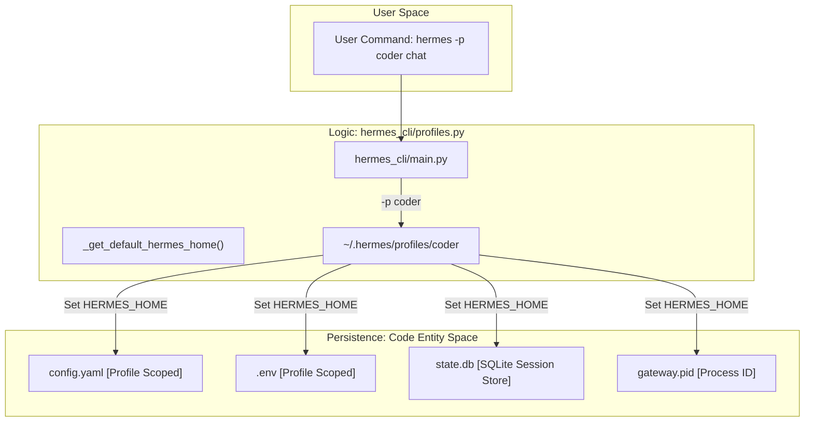
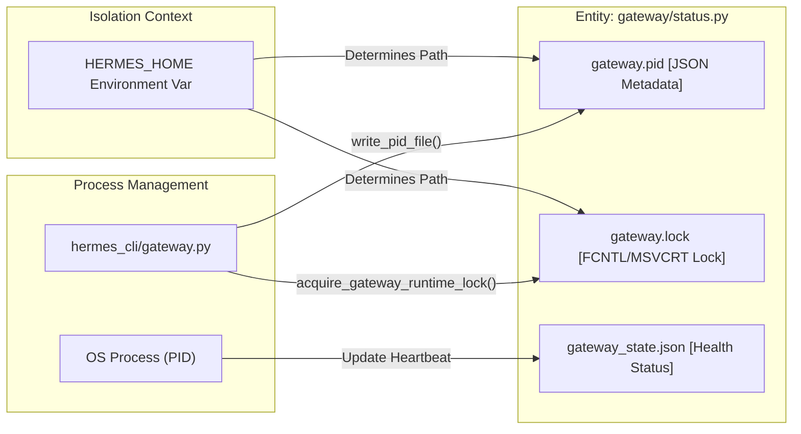

# Profiles & Multi-Instance Isolation

Relevant source files

The following files were used as context for generating this wiki page:

- [CONTRIBUTING.md](../CONTRIBUTING.md)
- [README.ur-pk.md](../README.ur-pk.md)
- [README.zh-CN.md](../README.zh-CN.md)
- contributors/emails/phixxation@gmail.com
- [gateway/status.py](../gateway/status.py)
- [hermes_cli/_subprocess_compat.py](../hermes_cli/_subprocess_compat.py)
- [hermes_cli/doctor.py](../hermes_cli/doctor.py)
- [hermes_cli/gateway.py](../hermes_cli/gateway.py)
- [hermes_cli/gateway_windows.py](../hermes_cli/gateway_windows.py)
- [hermes_cli/profiles.py](../hermes_cli/profiles.py)
- [hermes_cli/status.py](../hermes_cli/status.py)
- [tests/gateway/test_discord_document_handling.py](../tests/gateway/test_discord_document_handling.py)
- [tests/gateway/test_discord_send.py](../tests/gateway/test_discord_send.py)
- [tests/gateway/test_document_cache.py](../tests/gateway/test_document_cache.py)
- [tests/gateway/test_gateway_command_line_matcher.py](../tests/gateway/test_gateway_command_line_matcher.py)
- [tests/gateway/test_runner_startup_failures.py](../tests/gateway/test_runner_startup_failures.py)
- [tests/gateway/test_send_image_file.py](../tests/gateway/test_send_image_file.py)
- [tests/gateway/test_status.py](../tests/gateway/test_status.py)
- [tests/gateway/test_telegram_documents.py](../tests/gateway/test_telegram_documents.py)
- [tests/hermes_cli/test_config_validation.py](../tests/hermes_cli/test_config_validation.py)
- [tests/hermes_cli/test_doctor.py](../tests/hermes_cli/test_doctor.py)
- [tests/hermes_cli/test_gateway.py](../tests/hermes_cli/test_gateway.py)
- [tests/hermes_cli/test_gateway_linger.py](../tests/hermes_cli/test_gateway_linger.py)
- [tests/hermes_cli/test_gateway_proc_fallback.py](../tests/hermes_cli/test_gateway_proc_fallback.py)
- [tests/hermes_cli/test_gateway_service.py](../tests/hermes_cli/test_gateway_service.py)
- [tests/hermes_cli/test_gateway_windows.py](../tests/hermes_cli/test_gateway_windows.py)
- [tests/hermes_cli/test_profiles.py](../tests/hermes_cli/test_profiles.py)
- [tests/hermes_cli/test_windows_native_docs.py](../tests/hermes_cli/test_windows_native_docs.py)
- [tests/tools/test_windows_native_support.py](../tests/tools/test_windows_native_support.py)
- [website/docs/developer-guide/contributing.md](../website/docs/developer-guide/contributing.md)
- [website/docs/developer-guide/creating-skills.md](../website/docs/developer-guide/creating-skills.md)
- [website/docs/getting-started/installation.md](../website/docs/getting-started/installation.md)
- [website/docs/getting-started/quickstart.md](../website/docs/getting-started/quickstart.md)
- [website/docs/getting-started/updating.md](../website/docs/getting-started/updating.md)
- [website/docs/integrations/providers.md](../website/docs/integrations/providers.md)
- [website/docs/reference/cli-commands.md](../website/docs/reference/cli-commands.md)
- [website/docs/reference/environment-variables.md](../website/docs/reference/environment-variables.md)
- [website/docs/reference/profile-commands.md](../website/docs/reference/profile-commands.md)
- [website/docs/reference/slash-commands.md](../website/docs/reference/slash-commands.md)
- [website/docs/user-guide/cli.md](../website/docs/user-guide/cli.md)
- [website/docs/user-guide/configuration.md](../website/docs/user-guide/configuration.md)
- [website/docs/user-guide/features/fallback-providers.md](../website/docs/user-guide/features/fallback-providers.md)
- [website/docs/user-guide/features/skills.md](../website/docs/user-guide/features/skills.md)
- [website/docs/user-guide/messaging/index.md](../website/docs/user-guide/messaging/index.md)
- [website/docs/user-guide/profile-distributions.md](../website/docs/user-guide/profile-distributions.md)
- [website/docs/user-guide/profiles.md](../website/docs/user-guide/profiles.md)
- [website/docs/user-guide/security.md](../website/docs/user-guide/security.md)
- [website/docs/user-guide/windows-native.md](../website/docs/user-guide/windows-native.md)
- [website/i18n/zh-Hans/docusaurus-plugin-content-docs/current/developer-guide/contributing.md](../website/i18n/zh-Hans/docusaurus-plugin-content-docs/current/developer-guide/contributing.md)
- [website/i18n/zh-Hans/docusaurus-plugin-content-docs/current/getting-started/installation.md](../website/i18n/zh-Hans/docusaurus-plugin-content-docs/current/getting-started/installation.md)
- [website/i18n/zh-Hans/docusaurus-plugin-content-docs/current/user-guide/windows-native.md](../website/i18n/zh-Hans/docusaurus-plugin-content-docs/current/user-guide/windows-native.md)

Hermes Profiles allow for multiple, fully isolated agent environments on a single machine. Each profile operates as a complete "instance" of Hermes with its own configuration, identity, memory, and service lifecycle [hermes_cli/profiles.py:1-9](../hermes_cli/profiles.py#L1-L9). This isolation is achieved through the redirection of the `HERMES_HOME` environment variable, ensuring that data and process state never leak between instances [gateway/status.py:7-12](../gateway/status.py#L7-L12).

## Profile Implementation & Redirection

The core mechanism for isolation is the management of the `HERMES_HOME` directory. By default, Hermes uses `~/.hermes`. When a named profile (e.g., `coder`) is active, the home directory shifts to `~/.hermes/profiles/coder/` [hermes_cli/profiles.py:4-9](../hermes_cli/profiles.py#L4-L9).

### Technical Flow of Profile Resolution

1.  **CLI Flag**: The `--profile <name>` (or `-p`) flag at the global entrypoint overrides any sticky defaults [website/docs/reference/cli-commands.md:24-24](../website/docs/reference/cli-commands.md#L24).
2.  **Environment Variable**: The `HERMES_HOME` environment variable is the authoritative source for the agent's root [hermes_cli/config.py:44-44](../hermes_cli/config.py#L44).
3.  **Context Redirection**: Internal functions like `get_hermes_home()` resolve the path based on the active profile, which then dictates where `config.yaml`, `.env`, and `state.db` are loaded from [hermes_cli/doctor.py:13-20](../hermes_cli/doctor.py#L13-L20).

### Data Flow Diagram: Profile Redirection
This diagram shows how the `HERMES_HOME` redirection separates Natural Language concepts (User Profiles) from Code Entities (File paths and DBs).

Sources: [hermes_cli/profiles.py:1-20](../hermes_cli/profiles.py#L1-L20), [gateway/status.py:7-12](../gateway/status.py#L7-L12), [website/docs/reference/cli-commands.md:24-24](../website/docs/reference/cli-commands.md#L24)

---

## Profile Management Operations

Profiles are managed via the `hermes profile` command family [website/docs/reference/cli-commands.md:89-89](../website/docs/reference/cli-commands.md#L89).

### Creation and Cloning
When a profile is created, a standard directory structure is bootstrapped, including `memories`, `sessions`, `skills`, and `logs` [hermes_cli/profiles.py:39-54](../hermes_cli/profiles.py#L39-L54).

*   **`--clone`**: Copies core identity files (`config.yaml`, `.env`, `SOUL.md`) and basic memory files (`MEMORY.md`, `USER.md`) from the source [hermes_cli/profiles.py:56-70](../hermes_cli/profiles.py#L56-L70).
*   **`--clone-all`**: Performs a full copy of the source profile, excluding infrastructure artifacts like `node_modules`, `__pycache__`, and large history files like `state.db` or `backups/` [hermes_cli/profiles.py:96-126](../hermes_cli/profiles.py#L96-L126).

### Directory Structure of a Profile
| Directory | Purpose |
| :--- | :--- |
| `config.yaml` | Profile-specific settings (model, terminal, etc.) |
| `.env` | Profile-specific API keys and secrets |
| `state.db` | SQLite database for conversation history |
| `skills/` | Agent-created or installed skills for this profile |
| `memories/` | Persistent identity and user facts |
| `gateway.pid` | Lock file for the profile's gateway service |

Sources: [hermes_cli/profiles.py:11-20](../hermes_cli/profiles.py#L11-L20), [hermes_cli/profiles.py:39-54](../hermes_cli/profiles.py#L39-L54), [website/docs/user-guide/configuration.md:15-28](../website/docs/user-guide/configuration.md#L15-L28)

---

## Multi-Instance Gateway Isolation

Hermes supports running multiple messaging gateways simultaneously by ensuring each process binds to its own profile-scoped identity files [gateway/status.py:129-142](../gateway/status.py#L129-L142).

### Process Locking & PID Management
The `GatewayRunner` uses the profile's `HERMES_HOME` to locate its unique `gateway.pid` and `gateway.lock` files [gateway/status.py:157-170](../gateway/status.py#L157-L170). This prevents a gateway in the `default` profile from accidentally terminating or conflicting with a gateway in the `coder` profile.

### Gateway Process Entity Mapping
This diagram bridges the "Gateway Instance" concept to the specific code entities that manage its lifecycle.

Sources: [gateway/status.py:129-174](../gateway/status.py#L129-L174), [hermes_cli/gateway.py:73-95](../hermes_cli/gateway.py#L73-L95), [tests/gateway/test_status.py:13-48](../tests/gateway/test_status.py#L13-L48)

---

## Profile Distributions & Portability

Profile Distributions allow users to package an agent's entire configuration and skill set into a shareable format, often managed via Git [hermes_cli/profiles.py:1-20](../hermes_cli/profiles.py#L1-L20).

### Exporting and Importing
*   **Export**: The `hermes profile export <name>` command creates a portable archive. It strips environment-specific paths and runtime logs while preserving the "Soul" and "Skills" of the agent [hermes_cli/profiles.py:145-165](../hermes_cli/profiles.py#L145-L165).
*   **Opt-out of Bundled Skills**: Profiles can include a `.no-bundled-skills` marker. If present, the system skips seeding standard Hermes skills, allowing for "clean-room" profile distributions [hermes_cli/profiles.py:134-142](../hermes_cli/profiles.py#L134-L142).

### Wrapper Aliases
To simplify switching, Hermes can generate shell aliases. For example, creating a profile named `researcher` allows the user to run `researcher chat` directly, which internally executes `hermes -p researcher chat` [hermes_cli/profiles.py:16-17](../hermes_cli/profiles.py#L16-L17).

Sources: [hermes_cli/profiles.py:1-20](../hermes_cli/profiles.py#L1-L20), [hermes_cli/profiles.py:134-142](../hermes_cli/profiles.py#L134-L142), [website/docs/user-guide/profile-distributions.md:1-10](../website/docs/user-guide/profile-distributions.md#L1-L10)

---
