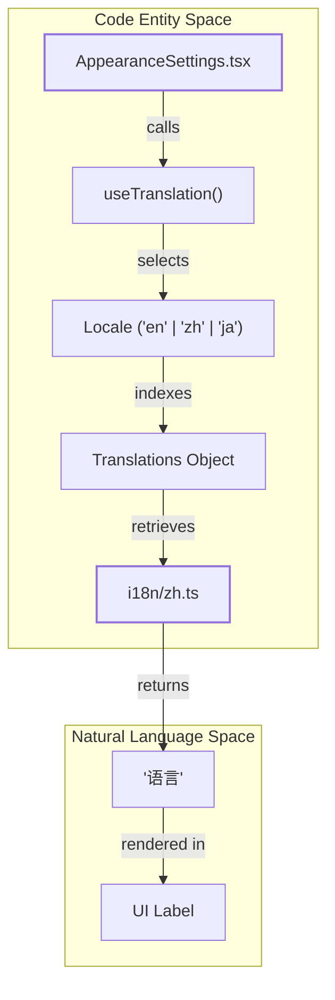
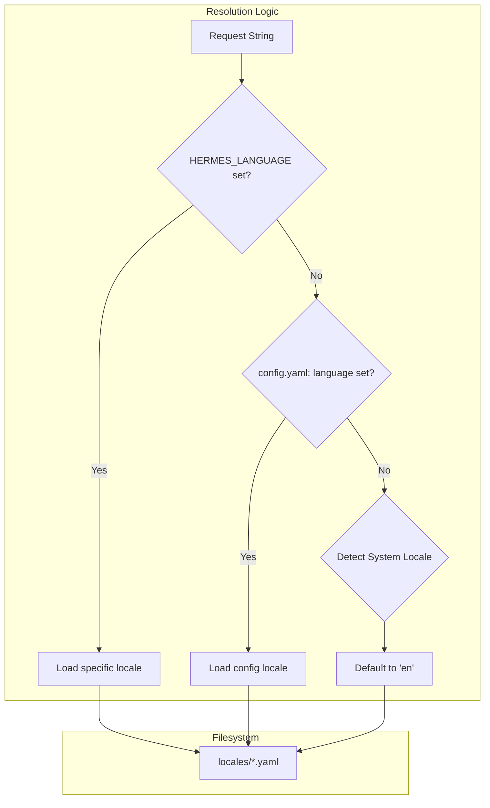

# Internationalization & Localization

Relevant source files

The following files were used as context for generating this wiki page:

- [agent/i18n.py](../agent/i18n.py)
- [apps/desktop/electron/main.ts](../apps/desktop/electron/main.ts)
- [apps/desktop/electron/preload.ts](../apps/desktop/electron/preload.ts)
- [apps/desktop/electron/zoom.test.ts](../apps/desktop/electron/zoom.test.ts)
- [apps/desktop/electron/zoom.ts](../apps/desktop/electron/zoom.ts)
- [apps/desktop/src/app/settings/appearance-settings.tsx](../apps/desktop/src/app/settings/appearance-settings.tsx)
- [apps/desktop/src/app/settings/gateway-settings.tsx](../apps/desktop/src/app/settings/gateway-settings.tsx)
- [apps/desktop/src/app/shell/titlebar.ts](../apps/desktop/src/app/shell/titlebar.ts)
- [apps/desktop/src/components/ui/button.tsx](../apps/desktop/src/components/ui/button.tsx)
- [apps/desktop/src/global.d.ts](../apps/desktop/src/global.d.ts)
- [apps/desktop/src/i18n/en.ts](../apps/desktop/src/i18n/en.ts)
- [apps/desktop/src/i18n/ja.ts](../apps/desktop/src/i18n/ja.ts)
- [apps/desktop/src/i18n/types.ts](../apps/desktop/src/i18n/types.ts)
- [apps/desktop/src/i18n/zh-hant.ts](../apps/desktop/src/i18n/zh-hant.ts)
- [apps/desktop/src/i18n/zh.ts](../apps/desktop/src/i18n/zh.ts)
- [hermes_cli/__init__.py](../hermes_cli/__init__.py)
- [optional-mcps/unreal-engine/manifest.yaml](../optional-mcps/unreal-engine/manifest.yaml)
- [plugins/observability/nemo_relay/README.md](../plugins/observability/nemo_relay/README.md)
- [plugins/observability/nemo_relay/__init__.py](../plugins/observability/nemo_relay/__init__.py)
- [pyproject.toml](../pyproject.toml)
- [scripts/contributor_audit.py](../scripts/contributor_audit.py)
- [scripts/release.py](../scripts/release.py)
- [tests/agent/test_i18n.py](../tests/agent/test_i18n.py)
- [tests/hermes_cli/test_ensure_utf8_locale.py](../tests/hermes_cli/test_ensure_utf8_locale.py)
- [tests/plugins/test_nemo_relay_plugin.py](../tests/plugins/test_nemo_relay_plugin.py)
- [tests/test_packaging_metadata.py](../tests/test_packaging_metadata.py)
- [tests/test_project_metadata.py](../tests/test_project_metadata.py)
- [tests/tools/test_lazy_deps.py](../tests/tools/test_lazy_deps.py)
- [tools/lazy_deps.py](../tools/lazy_deps.py)
- [uv.lock](../uv.lock)

Hermes Agent implements a multi-tiered internationalization (i18n) system that spans the core Python agent, the Electron desktop application, and the web dashboard. The system is designed for "placeholder parity," ensuring that translated strings maintain functional logic (like variable interpolation) across all supported languages.

## The i18n Resolution Ladder

Language selection in Hermes follows a hierarchical resolution ladder. The system prioritizes explicit user overrides before falling back to environment-level or system-level defaults.

1.  **`HERMES_LANGUAGE` Environment Variable**: Explicit override (e.g., `en`, `zh`, `ja`).
2.  **Configuration File**: The `language` key in `config.yaml`.
3.  **System Locale**: Detected via the operating system's locale settings (e.g., `LANG` on POSIX or system APIs on Windows).
4.  **Hardcoded Default**: Fallback to `en` (English).

The CLI ensures that standard output and error streams are forced to UTF-8 to prevent `UnicodeEncodeError` when rendering localized characters or box-drawing glyphs in environments with legacy encodings (like `cp1252` on Windows) `[hermes_cli/__init__.py:21-51](../hermes_cli/__init__.py#L21-L51)`.

## Core Agent i18n (`agent/i18n.py`)

The core agent uses a YAML-based catalog system located in `locales/`. It supports dotted-key access for nested translations.

### Key Components
*   **`agent/i18n.py`**: Contains the logic for loading YAML catalogs and performing string interpolation.
*   **Dotted-Key Access**: Allows referencing strings like `errors.connection.timeout` instead of flat keys.
*   **Placeholder Parity**: A specialized test suite `[tests/agent/test_i18n.py](../tests/agent/test_i18n.py)` ensures that if an English string contains `{name}`, all localized versions also contain exactly `{name}` to prevent runtime crashes during interpolation.

**Sources:** `[agent/i18n.py](../agent/i18n.py)`, `[tests/agent/test_i18n.py](../tests/agent/test_i18n.py)`.

## Desktop Application i18n

The desktop app uses a TypeScript-based localization system. Translations are defined as typed objects to ensure compile-time safety and catch missing keys during development.

### Supported Locales
The application currently supports:
*   **English (`en`)**: `[apps/desktop/src/i18n/en.ts](../apps/desktop/src/i18n/en.ts)`
*   **Simplified Chinese (`zh`)**: `[apps/desktop/src/i18n/zh.ts](../apps/desktop/src/i18n/zh.ts)`
*   **Traditional Chinese (`zh-hant`)**: `[apps/desktop/src/i18n/zh-hant.ts](../apps/desktop/src/i18n/zh-hant.ts)`
*   **Japanese (`ja`)**: `[apps/desktop/src/i18n/ja.ts](../apps/desktop/src/i18n/ja.ts)`

### Type Safety and Fallbacks
The `Translations` interface in `[apps/desktop/src/i18n/types.ts](../apps/desktop/src/i18n/types.ts)` acts as the single source of truth.
*   **`defineLocale`**: A helper function used to ensure that partial translations fall back to English for missing keys while maintaining type-checking for existing ones `[apps/desktop/src/i18n/types.ts:1-6](../apps/desktop/src/i18n/types.ts#L1-L6)`.
*   **Dynamic Copy**: Many keys are functions that take arguments for dynamic interpolation, such as `deleteTitle: (name: string) => string` `[apps/desktop/src/i18n/types.ts:104-104](../apps/desktop/src/i18n/types.ts#L104)`.

### i18n Data Flow (Desktop)

The following diagram illustrates how a localized string is resolved and rendered in the Desktop UI.

**Title: Desktop i18n Resolution Flow**

**Sources:** `[apps/desktop/src/i18n/types.ts](../apps/desktop/src/i18n/types.ts)`, `[apps/desktop/src/app/settings/appearance-settings.tsx](../apps/desktop/src/app/settings/appearance-settings.tsx)`.

## Translation Catalogs Comparison

The desktop application localizes complex UI components including tool titles, notification bodies, and setting descriptions.

| Feature | English (`en.ts`) | Chinese (`zh.ts`) | Japanese (`ja.ts`) |
| :--- | :--- | :--- | :--- |
| **Apply** | `Apply` `[apps/desktop/src/i18n/en.ts:7](../apps/desktop/src/i18n/en.ts#L7)` | `应用` `[apps/desktop/src/i18n/zh.ts:7](../apps/desktop/src/i18n/zh.ts#L7)` | `適用` `[apps/desktop/src/i18n/ja.ts:7](../apps/desktop/src/i18n/ja.ts#L7)` |
| **Save** | `Save` `[apps/desktop/src/i18n/en.ts:9](../apps/desktop/src/i18n/en.ts#L9)` | `保存` `[apps/desktop/src/i18n/zh.ts:9](../apps/desktop/src/i18n/zh.ts#L9)` | `保存` `[apps/desktop/src/i18n/ja.ts:9](../apps/desktop/src/i18n/ja.ts#L9)` |
| **Retry** | `Retry` `[apps/desktop/src/i18n/en.ts:37](../apps/desktop/src/i18n/en.ts#L37)` | `重试` `[apps/desktop/src/i18n/zh.ts:37](../apps/desktop/src/i18n/zh.ts#L37)` | `再試行` `[apps/desktop/src/i18n/ja.ts:37](../apps/desktop/src/i18n/ja.ts#L37)` |
| **Delete** | `Delete ${name}?` `[apps/desktop/src/i18n/en.ts:59](../apps/desktop/src/i18n/en.ts#L59)` | `删除 ${name}？` `[apps/desktop/src/i18n/zh.ts:59](../apps/desktop/src/i18n/zh.ts#L59)` | `${name} を削除しますか？` `[apps/desktop/src/i18n/ja.ts:59](../apps/desktop/src/i18n/ja.ts#L59)` |

## Localization Infrastructure

### UTF-8 Bootstrap
To support CJK (Chinese, Japanese, Korean) characters in terminal environments, the agent performs an early-import bootstrap. The function `_ensure_utf8` in `[hermes_cli/__init__.py:21-92](../hermes_cli/__init__.py#L21-L92)` reconfigures `sys.stdout` and `sys.stderr` to use UTF-8 encoding regardless of the shell's default locale. This is critical for:
*   Displaying the mascot glyphs.
*   Rendering localized help text in the `hermes setup` wizard.
*   Preventing crashes on minimal Linux installs (e.g., Raspberry Pi) that default to ASCII `[hermes_cli/__init__.py:28-34](../hermes_cli/__init__.py#L28-L34)`.

### Dependency Localization
Some localized features require specific libraries (e.g., `faster-whisper` for STT or `edge-tts`). These are managed via the `lazy_deps.py` system, ensuring that heavy localization-related binaries are only downloaded when the user selects a specific language-dependent provider `[tools/lazy_deps.py:129-138](../tools/lazy_deps.py#L129-L138)`.

### Language Resolution Logic
The system uses the `HERMES_LANGUAGE` resolution ladder to determine the active catalog.

**Title: HERMES_LANGUAGE Resolution Ladder**

**Sources:** `[agent/i18n.py](../agent/i18n.py)`, `[hermes_cli/__init__.py](../hermes_cli/__init__.py)`.

---
