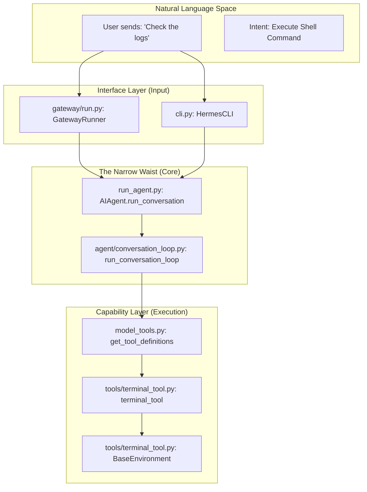
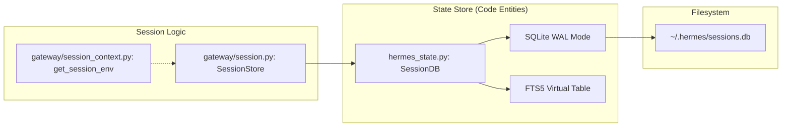

# Contributing & Code Architecture

Relevant source files

The following files were used as context for generating this wiki page:

- [.env.example](../.env.example)
- [AGENTS.md](../AGENTS.md)
- [CONTRIBUTING.md](../CONTRIBUTING.md)
- [README.md](../README.md)
- [README.ur-pk.md](../README.ur-pk.md)
- [README.zh-CN.md](../README.zh-CN.md)
- [acp_adapter/entry.py](../acp_adapter/entry.py)
- [cli-config.yaml.example](../cli-config.yaml.example)
- [cli.py](../cli.py)
- [gateway/config.py](../gateway/config.py)
- [gateway/platforms/base.py](../gateway/platforms/base.py)
- [gateway/run.py](../gateway/run.py)
- [gateway/session.py](../gateway/session.py)
- [hermes_bootstrap.py](../hermes_bootstrap.py)
- [hermes_cli/banner.py](../hermes_cli/banner.py)
- [hermes_cli/commands.py](../hermes_cli/commands.py)
- [hermes_cli/config.py](../hermes_cli/config.py)
- [hermes_state.py](../hermes_state.py)
- [run_agent.py](../run_agent.py)
- [tests/acp/test_entry.py](../tests/acp/test_entry.py)
- [tests/gateway/test_config.py](../tests/gateway/test_config.py)
- [tests/gateway/test_platform_base.py](../tests/gateway/test_platform_base.py)
- [tests/gateway/test_session.py](../tests/gateway/test_session.py)
- [tests/gateway/test_session_reset_notify.py](../tests/gateway/test_session_reset_notify.py)
- [tests/gateway/test_shared_group_sender_prefix.py](../tests/gateway/test_shared_group_sender_prefix.py)
- [tests/gateway/test_tts_media_routing.py](../tests/gateway/test_tts_media_routing.py)
- [tests/hermes_cli/test_banner.py](../tests/hermes_cli/test_banner.py)
- [tests/hermes_cli/test_commands.py](../tests/hermes_cli/test_commands.py)
- [tests/hermes_cli/test_managed_installs.py](../tests/hermes_cli/test_managed_installs.py)
- [tests/hermes_cli/test_pip_install_detection.py](../tests/hermes_cli/test_pip_install_detection.py)
- [tests/hermes_cli/test_update_check.py](../tests/hermes_cli/test_update_check.py)
- [tests/hermes_cli/test_windows_native_docs.py](../tests/hermes_cli/test_windows_native_docs.py)
- [tests/test_hermes_bootstrap.py](../tests/test_hermes_bootstrap.py)
- [tests/test_hermes_state.py](../tests/test_hermes_state.py)
- [tests/test_install_sh_install_method_stamp.py](../tests/test_install_sh_install_method_stamp.py)
- [tests/tools/test_dockerfile_immutable_install.py](../tests/tools/test_dockerfile_immutable_install.py)
- [tests/tools/test_lazy_deps_durable_target.py](../tests/tools/test_lazy_deps_durable_target.py)
- [tests/tui_gateway/test_entry_sys_path.py](../tests/tui_gateway/test_entry_sys_path.py)
- [website/docs/developer-guide/acp-internals.md](../website/docs/developer-guide/acp-internals.md)
- [website/docs/developer-guide/contributing.md](../website/docs/developer-guide/contributing.md)
- [website/docs/developer-guide/creating-skills.md](../website/docs/developer-guide/creating-skills.md)
- [website/docs/getting-started/installation.md](../website/docs/getting-started/installation.md)
- [website/docs/getting-started/quickstart.md](../website/docs/getting-started/quickstart.md)
- [website/docs/getting-started/updating.md](../website/docs/getting-started/updating.md)
- [website/docs/integrations/providers.md](../website/docs/integrations/providers.md)
- [website/docs/reference/cli-commands.md](../website/docs/reference/cli-commands.md)
- [website/docs/reference/environment-variables.md](../website/docs/reference/environment-variables.md)
- [website/docs/reference/slash-commands.md](../website/docs/reference/slash-commands.md)
- [website/docs/user-guide/cli.md](../website/docs/user-guide/cli.md)
- [website/docs/user-guide/configuration.md](../website/docs/user-guide/configuration.md)
- [website/docs/user-guide/features/acp.md](../website/docs/user-guide/features/acp.md)
- [website/docs/user-guide/features/fallback-providers.md](../website/docs/user-guide/features/fallback-providers.md)
- [website/docs/user-guide/features/skills.md](../website/docs/user-guide/features/skills.md)
- [website/docs/user-guide/messaging/index.md](../website/docs/user-guide/messaging/index.md)
- [website/docs/user-guide/security.md](../website/docs/user-guide/security.md)
- [website/docs/user-guide/windows-native.md](../website/docs/user-guide/windows-native.md)
- [website/i18n/zh-Hans/docusaurus-plugin-content-docs/current/developer-guide/contributing.md](../website/i18n/zh-Hans/docusaurus-plugin-content-docs/current/developer-guide/contributing.md)
- [website/i18n/zh-Hans/docusaurus-plugin-content-docs/current/getting-started/installation.md](../website/i18n/zh-Hans/docusaurus-plugin-content-docs/current/getting-started/installation.md)
- [website/i18n/zh-Hans/docusaurus-plugin-content-docs/current/user-guide/windows-native.md](../website/i18n/zh-Hans/docusaurus-plugin-content-docs/current/user-guide/windows-native.md)

This page outlines the structural design of the Hermes Agent codebase, the "Narrow Waist" philosophy that governs its evolution, and the technical standards for contributors.

## Project Organization

The codebase is organized into several distinct subsystems, each serving a specific layer of the agent's execution or delivery.

| Directory | Responsibility |
| :--- | :--- |
| `agent/` | Core logic: conversation loop, context compression, memory, and prompt assembly. |
| `gateway/` | Messaging platform adapters (Telegram, Discord, etc.) and session routing. |
| `tools/` | Implementation of individual tools (terminal, browser, file operations). |
| `hermes_cli/` | REPL interface, configuration management, and CLI command mixins. |
| `plugins/` | Extensible providers for models, memory, and observability. |

Sources: [CONTRIBUTING.md:1-50](../CONTRIBUTING.md#L1-L50), [README.md:1-30](../README.md#L1-L30)

## The "Narrow Waist" Design Philosophy

Hermes follows a "Narrow Waist" architecture. The **AIAgent** class in `run_agent.py` acts as the central pivot point (the "waist").

1.  **Top (Input/Delivery):** Multiple interfaces (CLI, Messaging Gateway, Web Dashboard, ACP) all converge on the `AIAgent.run_conversation` method.
2.  **Middle (Core Logic):** The `AIAgent` manages the state, tool selection, and LLM interaction without needing to know which platform it is serving.
3.  **Bottom (Capabilities):** A pluggable tool system and provider abstraction layer allow the agent to interact with various environments (Docker, SSH, Local) and LLMs (OpenRouter, Anthropic, Gemini).

### Data Flow: From User to Execution

The following diagram bridges the Natural Language Space (User Intent) to the Code Entity Space (Implementation).

**User Intent to Code Entity Mapping**

Sources: [run_agent.py:17-48](../run_agent.py#L17-L48), [gateway/run.py:5-14](../gateway/run.py#L5-L14), [cli.py:1-13](../cli.py#L1-L13), [agent/conversation_loop.py:1-50](../agent/conversation_loop.py#L1-L50)

## Core Subsystems

### 1. The Agent Core (`agent/`)
The core manages the iterative turn lifecycle.
*   **`hermes_bootstrap.py`**: This is the early-import module. It must be imported first to ensure UTF-8 stdio support on Windows and proper signal handling [hermes_bootstrap.py:1-40](../hermes_bootstrap.py#L1-L40).
*   **`run_agent.py`**: Contains the `AIAgent` class which initializes providers, toolsets, and memory [run_agent.py:136-182](../run_agent.py#L136-L182).
*   **`agent/conversation_compression.py`**: Implements the `ContextCompressor`. It uses a "compression lock" mechanism stored in SQLite to prevent concurrent compression tasks on the same session [gateway/run.py:57-117](../gateway/run.py#L57-L117), [hermes_state.py:44-91](../hermes_state.py#L44-L91).

### 2. Messaging Gateway (`gateway/`)
The gateway translates platform-specific events (e.g., a Telegram `Update`) into a standard `SessionSource` object.
*   **`gateway/platforms/base.py`**: Defines the `BasePlatformAdapter` which all adapters must implement [gateway/platforms/base.py:1-43](../gateway/platforms/base.py#L1-L43).
*   **`gateway/session.py`**: Manages the `SessionSource` dataclass, which tracks `chat_id`, `user_id`, and `thread_id` to maintain context across platforms [gateway/session.py:149-180](../gateway/session.py#L149-L180).

### 3. Persistence Layer (`hermes_state.py`)
Hermes uses a SQLite-backed state store with WAL (Write-Ahead Logging) mode to support concurrent access from multiple gateway adapters and the CLI [hermes_state.py:1-15](../hermes_state.py#L1-L15).
*   **FTS5 Search**: Conversation history is indexed using SQLite's FTS5 for fast retrieval [hermes_state.py:5-7](../hermes_state.py#L5-L7).
*   **Cascade Deletion**: Subagent sessions (delegates) are automatically cleaned up when the parent session is deleted [hermes_state.py:163-172](../hermes_state.py#L163-L172).

**State Management & Persistence Architecture**

Sources: [hermes_state.py:1-30](../hermes_state.py#L1-L30), [gateway/session.py:1-23](../gateway/session.py#L1-L23), [gateway/session_context.py:1-15](../gateway/session_context.py#L1-L15)

## Contributing Guide

### Adding New Tools
To add a tool, create a new module in `tools/` and define a function decorated for the tool registry. Ensure the tool respects the `BaseEnvironment` if it involves code execution [run_agent.py:136-145](../run_agent.py#L136-L145).

### Adding Platform Adapters
1.  Inherit from `BasePlatformAdapter` in `gateway/platforms/base.py`.
2.  Implement `start()`, `stop()`, and message delivery methods.
3.  Register the adapter in `gateway/run.py`.

### Contributor Documentation
*   **`CONTRIBUTING.md`**: General developer setup, linting (Ruff), and testing requirements.
*   **`AGENTS.md`**: A specialized guide for "Agent-facing" contributors—instructions on how the agent itself should be instructed to modify the codebase.

## Configuration & Environment

Configuration follows a strict precedence hierarchy:
1.  CLI Arguments (`--model`, etc.)
2.  `~/.hermes/config.yaml` (Non-secrets)
3.  `~/.hermes/.env` (Secrets/API Keys)
4.  Built-in Defaults

The `hermes_cli/config.py` module handles the resolution of these values, including environment variable substitution using `${VAR}` syntax [hermes_cli/config.py:1-35](../hermes_cli/config.py#L1-L35), [website/docs/user-guide/configuration.md:53-64](../website/docs/user-guide/configuration.md#L53-L64).

Sources: [hermes_cli/config.py:1-150](../hermes_cli/config.py#L1-L150), [website/docs/user-guide/configuration.md:1-100](../website/docs/user-guide/configuration.md#L1-L100), [cli-config.yaml.example:1-50](../cli-config.yaml.example#L1-L50)

---
