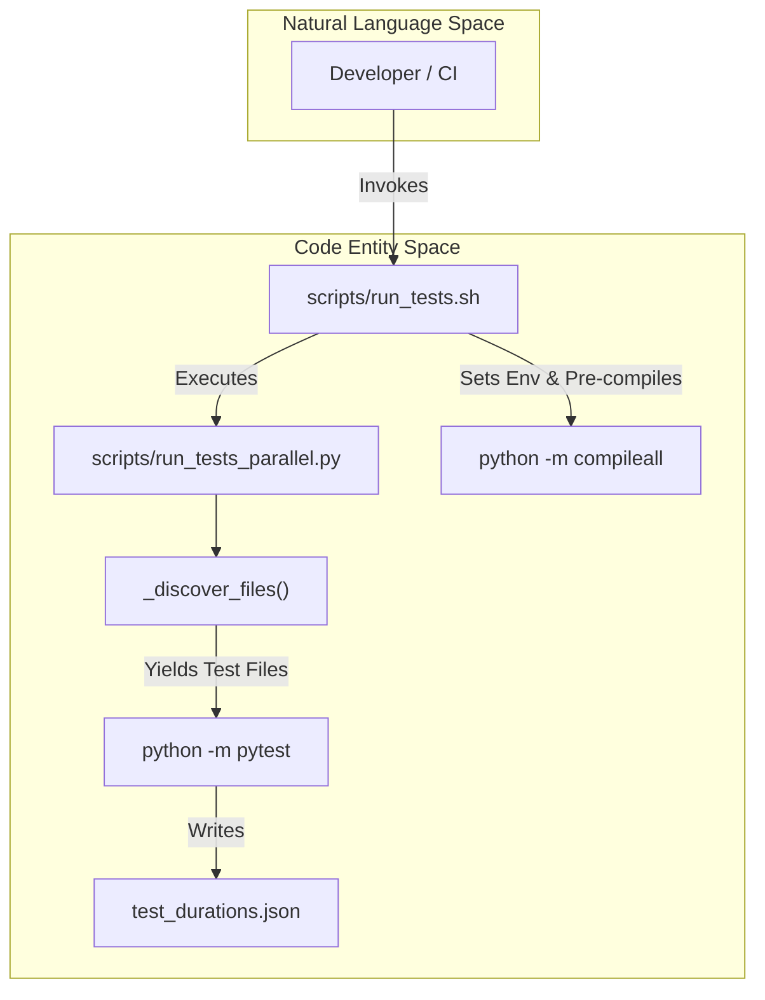
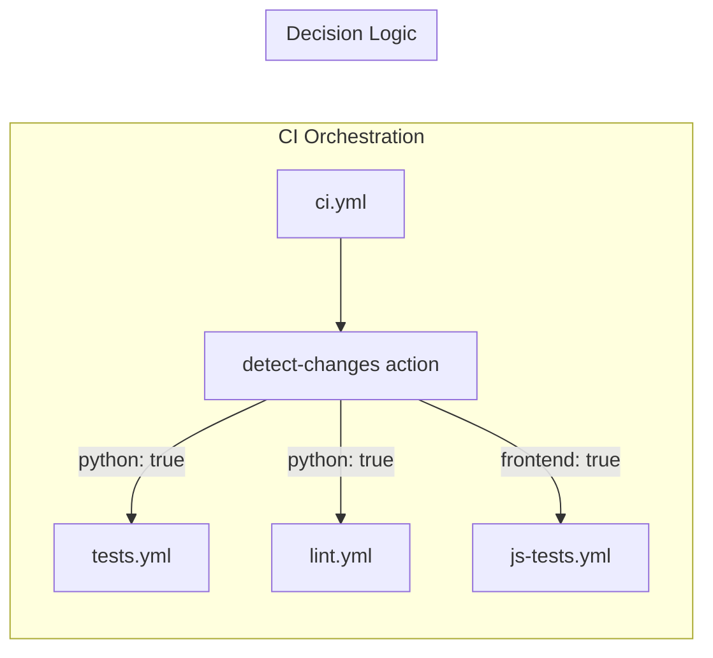

# Testing Infrastructure

Relevant source files

The following files were used as context for generating this wiki page:

- [.github/actions/detect-changes/action.yml](../.github/actions/detect-changes/action.yml)
- [.github/actions/get-app-token/action.yml](../.github/actions/get-app-token/action.yml)
- [.github/workflows/ci.yml](../.github/workflows/ci.yml)
- [.github/workflows/contributor-check.yml](../.github/workflows/contributor-check.yml)
- [.github/workflows/deploy-site.yml](../.github/workflows/deploy-site.yml)
- [.github/workflows/docker-lint.yml](../.github/workflows/docker-lint.yml)
- [.github/workflows/docker.yml](../.github/workflows/docker.yml)
- [.github/workflows/docs-site-checks.yml](../.github/workflows/docs-site-checks.yml)
- [.github/workflows/history-check.yml](../.github/workflows/history-check.yml)
- [.github/workflows/js-autofix.yml](../.github/workflows/js-autofix.yml)
- [.github/workflows/lint.yml](../.github/workflows/lint.yml)
- [.github/workflows/osv-scanner.yml](../.github/workflows/osv-scanner.yml)
- [.github/workflows/publish-e2e-evidence.yml](../.github/workflows/publish-e2e-evidence.yml)
- [.github/workflows/review-labels.yml](../.github/workflows/review-labels.yml)
- [.github/workflows/skills-index-freshness.yml](../.github/workflows/skills-index-freshness.yml)
- [.github/workflows/skills-index.yml](../.github/workflows/skills-index.yml)
- [.github/workflows/supply-chain-audit.yml](../.github/workflows/supply-chain-audit.yml)
- [.github/workflows/tests.yml](../.github/workflows/tests.yml)
- [.github/workflows/uv-lockfile-check.yml](../.github/workflows/uv-lockfile-check.yml)
- [agent/pet/generate/atlas.py](../agent/pet/generate/atlas.py)
- [agent/pet/generate/imagegen.py](../agent/pet/generate/imagegen.py)
- [agent/pet/generate/orchestrate.py](../agent/pet/generate/orchestrate.py)
- [agent/pet/generate/prompts.py](../agent/pet/generate/prompts.py)
- [apps/desktop/src/app/pet-generate/components/provider-picker.tsx](../apps/desktop/src/app/pet-generate/components/provider-picker.tsx)
- [scripts/ci/assemble_review_comment.py](../scripts/ci/assemble_review_comment.py)
- [scripts/ci/classify_changes.py](../scripts/ci/classify_changes.py)
- [scripts/ci/emit_review_status.py](../scripts/ci/emit_review_status.py)
- [scripts/ci/live_comment.py](../scripts/ci/live_comment.py)
- [scripts/ci/timings_report.py](../scripts/ci/timings_report.py)
- [scripts/run_tests.sh](../scripts/run_tests.sh)
- [scripts/run_tests_parallel.py](../scripts/run_tests_parallel.py)
- [tests/agent/test_pet_generate.py](../tests/agent/test_pet_generate.py)
- [tests/ci/test_assemble_review_comment.py](../tests/ci/test_assemble_review_comment.py)
- [tests/ci/test_classify_changes.py](../tests/ci/test_classify_changes.py)
- [tests/ci/test_live_comment.py](../tests/ci/test_live_comment.py)
- [tests/ci/test_timings_report.py](../tests/ci/test_timings_report.py)
- [tests/conftest.py](../tests/conftest.py)
- [tests/docker/test_smoke.py](../tests/docker/test_smoke.py)
- [tests/hermes_cli/test_api_key_providers.py](../tests/hermes_cli/test_api_key_providers.py)
- [tests/hermes_cli/test_cmd_update_docker.py](../tests/hermes_cli/test_cmd_update_docker.py)
- [tests/test_live_system_guard_self_test.py](../tests/test_live_system_guard_self_test.py)
- [tests/test_run_tests_parallel.py](../tests/test_run_tests_parallel.py)

The Hermes Agent testing infrastructure is designed for high-concurrency execution, strict environment isolation, and deterministic outcomes. It utilizes a custom parallel runner that prioritizes process-level isolation to prevent state leakage between test files, coupled with a multi-tiered CI pipeline that balances test load using historical timing data.

## Test Organization & Directory Structure

The `tests/` directory is organized by subsystem, mirroring the `agent/` and `gateway/` structures.

| Directory | Purpose |
| :--- | :--- |
| `tests/agent/` | Core `AIAgent` logic, conversation loops, and prompt assembly. |
| `tests/gateway/` | Platform adapters, session management, and messaging protocols. |
| `tests/tools/` | Tool-specific unit and integration tests (Terminal, File, etc.). |
| `tests/hermes_cli/` | CLI/REPL command handlers and authentication flows. |
| `tests/docker/` | Container-specific integration tests running against built images [scripts/run_tests_parallel.py:63-72](../scripts/run_tests_parallel.py#L63-L72). |
| `tests/e2e/` | End-to-end scenarios requiring external service mocks or full system orchestration [scripts/run_tests_parallel.py:61](../scripts/run_tests_parallel.py#L61). |
| `tests-js/` | JavaScript/TypeScript test suite for the Web Dashboard and Desktop frontend. |

**Sources:** [scripts/run_tests_parallel.py:54-73](../scripts/run_tests_parallel.py#L54-L73), [tests/hermes_cli/test_api_key_providers.py:1-45](../tests/hermes_cli/test_api_key_providers.py#L1-L45)

## Hermetic Test Invariants (`conftest.py`)

To ensure local tests match CI results, `tests/conftest.py` enforces several hermetic invariants.

### Credential Filtering
The infrastructure unsets all provider-related environment variables before every test. This prevents a developer's local `OPENAI_API_KEY` or `GH_TOKEN` from leaking into assertions that check for "auto-detection" logic [tests/conftest.py:5-7](../tests/conftest.py#L5-L7).
*   **Suffixes:** Variables ending in `_API_KEY`, `_TOKEN`, `_SECRET`, etc., are automatically cleared [tests/conftest.py:57-73](../tests/conftest.py#L57-L73).
*   **Explicit Names:** Specific keys like `AWS_ACCESS_KEY_ID` or `TELEGRAM_BOT_TOKEN` are explicitly targeted [tests/conftest.py:76-159](../tests/conftest.py#L76-L159).

### Isolated Runtime
*   **HERMES_HOME:** Redirected to a per-test temporary directory to prevent tests from reading/writing to `~/.hermes/` [tests/conftest.py:8-12](../tests/conftest.py#L8-L12).
*   **Determinism:** `TZ=UTC`, `LANG=C.UTF-8`, and `PYTHONHASHSEED=0` are set to ensure consistent behavior across different environments [tests/conftest.py:13](../tests/conftest.py#L13).
*   **Behavioral Guards:** Variables like `HERMES_YOLO_MODE` or `HERMES_MAX_ITERATIONS` are cleared to ensure tests run with default configurations unless explicitly overridden [tests/conftest.py:171-220](../tests/conftest.py#L171-L220).

**Sources:** [tests/conftest.py:1-220](../tests/conftest.py#L1-L220)

## Parallel Test Execution

Hermes uses a custom runner, `run_tests_parallel.py`, instead of `pytest-xdist`. This provides a fresh Python interpreter for every test file, eliminating module-level state leakage [scripts/run_tests_parallel.py:9-15](../scripts/run_tests_parallel.py#L9-L15).

### The Execution Flow

### Key Functions
*   **`_discover_files()`**: Recursively finds `test_*.py` files while respecting `_SKIP_PARTS` (e.g., skipping `e2e` and `docker` during standard runs) [scripts/run_tests_parallel.py:126-169](../scripts/run_tests_parallel.py#L126-L169).
*   **`_approximately_count_tests()`**: Estimates test counts by scanning file contents for `def test_` to avoid the slow import overhead of `pytest --collect-only` [scripts/run_tests_parallel.py:103-123](../scripts/run_tests_parallel.py#L103-L123).
*   **`run_tests.sh`**: The canonical entry point. It blanks the environment (`env -i`), sets deterministic variables, and pre-compiles bytecode to speed up the hundreds of subsequent subprocess spawns [scripts/run_tests.sh:85-104](../scripts/run_tests.sh#L85-L104).

**Sources:** [scripts/run_tests_parallel.py:1-169](../scripts/run_tests_parallel.py#L1-L169), [scripts/run_tests.sh:1-105](../scripts/run_tests.sh#L1-L105)

## CI Infrastructure & Timing Reports

The GitHub Actions pipeline (`.github/workflows/tests.yml`) uses a sophisticated "Longest Processing Time" (LPT) slicing strategy to balance test load across parallel runners.

### CI Slicing and Durations
1.  **Generate Slices**: The `generate` job restores `test_durations.json` from a cache tests.yml:30-41.
2.  **LPT Distribution**: `run_tests_parallel.py --generate-slices` uses historical data to distribute files across $N$ slices so that total execution time is roughly equal tests.yml:42-47.
3.  **Dynamic Updates**: After a successful run on `main`, `save-durations` merges per-slice timings and updates the global cache tests.yml:135-166.

### CI Timing Report (`timings_report.py`)
This script collects job and step timings from the GitHub API to generate an HTML report [scripts/ci/timings_report.py:2-10](../scripts/ci/timings_report.py#L2-L10).
*   **`api_get()`**: Authenticated GET with automatic pagination and retry logic for rate limits [scripts/ci/timings_report.py:103-143](../scripts/ci/timings_report.py#L103-L143).
*   **`dur_s()`**: Calculates duration from ISO timestamps [scripts/ci/timings_report.py:152-157](../scripts/ci/timings_report.py#L152-L157).

**Sources:** [.github/workflows/tests.yml:20-166](../.github/workflows/tests.yml#L20-L166), [scripts/ci/timings_report.py:1-157](../scripts/ci/timings_report.py#L1-L157)

## Security & Quality Guards

The infrastructure includes several non-functional test layers to protect the codebase.

| Guard | Code Entity | Purpose |
| :--- | :--- | :--- |
| **Supply Chain Audit** | `supply-chain-audit.yml` | Scans PR diffs for critical patterns like `.pth` files, base64-encoded `exec()` calls, or obfuscated subprocesses supply-chain-audit.yml:68-130. |
| **Windows Footguns** | `check-windows-footguns.py` | Static analysis for Windows-unsafe primitives (e.g., `os.killpg`, `os.setsid`, or `open()` without explicit encoding) lint.yml:144-162. |
| **Live System Guard** | `pytest_live_guard.py` | A plugin (if present in `~/.hermes/`) that prevents tests from running if a live production gateway is detected [scripts/run_tests.sh:68-74](../scripts/run_tests.sh#L68-L74). |
| **JS Auto-fix** | `js-autofix.yml` | A two-job split that generates an `eslint --fix` patch in an unprivileged environment and applies it via a privileged bot to prevent malicious code execution js-autofix.yml:16-35. |

### Change Detection Flow

**Sources:** [.github/workflows/ci.yml:39-88](../.github/workflows/ci.yml#L39-L88), [.github/workflows/supply-chain-audit.yml:1-130](../.github/workflows/supply-chain-audit.yml#L1-L130), [.github/workflows/js-autofix.yml:1-35](../.github/workflows/js-autofix.yml#L1-L35), [scripts/run_tests.sh:68-74](../scripts/run_tests.sh#L68-L74)

---
