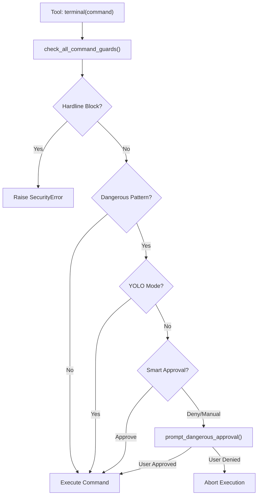
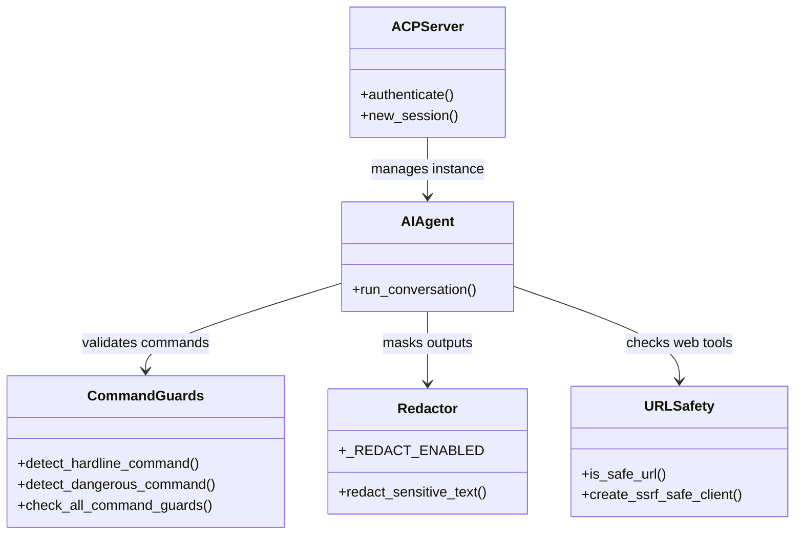

# Security Architecture

Relevant source files

The following files were used as context for generating this wiki page:

- [acp_adapter/events.py](../acp_adapter/events.py)
- [acp_adapter/permissions.py](../acp_adapter/permissions.py)
- [acp_adapter/server.py](../acp_adapter/server.py)
- [acp_adapter/session.py](../acp_adapter/session.py)
- [acp_adapter/tools.py](../acp_adapter/tools.py)
- [agent/redact.py](../agent/redact.py)
- [apps/desktop/src/components/assistant-ui/tool/approval.test.tsx](../apps/desktop/src/components/assistant-ui/tool/approval.test.tsx)
- [gateway/platforms/qqbot/__init__.py](../gateway/platforms/qqbot/__init__.py)
- [gateway/platforms/qqbot/adapter.py](../gateway/platforms/qqbot/adapter.py)
- [gateway/platforms/qqbot/chunked_upload.py](../gateway/platforms/qqbot/chunked_upload.py)
- [gateway/platforms/qqbot/constants.py](../gateway/platforms/qqbot/constants.py)
- [gateway/platforms/qqbot/crypto.py](../gateway/platforms/qqbot/crypto.py)
- [gateway/platforms/qqbot/keyboards.py](../gateway/platforms/qqbot/keyboards.py)
- [gateway/platforms/qqbot/onboard.py](../gateway/platforms/qqbot/onboard.py)
- [gateway/platforms/qqbot/utils.py](../gateway/platforms/qqbot/utils.py)
- [gateway/platforms/yuanbao_media.py](../gateway/platforms/yuanbao_media.py)
- [gateway/shutdown_forensics.py](../gateway/shutdown_forensics.py)
- [hermes_cli/portal_cli.py](../hermes_cli/portal_cli.py)
- [scripts/benchmark_browser_eval.py](../scripts/benchmark_browser_eval.py)
- [tests/acp/test_events.py](../tests/acp/test_events.py)
- [tests/acp/test_mcp_e2e.py](../tests/acp/test_mcp_e2e.py)
- [tests/acp/test_permissions.py](../tests/acp/test_permissions.py)
- [tests/acp/test_server.py](../tests/acp/test_server.py)
- [tests/acp/test_session.py](../tests/acp/test_session.py)
- [tests/acp/test_tools.py](../tests/acp/test_tools.py)
- [tests/acp_adapter/test_acp_commands.py](../tests/acp_adapter/test_acp_commands.py)
- [tests/acp_adapter/test_acp_images.py](../tests/acp_adapter/test_acp_images.py)
- [tests/agent/test_pre_compress_memory_context.py](../tests/agent/test_pre_compress_memory_context.py)
- [tests/agent/test_redact.py](../tests/agent/test_redact.py)
- [tests/agent/test_tool_call_arg_no_redaction.py](../tests/agent/test_tool_call_arg_no_redaction.py)
- [tests/gateway/test_approve_deny_commands.py](../tests/gateway/test_approve_deny_commands.py)
- [tests/gateway/test_async_delegation_session_binding.py](../tests/gateway/test_async_delegation_session_binding.py)
- [tests/gateway/test_matrix_exec_approval.py](../tests/gateway/test_matrix_exec_approval.py)
- [tests/gateway/test_media_download_retry.py](../tests/gateway/test_media_download_retry.py)
- [tests/gateway/test_qqbot.py](../tests/gateway/test_qqbot.py)
- [tests/gateway/test_session_store_runtime_stale_guard.py](../tests/gateway/test_session_store_runtime_stale_guard.py)
- [tests/gateway/test_shutdown_forensics.py](../tests/gateway/test_shutdown_forensics.py)
- [tests/gateway/test_yolo_command.py](../tests/gateway/test_yolo_command.py)
- [tests/run_agent/test_pre_compress_memory_context.py](../tests/run_agent/test_pre_compress_memory_context.py)
- [tests/tools/test_approval.py](../tests/tools/test_approval.py)
- [tests/tools/test_approval_interrupt.py](../tests/tools/test_approval_interrupt.py)
- [tests/tools/test_browser_cdp_override.py](../tests/tools/test_browser_cdp_override.py)
- [tests/tools/test_browser_cdp_tool.py](../tests/tools/test_browser_cdp_tool.py)
- [tests/tools/test_browser_eval_supervisor_path.py](../tests/tools/test_browser_eval_supervisor_path.py)
- [tests/tools/test_browser_hybrid_routing.py](../tests/tools/test_browser_hybrid_routing.py)
- [tests/tools/test_browser_secret_exfil.py](../tests/tools/test_browser_secret_exfil.py)
- [tests/tools/test_browser_ssrf_local.py](../tests/tools/test_browser_ssrf_local.py)
- [tests/tools/test_browser_supervisor.py](../tests/tools/test_browser_supervisor.py)
- [tests/tools/test_command_guards.py](../tests/tools/test_command_guards.py)
- [tests/tools/test_cron_approval_mode.py](../tests/tools/test_cron_approval_mode.py)
- [tests/tools/test_execution_flag_detection.py](../tests/tools/test_execution_flag_detection.py)
- [tests/tools/test_hardline_blocklist.py](../tests/tools/test_hardline_blocklist.py)
- [tests/tools/test_url_safety.py](../tests/tools/test_url_safety.py)
- [tests/tools/test_yolo_mode.py](../tests/tools/test_yolo_mode.py)
- [tools/approval.py](../tools/approval.py)
- [tools/browser_cdp_tool.py](../tools/browser_cdp_tool.py)
- [tools/browser_supervisor.py](../tools/browser_supervisor.py)
- [tools/url_safety.py](../tools/url_safety.py)
- [website/i18n/zh-Hans/docusaurus-plugin-content-docs/current/user-guide/security.md](../website/i18n/zh-Hans/docusaurus-plugin-content-docs/current/user-guide/security.md)

The Hermes Agent security architecture implements a multi-layered defense-in-depth strategy designed to protect the host system from malicious or accidental damage during autonomous execution. This includes strict command validation, automated secret redaction, network safety guards, and a robust permissions model for third-party integrations.

## Command Approval Layers

Hermes employs a hierarchical command guard system that evaluates every terminal command before execution. This system ensures that high-risk operations are either blocked entirely or require explicit human intervention.

### 1. Hardline Blocklist
The `detect_hardline_command` function identifies non-bypassable patterns. These are commands that are never permitted under any circumstances, even in "YOLO" mode, as they represent catastrophic risks (e.g., destructive operations on the root filesystem or sensitive system directories).
*   **Implementation:** [tools/approval.py:21-23](../tools/approval.py#L21-L23) defines the regex-based detection logic.
*   **Sources:** [tools/approval.py:21-23](../tools/approval.py#L21-L23), [tests/tools/test_hardline_blocklist.py](../tests/tools/test_hardline_blocklist.py)

### 2. Dangerous Pattern Detection
The system maintains a comprehensive list of `DANGEROUS_PATTERNS` that trigger an approval flow. This includes recursive deletions (`rm -rf`), package uninstalls, and modifications to system configuration files.
*   **Function:** `detect_dangerous_command` [tools/approval.py:110-115](../tools/approval.py#L110-L115) uses `shlex` to parse commands and match them against known risky signatures.
*   **Sources:** [tools/approval.py:1-9](../tools/approval.py#L1-L9), [tools/approval.py:110-115](../tools/approval.py#L110-L115)

### 3. Smart Approval & YOLO Mode
*   **Smart Approval:** When `approvals.mode: smart` is set in `config.yaml`, an auxiliary LLM is used to analyze the command context. If the risk is deemed low, it returns `APPROVE` [tools/approval.py:66-78](../tools/approval.py#L66-L78).
*   **YOLO Mode:** Enabled via `HERMES_YOLO_MODE=true`. This bypasses manual approval for `DANGEROUS_PATTERNS` but is "frozen" at import time to prevent prompt-injection escalation [tools/approval.py:32-35](../tools/approval.py#L32-L35).
*   **Sources:** [tools/approval.py:32-35](../tools/approval.py#L32-L35), [tools/approval.py:66-78](../tools/approval.py#L66-L78), [tests/tools/test_approval.py:61-65](../tests/tools/test_approval.py#L61-L65)

### Command Guard Data Flow
The following diagram illustrates the lifecycle of a command execution request.

**Title: Command Validation Flow**

*Sources: [tools/approval.py:1-20](../tools/approval.py#L1-L20), [tools/approval.py:102-104](../tools/approval.py#L102-L104)*

## PII and Secret Redaction

The `agent/redact.py` module provides regex-based masking to prevent API keys, tokens, and credentials from leaking into logs, tool outputs, or the conversation history.

*   **Prefix Patterns:** Identifies specific vendor shapes like OpenAI (`sk-`), GitHub (`ghp_`), and Slack (`xoxb-`) [agent/redact.py:72-114](../agent/redact.py#L72-L114).
*   **Environment Assignments:** Redacts patterns like `KEY=value` in shell output [agent/redact.py:120-122](../agent/redact.py#L120-L122).
*   **Short Token Protection:** Tokens shorter than 18 characters are fully masked; longer ones preserve the first 6 and last 4 characters for debugging [agent/redact.py:6-8](../agent/redact.py#L6-L8).
*   **Opt-out:** Users can disable this via `HERMES_REDACT_SECRETS=false` [agent/redact.py:69-70](../agent/redact.py#L69-L70).
*   **Sources:** [agent/redact.py:1-114](../agent/redact.py#L1-L114), [tests/agent/test_redact.py:19-25](../tests/agent/test_redact.py#L19-L25)

## Network & URL Safety (SSRF Prevention)

Hermes implements strict Server-Side Request Forgery (SSRF) prevention to stop the agent from accessing internal network resources or cloud metadata endpoints.

*   **Blocked Hostnames:** Always blocks `metadata.google.internal` and related hostnames [tools/url_safety.py:150-153](../tools/url_safety.py#L150-L153).
*   **IP Filtering:** Blocks the link-local range (`169.254.0.0/16`) and other known metadata IPs [tools/url_safety.py:164-175](../tools/url_safety.py#L164-L175).
*   **Safe Clients:** The `create_ssrf_safe_client()` function ensures that the policy is applied at the socket level during connection [tools/url_safety.py:18-21](../tools/url_safety.py#L18-L21).
*   **Redirect Guard:** `_ssrf_redirect_guard` validates every hop in an HTTP redirect chain [gateway/platforms/base.py:69-72](../gateway/platforms/base.py#L69-L72).
*   **Sources:** [tools/url_safety.py:1-26](../tools/url_safety.py#L1-L26), [tools/url_safety.py:150-175](../tools/url_safety.py#L150-L175), [gateway/platforms/qqbot/adapter.py:69-72](../gateway/platforms/qqbot/adapter.py#L69-L72)

## File System Safety

Security measures are in place to prevent path traversal and unauthorized access to sensitive files.

*   **Credential Protection:** Files identified as `credential_files` (e.g., `.env`, `id_rsa`) are subject to stricter access controls.
*   **Path Normalization:** The system uses `os.path.normpath` and `Path.resolve()` to prevent traversal attacks (e.g., `../../etc/passwd`).
*   **ACP Workspace Isolation:** The Agent Client Protocol (ACP) adapter translates Windows drive paths to WSL mount forms to ensure consistency and safety when running in cross-platform environments [acp_adapter/session.py:29-40](../acp_adapter/session.py#L29-L40).
*   **Sources:** [acp_adapter/session.py:29-40](../acp_adapter/session.py#L29-L40), [acp_adapter/server.py:158-190](../acp_adapter/server.py#L158-L190)

## ACP Permissions Model

The Agent Client Protocol (ACP) adapter provides a structured permissions model for IDE integrations (like Zed or VS Code).

*   **Interactive Context:** ACP sessions use `contextvars` to maintain thread-local state for `HERMES_INTERACTIVE`, preventing race conditions where one session might accidentally bypass approval checks [tools/approval.py:41-66](../tools/approval.py#L41-L66).
*   **Approval Callbacks:** `make_approval_callback` bridges internal agent approvals to the IDE's UI, allowing users to approve edits or commands via interactive buttons [acp_adapter/server.py:73](../acp_adapter/server.py#L73).
*   **Session Manager:** `SessionManager` ensures that agents are isolated within their own workspace directories and persisted safely in the `SessionDB` [acp_adapter/session.py:175-181](../acp_adapter/session.py#L175-L181).
*   **Sources:** [acp_adapter/server.py:73](../acp_adapter/server.py#L73), [acp_adapter/session.py:175-181](../acp_adapter/session.py#L175-L181), [tools/approval.py:41-66](../tools/approval.py#L41-L66)

## Supply-Chain Security

Hermes enforces strict dependency management to mitigate supply-chain attacks.

*   **Exact Pinning:** All dependencies are pinned to exact versions in requirements files to prevent the automatic ingestion of malicious updates.
*   **Lazy Dependency Allowlist:** The `LAZY_DEPS` system restricts which packages can be installed at runtime, requiring explicit inclusion in the allowlist.
*   **Automated Scanning:** CI/CD pipelines include `osv-scanner` and `supply-chain-audit` workflows to detect known vulnerabilities in the dependency tree.
*   **Sources:** [agent/redact.py:69-70](../agent/redact.py#L69-L70), [tests/agent/test_redact.py:11-16](../tests/agent/test_redact.py#L11-L16)

**Title: Security Entity Mapping**

*Sources: [acp_adapter/server.py:1-40](../acp_adapter/server.py#L1-L40), [tools/approval.py:1-30](../tools/approval.py#L1-L30), [agent/redact.py:1-20](../agent/redact.py#L1-L20), [tools/url_safety.py:1-30](../tools/url_safety.py#L1-L30)*

---
