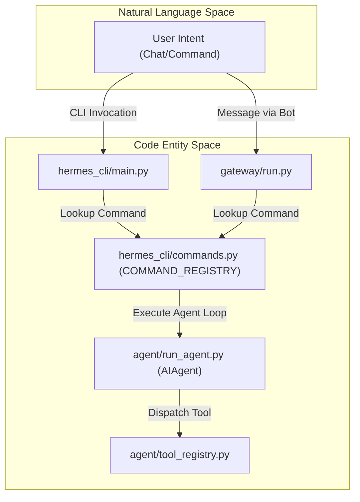
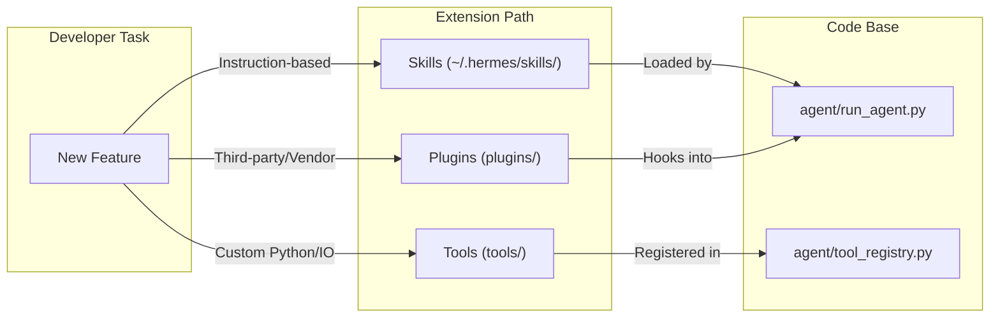

# Developer Guide

Relevant source files

The following files were used as context for generating this wiki page:

- [CONTRIBUTING.md](../CONTRIBUTING.md)
- [README.ur-pk.md](../README.ur-pk.md)
- [README.zh-CN.md](../README.zh-CN.md)
- [agent/pet/generate/atlas.py](../agent/pet/generate/atlas.py)
- [agent/pet/generate/imagegen.py](../agent/pet/generate/imagegen.py)
- [agent/pet/generate/orchestrate.py](../agent/pet/generate/orchestrate.py)
- [agent/pet/generate/prompts.py](../agent/pet/generate/prompts.py)
- [apps/desktop/src/app/pet-generate/components/provider-picker.tsx](../apps/desktop/src/app/pet-generate/components/provider-picker.tsx)
- [scripts/run_tests.sh](../scripts/run_tests.sh)
- [scripts/run_tests_parallel.py](../scripts/run_tests_parallel.py)
- [tests/agent/test_pet_generate.py](../tests/agent/test_pet_generate.py)
- [tests/conftest.py](../tests/conftest.py)
- [tests/hermes_cli/test_api_key_providers.py](../tests/hermes_cli/test_api_key_providers.py)
- [tests/hermes_cli/test_cmd_update_docker.py](../tests/hermes_cli/test_cmd_update_docker.py)
- [tests/hermes_cli/test_windows_native_docs.py](../tests/hermes_cli/test_windows_native_docs.py)
- [tests/test_live_system_guard_self_test.py](../tests/test_live_system_guard_self_test.py)
- [tests/test_run_tests_parallel.py](../tests/test_run_tests_parallel.py)
- [website/docs/developer-guide/contributing.md](../website/docs/developer-guide/contributing.md)
- [website/docs/developer-guide/creating-skills.md](../website/docs/developer-guide/creating-skills.md)
- [website/docs/getting-started/installation.md](../website/docs/getting-started/installation.md)
- [website/docs/getting-started/quickstart.md](../website/docs/getting-started/quickstart.md)
- [website/docs/getting-started/updating.md](../website/docs/getting-started/updating.md)
- [website/docs/integrations/providers.md](../website/docs/integrations/providers.md)
- [website/docs/reference/cli-commands.md](../website/docs/reference/cli-commands.md)
- [website/docs/reference/environment-variables.md](../website/docs/reference/environment-variables.md)
- [website/docs/reference/slash-commands.md](../website/docs/reference/slash-commands.md)
- [website/docs/user-guide/cli.md](../website/docs/user-guide/cli.md)
- [website/docs/user-guide/configuration.md](../website/docs/user-guide/configuration.md)
- [website/docs/user-guide/features/fallback-providers.md](../website/docs/user-guide/features/fallback-providers.md)
- [website/docs/user-guide/features/skills.md](../website/docs/user-guide/features/skills.md)
- [website/docs/user-guide/messaging/index.md](../website/docs/user-guide/messaging/index.md)
- [website/docs/user-guide/security.md](../website/docs/user-guide/security.md)
- [website/docs/user-guide/windows-native.md](../website/docs/user-guide/windows-native.md)
- [website/i18n/zh-Hans/docusaurus-plugin-content-docs/current/developer-guide/contributing.md](../website/i18n/zh-Hans/docusaurus-plugin-content-docs/current/developer-guide/contributing.md)
- [website/i18n/zh-Hans/docusaurus-plugin-content-docs/current/getting-started/installation.md](../website/i18n/zh-Hans/docusaurus-plugin-content-docs/current/getting-started/installation.md)
- [website/i18n/zh-Hans/docusaurus-plugin-content-docs/current/user-guide/windows-native.md](../website/i18n/zh-Hans/docusaurus-plugin-content-docs/current/user-guide/windows-native.md)

This guide provides a high-level overview of the resources, architectural principles, and infrastructure available to developers and contributors extending Hermes Agent.

Hermes is designed around a **"Narrow Waist"** philosophy, where a unified agent core (`AIAgent`) interfaces with a diverse ecosystem of toolsets, messaging platforms, and model providers through stable, abstract interfaces [CONTRIBUTING.md:3-10](../CONTRIBUTING.md#L3-L10).

## System Entry Points

The codebase is organized into several distinct functional areas. Understanding these entry points is critical for navigating the repository.

| Directory | Purpose |
| :--- | :--- |
| `agent/` | Core logic: `AIAgent`, conversation loops, memory management, and i18n [CONTRIBUTING.md:42-45](../CONTRIBUTING.md#L42-L45). |
| `gateway/` | Messaging platform adapters and the `GatewayRunner` service [website/docs/user-guide/messaging/index.md:48-51](../website/docs/user-guide/messaging/index.md#L48-L51). |
| `tools/` | Native tool implementations (Terminal, File Operations, Web Search) [CONTRIBUTING.md:50-56](../CONTRIBUTING.md#L50-L56). |
| `hermes_cli/` | Command-line interface logic, REPL, and the `COMMAND_REGISTRY` [website/docs/reference/slash-commands.md:9-12](../website/docs/reference/slash-commands.md#L9-L12). |
| `plugins/` | Extensible modules for memory, model providers, and observability [CONTRIBUTING.md:70-75](../CONTRIBUTING.md#L70-L75). |

For a deep dive into code organization and the contribution process, see **[Contributing & Code Architecture](#11.1)**.

### From Natural Language to Code Entities

The following diagram maps high-level user intents to the specific code entities that handle them within the Hermes ecosystem.

**Intent Mapping Architecture**

Sources: [website/docs/reference/slash-commands.md:9-12](../website/docs/reference/slash-commands.md#L9-L12), [website/docs/user-guide/messaging/index.md:109-110](../website/docs/user-guide/messaging/index.md#L109-L110)

---

## Core Infrastructure

### Testing & Quality Assurance
Hermes employs a rigorous testing infrastructure designed for hermeticity and parallel execution. The suite includes over 17,000 tests that are isolated by a custom parallel runner [tests/conftest.py:36-48](../tests/conftest.py#L36-L48).

*   **Hermetic Invariants:** The test environment unsets all credential environment variables (e.g., `_API_KEY`, `_TOKEN`) to prevent local leakages [tests/conftest.py:5-7](../tests/conftest.py#L5-L7).
*   **Parallelism:** `scripts/run_tests_parallel.py` spawns fresh pytest subprocesses per file to ensure zero cross-test state leakage [tests/conftest.py:36-42](../tests/conftest.py#L36-L42).
*   **CI Guardrails:** A "Live System Guard" prevents tests from accidentally interacting with production environments or real API endpoints [tests/test_live_system_guard_self_test.py:1-10](../tests/test_live_system_guard_self_test.py#L1-L10).

For details on writing and running tests, see **[Testing Infrastructure](#11.2)**.

### Security Architecture
Security is a primary consideration for any agent capable of code execution. Hermes implements a layered defense-in-depth strategy.

*   **Command Approval:** A multi-tier gatekeeper system (including `HARDLINE_PATTERNS`) filters dangerous shell commands [website/docs/user-guide/configuration.md:120-125](../website/docs/user-guide/configuration.md#L120-L125).
*   **Redaction:** The `agent/redact.py` module automatically scrubs PII and secrets from logs [website/docs/user-guide/configuration.md:27-28](../website/docs/user-guide/configuration.md#L27-L28).
*   **Supply Chain:** Dependencies are strictly pinned, and the system includes an on-demand `hermes security audit` command powered by OSV.dev [website/docs/reference/cli-commands.md:63-63](../website/docs/reference/cli-commands.md#L63).

For a full security breakdown, see **[Security Architecture](#11.3)**.

---

## Developer Workflows

### Extending Hermes
Developers can extend Hermes in three primary ways:
1.  **Skills:** Markdown-based instructions for high-level capabilities. These are preferred for most features [CONTRIBUTING.md:41-43](../CONTRIBUTING.md#L41-L43).
2.  **Tools:** Python-based integrations for low-level system access or complex binary data handling [CONTRIBUTING.md:50-56](../CONTRIBUTING.md#L50-L56).
3.  **Plugins:** Standalone modules for third-party services, memory providers, or model adapters [CONTRIBUTING.md:70-75](../CONTRIBUTING.md#L70-L75).

**Extensibility Mapping**

Sources: [CONTRIBUTING.md:41-90](../CONTRIBUTING.md#L41-L90), [website/docs/user-guide/features/skills.md:11-13](../website/docs/user-guide/features/skills.md#L11-L13)

### Local Development Setup
To set up a development environment:
1.  Clone the repository.
2.  Install dependencies using `uv`.
3.  Use `hermes profile create` to maintain an isolated development environment [website/docs/user-guide/features/skills.md:33-34](../website/docs/user-guide/features/skills.md#L33-L34).
4.  Run `hermes doctor` to verify the environment configuration [website/docs/reference/cli-commands.md:62-62](../website/docs/reference/cli-commands.md#L62).

For the step-by-step setup guide, see **[Contributing & Code Architecture](#11.1)**.

---
