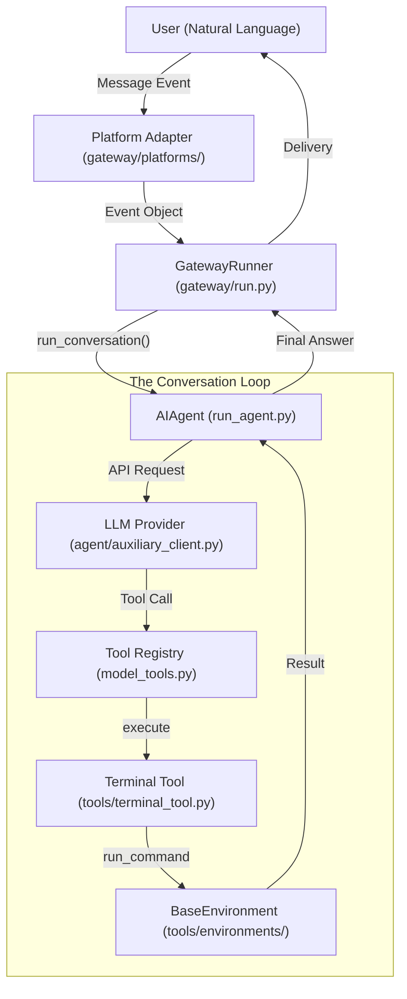
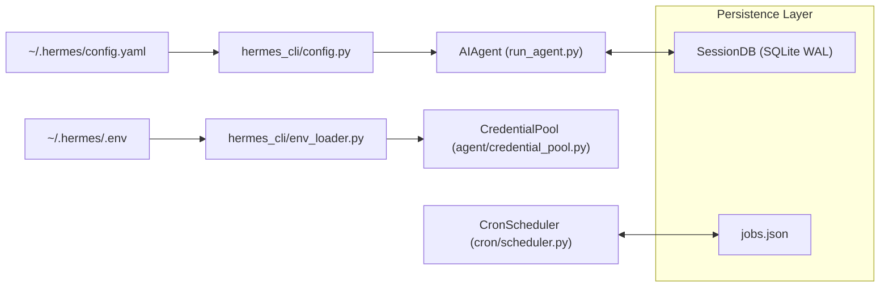

# Glossary

Relevant source files

The following files were used as context for generating this wiki page:

- [.env.example](../.env.example)
- [AGENTS.md](../AGENTS.md)
- [README.md](../README.md)
- [agent/agent_init.py](../agent/agent_init.py)
- [agent/agent_runtime_helpers.py](../agent/agent_runtime_helpers.py)
- [agent/auxiliary_client.py](../agent/auxiliary_client.py)
- [agent/bounded_response.py](../agent/bounded_response.py)
- [agent/chat_completion_helpers.py](../agent/chat_completion_helpers.py)
- [agent/context_compressor.py](../agent/context_compressor.py)
- [agent/conversation_compression.py](../agent/conversation_compression.py)
- [agent/conversation_loop.py](../agent/conversation_loop.py)
- [agent/credential_pool.py](../agent/credential_pool.py)
- [agent/gemini_native_adapter.py](../agent/gemini_native_adapter.py)
- [agent/i18n.py](../agent/i18n.py)
- [agent/moa_loop.py](../agent/moa_loop.py)
- [agent/model_metadata.py](../agent/model_metadata.py)
- [agent/models_dev.py](../agent/models_dev.py)
- [agent/prompt_builder.py](../agent/prompt_builder.py)
- [agent/runtime_cwd.py](../agent/runtime_cwd.py)
- [agent/skill_commands.py](../agent/skill_commands.py)
- [agent/skill_utils.py](../agent/skill_utils.py)
- [agent/system_prompt.py](../agent/system_prompt.py)
- [agent/tool_executor.py](../agent/tool_executor.py)
- [agent/turn_context.py](../agent/turn_context.py)
- [apps/desktop/src/app/settings/model-settings.test.tsx](../apps/desktop/src/app/settings/model-settings.test.tsx)
- [apps/desktop/src/app/settings/model-settings.tsx](../apps/desktop/src/app/settings/model-settings.tsx)
- [apps/desktop/src/hermes.ts](../apps/desktop/src/hermes.ts)
- [apps/desktop/src/lib/runtime-readiness.test.ts](../apps/desktop/src/lib/runtime-readiness.test.ts)
- [apps/desktop/src/lib/runtime-readiness.ts](../apps/desktop/src/lib/runtime-readiness.ts)
- [apps/desktop/src/store/onboarding.test.ts](../apps/desktop/src/store/onboarding.test.ts)
- [apps/desktop/src/store/onboarding.ts](../apps/desktop/src/store/onboarding.ts)
- [apps/desktop/src/types/hermes.ts](../apps/desktop/src/types/hermes.ts)
- [cli-config.yaml.example](../cli-config.yaml.example)
- [cli.py](../cli.py)
- contributors/emails/lanyusea@gmail.com
- contributors/emails/sjq15251852316@gmail.com
- contributors/emails/stanislav@local
- [cron/executions.py](../cron/executions.py)
- [cron/jobs.py](../cron/jobs.py)
- [cron/lifecycle_guard.py](../cron/lifecycle_guard.py)
- [cron/scheduler.py](../cron/scheduler.py)
- [cron/scheduler_provider.py](../cron/scheduler_provider.py)
- [gateway/config.py](../gateway/config.py)
- [gateway/platforms/base.py](../gateway/platforms/base.py)
- [gateway/restart_loop_guard.py](../gateway/restart_loop_guard.py)
- [gateway/run.py](../gateway/run.py)
- [gateway/session.py](../gateway/session.py)
- [hermes_cli/__init__.py](../hermes_cli/__init__.py)
- [hermes_cli/auth.py](../hermes_cli/auth.py)
- [hermes_cli/auth_commands.py](../hermes_cli/auth_commands.py)
- [hermes_cli/commands.py](../hermes_cli/commands.py)
- [hermes_cli/config.py](../hermes_cli/config.py)
- [hermes_cli/cron.py](../hermes_cli/cron.py)
- [hermes_cli/kanban.py](../hermes_cli/kanban.py)
- [hermes_cli/kanban_db.py](../hermes_cli/kanban_db.py)
- [hermes_cli/kanban_diagnostics.py](../hermes_cli/kanban_diagnostics.py)
- [hermes_cli/main.py](../hermes_cli/main.py)
- [hermes_cli/moa_cmd.py](../hermes_cli/moa_cmd.py)
- [hermes_cli/moa_config.py](../hermes_cli/moa_config.py)
- [hermes_cli/model_normalize.py](../hermes_cli/model_normalize.py)
- [hermes_cli/models.py](../hermes_cli/models.py)
- [hermes_cli/proxy/adapters/base.py](../hermes_cli/proxy/adapters/base.py)
- [hermes_cli/proxy/adapters/nous_portal.py](../hermes_cli/proxy/adapters/nous_portal.py)
- [hermes_cli/runtime_provider.py](../hermes_cli/runtime_provider.py)
- [hermes_cli/setup.py](../hermes_cli/setup.py)
- [hermes_cli/skills_config.py](../hermes_cli/skills_config.py)
- [hermes_cli/subcommands/cron.py](../hermes_cli/subcommands/cron.py)
- [hermes_cli/web_server.py](../hermes_cli/web_server.py)
- [hermes_state.py](../hermes_state.py)
- [optional-mcps/unreal-engine/manifest.yaml](../optional-mcps/unreal-engine/manifest.yaml)
- [plugins/cron_providers/chronos/__init__.py](../plugins/cron_providers/chronos/__init__.py)
- [plugins/kanban/dashboard/dist/index.js](../plugins/kanban/dashboard/dist/index.js)
- [plugins/kanban/dashboard/dist/style.css](../plugins/kanban/dashboard/dist/style.css)
- [plugins/kanban/dashboard/plugin_api.py](../plugins/kanban/dashboard/plugin_api.py)
- [plugins/observability/nemo_relay/README.md](../plugins/observability/nemo_relay/README.md)
- [plugins/observability/nemo_relay/__init__.py](../plugins/observability/nemo_relay/__init__.py)
- [pyproject.toml](../pyproject.toml)
- [run_agent.py](../run_agent.py)
- [scripts/contributor_audit.py](../scripts/contributor_audit.py)
- [scripts/release.py](../scripts/release.py)
- [tests/agent/test_auxiliary_client.py](../tests/agent/test_auxiliary_client.py)
- [tests/agent/test_auxiliary_named_custom_providers.py](../tests/agent/test_auxiliary_named_custom_providers.py)
- [tests/agent/test_bounded_response.py](../tests/agent/test_bounded_response.py)
- [tests/agent/test_compression_anti_thrash_persistence.py](../tests/agent/test_compression_anti_thrash_persistence.py)
- [tests/agent/test_compression_concurrent_fork.py](../tests/agent/test_compression_concurrent_fork.py)
- [tests/agent/test_compression_rotation_state.py](../tests/agent/test_compression_rotation_state.py)
- [tests/agent/test_context_compressor.py](../tests/agent/test_context_compressor.py)
- [tests/agent/test_credential_pool.py](../tests/agent/test_credential_pool.py)
- [tests/agent/test_credential_pool_oauth_writethrough.py](../tests/agent/test_credential_pool_oauth_writethrough.py)
- [tests/agent/test_credential_pool_routing.py](../tests/agent/test_credential_pool_routing.py)
- [tests/agent/test_gemini_native_adapter.py](../tests/agent/test_gemini_native_adapter.py)
- [tests/agent/test_i18n.py](../tests/agent/test_i18n.py)
- [tests/agent/test_idle_compaction_lock_and_guards.py](../tests/agent/test_idle_compaction_lock_and_guards.py)
- [tests/agent/test_model_metadata.py](../tests/agent/test_model_metadata.py)
- [tests/agent/test_model_metadata_local_ctx.py](../tests/agent/test_model_metadata_local_ctx.py)
- [tests/agent/test_models_dev.py](../tests/agent/test_models_dev.py)
- [tests/agent/test_probe_cache_followups.py](../tests/agent/test_probe_cache_followups.py)
- [tests/agent/test_prompt_builder.py](../tests/agent/test_prompt_builder.py)
- [tests/agent/test_runtime_cwd.py](../tests/agent/test_runtime_cwd.py)
- [tests/agent/test_skill_commands.py](../tests/agent/test_skill_commands.py)
- [tests/agent/test_skill_utils.py](../tests/agent/test_skill_utils.py)
- [tests/agent/test_system_prompt.py](../tests/agent/test_system_prompt.py)
- [tests/agent/test_turn_context.py](../tests/agent/test_turn_context.py)
- [tests/agent/test_turn_context_overflow_warning.py](../tests/agent/test_turn_context_overflow_warning.py)
- [tests/cli/test_cli_interrupt_ack_race.py](../tests/cli/test_cli_interrupt_ack_race.py)
- [tests/cli/test_cli_shutdown_memory_messages.py](../tests/cli/test_cli_shutdown_memory_messages.py)
- [tests/cli/test_moa_command.py](../tests/cli/test_moa_command.py)
- [tests/cron/test_cron_prompt_injection_skill.py](../tests/cron/test_cron_prompt_injection_skill.py)
- [tests/cron/test_cron_script.py](../tests/cron/test_cron_script.py)
- [tests/cron/test_execution_ledger.py](../tests/cron/test_execution_ledger.py)
- [tests/cron/test_jobs.py](../tests/cron/test_jobs.py)
- [tests/cron/test_scheduler.py](../tests/cron/test_scheduler.py)
- [tests/cron/test_scheduler_mcp_init.py](../tests/cron/test_scheduler_mcp_init.py)
- [tests/cron/test_scheduler_provider.py](../tests/cron/test_scheduler_provider.py)
- [tests/gateway/test_approve_deny_commands.py](../tests/gateway/test_approve_deny_commands.py)
- [tests/gateway/test_async_delegation_session_binding.py](../tests/gateway/test_async_delegation_session_binding.py)
- [tests/gateway/test_config.py](../tests/gateway/test_config.py)
- [tests/gateway/test_matrix_exec_approval.py](../tests/gateway/test_matrix_exec_approval.py)
- [tests/gateway/test_platform_base.py](../tests/gateway/test_platform_base.py)
- [tests/gateway/test_reasoning_command.py](../tests/gateway/test_reasoning_command.py)
- [tests/gateway/test_session.py](../tests/gateway/test_session.py)
- [tests/gateway/test_session_model_override_routing.py](../tests/gateway/test_session_model_override_routing.py)
- [tests/gateway/test_session_model_reset.py](../tests/gateway/test_session_model_reset.py)
- [tests/gateway/test_session_reset_notify.py](../tests/gateway/test_session_reset_notify.py)
- [tests/gateway/test_session_store_runtime_stale_guard.py](../tests/gateway/test_session_store_runtime_stale_guard.py)
- [tests/gateway/test_shared_group_sender_prefix.py](../tests/gateway/test_shared_group_sender_prefix.py)
- [tests/gateway/test_telegram_noise_filter.py](../tests/gateway/test_telegram_noise_filter.py)
- [tests/gateway/test_tts_media_routing.py](../tests/gateway/test_tts_media_routing.py)
- [tests/gateway/test_yolo_command.py](../tests/gateway/test_yolo_command.py)
- [tests/hermes_cli/test_auth_commands.py](../tests/hermes_cli/test_auth_commands.py)
- [tests/hermes_cli/test_auth_nous_provider.py](../tests/hermes_cli/test_auth_nous_provider.py)
- [tests/hermes_cli/test_auth_profile_fallback.py](../tests/hermes_cli/test_auth_profile_fallback.py)
- [tests/hermes_cli/test_commands.py](../tests/hermes_cli/test_commands.py)
- [tests/hermes_cli/test_cron.py](../tests/hermes_cli/test_cron.py)
- [tests/hermes_cli/test_ensure_utf8_locale.py](../tests/hermes_cli/test_ensure_utf8_locale.py)
- [tests/hermes_cli/test_gateway_restart_loop.py](../tests/hermes_cli/test_gateway_restart_loop.py)
- [tests/hermes_cli/test_gateway_runtime_health.py](../tests/hermes_cli/test_gateway_runtime_health.py)
- [tests/hermes_cli/test_gemini_provider.py](../tests/hermes_cli/test_gemini_provider.py)
- [tests/hermes_cli/test_kanban_cli.py](../tests/hermes_cli/test_kanban_cli.py)
- [tests/hermes_cli/test_kanban_core_functionality.py](../tests/hermes_cli/test_kanban_core_functionality.py)
- [tests/hermes_cli/test_kanban_db.py](../tests/hermes_cli/test_kanban_db.py)
- [tests/hermes_cli/test_kanban_diagnostics.py](../tests/hermes_cli/test_kanban_diagnostics.py)
- [tests/hermes_cli/test_moa_config.py](../tests/hermes_cli/test_moa_config.py)
- [tests/hermes_cli/test_model_normalize.py](../tests/hermes_cli/test_model_normalize.py)
- [tests/hermes_cli/test_model_validation.py](../tests/hermes_cli/test_model_validation.py)
- [tests/hermes_cli/test_proxy.py](../tests/hermes_cli/test_proxy.py)
- [tests/hermes_cli/test_runtime_provider_resolution.py](../tests/hermes_cli/test_runtime_provider_resolution.py)
- [tests/hermes_cli/test_skills_config.py](../tests/hermes_cli/test_skills_config.py)
- [tests/hermes_cli/test_web_oauth_dispatch.py](../tests/hermes_cli/test_web_oauth_dispatch.py)
- [tests/hermes_cli/test_web_server.py](../tests/hermes_cli/test_web_server.py)
- [tests/hermes_cli/test_web_server_messaging_profiles.py](../tests/hermes_cli/test_web_server_messaging_profiles.py)
- [tests/hermes_cli/test_web_server_profile_unification.py](../tests/hermes_cli/test_web_server_profile_unification.py)
- [tests/hermes_cli/test_whatsapp_onboarding.py](../tests/hermes_cli/test_whatsapp_onboarding.py)
- [tests/integration/test_daytona_terminal.py](../tests/integration/test_daytona_terminal.py)
- [tests/plugins/test_kanban_dashboard_plugin.py](../tests/plugins/test_kanban_dashboard_plugin.py)
- [tests/plugins/test_nemo_relay_plugin.py](../tests/plugins/test_nemo_relay_plugin.py)
- [tests/run_agent/test_413_compression.py](../tests/run_agent/test_413_compression.py)
- [tests/run_agent/test_compression_feasibility.py](../tests/run_agent/test_compression_feasibility.py)
- [tests/run_agent/test_credential_pool_interrupt.py](../tests/run_agent/test_credential_pool_interrupt.py)
- [tests/run_agent/test_moa_fanout_cadence.py](../tests/run_agent/test_moa_fanout_cadence.py)
- [tests/run_agent/test_moa_loop_mode.py](../tests/run_agent/test_moa_loop_mode.py)
- [tests/run_agent/test_run_agent.py](../tests/run_agent/test_run_agent.py)
- [tests/test_hermes_state.py](../tests/test_hermes_state.py)
- [tests/test_hermes_state_compression_locks.py](../tests/test_hermes_state_compression_locks.py)
- [tests/test_packaging_metadata.py](../tests/test_packaging_metadata.py)
- [tests/test_project_metadata.py](../tests/test_project_metadata.py)
- [tests/test_tui_gateway_server.py](../tests/test_tui_gateway_server.py)
- [tests/tools/test_approval.py](../tests/tools/test_approval.py)
- [tests/tools/test_approval_interrupt.py](../tests/tools/test_approval_interrupt.py)
- [tests/tools/test_command_guards.py](../tests/tools/test_command_guards.py)
- [tests/tools/test_credential_files.py](../tests/tools/test_credential_files.py)
- [tests/tools/test_cron_approval_mode.py](../tests/tools/test_cron_approval_mode.py)
- [tests/tools/test_cronjob_tools.py](../tests/tools/test_cronjob_tools.py)
- [tests/tools/test_daemon_pool.py](../tests/tools/test_daemon_pool.py)
- [tests/tools/test_daytona_environment.py](../tests/tools/test_daytona_environment.py)
- [tests/tools/test_docker_environment.py](../tests/tools/test_docker_environment.py)
- [tests/tools/test_docker_orphan_reaper_integration.py](../tests/tools/test_docker_orphan_reaper_integration.py)
- [tests/tools/test_execution_flag_detection.py](../tests/tools/test_execution_flag_detection.py)
- [tests/tools/test_file_sync.py](../tests/tools/test_file_sync.py)
- [tests/tools/test_file_sync_back.py](../tests/tools/test_file_sync_back.py)
- [tests/tools/test_file_sync_sigint.py](../tests/tools/test_file_sync_sigint.py)
- [tests/tools/test_hardline_blocklist.py](../tests/tools/test_hardline_blocklist.py)
- [tests/tools/test_kanban_tools.py](../tests/tools/test_kanban_tools.py)
- [tests/tools/test_lazy_deps.py](../tests/tools/test_lazy_deps.py)
- [tests/tools/test_modal_bulk_upload.py](../tests/tools/test_modal_bulk_upload.py)
- [tests/tools/test_modal_snapshot_isolation.py](../tests/tools/test_modal_snapshot_isolation.py)
- [tests/tools/test_skill_manager_tool.py](../tests/tools/test_skill_manager_tool.py)
- [tests/tools/test_skills_tool.py](../tests/tools/test_skills_tool.py)
- [tests/tools/test_ssh_bulk_upload.py](../tests/tools/test_ssh_bulk_upload.py)
- [tests/tools/test_ssh_environment.py](../tests/tools/test_ssh_environment.py)
- [tests/tools/test_sync_back_backends.py](../tests/tools/test_sync_back_backends.py)
- [tests/tools/test_terminal_config_env_sync.py](../tests/tools/test_terminal_config_env_sync.py)
- [tests/tools/test_tts_gemini.py](../tests/tools/test_tts_gemini.py)
- [tests/tools/test_yolo_mode.py](../tests/tools/test_yolo_mode.py)
- [tests/tui_gateway/test_goal_command.py](../tests/tui_gateway/test_goal_command.py)
- [tests/tui_gateway/test_protocol.py](../tests/tui_gateway/test_protocol.py)
- [tests/tui_gateway/test_review_summary_callback.py](../tests/tui_gateway/test_review_summary_callback.py)
- [tools/approval.py](../tools/approval.py)
- [tools/credential_files.py](../tools/credential_files.py)
- [tools/cronjob_tools.py](../tools/cronjob_tools.py)
- [tools/daemon_pool.py](../tools/daemon_pool.py)
- [tools/environments/daytona.py](../tools/environments/daytona.py)
- [tools/environments/docker.py](../tools/environments/docker.py)
- [tools/environments/file_sync.py](../tools/environments/file_sync.py)
- [tools/environments/modal.py](../tools/environments/modal.py)
- [tools/environments/singularity.py](../tools/environments/singularity.py)
- [tools/environments/ssh.py](../tools/environments/ssh.py)
- [tools/kanban_tools.py](../tools/kanban_tools.py)
- [tools/lazy_deps.py](../tools/lazy_deps.py)
- [tools/project_tools.py](../tools/project_tools.py)
- [tools/skill_manager_tool.py](../tools/skill_manager_tool.py)
- [tools/skills_tool.py](../tools/skills_tool.py)
- [tools/terminal_tool.py](../tools/terminal_tool.py)
- [tui_gateway/server.py](../tui_gateway/server.py)
- [ui-tui/src/__tests__/appChromeStatusRule.test.tsx](../ui-tui/src/__tests__/appChromeStatusRule.test.tsx)
- [ui-tui/src/__tests__/createGatewayEventHandler.test.ts](../ui-tui/src/__tests__/createGatewayEventHandler.test.ts)
- [ui-tui/src/__tests__/createSlashHandler.test.ts](../ui-tui/src/__tests__/createSlashHandler.test.ts)
- [ui-tui/src/__tests__/slashParity.test.ts](../ui-tui/src/__tests__/slashParity.test.ts)
- [ui-tui/src/__tests__/subagentTree.test.ts](../ui-tui/src/__tests__/subagentTree.test.ts)
- [ui-tui/src/__tests__/useConfigSync.test.ts](../ui-tui/src/__tests__/useConfigSync.test.ts)
- [ui-tui/src/app/createGatewayEventHandler.ts](../ui-tui/src/app/createGatewayEventHandler.ts)
- [ui-tui/src/app/interfaces.ts](../ui-tui/src/app/interfaces.ts)
- [ui-tui/src/app/slash/commands/core.ts](../ui-tui/src/app/slash/commands/core.ts)
- [ui-tui/src/app/slash/commands/ops.ts](../ui-tui/src/app/slash/commands/ops.ts)
- [ui-tui/src/app/slash/commands/session.ts](../ui-tui/src/app/slash/commands/session.ts)
- [ui-tui/src/app/turnController.ts](../ui-tui/src/app/turnController.ts)
- [ui-tui/src/app/uiStore.ts](../ui-tui/src/app/uiStore.ts)
- [ui-tui/src/app/useConfigSync.ts](../ui-tui/src/app/useConfigSync.ts)
- [ui-tui/src/app/useMainApp.ts](../ui-tui/src/app/useMainApp.ts)
- [ui-tui/src/components/agentsOverlay.tsx](../ui-tui/src/components/agentsOverlay.tsx)
- [ui-tui/src/components/appChrome.tsx](../ui-tui/src/components/appChrome.tsx)
- [ui-tui/src/components/appLayout.tsx](../ui-tui/src/components/appLayout.tsx)
- [ui-tui/src/gatewayTypes.ts](../ui-tui/src/gatewayTypes.ts)
- [ui-tui/src/lib/subagentTree.ts](../ui-tui/src/lib/subagentTree.ts)
- [uv.lock](../uv.lock)
- [web/src/lib/api.ts](../web/src/lib/api.ts)
- [web/src/pages/ChannelsPage.tsx](../web/src/pages/ChannelsPage.tsx)
- [web/src/pages/ModelsPage.tsx](../web/src/pages/ModelsPage.tsx)
- [website/docs/developer-guide/agent-loop.md](../website/docs/developer-guide/agent-loop.md)
- [website/docs/developer-guide/architecture.md](../website/docs/developer-guide/architecture.md)
- [website/docs/developer-guide/cron-internals.md](../website/docs/developer-guide/cron-internals.md)
- [website/docs/developer-guide/gateway-internals.md](../website/docs/developer-guide/gateway-internals.md)
- [website/docs/user-guide/features/cron.md](../website/docs/user-guide/features/cron.md)
- [website/docs/user-guide/features/kanban-tutorial.md](../website/docs/user-guide/features/kanban-tutorial.md)
- [website/docs/user-guide/features/kanban-worker-lanes.md](../website/docs/user-guide/features/kanban-worker-lanes.md)
- [website/docs/user-guide/features/kanban.md](../website/docs/user-guide/features/kanban.md)
- [website/docs/user-guide/features/mixture-of-agents.md](../website/docs/user-guide/features/mixture-of-agents.md)
- [website/i18n/zh-Hans/docusaurus-plugin-content-docs/current/user-guide/features/kanban.md](../website/i18n/zh-Hans/docusaurus-plugin-content-docs/current/user-guide/features/kanban.md)
- [website/i18n/zh-Hans/docusaurus-plugin-content-docs/current/user-guide/security.md](../website/i18n/zh-Hans/docusaurus-plugin-content-docs/current/user-guide/security.md)

This page defines codebase-specific terms, jargon, and architectural concepts used within the Hermes Agent system. It serves as a technical reference for onboarding engineers to bridge the gap between high-level descriptions and the underlying implementation.

## Core System Entities

### AIAgent
The primary execution class that orchestrates the interaction between a Large Language Model (LLM) and the tool system. It manages the conversation state, handles provider-specific message formatting, and implements the iterative tool-calling loop.
*   **Implementation**: `AIAgent` class in [run_agent.py:18-21](../run_agent.py#L18-L21).
*   **Key Method**: `run_conversation` [run_agent.py:20-20](../run_agent.py#L20) handles the full turn lifecycle, including error recovery and tool dispatch.

### Gateway / GatewayRunner
The multi-platform messaging bridge that connects Hermes to external interfaces like Telegram, Discord, and Slack. It manages session persistence and maps platform-specific events to agent turns.
*   **Implementation**: `GatewayRunner` in [gateway/run.py:5-6](../gateway/run.py#L5-L6).
*   **Process Entry**: `start_gateway()` [gateway/run.py:5-5](../gateway/run.py#L5).

### SessionDB
The SQLite-backed persistence layer for all conversation history, token usage, and metadata. It uses WAL mode for concurrency and FTS5 for message searching.
*   **Implementation**: [hermes_state.py:1-1](../hermes_state.py#L1) (referenced via `SessionDB` imports).
*   **Code Pointer**: Used extensively in `AIAgent` for state persistence [run_agent.py:148-148](../run_agent.py#L148).

---

## Technical Jargon & Concepts

### Auxiliary Client
A secondary LLM configuration used for non-primary tasks such as context compression, vision analysis, or web extraction. This prevents high-latency or high-cost primary models from being used for routine background tasks.
*   **Resolution Logic**: Defined in [agent/auxiliary_client.py:7-41](../agent/auxiliary_client.py#L7-L41).
*   **Task Overrides**: Configurable in `config.yaml` under the `auxiliary:` section [agent/auxiliary_client.py:32-33](../agent/auxiliary_client.py#L32-L33).

### Context Compression (Compaction)
The process of summarizing or removing older conversation turns to fit within the LLM's context window. It uses a `ContextCompressor` to generate `HISTORICAL_TASK_SNAPSHOT` entries.
*   **Implementation**: `ContextCompressor` in [agent/context_compressor.py:1-1](../agent/context_compressor.py#L1) (referenced in [run_agent.py:158-161](../run_agent.py#L158-L161)).
*   **Triggers**: `PRE_API_COMPRESSION`, `IDLE_COMPACTION`, and `PREFLIGHT_COMPRESSION` [gateway/run.py:57-66](../gateway/run.py#L57-L66).

### Credential Pool
A management system for rotating multiple API keys or OAuth tokens to handle rate limits (`429`) or credit exhaustion (`402`).
*   **Implementation**: `load_pool` in [agent/credential_pool.py:107-107](../agent/credential_pool.py#L107).
*   **Failover**: Handled during provider client resolution [agent/auxiliary_client.py:36-41](../agent/auxiliary_client.py#L36-L41).

### Mixture-of-Agents (MoA)
A virtual provider architecture where multiple "advisor" models provide input to an "aggregator" model to improve response quality.
*   **Implementation**: `moa_loop.py` [agent/moa_loop.py:1-1](../agent/moa_loop.py#L1).

### One-Shot Mode
A non-interactive execution mode where the agent runs a single prompt to completion and exits immediately. Used for CLI commands like `hermes -c "..."`.
*   **Cleanup**: `_cleanup_oneshot_runtime` [hermes_cli/main.py:128-135](../hermes_cli/main.py#L128-L135).

---

## Tooling & Environment

### Terminal Environment (BaseEnvironment)
The abstraction layer for code execution. It allows the agent to run commands locally, in Docker, or via SSH without changing the tool implementation.
*   **Backends**: Local, Docker, SSH, Modal, Daytona [tools/terminal_tool.py:1-1](../tools/terminal_tool.py#L1).
*   **Code Pointer**: `get_active_env` in [run_agent.py:142-142](../run_agent.py#L142).

### MCP (Model Context Protocol)
A protocol that allows Hermes to connect to external "MCP Servers" which provide additional tools and resources.
*   **Management**: `shutdown_mcp_servers` [hermes_cli/main.py:156-157](../hermes_cli/main.py#L156-L157).

### Soul.md / Skill.md
Markdown files used to define the agent's personality and procedural memory.
*   **Soul**: The "core identity" prompt [agent/prompt_builder.py:169-169](../agent/prompt_builder.py#L169).
*   **Skills**: Dynamically injected procedural instructions [agent/prompt_builder.py:165-165](../agent/prompt_builder.py#L165).

---

## System Architecture Diagrams

### From Natural Language to Code Execution
This diagram shows how a user's natural language input moves from a Messaging Platform through the Gateway and into the AIAgent's tool-calling loop.

Title: Message Flow Architecture

Sources: [run_agent.py:18-21](../run_agent.py#L18-L21), [gateway/run.py:5-6](../gateway/run.py#L5-L6), [gateway/platforms/base.py:1-6](../gateway/platforms/base.py#L1-L6), [tools/terminal_tool.py:142-142](../tools/terminal_tool.py#L142)

### Configuration and State Persistence
This diagram associates configuration files and state stores with the code entities that manage them.

Title: State and Configuration Mapping

Sources: [hermes_cli/config.py:1-15](../hermes_cli/config.py#L1-L15), [run_agent.py:125-128](../run_agent.py#L125-L128), [cron/scheduler.py:1-9](../cron/scheduler.py#L1-L9), [hermes_state.py:1-1](../hermes_state.py#L1)

---

## Abbreviations Table

| Abbreviation | Full Term | Description | Code Pointer |
| :--- | :--- | :--- | :--- |
| **ACP** | Agent Control Protocol | Used for IDE integrations (e.g., VS Code). | [hermes_cli/main.py:40-40](../hermes_cli/main.py#L40) |
| **MoA** | Mixture-of-Agents | Architecture for multi-model reasoning. | [agent/moa_loop.py:1-1](../agent/moa_loop.py#L1) |
| **FTS** | Full Text Search | SQLite extension used for indexing chat history. | [hermes_state.py:1-1](../hermes_state.py#L1) |
| **WAL** | Write-Ahead Logging | SQLite mode for high-concurrency database access. | [hermes_state.py:1-1](../hermes_state.py#L1) |
| **TUI** | Terminal User Interface | The Ink-based interactive interface. | [tui_gateway/server.py:49-57](../tui_gateway/server.py#L49-L57) |

Sources: [hermes_cli/main.py:40-40](../hermes_cli/main.py#L40), [agent/moa_loop.py:1-1](../agent/moa_loop.py#L1), [tui_gateway/server.py:49-57](../tui_gateway/server.py#L49-L57)
