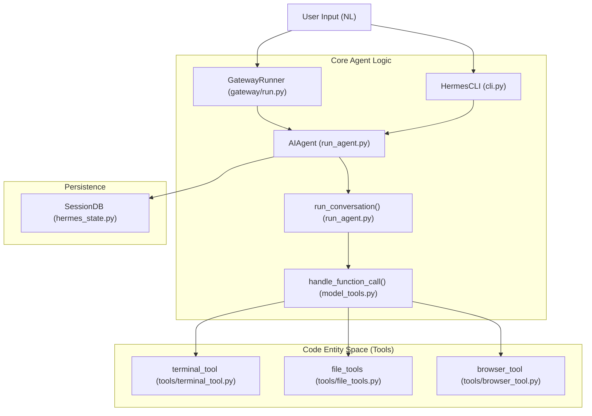
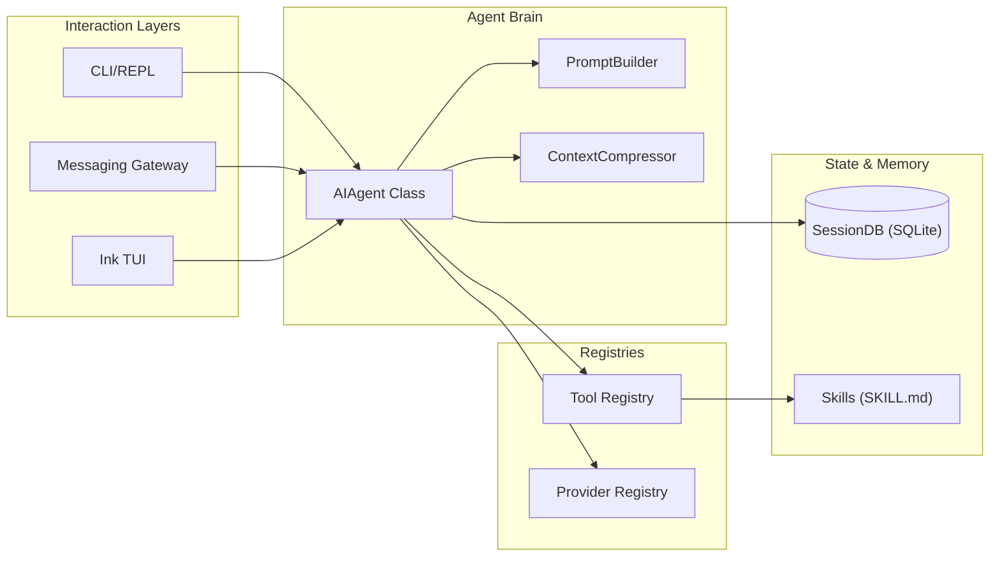

# Hermes Agent — Project Overview

Relevant source files

The following files were used as context for generating this wiki page:

- [.env.example](../.env.example)
- [AGENTS.md](../AGENTS.md)
- [CONTRIBUTING.md](../CONTRIBUTING.md)
- [README.md](../README.md)
- [README.ur-pk.md](../README.ur-pk.md)
- [README.zh-CN.md](../README.zh-CN.md)
- [agent/i18n.py](../agent/i18n.py)
- [cli-config.yaml.example](../cli-config.yaml.example)
- [cli.py](../cli.py)
- [gateway/config.py](../gateway/config.py)
- [gateway/platforms/base.py](../gateway/platforms/base.py)
- [gateway/run.py](../gateway/run.py)
- [gateway/session.py](../gateway/session.py)
- [hermes_cli/__init__.py](../hermes_cli/__init__.py)
- [hermes_cli/commands.py](../hermes_cli/commands.py)
- [hermes_cli/config.py](../hermes_cli/config.py)
- [hermes_constants.py](../hermes_constants.py)
- [hermes_state.py](../hermes_state.py)
- [optional-mcps/unreal-engine/manifest.yaml](../optional-mcps/unreal-engine/manifest.yaml)
- [plugins/observability/nemo_relay/README.md](../plugins/observability/nemo_relay/README.md)
- [plugins/observability/nemo_relay/__init__.py](../plugins/observability/nemo_relay/__init__.py)
- [pyproject.toml](../pyproject.toml)
- [run_agent.py](../run_agent.py)
- [scripts/contributor_audit.py](../scripts/contributor_audit.py)
- [scripts/release.py](../scripts/release.py)
- [tests/agent/test_i18n.py](../tests/agent/test_i18n.py)
- [tests/gateway/test_config.py](../tests/gateway/test_config.py)
- [tests/gateway/test_platform_base.py](../tests/gateway/test_platform_base.py)
- [tests/gateway/test_session.py](../tests/gateway/test_session.py)
- [tests/gateway/test_session_reset_notify.py](../tests/gateway/test_session_reset_notify.py)
- [tests/gateway/test_shared_group_sender_prefix.py](../tests/gateway/test_shared_group_sender_prefix.py)
- [tests/gateway/test_tts_media_routing.py](../tests/gateway/test_tts_media_routing.py)
- [tests/hermes_cli/test_commands.py](../tests/hermes_cli/test_commands.py)
- [tests/hermes_cli/test_ensure_utf8_locale.py](../tests/hermes_cli/test_ensure_utf8_locale.py)
- [tests/hermes_cli/test_windows_native_docs.py](../tests/hermes_cli/test_windows_native_docs.py)
- [tests/plugins/test_nemo_relay_plugin.py](../tests/plugins/test_nemo_relay_plugin.py)
- [tests/test_hermes_constants.py](../tests/test_hermes_constants.py)
- [tests/test_hermes_state.py](../tests/test_hermes_state.py)
- [tests/test_packaging_metadata.py](../tests/test_packaging_metadata.py)
- [tests/test_project_metadata.py](../tests/test_project_metadata.py)
- [tests/tools/test_lazy_deps.py](../tests/tools/test_lazy_deps.py)
- [tools/lazy_deps.py](../tools/lazy_deps.py)
- [uv.lock](../uv.lock)
- [website/docs/developer-guide/contributing.md](../website/docs/developer-guide/contributing.md)
- [website/docs/developer-guide/creating-skills.md](../website/docs/developer-guide/creating-skills.md)
- [website/docs/getting-started/installation.md](../website/docs/getting-started/installation.md)
- [website/docs/getting-started/quickstart.md](../website/docs/getting-started/quickstart.md)
- [website/docs/getting-started/updating.md](../website/docs/getting-started/updating.md)
- [website/docs/integrations/providers.md](../website/docs/integrations/providers.md)
- [website/docs/reference/cli-commands.md](../website/docs/reference/cli-commands.md)
- [website/docs/reference/environment-variables.md](../website/docs/reference/environment-variables.md)
- [website/docs/reference/slash-commands.md](../website/docs/reference/slash-commands.md)
- [website/docs/user-guide/cli.md](../website/docs/user-guide/cli.md)
- [website/docs/user-guide/configuration.md](../website/docs/user-guide/configuration.md)
- [website/docs/user-guide/features/fallback-providers.md](../website/docs/user-guide/features/fallback-providers.md)
- [website/docs/user-guide/features/skills.md](../website/docs/user-guide/features/skills.md)
- [website/docs/user-guide/messaging/index.md](../website/docs/user-guide/messaging/index.md)
- [website/docs/user-guide/security.md](../website/docs/user-guide/security.md)
- [website/docs/user-guide/windows-native.md](../website/docs/user-guide/windows-native.md)
- [website/i18n/zh-Hans/docusaurus-plugin-content-docs/current/developer-guide/contributing.md](../website/i18n/zh-Hans/docusaurus-plugin-content-docs/current/developer-guide/contributing.md)
- [website/i18n/zh-Hans/docusaurus-plugin-content-docs/current/getting-started/installation.md](../website/i18n/zh-Hans/docusaurus-plugin-content-docs/current/getting-started/installation.md)
- [website/i18n/zh-Hans/docusaurus-plugin-content-docs/current/user-guide/windows-native.md](../website/i18n/zh-Hans/docusaurus-plugin-content-docs/current/user-guide/windows-native.md)

Hermes Agent is a self-improving AI agent designed to operate across diverse environments, from local terminal interfaces to multi-platform messaging gateways. It features a sophisticated tool-calling loop, autonomous skill creation, and robust session persistence.

The project philosophy emphasizes a "Narrow Waist" design where a core agent logic connects flexible frontends (CLI, TUI, Gateway, Desktop) to a vast array of tools and model providers [CONTRIBUTING.md:1-20](../CONTRIBUTING.md#L1-L20).

## Key Capabilities

*   **Autonomous Skill Creation:** Hermes creates "skills" from experience, refining them through use to build a procedural memory [website/docs/user-guide/features/skills.md:1-15](../website/docs/user-guide/features/skills.md#L1-L15).
*   **Multi-Platform Gateway:** A single instance can serve users across Telegram, Discord, Slack, WhatsApp, and more via a unified messaging bridge [gateway/run.py:1-14](../gateway/run.py#L1-L14).
*   **Robust Execution:** Supports local, Docker, SSH, and Modal backends for code execution and terminal tasks [website/docs/user-guide/configuration.md:116-128](../website/docs/user-guide/configuration.md#L116-L128).
*   **Context Management:** Features automatic conversation compression and SQLite-backed session persistence with FTS5 search [hermes_state.py:1-15](../hermes_state.py#L1-L15).

## System Architecture

The following diagram illustrates how high-level natural language requests are processed through the core code entities into actionable tool executions.

### Natural Language to Code Entity Mapping

**Sources:** [gateway/run.py:1-14](../gateway/run.py#L1-L14), [run_agent.py:17-21](../run_agent.py#L17-L21), [cli.py:1-13](../cli.py#L1-L13), [hermes_state.py:1-15](../hermes_state.py#L1-L15), [model_tools.py:136-141](../model_tools.py#L136-L141).

## Subsystem Relationships

Hermes is composed of several major subsystems that interact to provide a seamless agentic experience.

### Component Interaction Diagram

**Sources:** [run_agent.py:147-185](../run_agent.py#L147-L185), [hermes_cli/config.py:1-15](../hermes_cli/config.py#L1-L15), [gateway/run.py:5-7](../gateway/run.py#L5-L7), [hermes_state.py:3-15](../hermes_state.py#L3-L15).

## Major Subsystems

### 1. Core Agent Logic
The `AIAgent` class in `run_agent.py` is the central orchestrator. it manages the `run_conversation` loop, which iteratively calls LLMs and executes tools until a task is complete [run_agent.py:17-21](../run_agent.py#L17-L21).

### 2. Messaging Gateway
The `GatewayRunner` in `gateway/run.py` allows Hermes to act as a bot on platforms like Telegram and Discord. It manages `SessionSource` objects to track context across different chats [gateway/run.py:5-7](../gateway/run.py#L5-L7), [gateway/session.py:148-157](../gateway/session.py#L148-L157).

### 3. Tool & Environment System
Tools are defined in `model_tools.py` and dispatched via `handle_function_call`. The `terminal_tool` provides a `BaseEnvironment` interface allowing commands to run locally or in sandboxes like Docker [model_tools.py:136-141](../model_tools.py#L136-L141), [website/docs/user-guide/configuration.md:116-128](../website/docs/user-guide/configuration.md#L116-L128).

### 4. Persistence & State
All conversation history and metadata are stored in a SQLite database (`hermes_state.py`) using WAL mode for concurrency and FTS5 for searching history [hermes_state.py:3-15](../hermes_state.py#L3-L15).

## Further Exploration

- **[Getting Started & Installation](#1.1)**: Setup instructions for various environments and the initial configuration wizard.
- **[Configuration Reference](#1.2)**: Detailed guide to `config.yaml`, `.env`, and environment variable precedence.
- **[Profiles & Multi-Instance Isolation](#1.3)**: Managing multiple agent identities and isolated home directories using `HERMES_HOME`.

**Sources:** [scripts/release.py:33-35](../scripts/release.py#L33-L35), [pyproject.toml:3-15](../pyproject.toml#L3-L15), [hermes_cli/config.py:1-15](../hermes_cli/config.py#L1-L15), [website/docs/user-guide/configuration.md:1-28](../website/docs/user-guide/configuration.md#L1-L28).

---
