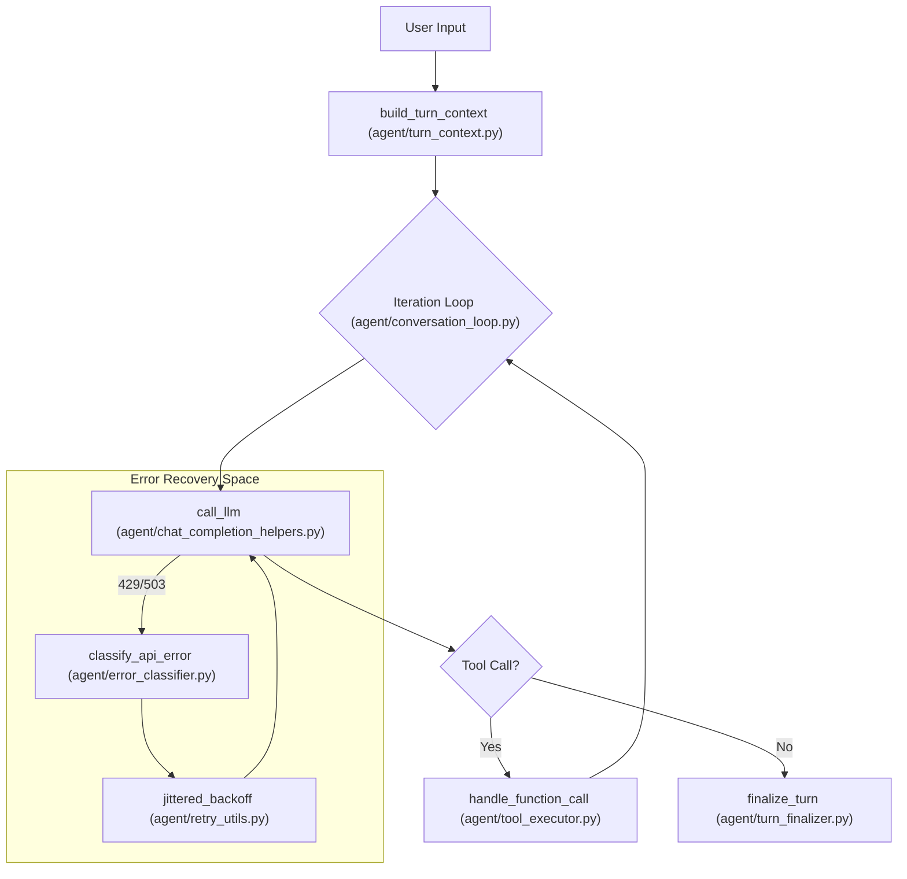
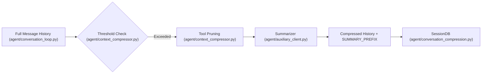

# Conversation Loop & Turn Lifecycle

Relevant source files

The following files were used as context for generating this wiki page:

- [agent/agent_init.py](../agent/agent_init.py)
- [agent/agent_runtime_helpers.py](../agent/agent_runtime_helpers.py)
- [agent/background_review.py](../agent/background_review.py)
- [agent/chat_completion_helpers.py](../agent/chat_completion_helpers.py)
- [agent/codex_responses_adapter.py](../agent/codex_responses_adapter.py)
- [agent/context_compressor.py](../agent/context_compressor.py)
- [agent/context_engine.py](../agent/context_engine.py)
- [agent/conversation_compression.py](../agent/conversation_compression.py)
- [agent/conversation_loop.py](../agent/conversation_loop.py)
- [agent/error_classifier.py](../agent/error_classifier.py)
- [agent/tool_executor.py](../agent/tool_executor.py)
- [agent/transports/codex.py](../agent/transports/codex.py)
- [agent/turn_context.py](../agent/turn_context.py)
- [agent/turn_finalizer.py](../agent/turn_finalizer.py)
- contributors/emails/ben@whetstone.com.au
- contributors/emails/chaosxinglong@gmail.com
- contributors/emails/lanyusea@gmail.com
- contributors/emails/miniadmin@skshim-mini.local
- contributors/emails/stanislav@local
- [tests/agent/test_cjk_token_estimation.py](../tests/agent/test_cjk_token_estimation.py)
- [tests/agent/test_codex_responses_adapter.py](../tests/agent/test_codex_responses_adapter.py)
- [tests/agent/test_compression_anti_thrash_persistence.py](../tests/agent/test_compression_anti_thrash_persistence.py)
- [tests/agent/test_compression_concurrent_fork.py](../tests/agent/test_compression_concurrent_fork.py)
- [tests/agent/test_compression_rotation_state.py](../tests/agent/test_compression_rotation_state.py)
- [tests/agent/test_compressor_tool_call_budget.py](../tests/agent/test_compressor_tool_call_budget.py)
- [tests/agent/test_context_compressor.py](../tests/agent/test_context_compressor.py)
- [tests/agent/test_context_compressor_summary_continuity.py](../tests/agent/test_context_compressor_summary_continuity.py)
- [tests/agent/test_context_engine_on_turn_complete_usage.py](../tests/agent/test_context_engine_on_turn_complete_usage.py)
- [tests/agent/test_context_engine_select_context.py](../tests/agent/test_context_engine_select_context.py)
- [tests/agent/test_credential_pool_routing.py](../tests/agent/test_credential_pool_routing.py)
- [tests/agent/test_error_classifier.py](../tests/agent/test_error_classifier.py)
- [tests/agent/test_idle_compaction_lock_and_guards.py](../tests/agent/test_idle_compaction_lock_and_guards.py)
- [tests/agent/test_turn_context.py](../tests/agent/test_turn_context.py)
- [tests/agent/test_turn_context_overflow_warning.py](../tests/agent/test_turn_context_overflow_warning.py)
- [tests/agent/test_turn_finalizer_cleanup_guard.py](../tests/agent/test_turn_finalizer_cleanup_guard.py)
- [tests/agent/test_turn_finalizer_final_response_persistence.py](../tests/agent/test_turn_finalizer_final_response_persistence.py)
- [tests/agent/test_turn_finalizer_iteration_limit_exit.py](../tests/agent/test_turn_finalizer_iteration_limit_exit.py)
- [tests/agent/transports/test_codex_transport.py](../tests/agent/transports/test_codex_transport.py)
- [tests/cli/test_cli_interrupt_ack_race.py](../tests/cli/test_cli_interrupt_ack_race.py)
- [tests/cli/test_cli_shutdown_memory_messages.py](../tests/cli/test_cli_shutdown_memory_messages.py)
- [tests/gateway/test_telegram_noise_filter.py](../tests/gateway/test_telegram_noise_filter.py)
- [tests/run_agent/test_18028_content_policy_blocked.py](../tests/run_agent/test_18028_content_policy_blocked.py)
- [tests/run_agent/test_413_compression.py](../tests/run_agent/test_413_compression.py)
- [tests/run_agent/test_background_review.py](../tests/run_agent/test_background_review.py)
- [tests/run_agent/test_background_review_cache_parity.py](../tests/run_agent/test_background_review_cache_parity.py)
- [tests/run_agent/test_background_review_cost_controls.py](../tests/run_agent/test_background_review_cost_controls.py)
- [tests/run_agent/test_background_review_toolset_restriction.py](../tests/run_agent/test_background_review_toolset_restriction.py)
- [tests/run_agent/test_codex_xai_oauth_recovery.py](../tests/run_agent/test_codex_xai_oauth_recovery.py)
- [tests/run_agent/test_compression_feasibility.py](../tests/run_agent/test_compression_feasibility.py)
- [tests/run_agent/test_credential_pool_interrupt.py](../tests/run_agent/test_credential_pool_interrupt.py)
- [tests/run_agent/test_per_model_compression_threshold.py](../tests/run_agent/test_per_model_compression_threshold.py)
- [tests/run_agent/test_per_model_threshold_init_ordering.py](../tests/run_agent/test_per_model_threshold_init_ordering.py)
- [tests/run_agent/test_primary_runtime_restore.py](../tests/run_agent/test_primary_runtime_restore.py)
- [tests/run_agent/test_run_agent.py](../tests/run_agent/test_run_agent.py)
- [tests/run_agent/test_run_agent_codex_responses.py](../tests/run_agent/test_run_agent_codex_responses.py)
- [tests/run_agent/test_switch_model_pool_reload_52727.py](../tests/run_agent/test_switch_model_pool_reload_52727.py)
- [tests/run_agent/test_verification_continuation_budget.py](../tests/run_agent/test_verification_continuation_budget.py)
- [tests/test_hermes_state_compression_locks.py](../tests/test_hermes_state_compression_locks.py)
- [tests/tools/test_daemon_pool.py](../tests/tools/test_daemon_pool.py)
- [tools/daemon_pool.py](../tools/daemon_pool.py)
- [website/docs/developer-guide/context-engine-plugin.md](../website/docs/developer-guide/context-engine-plugin.md)

The conversation loop is the central execution engine of the Hermes Agent. It orchestrates the transition from a user's natural language input to a sequence of model-driven tool executions, culminating in a final response. This lifecycle is managed primarily by `run_conversation`, which handles iterative reasoning, error recovery, and context management.

## The Core Loop: `run_conversation`

The `run_conversation` function (implemented in `agent/conversation_loop.py`) drives a single user turn through the agent. It is an iterative process where the model can call tools multiple times before providing a final answer.

### High-Level Lifecycle Phases
1.  **Prologue (Turn Context Building):** Assembly of the system prompt, user message sanitization, and preflight checks.
2.  **Iterative Execution Loop:** The model generates a response; if it contains tool calls, they are dispatched, and the results are fed back for the next iteration.
3.  **Epilogue (Finalization):** Post-turn hooks, resource cleanup, and persistence of the final state.

### Implementation Flow
The loop uses an `IterationBudget` to prevent infinite loops and manage execution depth [agent/conversation_loop.py:43](../agent/conversation_loop.py#L43). It tracks state via a `TurnRetryState` to handle transient API failures without losing the progress of the current turn [agent/conversation_loop.py:50](../agent/conversation_loop.py#L50).

**Turn Lifecycle and Entity Mapping**

Sources: [agent/conversation_loop.py:1-60](../agent/conversation_loop.py#L1-L60), [agent/turn_context.py:1-20](../agent/turn_context.py#L1-L20), [agent/error_classifier.py:1-10](../agent/error_classifier.py#L1-L10)

## Turn Context & Prologue

Before the model is invoked, the agent builds a "Turn Context." This involves aggregating various memory tiers and applying sanitization.

*   **System Prompt Assembly:** The `ContextEngine` builds the multi-tiered system prompt [agent/context_engine.py](../agent/context_engine.py).
*   **User Message Composition:** `compose_user_api_content` appends ephemeral context (like memory prefetch or plugin data) to the API-bound version of the user message while keeping the stored version "clean" [agent/turn_context.py:51-83](../agent/turn_context.py#L51-L83).
*   **Prompt Caching:** The agent uses an `api_content` sidecar to store the exact bytes sent to the provider, ensuring that subsequent turns can benefit from prefix caching [agent/turn_context.py:86-106](../agent/turn_context.py#L86-L106).

Sources: [agent/turn_context.py:51-106](../agent/turn_context.py#L51-L106), [agent/context_engine.py:29-30](../agent/context_engine.py#L29-L30)

## Iterative Tool Execution

Hermes supports parallel tool execution and handles complex multi-step reasoning.

### Parallel Tool Dispatch
When the model returns multiple tool calls in a single turn, the agent processes them. If the backend environment supports it, tools can be executed in parallel. The results are collected and formatted into `tool` role messages for the next LLM iteration.

### Scaffolding & Ephemeral Context
During the loop, the agent may inject "scaffolding" or "nudges" (e.g., reminding the model of a pending task) if it detects the model is drifting. This is managed by the `BackgroundReview` system [agent/background_review.py](../agent/background_review.py).

Sources: [agent/conversation_loop.py:15-40](../agent/conversation_loop.py#L15-L40), [agent/agent_runtime_helpers.py:61-75](../agent/agent_runtime_helpers.py#L61-L75)

## Context Compression & Compaction

To handle long-running conversations that exceed the model's context window, Hermes employs an automatic `ContextCompressor`.

### The Compaction Trigger
The agent monitors token usage. If the `last_prompt_tokens` exceeds a `threshold_percent` (default 85%), a compaction is triggered [agent/context_compressor.py:84-95](../agent/context_compressor.py#L84-L95).

### The Summarization Loop
1.  **Pruning:** Large tool outputs are pruned or summarized using a cheap pre-pass [agent/context_compressor.py:14-17](../agent/context_compressor.py#L14-L17).
2.  **Auxiliary Model:** An auxiliary (cheaper/faster) model summarizes middle turns while protecting the "head" (system prompt/early context) and "tail" (recent messages) [agent/context_compressor.py:3-6](../agent/context_compressor.py#L3-L6).
3.  **Historical Headings:** The summary is wrapped in specific headings like `## Historical Task Snapshot` to signal to the model that these are background references, not active instructions [agent/context_compressor.py:92-127](../agent/context_compressor.py#L92-L127).

**Context Compaction Data Flow**

Sources: [agent/context_compressor.py:1-40](../agent/context_compressor.py#L1-L40), [agent/conversation_compression.py:15-27](../agent/conversation_compression.py#L15-L27)

## Error Recovery & Failover

The agent features a robust `classify_api_error` system to handle various failure modes [agent/error_classifier.py:24-73](../agent/error_classifier.py#L24-L73).

| Error Code | Failover Reason | Recovery Action |
| :--- | :--- | :--- |
| **413** | `payload_too_large` | Immediate context compression and retry [agent/error_classifier.py:52](../agent/error_classifier.py#L52). |
| **429** | `rate_limit` | Jittered backoff; if exhausted, rotate credential via `CredentialPool` [agent/error_classifier.py:33](../agent/error_classifier.py#L33). |
| **400** | `format_error` | Attempt to repair tool arguments or strip problematic content [agent/error_classifier.py:61](../agent/error_classifier.py#L61). |
| **503/529**| `overloaded` | Backoff and retry the same provider [agent/error_classifier.py:39](../agent/error_classifier.py#L39). |

### Parallel Failover Logic
If a primary provider fails repeatedly, the agent can trigger a `fallback` to a secondary provider or model defined in the `ProviderProfile` [agent/chat_completion_helpers.py:48-57](../agent/chat_completion_helpers.py#L48-L57).

Sources: [agent/error_classifier.py:24-124](../agent/error_classifier.py#L24-L124), [agent/chat_completion_helpers.py:48-57](../agent/chat_completion_helpers.py#L48-L57), [agent/conversation_loop.py:75-82](../agent/conversation_loop.py#L75-L82)

---
