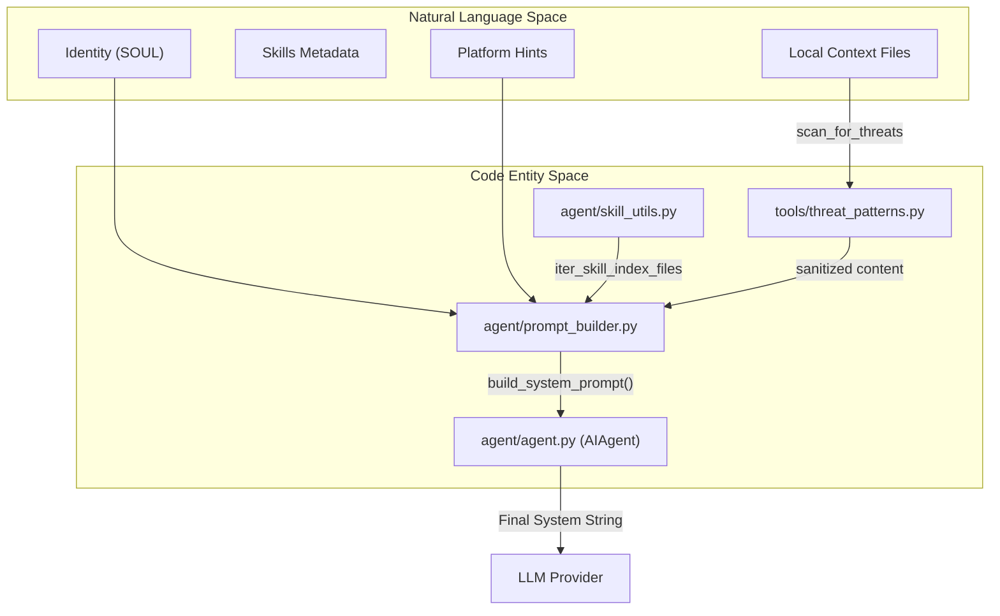
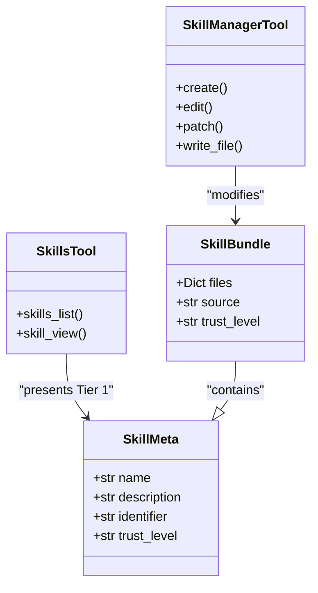

# System Prompt Assembly & Skills

Relevant source files

The following files were used as context for generating this wiki page:

- [agent/prompt_builder.py](../agent/prompt_builder.py)
- [agent/runtime_cwd.py](../agent/runtime_cwd.py)
- [agent/skill_commands.py](../agent/skill_commands.py)
- [agent/skill_utils.py](../agent/skill_utils.py)
- [agent/system_prompt.py](../agent/system_prompt.py)
- [hermes_cli/skills_config.py](../hermes_cli/skills_config.py)
- [hermes_cli/skills_hub.py](../hermes_cli/skills_hub.py)
- [optional-skills/mlops/models/segment-anything/SKILL.md](../optional-skills/mlops/models/segment-anything/SKILL.md)
- [optional-skills/mlops/models/segment-anything/references/advanced-usage.md](../optional-skills/mlops/models/segment-anything/references/advanced-usage.md)
- [optional-skills/mlops/models/segment-anything/references/troubleshooting.md](../optional-skills/mlops/models/segment-anything/references/troubleshooting.md)
- [optional-skills/yuanbao/SKILL.md](../optional-skills/yuanbao/SKILL.md)
- [scripts/build_skills_index.py](../scripts/build_skills_index.py)
- [skills/autonomous-ai-agents/computer-use/SKILL.md](../skills/autonomous-ai-agents/computer-use/SKILL.md)
- [skills/software-development/simplify-code/SKILL.md](../skills/software-development/simplify-code/SKILL.md)
- [tests/agent/test_prompt_builder.py](../tests/agent/test_prompt_builder.py)
- [tests/agent/test_runtime_cwd.py](../tests/agent/test_runtime_cwd.py)
- [tests/agent/test_skill_commands.py](../tests/agent/test_skill_commands.py)
- [tests/agent/test_skill_utils.py](../tests/agent/test_skill_utils.py)
- [tests/agent/test_system_prompt.py](../tests/agent/test_system_prompt.py)
- [tests/gateway/test_reasoning_command.py](../tests/gateway/test_reasoning_command.py)
- [tests/gateway/test_session_model_override_routing.py](../tests/gateway/test_session_model_override_routing.py)
- [tests/gateway/test_session_model_reset.py](../tests/gateway/test_session_model_reset.py)
- [tests/hermes_cli/test_skills_config.py](../tests/hermes_cli/test_skills_config.py)
- [tests/hermes_cli/test_skills_hub.py](../tests/hermes_cli/test_skills_hub.py)
- [tests/scripts/test_build_skills_index_health.py](../tests/scripts/test_build_skills_index_health.py)
- [tests/tools/test_force_dangerous_override.py](../tests/tools/test_force_dangerous_override.py)
- [tests/tools/test_skill_manager_tool.py](../tests/tools/test_skill_manager_tool.py)
- [tests/tools/test_skills_guard.py](../tests/tools/test_skills_guard.py)
- [tests/tools/test_skills_hub.py](../tests/tools/test_skills_hub.py)
- [tests/tools/test_skills_hub_clawhub.py](../tests/tools/test_skills_hub_clawhub.py)
- [tests/tools/test_skills_sync.py](../tests/tools/test_skills_sync.py)
- [tests/tools/test_skills_tool.py](../tests/tools/test_skills_tool.py)
- [tests/website/__init__.py](../tests/website/__init__.py)
- [tests/website/test_extract_skills.py](../tests/website/test_extract_skills.py)
- [tests/website/test_generate_skill_docs.py](../tests/website/test_generate_skill_docs.py)
- [tools/project_tools.py](../tools/project_tools.py)
- [tools/skill_manager_tool.py](../tools/skill_manager_tool.py)
- [tools/skills_guard.py](../tools/skills_guard.py)
- [tools/skills_hub.py](../tools/skills_hub.py)
- [tools/skills_sync.py](../tools/skills_sync.py)
- [tools/skills_tool.py](../tools/skills_tool.py)
- [website/docs/reference/optional-skills-catalog.md](../website/docs/reference/optional-skills-catalog.md)
- [website/docs/reference/skills-catalog.md](../website/docs/reference/skills-catalog.md)
- [website/docs/user-guide/features/computer-use.md](../website/docs/user-guide/features/computer-use.md)
- [website/docs/user-guide/skills/bundled/autonomous-ai-agents/autonomous-ai-agents-computer-use.md](../website/docs/user-guide/skills/bundled/autonomous-ai-agents/autonomous-ai-agents-computer-use.md)
- [website/docs/user-guide/skills/bundled/software-development/software-development-simplify-code.md](../website/docs/user-guide/skills/bundled/software-development/software-development-simplify-code.md)
- [website/docs/user-guide/skills/optional/mlops/mlops-models-segment-anything.md](../website/docs/user-guide/skills/optional/mlops/mlops-models-segment-anything.md)
- [website/docs/user-guide/skills/optional/yuanbao/yuanbao-yuanbao.md](../website/docs/user-guide/skills/optional/yuanbao/yuanbao-yuanbao.md)
- [website/i18n/zh-Hans/docusaurus-plugin-content-docs/current/reference/optional-skills-catalog.md](../website/i18n/zh-Hans/docusaurus-plugin-content-docs/current/reference/optional-skills-catalog.md)
- [website/i18n/zh-Hans/docusaurus-plugin-content-docs/current/reference/skills-catalog.md](../website/i18n/zh-Hans/docusaurus-plugin-content-docs/current/reference/skills-catalog.md)
- [website/i18n/zh-Hans/docusaurus-plugin-content-docs/current/user-guide/features/skills.md](../website/i18n/zh-Hans/docusaurus-plugin-content-docs/current/user-guide/features/skills.md)
- [website/i18n/zh-Hans/docusaurus-plugin-content-docs/current/user-guide/skills/optional/mlops/mlops-models-segment-anything.md](../website/i18n/zh-Hans/docusaurus-plugin-content-docs/current/user-guide/skills/optional/mlops/mlops-models-segment-anything.md)
- [website/i18n/zh-Hans/docusaurus-plugin-content-docs/current/user-guide/skills/optional/yuanbao/yuanbao-yuanbao.md](../website/i18n/zh-Hans/docusaurus-plugin-content-docs/current/user-guide/skills/optional/yuanbao/yuanbao-yuanbao.md)
- [website/scripts/extract-skills.py](../website/scripts/extract-skills.py)
- [website/scripts/generate-skill-docs.py](../website/scripts/generate-skill-docs.py)
- [website/scripts/prebuild.mjs](../website/scripts/prebuild.mjs)
- [website/sidebars.ts](../website/sidebars.ts)
- [website/src/pages/skills/index.tsx](../website/src/pages/skills/index.tsx)
- [website/src/pages/skills/styles.module.css](../website/src/pages/skills/styles.module.css)

The Hermes Agent utilizes a multi-tiered system prompt assembly process that combines static identity, environmental context, and dynamic procedural memory (Skills). This system ensures the agent remains grounded in its core persona while adapting its capabilities to the specific task, platform, and user preferences at hand.

## System Prompt Assembly

The system prompt is not a single static file but a dynamically assembled string generated at the start of each conversation turn. The `AIAgent` class orchestrates this assembly by calling stateless functions within `agent/prompt_builder.py` [agent/prompt_builder.py:3-5](../agent/prompt_builder.py#L3-L5).

### The Assembly Hierarchy

The prompt is built using a "tiered" approach, moving from general identity to session-specific context:

1.  **Identity & Base Guidance**: The core persona defined in `DEFAULT_AGENT_IDENTITY` [agent/prompt_builder.py:139-147](../agent/prompt_builder.py#L139-L147) and `HERMES_AGENT_HELP_GUIDANCE` [agent/prompt_builder.py:149-158](../agent/prompt_builder.py#L149-L158).
2.  **Platform & Environment Hints**: Injected based on the detected OS (macOS, Linux, Windows/WSL) [agent/prompt_builder.py:34-36](../agent/prompt_builder.py#L34-L36).
3.  **Skills Index**: A compact list of available procedural memories (Tier 1 of progressive disclosure) [agent/prompt_builder.py:18-32](../agent/prompt_builder.py#L18-L32).
4.  **Context Files**: Content from `SOUL.md`, `AGENTS.md`, or `.hermes.md` discovered in the current working directory or git root [agent/prompt_builder.py:93-114](../agent/prompt_builder.py#L93-L114).
5.  **Memory**: Durable facts retrieved from the `MemoryManager` (e.g., user preferences) [agent/prompt_builder.py:160-170](../agent/prompt_builder.py#L160-L170).

### Prompt Assembly Data Flow

The following diagram illustrates how various code entities contribute to the final system prompt.

**Diagram: System Prompt Construction Pipeline**

Sources: [agent/prompt_builder.py:1-45](../agent/prompt_builder.py#L1-L45), [agent/skill_utils.py:20-32](../agent/skill_utils.py#L20-L32), [tools/threat_patterns.py:47-50](../tools/threat_patterns.py#L47-L50)

## The Skills System (Procedural Memory)

Skills are the "procedural memory" of Hermes. Unlike declarative memory (facts), skills define *how* to perform specific tasks. They are stored as directories containing a `SKILL.md` file and optional supporting assets [tools/skills_tool.py:14-26](../tools/skills_tool.py#L14-L26).

### Progressive Disclosure Architecture

To conserve the context window, Hermes uses a three-tier progressive disclosure model inspired by Anthropic's design [tools/skills_tool.py:9-13](../tools/skills_tool.py#L9-L13):

| Tier | Component | Content | Delivery Method |
| :--- | :--- | :--- | :--- |
| **1** | **Index** | Name (≤64 chars) and Description (≤1024 chars) | Injected into System Prompt |
| **2** | **Full Skill** | Complete instructions in `SKILL.md` | Loaded via `skill_view(name)` |
| **3** | **Assets** | Supporting references, templates, or scripts | Loaded via `skill_view(name, path)` |

Sources: [tools/skills_tool.py:52-67](../tools/skills_tool.py#L52-L67), [tools/skills_tool.py:161-163](../tools/skills_tool.py#L161-L163)

### Skill Lifecycle and Management

The `SkillManagerTool` allows the agent to autonomously evolve its own capabilities by creating or patching skills [tools/skill_manager_tool.py:14-21](../tools/skill_manager_tool.py#L14-L21).

1.  **Discovery**: `skills_list` scans `~/.hermes/skills/` and external directories [tools/skills_tool.py:139-143](../tools/skills_tool.py#L139-L143).
2.  **Creation**: `create` action generates a new directory with a `SKILL.md` featuring YAML frontmatter [tools/skill_manager_tool.py:15-16](../tools/skill_manager_tool.py#L15-L16).
3.  **Refinement**: `patch` and `edit` actions allow the agent to update procedural steps based on feedback [tools/skill_manager_tool.py:17-18](../tools/skill_manager_tool.py#L17-L18).
4.  **Distribution**: Skills can be installed from the "Skills Hub" (GitHub or official registries) using `tools/skills_hub.py` [tools/skills_hub.py:1-14](../tools/skills_hub.py#L1-L14).

**Diagram: Skill Entity Relationship**

Sources: [tools/skills_hub.py:130-153](../tools/skills_hub.py#L130-L153), [tools/skill_manager_tool.py:14-33](../tools/skill_manager_tool.py#L14-L33), [tools/skills_tool.py:52-57](../tools/skills_tool.py#L52-L57)

## Security Scanning & Guardrails

To prevent prompt injection and malicious tool usage via third-party skills, Hermes employs a multi-layered scanning system.

### Context Scanning
Before any local file (like `AGENTS.md`) is injected into the system prompt, it is passed through `_scan_context_content` [agent/prompt_builder.py:50-74](../agent/prompt_builder.py#L50-L74). This function uses `tools/threat_patterns.py` to detect:
*   Role-play hijacking.
*   Instruction overrides ("ignore previous instructions").
*   Hidden HTML/Unicode artifacts [tests/agent/test_prompt_builder.py:63-114](../tests/agent/test_prompt_builder.py#L63-L114).

### Skills Guard
The `SkillsGuard` performs static analysis on externally sourced skills [tools/skills_guard.py:3-9](../tools/skills_guard.py#L3-L9). It assigns a trust level and enforces an `INSTALL_POLICY`:

*   **Builtin**: Always allowed [tools/skills_guard.py:57](../tools/skills_guard.py#L57).
*   **Trusted**: (e.g., OpenAI/Anthropic repos) Allowed unless "dangerous" patterns are found [tools/skills_guard.py:58](../tools/skills_guard.py#L58).
*   **Community**: Blocked if any "caution" or "dangerous" patterns are detected [tools/skills_guard.py:59](../tools/skills_guard.py#L59).

### Threat Patterns
The scanner looks for critical patterns such as:
*   **Exfiltration**: `curl` or `httpx` calls interpolating environment variables like `API_KEY` [tools/skills_guard.py:103-118](../tools/skills_guard.py#L103-L118).
*   **Persistence**: Unauthorized modifications to `.bashrc` or `systemd` [tools/skills_guard.py:98-101](../tools/skills_guard.py#L98-L101).
*   **Credential Access**: Reading from `~/.ssh` or `~/.aws` [tools/skills_guard.py:123-137](../tools/skills_guard.py#L123-L137).

Sources: [tools/skills_guard.py:44-65](../tools/skills_guard.py#L44-L65), [agent/prompt_builder.py:47-60](../agent/prompt_builder.py#L47-L60), [tests/agent/test_prompt_builder.py:63-125](../tests/agent/test_prompt_builder.py#L63-L125)

---
