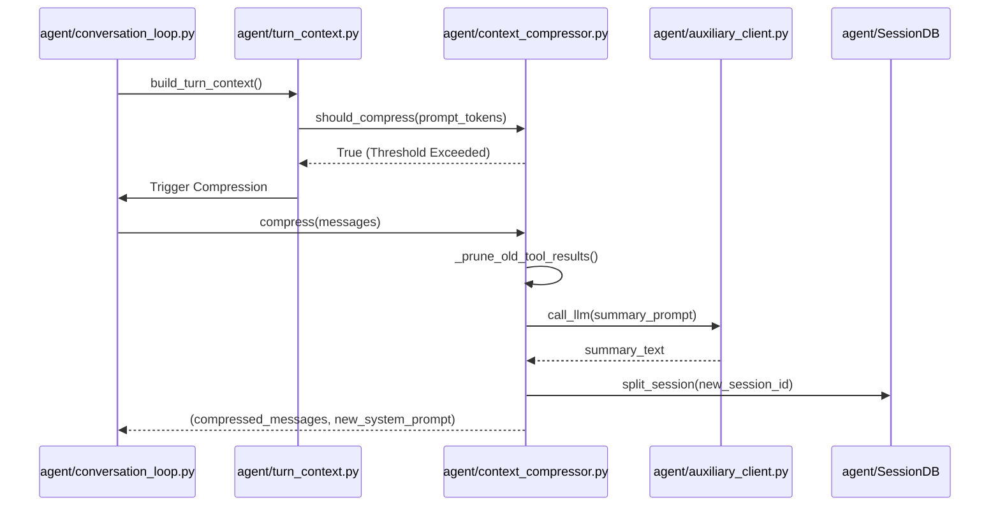
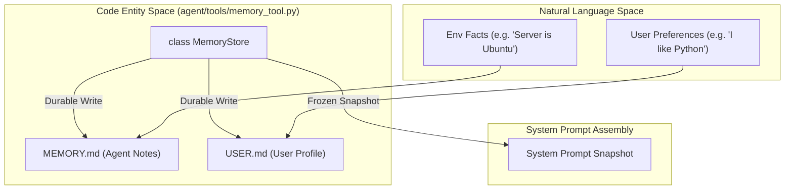

# Context Compression & Memory Management

Relevant source files

The following files were used as context for generating this wiki page:

- [agent/agent_init.py](../agent/agent_init.py)
- [agent/agent_runtime_helpers.py](../agent/agent_runtime_helpers.py)
- [agent/chat_completion_helpers.py](../agent/chat_completion_helpers.py)
- [agent/context_compressor.py](../agent/context_compressor.py)
- [agent/conversation_compression.py](../agent/conversation_compression.py)
- [agent/conversation_loop.py](../agent/conversation_loop.py)
- [agent/manual_compression_feedback.py](../agent/manual_compression_feedback.py)
- [agent/tool_executor.py](../agent/tool_executor.py)
- [agent/turn_context.py](../agent/turn_context.py)
- contributors/emails/lanyusea@gmail.com
- contributors/emails/stanislav@local
- [gateway/slash_commands.py](../gateway/slash_commands.py)
- [hermes_cli/browser_connect.py](../hermes_cli/browser_connect.py)
- [hermes_cli/cli_commands_mixin.py](../hermes_cli/cli_commands_mixin.py)
- [hermes_cli/session_listing.py](../hermes_cli/session_listing.py)
- [hermes_cli/write_approval_commands.py](../hermes_cli/write_approval_commands.py)
- [tests/agent/test_compression_anti_thrash_persistence.py](../tests/agent/test_compression_anti_thrash_persistence.py)
- [tests/agent/test_compression_concurrent_fork.py](../tests/agent/test_compression_concurrent_fork.py)
- [tests/agent/test_compression_rotation_state.py](../tests/agent/test_compression_rotation_state.py)
- [tests/agent/test_context_compressor.py](../tests/agent/test_context_compressor.py)
- [tests/agent/test_credential_pool_routing.py](../tests/agent/test_credential_pool_routing.py)
- [tests/agent/test_idle_compaction_lock_and_guards.py](../tests/agent/test_idle_compaction_lock_and_guards.py)
- [tests/agent/test_manual_compression_feedback.py](../tests/agent/test_manual_compression_feedback.py)
- [tests/agent/test_turn_context.py](../tests/agent/test_turn_context.py)
- [tests/agent/test_turn_context_overflow_warning.py](../tests/agent/test_turn_context_overflow_warning.py)
- [tests/cli/test_branch_command.py](../tests/cli/test_branch_command.py)
- [tests/cli/test_cli_browser_connect.py](../tests/cli/test_cli_browser_connect.py)
- [tests/cli/test_cli_interrupt_ack_race.py](../tests/cli/test_cli_interrupt_ack_race.py)
- [tests/cli/test_cli_resume_command.py](../tests/cli/test_cli_resume_command.py)
- [tests/cli/test_cli_shutdown_memory_messages.py](../tests/cli/test_cli_shutdown_memory_messages.py)
- [tests/cli/test_manual_compress.py](../tests/cli/test_manual_compress.py)
- [tests/gateway/test_compress_command.py](../tests/gateway/test_compress_command.py)
- [tests/gateway/test_resume_command.py](../tests/gateway/test_resume_command.py)
- [tests/gateway/test_session_hygiene.py](../tests/gateway/test_session_hygiene.py)
- [tests/gateway/test_telegram_noise_filter.py](../tests/gateway/test_telegram_noise_filter.py)
- [tests/hermes_cli/test_browser_connect_dual_stack.py](../tests/hermes_cli/test_browser_connect_dual_stack.py)
- [tests/hermes_cli/test_session_listing.py](../tests/hermes_cli/test_session_listing.py)
- [tests/run_agent/test_413_compression.py](../tests/run_agent/test_413_compression.py)
- [tests/run_agent/test_compression_feasibility.py](../tests/run_agent/test_compression_feasibility.py)
- [tests/run_agent/test_credential_pool_interrupt.py](../tests/run_agent/test_credential_pool_interrupt.py)
- [tests/run_agent/test_run_agent.py](../tests/run_agent/test_run_agent.py)
- [tests/test_hermes_state_compression_locks.py](../tests/test_hermes_state_compression_locks.py)
- [tests/tools/test_daemon_pool.py](../tests/tools/test_daemon_pool.py)
- [tests/tools/test_memory_tool.py](../tests/tools/test_memory_tool.py)
- [tests/tools/test_memory_tool_schema.py](../tests/tools/test_memory_tool_schema.py)
- [tests/tools/test_write_approval.py](../tests/tools/test_write_approval.py)
- [tests/tui_gateway/test_compress_lock_skip.py](../tests/tui_gateway/test_compress_lock_skip.py)
- [tools/daemon_pool.py](../tools/daemon_pool.py)
- [tools/memory_tool.py](../tools/memory_tool.py)
- [tools/write_approval.py](../tools/write_approval.py)
- [website/docs/user-guide/features/memory.md](../website/docs/user-guide/features/memory.md)

The Hermes Agent implements an automated, multi-tiered memory management system designed to handle long-running conversations that exceed the context window limits of Large Language Models (LLMs). This system combines **Context Compression** (summarizing history) with **Persistent Curated Memory** (stable, long-term facts).

## 1. Automatic Context Compaction

The `ContextCompressor` is the primary engine for managing the active context window. It monitors token usage and proactively summarizes the middle of a conversation while protecting the "head" (initial instructions) and "tail" (most recent turns) [agent/context_compressor.py:1-17](../agent/context_compressor.py#L1-L17).

### The Compression Pipeline
When a session exceeds the `threshold_percent` (default 85% of the model's context window), the compressor is triggered [agent/context_compressor.py:29-36](../agent/context_compressor.py#L29-L36).

1.  **Tool Pruning**: A cheap pre-pass that replaces large tool outputs (like web search results) with concise summaries (e.g., "[web_search] 5 results (2500 chars)") to save tokens before LLM summarization [agent/context_compressor.py:14, 51-80](../agent/context_compressor.py#L14).
2.  **Turn Selection**: The system protects the first `N` messages and the last `N` messages (based on a token budget) [agent/context_compressor.py:30-36](../agent/context_compressor.py#L30-L36).
3.  **Auxiliary Summarization**: An auxiliary (typically cheaper/faster) model is used to generate a structured summary of the middle turns [agent/context_compressor.py:3-5](../agent/context_compressor.py#L3-L5).
4.  **Structure Injection**: The summary is injected into the conversation using specific headings to prevent the model from treating old tasks as active instructions [agent/context_compressor.py:92-96](../agent/context_compressor.py#L92-L96).

### Historical Task Snapshot Structure
The summary is organized into a `HISTORICAL_TASK_SNAPSHOT` to maintain state without confusing the agent's current objectives:

| Heading | Purpose |
| :--- | :--- |
| `## Historical Task Snapshot` | High-level summary of completed work [agent/context_compressor.py:92](../agent/context_compressor.py#L92). |
| `## Historical In-Progress State` | State of tools or files at the time of compaction [agent/context_compressor.py:93](../agent/context_compressor.py#L93). |
| `## Historical Pending User Asks` | Questions the user asked that were already addressed [agent/context_compressor.py:94](../agent/context_compressor.py#L94). |
| `## Historical Remaining Work` | Items that were not finished in the compacted window [agent/context_compressor.py:95](../agent/context_compressor.py#L95). |

**Sources:** [agent/context_compressor.py:1-17](../agent/context_compressor.py#L1-L17), [agent/context_compressor.py:92-127](../agent/context_compressor.py#L92-L127), [agent/conversation_compression.py:87-110](../agent/conversation_compression.py#L87-L110).

---

## 2. Implementation & Data Flow

The compression logic is integrated into the `run_conversation` loop, serving as a "prologue" to every model turn.

### Context Compression Flow (Code Entity Space)

The following diagram maps the relationship between the core `AIAgent` loop and the compression subsystems.

Title: Context Compression Sequence

**Sources:** [agent/conversation_loop.py:31-49](../agent/conversation_loop.py#L31-L49), [agent/turn_context.py:34-46](../agent/turn_context.py#L34-L46), [agent/context_compressor.py:28-38](../agent/context_compressor.py#L28-L38).

### Anti-Thrash Breaker & Compression Locks
To prevent "summarization loops" where the agent spends more tokens summarizing than it saves, the system implements several guards:
*   **Anti-Thrash Breaker**: Prevents immediate re-compression if the previous compression did not yield significant token savings [agent/context_compressor.py:122-140](../agent/context_compressor.py#L122-L140).
*   **Compression Locks**: In multi-user or concurrent environments (like the Gateway), a lock prevents multiple threads from attempting to compress the same session simultaneously [agent/conversation_compression.py:37-41](../agent/conversation_compression.py#L37-L41).
*   **Idle Compaction**: If a session has been idle for a long period, the system may perform "Idle Compaction" upon resumption to ensure the agent starts with a fresh, concise context [agent/conversation_compression.py:95-98](../agent/conversation_compression.py#L95-L98).

**Sources:** [agent/context_compressor.py:122-164](../agent/context_compressor.py#L122-L164), [agent/conversation_compression.py:31-41](../agent/conversation_compression.py#L31-L41), [agent/turn_context.py:34-40](../agent/turn_context.py#L34-L40).

---

## 3. Persistent Memory (MemoryStore)

While context compression manages the *short-term* conversation history, the `MemoryStore` manages *long-term* persistent facts.

### Memory Architecture (Natural Language to Code Entity)

Title: Memory Management Architecture

**Sources:** [tools/memory_tool.py:5-24](../tools/memory_tool.py#L5-L24), [tools/memory_tool.py:123-146](../tools/memory_tool.py#L123-L146).

### Key Memory Features
*   **Frozen Snapshot Pattern**: Memory is injected into the system prompt at the *start* of a session. Mid-session updates via the `memory` tool are written to disk immediately but do not update the current session's system prompt. This preserves the **Prefix Cache** for the LLM provider, reducing latency and cost [tools/memory_tool.py:11-14](../tools/memory_tool.py#L11-L14).
*   **Character-Based Limits**: Limits are enforced in characters (not tokens) to remain model-agnostic [tools/memory_tool.py:17-18, 140-143](../tools/memory_tool.py#L17-L18).
*   **Consolidation Guard**: If the agent attempts to add memory to a full store, the tool returns a failure, prompting the agent to "consolidate" or remove old entries before adding new ones [tools/memory_tool.py:155-165](../tools/memory_tool.py#L155-L165).

**Sources:** [tools/memory_tool.py:5-24](../tools/memory_tool.py#L5-L24), [tools/memory_tool.py:138-165](../tools/memory_tool.py#L138-L165).

---

## 4. Session Rotation & Persistence

When context compression occurs, the agent performs a **Session Rotation** to maintain a clean database record.

1.  **Session Splitting**: The `SessionDB` creates a new `session_id`. The old session is marked as the parent of the new session [agent/context_compressor.py:22-26](../agent/context_compressor.py#L22-L26).
2.  **Metadata Injection**: The compression summary is tagged with `COMPRESSED_SUMMARY_METADATA_KEY` (`_compressed_summary`). This allows frontends (CLI, TUI, Desktop) to distinguish summaries from actual messages and hide or style them appropriately [agent/context_compressor.py:143-145](../agent/context_compressor.py#L143-L145).
3.  **Token Tracking**: The compressor updates `last_real_prompt_tokens` and `last_rough_tokens_when_real_prompt_fit` to calibrate future compression triggers [agent/context_compressor.py:103-120](../agent/context_compressor.py#L103-L120).

**Sources:** [agent/context_compressor.py:143-157](../agent/context_compressor.py#L143-L157), [agent/context_compressor.py:103-120](../agent/context_compressor.py#L103-L120), [agent/conversation_compression.py:15-18](../agent/conversation_compression.py#L15-L18).

---
