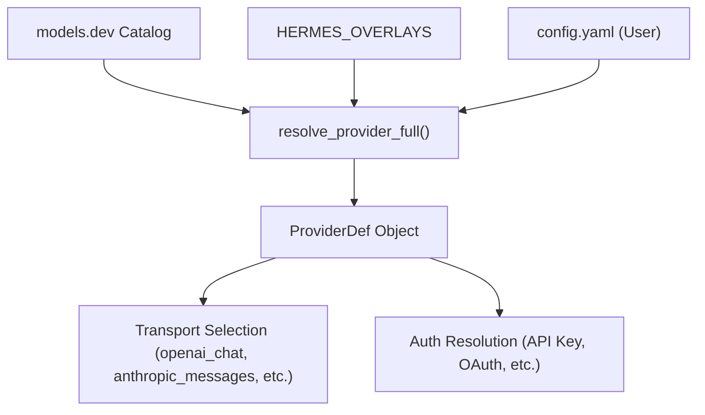
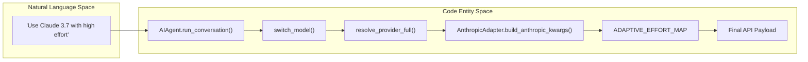
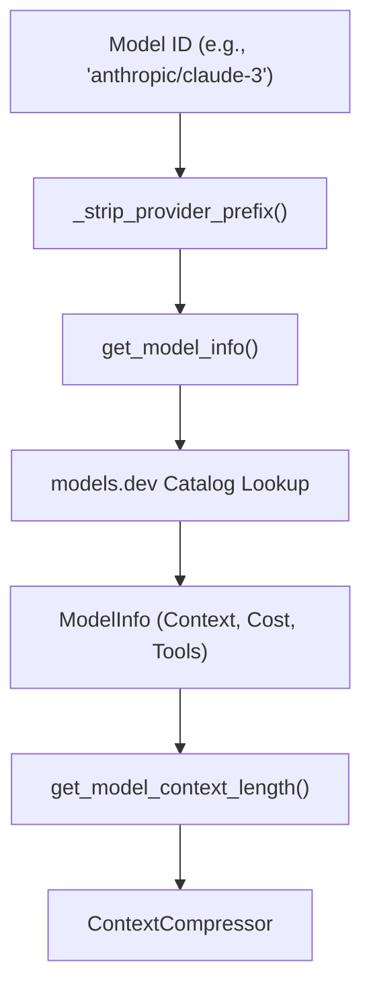

# LLM Provider System & Model Metadata

Relevant source files

The following files were used as context for generating this wiki page:

- [agent/anthropic_adapter.py](../agent/anthropic_adapter.py)
- [agent/bounded_response.py](../agent/bounded_response.py)
- [agent/codex_runtime.py](../agent/codex_runtime.py)
- [agent/gemini_native_adapter.py](../agent/gemini_native_adapter.py)
- [agent/model_metadata.py](../agent/model_metadata.py)
- [agent/models_dev.py](../agent/models_dev.py)
- [agent/portal_tags.py](../agent/portal_tags.py)
- [agent/prompt_caching.py](../agent/prompt_caching.py)
- [agent/transports/__init__.py](../agent/transports/__init__.py)
- [agent/transports/anthropic.py](../agent/transports/anthropic.py)
- [agent/transports/chat_completions.py](../agent/transports/chat_completions.py)
- [agent/transports/codex_app_server_session.py](../agent/transports/codex_app_server_session.py)
- [agent/transports/types.py](../agent/transports/types.py)
- [hermes_cli/inventory.py](../hermes_cli/inventory.py)
- [hermes_cli/model_catalog.py](../hermes_cli/model_catalog.py)
- [hermes_cli/model_normalize.py](../hermes_cli/model_normalize.py)
- [hermes_cli/model_switch.py](../hermes_cli/model_switch.py)
- [hermes_cli/providers.py](../hermes_cli/providers.py)
- [plugins/model-providers/minimax/__init__.py](../plugins/model-providers/minimax/__init__.py)
- [plugins/model-providers/nous/__init__.py](../plugins/model-providers/nous/__init__.py)
- [plugins/model-providers/openrouter/__init__.py](../plugins/model-providers/openrouter/__init__.py)
- [scripts/build_model_catalog.py](../scripts/build_model_catalog.py)
- [tests/agent/test_anthropic_adapter.py](../tests/agent/test_anthropic_adapter.py)
- [tests/agent/test_anthropic_mcp_prefix_strip.py](../tests/agent/test_anthropic_mcp_prefix_strip.py)
- [tests/agent/test_anthropic_oauth_ua_prefix.py](../tests/agent/test_anthropic_oauth_ua_prefix.py)
- [tests/agent/test_anthropic_output_field_leak.py](../tests/agent/test_anthropic_output_field_leak.py)
- [tests/agent/test_auxiliary_named_custom_providers.py](../tests/agent/test_auxiliary_named_custom_providers.py)
- [tests/agent/test_bounded_response.py](../tests/agent/test_bounded_response.py)
- [tests/agent/test_codex_app_server_event_bridge.py](../tests/agent/test_codex_app_server_event_bridge.py)
- [tests/agent/test_codex_app_server_persist.py](../tests/agent/test_codex_app_server_persist.py)
- [tests/agent/test_gemini_native_adapter.py](../tests/agent/test_gemini_native_adapter.py)
- [tests/agent/test_minimax_provider.py](../tests/agent/test_minimax_provider.py)
- [tests/agent/test_model_metadata.py](../tests/agent/test_model_metadata.py)
- [tests/agent/test_model_metadata_local_ctx.py](../tests/agent/test_model_metadata_local_ctx.py)
- [tests/agent/test_models_dev.py](../tests/agent/test_models_dev.py)
- [tests/agent/test_portal_tags.py](../tests/agent/test_portal_tags.py)
- [tests/agent/test_probe_cache_followups.py](../tests/agent/test_probe_cache_followups.py)
- [tests/agent/test_prompt_caching.py](../tests/agent/test_prompt_caching.py)
- [tests/agent/transports/test_chat_completions.py](../tests/agent/transports/test_chat_completions.py)
- [tests/agent/transports/test_codex_app_server_session.py](../tests/agent/transports/test_codex_app_server_session.py)
- [tests/agent/transports/test_transport.py](../tests/agent/transports/test_transport.py)
- [tests/agent/transports/test_types.py](../tests/agent/transports/test_types.py)
- [tests/hermes_cli/test_gemini_provider.py](../tests/hermes_cli/test_gemini_provider.py)
- [tests/hermes_cli/test_inventory.py](../tests/hermes_cli/test_inventory.py)
- [tests/hermes_cli/test_model_catalog.py](../tests/hermes_cli/test_model_catalog.py)
- [tests/hermes_cli/test_model_normalize.py](../tests/hermes_cli/test_model_normalize.py)
- [tests/hermes_cli/test_model_switch_custom_providers.py](../tests/hermes_cli/test_model_switch_custom_providers.py)
- [tests/hermes_cli/test_models.py](../tests/hermes_cli/test_models.py)
- [tests/hermes_cli/test_tencent_tokenhub_provider.py](../tests/hermes_cli/test_tencent_tokenhub_provider.py)
- [tests/hermes_cli/test_user_providers_model_switch.py](../tests/hermes_cli/test_user_providers_model_switch.py)
- [tests/hermes_state/test_conversation_root.py](../tests/hermes_state/test_conversation_root.py)
- [tests/plugins/model_providers/test_minimax_profile.py](../tests/plugins/model_providers/test_minimax_profile.py)
- [tests/providers/test_profile_wiring.py](../tests/providers/test_profile_wiring.py)
- [tests/providers/test_provider_profiles.py](../tests/providers/test_provider_profiles.py)
- [tests/providers/test_transport_parity.py](../tests/providers/test_transport_parity.py)
- [tests/run_agent/test_anthropic_prompt_cache_policy.py](../tests/run_agent/test_anthropic_prompt_cache_policy.py)
- [tests/run_agent/test_anthropic_truncation_continuation.py](../tests/run_agent/test_anthropic_truncation_continuation.py)
- [tests/run_agent/test_codex_app_server_integration.py](../tests/run_agent/test_codex_app_server_integration.py)
- [tests/run_agent/test_provider_parity.py](../tests/run_agent/test_provider_parity.py)
- [tests/test_empty_model_fallback.py](../tests/test_empty_model_fallback.py)
- [tests/tools/test_tts_gemini.py](../tests/tools/test_tts_gemini.py)
- [website/docs/developer-guide/adding-providers.md](../website/docs/developer-guide/adding-providers.md)
- [website/docs/developer-guide/model-provider-plugin.md](../website/docs/developer-guide/model-provider-plugin.md)
- [website/docs/reference/model-catalog.md](../website/docs/reference/model-catalog.md)
- [website/docs/user-guide/features/provider-routing.md](../website/docs/user-guide/features/provider-routing.md)
- [website/i18n/zh-Hans/docusaurus-plugin-content-docs/current/developer-guide/adding-platform-adapters.md](../website/i18n/zh-Hans/docusaurus-plugin-content-docs/current/developer-guide/adding-platform-adapters.md)
- [website/i18n/zh-Hans/docusaurus-plugin-content-docs/current/developer-guide/gateway-internals.md](../website/i18n/zh-Hans/docusaurus-plugin-content-docs/current/developer-guide/gateway-internals.md)
- [website/i18n/zh-Hans/docusaurus-plugin-content-docs/current/reference/model-catalog.md](../website/i18n/zh-Hans/docusaurus-plugin-content-docs/current/reference/model-catalog.md)
- [website/static/api/model-catalog.json](../website/static/api/model-catalog.json)

The LLM Provider System is a multi-layered registry and normalization engine that abstracts the differences between dozens of AI model providers (OpenRouter, Anthropic, Gemini, OpenAI, etc.). It handles model metadata resolution, context window tracking, and cross-provider name normalization.

## Provider Registry & Overlays

Hermes uses a tiered system to identify and configure providers, merging a large-scale catalog with local Hermes-specific logic.

1.  **models.dev catalog**: A primary database of 100+ providers containing base URLs, environment variables, and metadata [hermes_cli/providers.py:6-8](../hermes_cli/providers.py#L6-L8).
2.  **Hermes Overlays**: A local dictionary `HERMES_OVERLAYS` that adds transport types (e.g., `anthropic_messages`), authentication patterns (e.g., `oauth_device_code`), and aggregator flags [hermes_cli/providers.py:31-45](../hermes_cli/providers.py#L31-L45).
3.  **User Config**: Custom endpoints defined in `config.yaml` under `providers:` or `custom_providers:` [hermes_cli/providers.py:14-16](../hermes_cli/providers.py#L14-L16).

### Provider Metadata Flow
The `ProviderDef` dataclass is the unified structure representing a resolved provider [hermes_cli/model_switch.py:28-36](../hermes_cli/model_switch.py#L28-L36).

Title: Provider Resolution Architecture

**Sources:** [hermes_cli/providers.py:31-46](../hermes_cli/providers.py#L31-L46), [hermes_cli/model_switch.py:28-36](../hermes_cli/model_switch.py#L28-L36)

## Model Metadata & Context Resolution

Metadata resolution ensures the agent knows the capabilities (tool-calling, vision) and constraints (context window) of the selected model.

### Context Window Probing
When a model's context length is unknown, Hermes employs a waterfall probing strategy defined in `CONTEXT_PROBE_TIERS`. It starts at 256K and steps down on error until a request succeeds [agent/model_metadata.py:181-188](../agent/model_metadata.py#L181-L188).

### Metadata Caching
Metadata is cached both in-memory and on disk to minimize API calls:
*   **OpenRouter Cache**: Stored in `openrouter_model_metadata.json` [agent/model_metadata.py:127-130](../agent/model_metadata.py#L127-L130).
*   **Endpoint Cache**: Remembers server types (e.g., Ollama vs. LM Studio) for specific URLs to avoid repeated 404 probes [agent/model_metadata.py:116-124](../agent/model_metadata.py#L116-L124).

### Token Estimation
The system provides rough token estimation without requiring heavy tokenizer dependencies. It uses a character-to-token ratio (approx 4:1) but applies special logic for CJK characters (1:1) and vision payloads (flat ~1500 tokens per image) [agent/model_metadata.py:24-64](../agent/model_metadata.py#L24-L64).

**Sources:** [agent/model_metadata.py:116-188](../agent/model_metadata.py#L116-L188), [tests/agent/test_model_metadata.py:42-111](../tests/agent/test_model_metadata.py#L42-L111)

## Provider Normalization & Transports

Hermes normalizes interaction with disparate APIs via the `ProviderTransport` interface.

### Transport Types
| Transport | Description | Key File |
| :--- | :--- | :--- |
| `openai_chat` | Standard OpenAI Chat Completions API. | [agent/transports/chat_completions.py:1-10](../agent/transports/chat_completions.py#L1-L10) |
| `anthropic_messages` | Native Anthropic Messages API with thinking/adaptive effort support. | [agent/anthropic_adapter.py:1-11](../agent/anthropic_adapter.py#L1-L11) |
| `codex_responses` | Specialized "Responses API" mode for high-throughput streaming. | [agent/codex_runtime.py:11-15](../agent/codex_runtime.py#L11-L15) |

### Gemini Native Adapter
The system includes native support for Gemini-specific features through the `ChatCompletionsTransport`. It translates Hermes reasoning configurations into Gemini's `thinkingConfig` (including `includeThoughts` and `thinkingLevel`) [agent/transports/chat_completions.py:35-88](../agent/transports/chat_completions.py#L35-L88). It also handles the `thought_signature` (extra_content) required for tool-calling replay in Gemini 3 models [agent/transports/chat_completions.py:115-128](../agent/transports/chat_completions.py#L115-L128).

### Anthropic Adaptive Thinking
The `anthropic_adapter.py` maps Hermes effort levels (`ultra`, `max`, `high`, etc.) to Anthropic's adaptive thinking effort levels [agent/anthropic_adapter.py:67-75](../agent/anthropic_adapter.py#L67-L75). It distinguishes between legacy manual thinking (budget-based) and modern adaptive thinking based on model name substrings [agent/anthropic_adapter.py:98-114](../agent/anthropic_adapter.py#L98-L114).

Title: Request Normalization Flow

**Sources:** [agent/transports/chat_completions.py:35-128](../agent/transports/chat_completions.py#L35-L128), [agent/anthropic_adapter.py:67-114](../agent/anthropic_adapter.py#L67-L114), [hermes_cli/model_switch.py:10-19](../hermes_cli/model_switch.py#L10-L19)

## Codex & Responses API Mode

The Codex runtime provides a high-performance alternative to standard chat completions. It supports an "App Server" mode where Hermes communicates with a local Codex process [agent/codex_runtime.py:8-10](../agent/codex_runtime.py#L8-L10).

### Token Accounting
Because Codex APIs often use different usage formats, `_record_codex_app_server_usage` translates fields like `cachedInputTokens` and `reasoningOutputTokens` into the Hermes `CanonicalUsage` format for billing and context compression [agent/codex_runtime.py:46-120](../agent/codex_runtime.py#L46-L120).

**Sources:** [agent/codex_runtime.py:8-120](../agent/codex_runtime.py#L8-L120)

## Models.dev Integration

The `models.dev` registry is integrated via `agent/models_dev.py` and `website/static/api/model-catalog.json`. This provides a live-updated list of models, their pricing, and tool-calling capabilities.

### Model Selection Logic
When listing models for the user (e.g., in the CLI or Gateway), Hermes:
1.  Filters for tool-calling support (`supported_parameters` must include `tools`) [tests/hermes_cli/test_models.py:93-119](../tests/hermes_cli/test_models.py#L93-L119).
2.  Partitions models by tier (Free vs. Paid) for providers like Nous Portal [tests/hermes_cli/test_models.py:5-12](../tests/hermes_cli/test_models.py#L5-L12).
3.  Strips provider prefixes (e.g., `openrouter:`) to normalize IDs for internal cache lookups [agent/model_metadata.py:89-106](../agent/model_metadata.py#L89-L106).

Title: Model Metadata Resolution

**Sources:** [agent/model_metadata.py:89-106](../agent/model_metadata.py#L89-L106), [hermes_cli/model_switch.py:40-46](../hermes_cli/model_switch.py#L40-L46), [tests/hermes_cli/test_models.py:93-119](../tests/hermes_cli/test_models.py#L93-L119)

---
