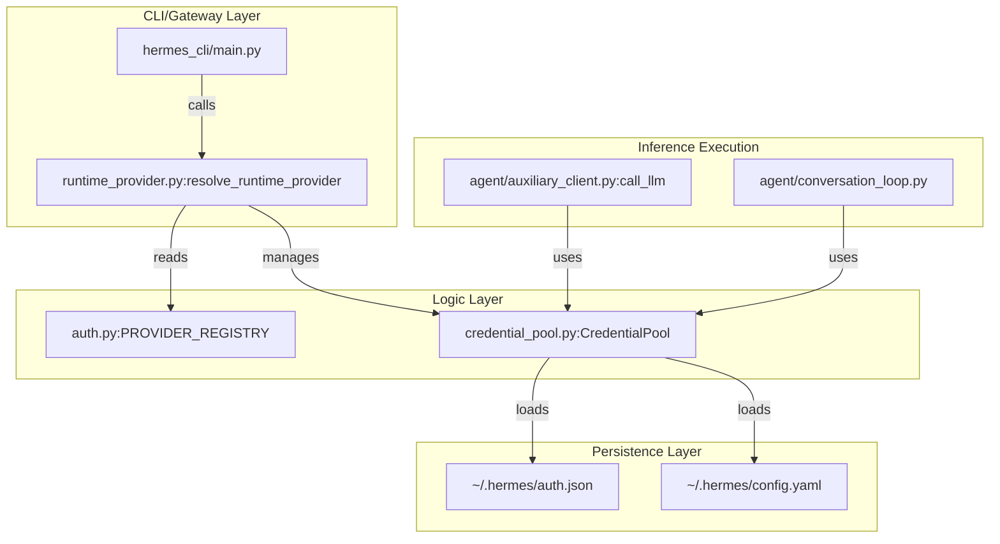
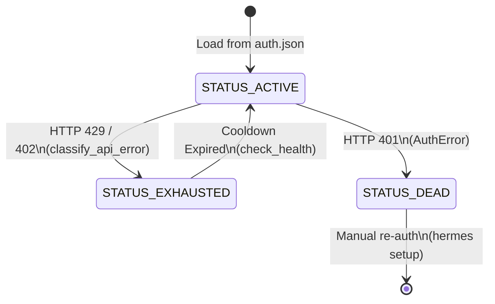

# Credential Management & Provider Failover

Relevant source files

The following files were used as context for generating this wiki page:

- [agent/agent_init.py](../agent/agent_init.py)
- [agent/agent_runtime_helpers.py](../agent/agent_runtime_helpers.py)
- [agent/auxiliary_client.py](../agent/auxiliary_client.py)
- [agent/bedrock_adapter.py](../agent/bedrock_adapter.py)
- [agent/chat_completion_helpers.py](../agent/chat_completion_helpers.py)
- [agent/context_compressor.py](../agent/context_compressor.py)
- [agent/conversation_compression.py](../agent/conversation_compression.py)
- [agent/conversation_loop.py](../agent/conversation_loop.py)
- [agent/credential_pool.py](../agent/credential_pool.py)
- [agent/message_sanitization.py](../agent/message_sanitization.py)
- [agent/tool_executor.py](../agent/tool_executor.py)
- [agent/turn_context.py](../agent/turn_context.py)
- [agent/usage_pricing.py](../agent/usage_pricing.py)
- [apps/desktop/src/lib/runtime-readiness.test.ts](../apps/desktop/src/lib/runtime-readiness.test.ts)
- [apps/desktop/src/lib/runtime-readiness.ts](../apps/desktop/src/lib/runtime-readiness.ts)
- [apps/desktop/src/store/onboarding.test.ts](../apps/desktop/src/store/onboarding.test.ts)
- [apps/desktop/src/store/onboarding.ts](../apps/desktop/src/store/onboarding.ts)
- contributors/emails/lanyusea@gmail.com
- contributors/emails/stanislav@local
- [hermes_cli/auth.py](../hermes_cli/auth.py)
- [hermes_cli/auth_commands.py](../hermes_cli/auth_commands.py)
- [hermes_cli/main.py](../hermes_cli/main.py)
- [hermes_cli/model_setup_flows.py](../hermes_cli/model_setup_flows.py)
- [hermes_cli/models.py](../hermes_cli/models.py)
- [hermes_cli/proxy/adapters/base.py](../hermes_cli/proxy/adapters/base.py)
- [hermes_cli/proxy/adapters/nous_portal.py](../hermes_cli/proxy/adapters/nous_portal.py)
- [hermes_cli/runtime_provider.py](../hermes_cli/runtime_provider.py)
- [hermes_cli/setup.py](../hermes_cli/setup.py)
- [tests/agent/test_auxiliary_client.py](../tests/agent/test_auxiliary_client.py)
- [tests/agent/test_bedrock_adapter.py](../tests/agent/test_bedrock_adapter.py)
- [tests/agent/test_bedrock_integration.py](../tests/agent/test_bedrock_integration.py)
- [tests/agent/test_bedrock_interrupt_post_worker.py](../tests/agent/test_bedrock_interrupt_post_worker.py)
- [tests/agent/test_close_interrupted_tool_sequence.py](../tests/agent/test_close_interrupted_tool_sequence.py)
- [tests/agent/test_compression_anti_thrash_persistence.py](../tests/agent/test_compression_anti_thrash_persistence.py)
- [tests/agent/test_compression_concurrent_fork.py](../tests/agent/test_compression_concurrent_fork.py)
- [tests/agent/test_compression_rotation_state.py](../tests/agent/test_compression_rotation_state.py)
- [tests/agent/test_context_compressor.py](../tests/agent/test_context_compressor.py)
- [tests/agent/test_credential_pool.py](../tests/agent/test_credential_pool.py)
- [tests/agent/test_credential_pool_oauth_writethrough.py](../tests/agent/test_credential_pool_oauth_writethrough.py)
- [tests/agent/test_credential_pool_routing.py](../tests/agent/test_credential_pool_routing.py)
- [tests/agent/test_idle_compaction_lock_and_guards.py](../tests/agent/test_idle_compaction_lock_and_guards.py)
- [tests/agent/test_turn_context.py](../tests/agent/test_turn_context.py)
- [tests/agent/test_turn_context_overflow_warning.py](../tests/agent/test_turn_context_overflow_warning.py)
- [tests/agent/test_usage_pricing.py](../tests/agent/test_usage_pricing.py)
- [tests/cli/test_cli_interrupt_ack_race.py](../tests/cli/test_cli_interrupt_ack_race.py)
- [tests/cli/test_cli_provider_resolution.py](../tests/cli/test_cli_provider_resolution.py)
- [tests/cli/test_cli_shutdown_memory_messages.py](../tests/cli/test_cli_shutdown_memory_messages.py)
- [tests/gateway/test_dingtalk.py](../tests/gateway/test_dingtalk.py)
- [tests/gateway/test_feishu_bot_admission.py](../tests/gateway/test_feishu_bot_admission.py)
- [tests/gateway/test_telegram_noise_filter.py](../tests/gateway/test_telegram_noise_filter.py)
- [tests/hermes_cli/test_auth_commands.py](../tests/hermes_cli/test_auth_commands.py)
- [tests/hermes_cli/test_auth_nous_provider.py](../tests/hermes_cli/test_auth_nous_provider.py)
- [tests/hermes_cli/test_auth_profile_fallback.py](../tests/hermes_cli/test_auth_profile_fallback.py)
- [tests/hermes_cli/test_bedrock_model_picker.py](../tests/hermes_cli/test_bedrock_model_picker.py)
- [tests/hermes_cli/test_bedrock_region_scoped_picker.py](../tests/hermes_cli/test_bedrock_region_scoped_picker.py)
- [tests/hermes_cli/test_custom_provider_model_switch.py](../tests/hermes_cli/test_custom_provider_model_switch.py)
- [tests/hermes_cli/test_gpt56_registration.py](../tests/hermes_cli/test_gpt56_registration.py)
- [tests/hermes_cli/test_model_provider_persistence.py](../tests/hermes_cli/test_model_provider_persistence.py)
- [tests/hermes_cli/test_model_validation.py](../tests/hermes_cli/test_model_validation.py)
- [tests/hermes_cli/test_proxy.py](../tests/hermes_cli/test_proxy.py)
- [tests/hermes_cli/test_reasoning_effort_menu.py](../tests/hermes_cli/test_reasoning_effort_menu.py)
- [tests/hermes_cli/test_runtime_provider_resolution.py](../tests/hermes_cli/test_runtime_provider_resolution.py)
- [tests/hermes_cli/test_terminal_menu_fallbacks.py](../tests/hermes_cli/test_terminal_menu_fallbacks.py)
- [tests/hermes_cli/test_web_oauth_dispatch.py](../tests/hermes_cli/test_web_oauth_dispatch.py)
- [tests/run_agent/test_413_compression.py](../tests/run_agent/test_413_compression.py)
- [tests/run_agent/test_compression_feasibility.py](../tests/run_agent/test_compression_feasibility.py)
- [tests/run_agent/test_credential_pool_interrupt.py](../tests/run_agent/test_credential_pool_interrupt.py)
- [tests/run_agent/test_repair_tool_call_arguments.py](../tests/run_agent/test_repair_tool_call_arguments.py)
- [tests/run_agent/test_run_agent.py](../tests/run_agent/test_run_agent.py)
- [tests/run_agent/test_stream_single_writer_65991.py](../tests/run_agent/test_stream_single_writer_65991.py)
- [tests/run_agent/test_streaming.py](../tests/run_agent/test_streaming.py)
- [tests/test_hermes_state_compression_locks.py](../tests/test_hermes_state_compression_locks.py)
- [tests/test_minisweagent_path.py](../tests/test_minisweagent_path.py)
- [tests/tools/test_daemon_pool.py](../tests/tools/test_daemon_pool.py)
- [tests/tools/test_terminal_requirements.py](../tests/tools/test_terminal_requirements.py)
- [tests/tools/test_terminal_tool_requirements.py](../tests/tools/test_terminal_tool_requirements.py)
- [tests/tools/test_tts_kittentts.py](../tests/tools/test_tts_kittentts.py)
- [tools/daemon_pool.py](../tools/daemon_pool.py)

This section details the Hermes Agent's multi-layered credential management system. It covers the `CredentialPool` architecture for load balancing and high availability, the OAuth device code flows for managed providers, and the auxiliary client fallback chain that ensures system tasks (like context compression) remain operational even when primary credentials fail.

## Credential Pool System

The `CredentialPool` provides a robust abstraction for managing multiple API keys or OAuth tokens for a single provider. It prevents single-point-of-failure scenarios and enables higher throughput by distributing requests across multiple accounts.

### Implementation and Strategies
The pool is managed via the `CredentialPool` class [agent/credential_pool.py:1-50](../agent/credential_pool.py#L1-L50), which tracks the state of each credential using a `PooledCredential` object.

| Strategy | Behavior |
| :--- | :--- |
| **Round-Robin** | Cycles through available credentials sequentially. |
| **Least-Used** | Selects the credential with the lowest lifetime request count. |
| **Fill-First** | Uses the first available credential until it hits a rate limit or error. |

### Credential States
Credentials within a pool transition through various states based on API feedback [agent/credential_pool.py:80-120](../agent/credential_pool.py#L80-L120):
- `STATUS_ACTIVE`: Healthy and ready for use.
- `STATUS_EXHAUSTED`: Temporarily disabled due to rate limits (429) or quota exhaustion (402).
- `STATUS_DEAD`: Permanently disabled due to invalid authentication (401).

### Credential Rotation Logic
When an LLM call fails with a retryable error (e.g., 429), the agent invokes `recover_with_credential_pool` [agent/agent_runtime_helpers.py:13-15](../agent/agent_runtime_helpers.py#L13-L15). This function marks the current credential as `STATUS_EXHAUSTED` and requests a new one from the pool. If no active credentials remain, the system triggers the **Provider Failover** chain.

Sources: `agent/credential_pool.py`, `agent/agent_runtime_helpers.py`

## OAuth & Managed Authentication

Hermes supports modern OAuth 2.0 flows, primarily focusing on **Device Code Flows** to support headless environments (SSH/CLI).

### Supported Managed Flows
1.  **Nous Portal**: The preferred managed provider. Uses the `invoke_jwt` flow [hermes_cli/auth.py:15-17](../hermes_cli/auth.py#L15-L17).
2.  **OpenAI Codex**: OAuth-based access to ChatGPT-account-backed inference [hermes_cli/auth.py:25-30](../hermes_cli/auth.py#L25-L30).
3.  **xAI/Grok**: OAuth integration for Grok models [hermes_cli/auth.py:110-115](../hermes_cli/auth.py#L110-L115).

### Write-Through Token Refresh
To prevent session interruptions, the `resolve_*_runtime_credentials` functions (e.g., `resolve_nous_runtime_credentials`) implement a write-through cache [hermes_cli/auth.py:82-85](../hermes_cli/auth.py#L82-L85). If a token is within the `ACCESS_TOKEN_REFRESH_SKEW_SECONDS` window (default 120s), a refresh is triggered, and the new token is atomically written back to `~/.hermes/auth.json` [hermes_cli/auth.py:5-7](../hermes_cli/auth.py#L5-L7).

### Nous Portal `invoke_jwt` Flow
The Nous Portal uses a scoped `access_token` to request a short-lived, inference-specific JWT. This JWT is then passed to the inference endpoint, minimizing the exposure of the long-lived refresh token.

Sources: `hermes_cli/auth.py`, `hermes_cli/runtime_provider.py`

## Auxiliary Client Fallback Chain

Auxiliary tasks—such as **Context Compression**, **Web Extraction**, and **Vision Analysis**—require highly reliable LLM access. The `auxiliary_client.py` module defines a standardized resolution chain that automatically falls back to secondary providers if the primary one is unavailable.

### Resolution Data Flow
The system follows a strict priority chain when `auto` mode is enabled [agent/auxiliary_client.py:7-15](../agent/auxiliary_client.py#L7-L15):

1.  **Main Provider**: The model currently selected by the user.
2.  **OpenRouter**: Checked if `OPENROUTER_API_KEY` is present.
3.  **Nous Portal**: Checked if an active session exists in `auth.json`.
4.  **Custom Endpoint**: Uses `model.base_url` + `OPENAI_API_KEY`.
5.  **Native Anthropic/Direct Keys**: Fallback to specific vendor keys (Kimi, GLM, etc.).

### Failure Recovery (402/429)
If a call via `call_llm()` fails with a `FailoverReason.billing` (402) or `FailoverReason.rate_limit` (429), the `_try_payment_fallback` logic [agent/auxiliary_client.py:36-41](../agent/auxiliary_client.py#L36-L41) automatically suppresses the error and attempts the next provider in the chain.

Sources: `agent/auxiliary_client.py`, `agent/context_compressor.py`

## Code-to-System Mapping

### Provider Resolution Architecture
The following diagram bridges the natural language concepts of "Providers" and "Keys" to the specific classes and functions in the codebase.

Title: Provider Resolution & Auth Flow

Sources: `hermes_cli/main.py`, `hermes_cli/runtime_provider.py`, `hermes_cli/auth.py`, `agent/credential_pool.py`

### Credential State Machine
This diagram maps the internal state transitions within the `PooledCredential` system.

Title: Credential State Transitions

Sources: `agent/credential_pool.py`, `agent/error_classifier.py`, `agent/agent_runtime_helpers.py`

## Technical Reference: Key Functions

| Function | File | Description |
| :--- | :--- | :--- |
| `resolve_provider` | [hermes_cli/auth.py:31](../hermes_cli/auth.py#L31) | Determines which auth provider is currently active based on config and env. |
| `load_pool` | [agent/credential_pool.py:107](../agent/credential_pool.py#L107) | Factory function to initialize a `CredentialPool` for a specific provider. |
| `call_llm` | [agent/auxiliary_client.py:28](../agent/auxiliary_client.py#L28) | The high-level entry point for auxiliary tasks with built-in failover. |
| `recover_with_credential_pool` | [agent/agent_runtime_helpers.py:13](../agent/agent_runtime_helpers.py#L13) | Rotates credentials within an active session loop after a provider error. |
| `resolve_nous_runtime_credentials` | [hermes_cli/auth.py:32](../hermes_cli/auth.py#L32) | Handles the JWT exchange and token refresh for Nous Portal. |

Sources: `hermes_cli/auth.py`, `agent/credential_pool.py`, `agent/auxiliary_client.py`, `agent/agent_runtime_helpers.py`

---
