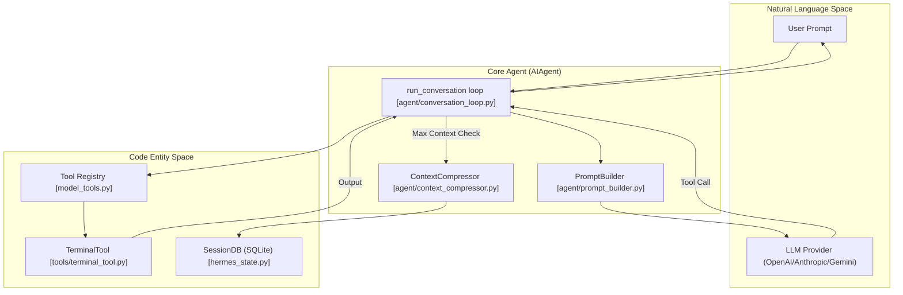
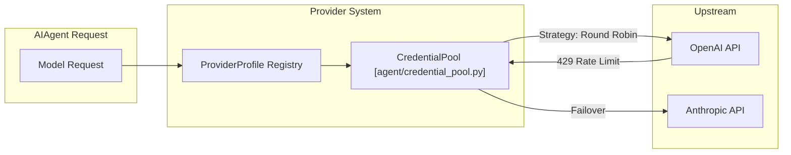

# Core Agent Architecture

Relevant source files

The following files were used as context for generating this wiki page:

- [.env.example](../.env.example)
- [AGENTS.md](../AGENTS.md)
- [README.md](../README.md)
- [agent/agent_init.py](../agent/agent_init.py)
- [agent/agent_runtime_helpers.py](../agent/agent_runtime_helpers.py)
- [agent/chat_completion_helpers.py](../agent/chat_completion_helpers.py)
- [agent/context_compressor.py](../agent/context_compressor.py)
- [agent/conversation_compression.py](../agent/conversation_compression.py)
- [agent/conversation_loop.py](../agent/conversation_loop.py)
- [agent/prompt_builder.py](../agent/prompt_builder.py)
- [agent/runtime_cwd.py](../agent/runtime_cwd.py)
- [agent/skill_commands.py](../agent/skill_commands.py)
- [agent/skill_utils.py](../agent/skill_utils.py)
- [agent/system_prompt.py](../agent/system_prompt.py)
- [agent/tool_executor.py](../agent/tool_executor.py)
- [agent/turn_context.py](../agent/turn_context.py)
- [cli-config.yaml.example](../cli-config.yaml.example)
- [cli.py](../cli.py)
- contributors/emails/lanyusea@gmail.com
- contributors/emails/stanislav@local
- [gateway/config.py](../gateway/config.py)
- [gateway/platforms/base.py](../gateway/platforms/base.py)
- [gateway/run.py](../gateway/run.py)
- [gateway/session.py](../gateway/session.py)
- [hermes_cli/commands.py](../hermes_cli/commands.py)
- [hermes_cli/config.py](../hermes_cli/config.py)
- [hermes_cli/skills_config.py](../hermes_cli/skills_config.py)
- [hermes_state.py](../hermes_state.py)
- [run_agent.py](../run_agent.py)
- [tests/agent/test_compression_anti_thrash_persistence.py](../tests/agent/test_compression_anti_thrash_persistence.py)
- [tests/agent/test_compression_concurrent_fork.py](../tests/agent/test_compression_concurrent_fork.py)
- [tests/agent/test_compression_rotation_state.py](../tests/agent/test_compression_rotation_state.py)
- [tests/agent/test_context_compressor.py](../tests/agent/test_context_compressor.py)
- [tests/agent/test_credential_pool_routing.py](../tests/agent/test_credential_pool_routing.py)
- [tests/agent/test_idle_compaction_lock_and_guards.py](../tests/agent/test_idle_compaction_lock_and_guards.py)
- [tests/agent/test_prompt_builder.py](../tests/agent/test_prompt_builder.py)
- [tests/agent/test_runtime_cwd.py](../tests/agent/test_runtime_cwd.py)
- [tests/agent/test_skill_commands.py](../tests/agent/test_skill_commands.py)
- [tests/agent/test_skill_utils.py](../tests/agent/test_skill_utils.py)
- [tests/agent/test_system_prompt.py](../tests/agent/test_system_prompt.py)
- [tests/agent/test_turn_context.py](../tests/agent/test_turn_context.py)
- [tests/agent/test_turn_context_overflow_warning.py](../tests/agent/test_turn_context_overflow_warning.py)
- [tests/cli/test_cli_interrupt_ack_race.py](../tests/cli/test_cli_interrupt_ack_race.py)
- [tests/cli/test_cli_shutdown_memory_messages.py](../tests/cli/test_cli_shutdown_memory_messages.py)
- [tests/gateway/test_config.py](../tests/gateway/test_config.py)
- [tests/gateway/test_platform_base.py](../tests/gateway/test_platform_base.py)
- [tests/gateway/test_reasoning_command.py](../tests/gateway/test_reasoning_command.py)
- [tests/gateway/test_session.py](../tests/gateway/test_session.py)
- [tests/gateway/test_session_model_override_routing.py](../tests/gateway/test_session_model_override_routing.py)
- [tests/gateway/test_session_model_reset.py](../tests/gateway/test_session_model_reset.py)
- [tests/gateway/test_session_reset_notify.py](../tests/gateway/test_session_reset_notify.py)
- [tests/gateway/test_shared_group_sender_prefix.py](../tests/gateway/test_shared_group_sender_prefix.py)
- [tests/gateway/test_telegram_noise_filter.py](../tests/gateway/test_telegram_noise_filter.py)
- [tests/gateway/test_tts_media_routing.py](../tests/gateway/test_tts_media_routing.py)
- [tests/hermes_cli/test_commands.py](../tests/hermes_cli/test_commands.py)
- [tests/hermes_cli/test_skills_config.py](../tests/hermes_cli/test_skills_config.py)
- [tests/run_agent/test_413_compression.py](../tests/run_agent/test_413_compression.py)
- [tests/run_agent/test_compression_feasibility.py](../tests/run_agent/test_compression_feasibility.py)
- [tests/run_agent/test_credential_pool_interrupt.py](../tests/run_agent/test_credential_pool_interrupt.py)
- [tests/run_agent/test_run_agent.py](../tests/run_agent/test_run_agent.py)
- [tests/test_hermes_state.py](../tests/test_hermes_state.py)
- [tests/test_hermes_state_compression_locks.py](../tests/test_hermes_state_compression_locks.py)
- [tests/tools/test_daemon_pool.py](../tests/tools/test_daemon_pool.py)
- [tests/tools/test_skill_manager_tool.py](../tests/tools/test_skill_manager_tool.py)
- [tests/tools/test_skills_tool.py](../tests/tools/test_skills_tool.py)
- [tools/daemon_pool.py](../tools/daemon_pool.py)
- [tools/project_tools.py](../tools/project_tools.py)
- [tools/skill_manager_tool.py](../tools/skill_manager_tool.py)
- [tools/skills_tool.py](../tools/skills_tool.py)

The Hermes Agent is built on a "Narrow Waist" design philosophy, where the `AIAgent` class serves as the central orchestration point. It bridges high-level user interfaces (CLI, Web, Messaging Gateways) with low-level LLM providers and tool execution environments. The architecture is designed for long-running, iterative problem-solving turns that can survive context window exhaustion and provider failures.

## The AIAgent Execution Model

The core of Hermes is the `AIAgent` class defined in `run_agent.py`. It maintains the state of a single conversation session, including message history, tool schemas, and provider configurations. The agent operates primarily through the `run_conversation` loop, which manages the lifecycle of a user request from prompt assembly to final response.

### High-Level Component Interaction

The following diagram illustrates how the `AIAgent` coordinates between the "Natural Language Space" (LLM) and the "Code Entity Space" (Tools and State).

**Hermes Core Orchestration**

Sources: [run_agent.py:17-21](../run_agent.py#L17-L21), [agent/conversation_loop.py:1-15](../agent/conversation_loop.py#L1-L15), [hermes_state.py:3-15](../hermes_state.py#L3-L15)

## The Conversation Loop

The `run_conversation` function in `agent/conversation_loop.py` (formerly part of `run_agent.py`) implements the iterative tool-calling logic. Unlike a simple request-response model, Hermes will continue to call tools in a loop until it achieves the user's goal or hits an iteration budget.

1.  **Context Building**: The agent assembles the `turn_context`, combining the system prompt, conversation history, and dynamic skills.
2.  **Model Invocation**: The LLM is called via the `OpenAI` proxy client.
3.  **Tool Dispatch**: If the model returns a tool call, `handle_function_call` executes the code and returns the result to the model.
4.  **Error Recovery**: The loop includes logic to handle common LLM errors like 429 (Rate Limit) with jittered backoff or 413 (Context Too Large) by triggering immediate compression.

For details, see [Conversation Loop & Turn Lifecycle](#2.1).

Sources: [agent/conversation_loop.py:44-50](../agent/conversation_loop.py#L44-L50), [run_agent.py:136-141](../run_agent.py#L136-L141)

## System Prompt & Skills

Hermes uses a multi-tiered system prompt strategy. Instead of a single static string, the prompt is assembled dynamically by the `PromptBuilder`. This includes:
*   **SOUL.md**: The core personality and behavioral guidelines.
*   **Skills**: Procedural memories stored as `SKILL.md` files that are injected based on the current task.
*   **Environment Hints**: Details about the current OS, shell, and working directory.

For details, see [System Prompt Assembly & Skills](#2.2).

Sources: [agent/prompt_builder.py:163-170](../agent/prompt_builder.py#L163-L170), [run_agent.py:163-170](../run_agent.py#L163-L170)

## Memory and State Management

Persistence is handled by the `SessionDB` class in `hermes_state.py`, which uses a SQLite backend with WAL mode enabled for concurrent access.

| Component | Responsibility | File Reference |
| :--- | :--- | :--- |
| **SessionDB** | Stores message history, metadata, and FTS5 search index. | `hermes_state.py` |
| **ContextCompressor** | Summarizes old messages when the context window is full. | `agent/context_compressor.py` |
| **MemoryManager** | Manages the `MEMORY.md` and `USER.md` volatile memory tiers. | `agent/memory_manager.py` |

For details, see [Context Compression & Memory Management](#2.3) and [Persistence & State](#6).

Sources: [hermes_state.py:3-15](../hermes_state.py#L3-L15), [agent/context_compressor.py:1-17](../agent/context_compressor.py#L1-L17)

## Multi-Provider & Failover System

Hermes is provider-agnostic. It uses a `ProviderProfile` system to normalize interactions across OpenAI, Anthropic, Gemini, and local models. A `CredentialPool` manages API keys and handles automatic failover if a provider is exhausted or down.

**Provider and Credential Flow**

Sources: [run_agent.py:111-115](../run_agent.py#L111-L115), [agent/conversation_loop.py:75-80](../agent/conversation_loop.py#L75-L80)

For details, see [LLM Provider System & Model Metadata](#2.4) and [Credential Management & Provider Failover](#2.5).

## Mixture-of-Agents (MoA)

For complex reasoning tasks, Hermes supports a Mixture-of-Agents virtual provider. This fans out a single prompt to multiple "advisor" models and uses an "aggregator" model to synthesize the final response, injecting guidance and cross-model insights into the conversation loop.

For details, see [Mixture-of-Agents (MoA)](#2.6).

---
