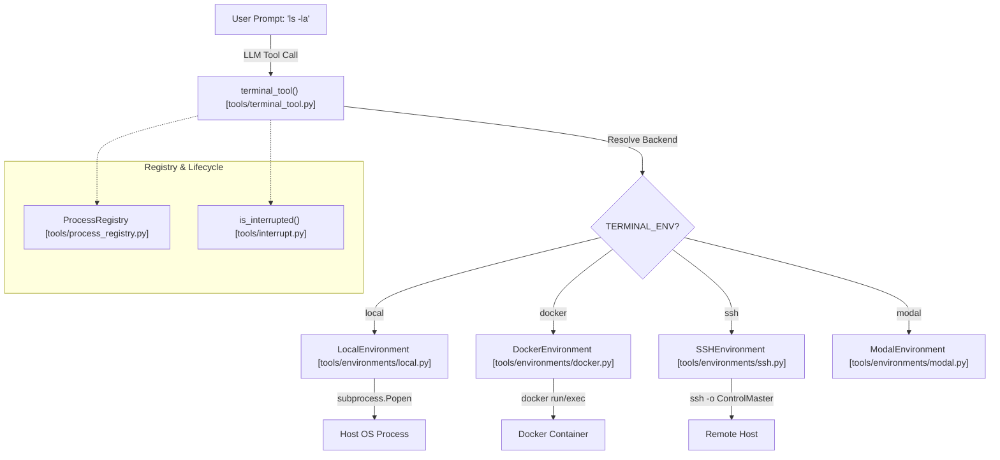

# Terminal & Code Execution

<details>
<summary>Relevant source files</summary>

The following files were used as context for generating this wiki page:

- [scripts/tests/test-install-ps1-gitbash-compatibility.ps1](../scripts/tests/test-install-ps1-gitbash-compatibility.ps1)
- [tests/gateway/test_internal_event_bypass_pairing.py](../tests/gateway/test_internal_event_bypass_pairing.py)
- [tests/integration/test_daytona_terminal.py](../tests/integration/test_daytona_terminal.py)
- [tests/run_agent/test_24996_fallback_exhaustion_cooldown.py](../tests/run_agent/test_24996_fallback_exhaustion_cooldown.py)
- [tests/test_transform_tool_result_hook.py](../tests/test_transform_tool_result_hook.py)
- [tests/tools/test_approved_command_clean_slate.py](../tests/tools/test_approved_command_clean_slate.py)
- [tests/tools/test_base_environment.py](../tests/tools/test_base_environment.py)
- [tests/tools/test_code_execution.py](../tests/tools/test_code_execution.py)
- [tests/tools/test_code_execution_windows_env.py](../tests/tools/test_code_execution_windows_env.py)
- [tests/tools/test_credential_files.py](../tests/tools/test_credential_files.py)
- [tests/tools/test_daytona_environment.py](../tests/tools/test_daytona_environment.py)
- [tests/tools/test_docker_environment.py](../tests/tools/test_docker_environment.py)
- [tests/tools/test_docker_orphan_reaper_integration.py](../tests/tools/test_docker_orphan_reaper_integration.py)
- [tests/tools/test_file_sync.py](../tests/tools/test_file_sync.py)
- [tests/tools/test_file_sync_back.py](../tests/tools/test_file_sync_back.py)
- [tests/tools/test_file_sync_sigint.py](../tests/tools/test_file_sync_sigint.py)
- [tests/tools/test_file_tools_live.py](../tests/tools/test_file_tools_live.py)
- [tests/tools/test_find_shell.py](../tests/tools/test_find_shell.py)
- [tests/tools/test_interrupt.py](../tests/tools/test_interrupt.py)
- [tests/tools/test_local_background_child_hang.py](../tests/tools/test_local_background_child_hang.py)
- [tests/tools/test_local_env_blocklist.py](../tests/tools/test_local_env_blocklist.py)
- [tests/tools/test_local_env_cwd_recovery.py](../tests/tools/test_local_env_cwd_recovery.py)
- [tests/tools/test_local_env_windows_msys.py](../tests/tools/test_local_env_windows_msys.py)
- [tests/tools/test_managed_modal_environment.py](../tests/tools/test_managed_modal_environment.py)
- [tests/tools/test_modal_bulk_upload.py](../tests/tools/test_modal_bulk_upload.py)
- [tests/tools/test_modal_snapshot_isolation.py](../tests/tools/test_modal_snapshot_isolation.py)
- [tests/tools/test_notify_on_complete.py](../tests/tools/test_notify_on_complete.py)
- [tests/tools/test_process_registry.py](../tests/tools/test_process_registry.py)
- [tests/tools/test_ssh_bulk_upload.py](../tests/tools/test_ssh_bulk_upload.py)
- [tests/tools/test_ssh_environment.py](../tests/tools/test_ssh_environment.py)
- [tests/tools/test_sync_back_backends.py](../tests/tools/test_sync_back_backends.py)
- [tests/tools/test_terminal_config_env_sync.py](../tests/tools/test_terminal_config_env_sync.py)
- [tests/tools/test_terminal_output_transform_hook.py](../tests/tools/test_terminal_output_transform_hook.py)
- [tests/tools/test_threaded_process_handle.py](../tests/tools/test_threaded_process_handle.py)
- [tests/tools/test_tirith_security.py](../tests/tools/test_tirith_security.py)
- [tests/tools/test_watch_patterns.py](../tests/tools/test_watch_patterns.py)
- [tools/code_execution_tool.py](../tools/code_execution_tool.py)
- [tools/credential_files.py](../tools/credential_files.py)
- [tools/environments/base.py](../tools/environments/base.py)
- [tools/environments/daytona.py](../tools/environments/daytona.py)
- [tools/environments/docker.py](../tools/environments/docker.py)
- [tools/environments/file_sync.py](../tools/environments/file_sync.py)
- [tools/environments/local.py](../tools/environments/local.py)
- [tools/environments/managed_modal.py](../tools/environments/managed_modal.py)
- [tools/environments/modal.py](../tools/environments/modal.py)
- [tools/environments/modal_utils.py](../tools/environments/modal_utils.py)
- [tools/environments/singularity.py](../tools/environments/singularity.py)
- [tools/environments/ssh.py](../tools/environments/ssh.py)
- [tools/interrupt.py](../tools/interrupt.py)
- [tools/process_registry.py](../tools/process_registry.py)
- [tools/terminal_tool.py](../tools/terminal_tool.py)
- [tools/tirith_security.py](../tools/tirith_security.py)

</details>


The terminal and code execution system in Hermes provides a unified abstraction for running arbitrary shell commands and programmatic scripts across diverse infrastructure backends. It bridges the "Natural Language Space" (LLM tool calls) to the "Code Entity Space" (OS processes, containers, and cloud sandboxes) through the `terminal_tool` and `BaseEnvironment` interface.

## Architecture Overview

The system is built on a "spawn-per-call" model where each tool invocation executes a fresh shell process while maintaining session continuity (environment variables, aliases, and working directory) via state snapshots [tools/environments/base.py:1-7](../tools/environments/base.py#L1-L7).

### Core Components

| Component | Role |
| :--- | :--- |
| `terminal_tool` | The primary entry point for LLMs to execute shell commands [tools/terminal_tool.py:25-32](../tools/terminal_tool.py#L25-L32). |
| `BaseEnvironment` | Abstract base class defining the contract for all execution backends [tools/environments/base.py:54-55](../tools/environments/base.py#L54-L55). |
| `ProcessRegistry` | Tracks and manages long-running background processes spawned via `background=True` [tools/process_registry.py:2-10](../tools/process_registry.py#L2-L10). |
| `FileSyncManager` | Synchronizes credentials and local state (e.g., `~/.hermes`) to remote backends [tools/environments/ssh.py:72-79](../tools/environments/ssh.py#L72-L79). |
| `execute_code` | Programmatic Tool Calling (PTC) tool that lets the LLM run Python scripts that call other Hermes tools via RPC [tools/code_execution_tool.py:3-7](../tools/code_execution_tool.py#L3-L7). |

### Natural Language to Code Entity Mapping: Terminal Execution
The following diagram illustrates how a natural language request to "run a command" traverses the system into specific code entities.

**Terminal Tool Dispatch Flow**

**Sources:** [tools/terminal_tool.py:5-15](../tools/terminal_tool.py#L5-L15), [tools/environments/base.py:1-7](../tools/environments/base.py#L1-L7), [tools/process_registry.py:2-10](../tools/process_registry.py#L2-L10)

## Execution Backends

Hermes supports multiple backends, each implementing the `BaseEnvironment` interface.

### Local Execution (`LocalEnvironment`)
The default backend. It executes commands directly on the host machine using `subprocess.Popen` [tools/environments/local.py:1-5](../tools/environments/local.py#L1-L5).
- **Path Translation:** On Windows, it automatically translates MSYS/Git Bash paths (e.g., `/c/Users`) to native Windows paths for `os.path` compatibility [tools/environments/local.py:24-36](../tools/environments/local.py#L24-L36).
- **CWD Recovery:** If a previous command deleted the working directory, it attempts to recover by walking up to the nearest accessible ancestor [tools/environments/local.py:154-160](../tools/environments/local.py#L154-L160).

### Containerized Execution (`DockerEnvironment`)
Provides isolation using Docker or Podman.
- **Security:** Containers are hardened with `cap-drop ALL`, `no-new-privileges`, and PID limits [tools/environments/docker.py:1-6](../tools/environments/docker.py#L1-L6).
- **Orphan Reaping:** Includes a `reap_orphan_containers` function to clean up stale containers left by crashed Hermes processes [tools/environments/docker.py:141-150](../tools/environments/docker.py#L141-L150).

### Remote & Cloud Backends
- **SSH (`SSHEnvironment`):** Uses `ControlMaster` for persistent connection reuse, significantly reducing the overhead of multiple small commands [tools/environments/ssh.py:37-43](../tools/environments/ssh.py#L37-L43).
- **Modal:** Serverless execution in the cloud with managed sandbox support [tools/terminal_tool.py:12-13](../tools/terminal_tool.py#L12-L13).
- **Daytona:** Uses the Daytona SDK to manage cloud development environments [tools/environments/daytona.py:1-6](../tools/environments/daytona.py#L1-L6).
- **Singularity:** Specialized for HPC environments with custom scratch space management [tools/environments/singularity.py:65-69](../tools/environments/singularity.py#L65-L69).

**Sources:** [tools/environments/local.py](../tools/environments/local.py), [tools/environments/docker.py](../tools/environments/docker.py), [tools/environments/ssh.py](../tools/environments/ssh.py), [tools/environments/daytona.py](../tools/environments/daytona.py)

## Background Processes & Monitoring

When an LLM calls `terminal_tool(command, background=True)`, the command is handed to the `ProcessRegistry` [tools/process_registry.py:19-21](../tools/process_registry.py#L19-L21).

### ProcessRegistry Features
- **Output Buffering:** Maintains a rolling 200KB window of stdout/stderr [tools/process_registry.py:58](../tools/process_registry.py#L58).
- **Watch Patterns:** Triggers notifications to the user if specific patterns (e.g., "Build successful") appear in the output [tools/process_registry.py:63-71](../tools/process_registry.py#L63-L71).
- **Crash Recovery:** State is persisted to `processes.json` to allow the gateway to resume tracking after a restart [tools/process_registry.py:54-55](../tools/process_registry.py#L54-L55).

**Sources:** [tools/process_registry.py:1-10](../tools/process_registry.py#L1-L10), [tools/process_registry.py:54-71](../tools/process_registry.py#L54-L71)

## Programmatic Tool Calling (PTC)

The `execute_code` tool allows the LLM to write Python scripts that perform complex logic and call other Hermes tools (like `web_search` or `read_file`) within the script itself [tools/code_execution_tool.py:3-7](../tools/code_execution_tool.py#L3-L7).

### PTC Transport Mechanism
The communication between the sandbox script and the parent Hermes process depends on the environment:

1.  **Local Backend (UDS):** Uses Unix Domain Sockets for high-performance RPC [tools/code_execution_tool.py:10-15](../tools/code_execution_tool.py#L10-L15).
2.  **Remote Backend (File-based):** Uses a polling mechanism with request/response files when UDS is unavailable (e.g., over SSH or in restricted containers) [tools/code_execution_tool.py:16-23](../tools/code_execution_tool.py#L16-L23).

### Natural Language to Code Entity Mapping: PTC RPC
This diagram shows how a script written by the LLM communicates back to the Hermes tool system.

**PTC RPC Data Flow**
```mermaid
sequenceDiagram
    participant LLM as "LLM (Generated Script)"
    participant STUB as "hermes_tools.py [tools/code_execution_tool.py]"
    participant SOCK as "RPC Transport (UDS/File)"
    participant PAR as "Hermes Parent Process"
    participant TOOL as "Target Tool (e.g., read_file)"

    LLM->>STUB: Call terminal("ls")
    STUB->>SOCK: Send JSON RPC Request
    PAR->>SOCK: Poll/Listen for Request
    PAR->>TOOL: Dispatch to handle_function_call()
    TOOL-->>PAR: Return Result
    PAR->>SOCK: Write JSON RPC Response
    SOCK-->>STUB: Receive Response
    STUB-->>LLM: Return String Output
```
**Sources:** [tools/code_execution_tool.py:8-29](../tools/code_execution_tool.py#L8-L29), [tools/code_execution_tool.py:106-111](../tools/code_execution_tool.py#L106-L111)

## Security & Sanitization

Execution is subject to strict security layers:
- **Environment Scrubbing:** Before spawning a process, Hermes strips sensitive environment variables (e.g., `OPENAI_API_KEY`, `HERMES_CONFIG`) to prevent credential leakage [tools/code_execution_tool.py:143-161](../tools/code_execution_tool.py#L143-L161).
- **Provider Blocklist:** Specifically blocks 30+ provider-related keys from leaking into local subprocesses [tools/environments/local.py:19-21](../tools/environments/local.py#L19-L21), [tests/tools/test_local_env_blocklist.py:64-77](../tests/tools/test_local_env_blocklist.py#L64-L77).
- **Output Capping:** Stdout is capped (default 50KB) to prevent context window flooding [tools/code_execution_tool.py:75-76](../tools/code_execution_tool.py#L75-L76).

**Sources:** [tools/code_execution_tool.py:143-161](../tools/code_execution_tool.py#L143-L161), [tests/tools/test_local_env_blocklist.py](../tests/tools/test_local_env_blocklist.py), [tools/code_execution_tool.py:75-76](../tools/code_execution_tool.py#L75-L76)

---
