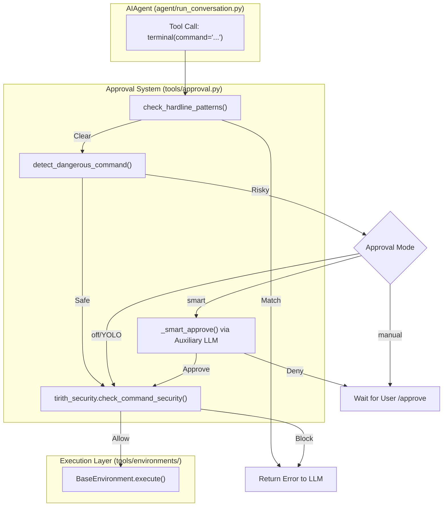
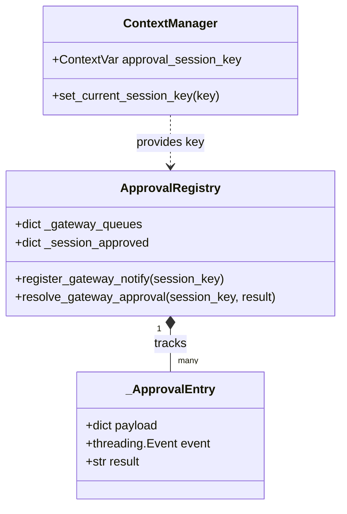

# Security & Command Approval

Relevant source files

The following files were used as context for generating this wiki page:

- [scripts/tests/test-install-ps1-gitbash-compatibility.ps1](../scripts/tests/test-install-ps1-gitbash-compatibility.ps1)
- [tests/gateway/test_approve_deny_commands.py](../tests/gateway/test_approve_deny_commands.py)
- [tests/gateway/test_async_delegation_session_binding.py](../tests/gateway/test_async_delegation_session_binding.py)
- [tests/gateway/test_internal_event_bypass_pairing.py](../tests/gateway/test_internal_event_bypass_pairing.py)
- [tests/gateway/test_matrix_exec_approval.py](../tests/gateway/test_matrix_exec_approval.py)
- [tests/gateway/test_session_store_runtime_stale_guard.py](../tests/gateway/test_session_store_runtime_stale_guard.py)
- [tests/gateway/test_yolo_command.py](../tests/gateway/test_yolo_command.py)
- [tests/run_agent/test_24996_fallback_exhaustion_cooldown.py](../tests/run_agent/test_24996_fallback_exhaustion_cooldown.py)
- [tests/test_transform_tool_result_hook.py](../tests/test_transform_tool_result_hook.py)
- [tests/tools/test_approval.py](../tests/tools/test_approval.py)
- [tests/tools/test_approval_interrupt.py](../tests/tools/test_approval_interrupt.py)
- [tests/tools/test_approved_command_clean_slate.py](../tests/tools/test_approved_command_clean_slate.py)
- [tests/tools/test_base_environment.py](../tests/tools/test_base_environment.py)
- [tests/tools/test_code_execution.py](../tests/tools/test_code_execution.py)
- [tests/tools/test_code_execution_windows_env.py](../tests/tools/test_code_execution_windows_env.py)
- [tests/tools/test_command_guards.py](../tests/tools/test_command_guards.py)
- [tests/tools/test_cron_approval_mode.py](../tests/tools/test_cron_approval_mode.py)
- [tests/tools/test_execution_flag_detection.py](../tests/tools/test_execution_flag_detection.py)
- [tests/tools/test_file_tools_live.py](../tests/tools/test_file_tools_live.py)
- [tests/tools/test_find_shell.py](../tests/tools/test_find_shell.py)
- [tests/tools/test_hardline_blocklist.py](../tests/tools/test_hardline_blocklist.py)
- [tests/tools/test_interrupt.py](../tests/tools/test_interrupt.py)
- [tests/tools/test_local_background_child_hang.py](../tests/tools/test_local_background_child_hang.py)
- [tests/tools/test_local_env_blocklist.py](../tests/tools/test_local_env_blocklist.py)
- [tests/tools/test_local_env_cwd_recovery.py](../tests/tools/test_local_env_cwd_recovery.py)
- [tests/tools/test_local_env_windows_msys.py](../tests/tools/test_local_env_windows_msys.py)
- [tests/tools/test_managed_modal_environment.py](../tests/tools/test_managed_modal_environment.py)
- [tests/tools/test_notify_on_complete.py](../tests/tools/test_notify_on_complete.py)
- [tests/tools/test_process_registry.py](../tests/tools/test_process_registry.py)
- [tests/tools/test_terminal_output_transform_hook.py](../tests/tools/test_terminal_output_transform_hook.py)
- [tests/tools/test_threaded_process_handle.py](../tests/tools/test_threaded_process_handle.py)
- [tests/tools/test_tirith_security.py](../tests/tools/test_tirith_security.py)
- [tests/tools/test_watch_patterns.py](../tests/tools/test_watch_patterns.py)
- [tests/tools/test_yolo_mode.py](../tests/tools/test_yolo_mode.py)
- [tools/approval.py](../tools/approval.py)
- [tools/code_execution_tool.py](../tools/code_execution_tool.py)
- [tools/environments/base.py](../tools/environments/base.py)
- [tools/environments/local.py](../tools/environments/local.py)
- [tools/environments/managed_modal.py](../tools/environments/managed_modal.py)
- [tools/environments/modal_utils.py](../tools/environments/modal_utils.py)
- [tools/interrupt.py](../tools/interrupt.py)
- [tools/process_registry.py](../tools/process_registry.py)
- [tools/tirith_security.py](../tools/tirith_security.py)
- [website/i18n/zh-Hans/docusaurus-plugin-content-docs/current/user-guide/security.md](../website/i18n/zh-Hans/docusaurus-plugin-content-docs/current/user-guide/security.md)

Hermes Agent employs a multi-layered security architecture designed to prevent accidental or malicious system damage. This system mediates all tool-driven interactions with the host or remote environments, ranging from static pattern matching to dynamic AI-driven risk assessment.

## Command Guard Architecture

The security system is centered around `tools/approval.py`, which acts as the single source of truth for command safety. Every command executed via the terminal or code execution tools must pass through a chain of "guards" before spawning a process.

### The Guard Chain
1.  **Hardline Patterns**: Non-bypassable regex blocks for catastrophic commands.
2.  **Dangerous Patterns**: Heuristic detection of risky operations (e.g., `rm -rf`, `curl | bash`).
3.  **Tirith Security Scanning**: External deep-packet inspection of command strings.
4.  **Approval Logic**: Evaluation based on the current mode (`manual`, `smart`, or `off`).

### Data Flow: Command Validation
The following diagram illustrates the lifecycle of a command string as it moves from the LLM's tool call to actual execution.

**Diagram: Command Approval Logic Flow**

Sources: [tools/approval.py:1-9](../tools/approval.py#L1-L9), [tools/approval.py:1020-1080](../tools/approval.py#L1020-L1080), [tools/tirith_security.py:1-11](../tools/tirith_security.py#L1-L11).

---

## Pattern Matching & Detection

### HARDLINE_PATTERNS
These patterns represent commands that are strictly forbidden. They cannot be bypassed even in YOLO mode or with manual approval. This layer prevents the agent from attempting to uninstall critical system components or modify its own security configuration.
*   **Implementation**: A list of compiled regex patterns in `tools/approval.py`.
*   **Behavior**: If a match is found, `check_hardline_patterns` raises a `SecurityError` immediately.

### DANGEROUS_PATTERNS
Risky commands that require user or AI intervention.
*   **Heuristics**: Includes recursive deletions (`rm -rf`), pipe-to-shell (`curl ... | sh`), and direct disk manipulation (`dd`).
*   **Context Awareness**: The system exempts certain safe patterns, such as cleaning up its own temporary verification files (e.g., `rm -f /tmp/hermes-verify-*`).

Sources: [tools/approval.py:111-168](../tools/approval.py#L111-L168), [tests/tools/test_approval.py:109-169](../tests/tools/test_approval.py#L109-L169).

---

## Approval Modes

The system behavior is governed by the `approvals.mode` setting in `config.yaml`.

| Mode | Description | Code Entity |
| :--- | :--- | :--- |
| `manual` | Every dangerous command triggers a blocking prompt to the user. | `_normalize_approval_mode("manual")` |
| `smart` | (Default) An auxiliary LLM analyzes the command and description to auto-approve low-risk tasks. | `_smart_approve()` |
| `off` | Dangerous patterns are ignored (but Hardline and Tirith still apply). | `_normalize_approval_mode("off")` |

### Smart Approval (Auxiliary LLM)
When in `smart` mode, the agent uses a separate, low-latency LLM call to judge the intent of a command. This prevents the "approval fatigue" associated with manual mode while maintaining a security barrier.
*   **Function**: `_smart_approve(command, description)` in `tools/approval.py`.
*   **Redaction**: Before sending the command to the auxiliary LLM for judgment, sensitive data (PII, keys) is redacted via `agent.redact.redact_sensitive_text`.

Sources: [tools/approval.py:7-9](../tools/approval.py#L7-L9), [tools/approval.py:131-156](../tools/approval.py#L131-L156), [tests/tools/test_approval.py:60-78](../tests/tools/test_approval.py#L60-L78).

---

## Tirith Security Scanning

Hermes integrates **Tirith**, an external security binary that performs content-level threat analysis.
*   **Detection**: Scans for homograph URLs, obfuscated shell scripts, and terminal injection attacks.
*   **Auto-Installation**: If the `tirith` binary is missing, `tools/tirith_security.py` automatically downloads it from GitHub, verifying SHA-256 checksums and (if available) `cosign` signatures.
*   **Fail-Open Policy**: Configurable via `TIRITH_FAIL_OPEN`. If the scanner crashes or times out, Hermes can be set to allow the command to proceed to prevent agent hangs.

Sources: [tools/tirith_security.py:1-21](../tools/tirith_security.py#L1-L21), [tools/tirith_security.py:112-128](../tools/tirith_security.py#L112-L128).

---

## Session Isolation & Gateway Approval

In multi-user environments (like the Telegram or Discord Gateway), approvals must be isolated by session to prevent one user from approving another's dangerous command.

### Session Key Isolation
The approval state is stored in a thread-safe registry keyed by `session_key`.
*   **ContextVars**: Hermes uses `contextvars` to track the `approval_session_key` across asynchronous tasks and thread pools, ensuring that `is_approved()` always checks the correct session context.

### Gateway Approval Flow
When a command requires approval in the Gateway:
1.  The agent thread is paused using a `threading.Event` inside an `_ApprovalEntry`.
2.  A message with interactive buttons (Approve/Deny) is sent to the user.
3.  The user's response triggers `/approve` or `/deny` slash commands, which call `resolve_gateway_approval()`.
4.  The `Event` is signaled, and the agent thread resumes.

**Diagram: Gateway Session & Approval Registry**

Sources: [tools/approval.py:37-66](../tools/approval.py#L37-L66), [tools/approval.py:171-192](../tools/approval.py#L171-L192), [tests/gateway/test_approve_deny_commands.py:84-120](../tests/gateway/test_approve_deny_commands.py#L84-L120).

---

## YOLO Mode

"You Only Live Once" (YOLO) mode is a global bypass for the dangerous pattern guard.
*   **Activation**: Set via `HERMES_YOLO_MODE=1` or the `/yolo` slash command.
*   **Security Lock**: To prevent prompt-injection attacks from enabling YOLO mode mid-session, the state is "frozen" at module import time (`_YOLO_MODE_FROZEN`).
*   **Persistence**: YOLO mode can be enabled permanently in `config.yaml` or per-session via the `/yolo on` command.

Sources: [tools/approval.py:32-35](../tools/approval.py#L32-L35), [tests/gateway/test_yolo_command.py:1-10](../tests/gateway/test_yolo_command.py#L1-L10).

---

## Environment Sanitization

To prevent credential leakage, the `LocalEnvironment` and `CodeExecutionTool` perform aggressive environment variable scrubbing before spawning child processes.
*   **Blocklist**: Variables like `OPENAI_API_KEY`, `ANTHROPIC_TOKEN`, and `HERMES_ENV` are stripped.
*   **Substrings**: Any variable containing `KEY`, `SECRET`, `PASSWORD`, or `TOKEN` is automatically removed unless it is on an explicit allowlist (e.g., `PATH`, `LANG`).
*   **Isolation**: This ensures that even if an agent is compromised via prompt injection, it cannot easily exfiltrate the primary LLM provider keys or session tokens.

Sources: tools/code_execution_tool:148-173, [tests/tools/test_local_env_blocklist.py:61-91](../tests/tools/test_local_env_blocklist.py#L61-L91).

---
