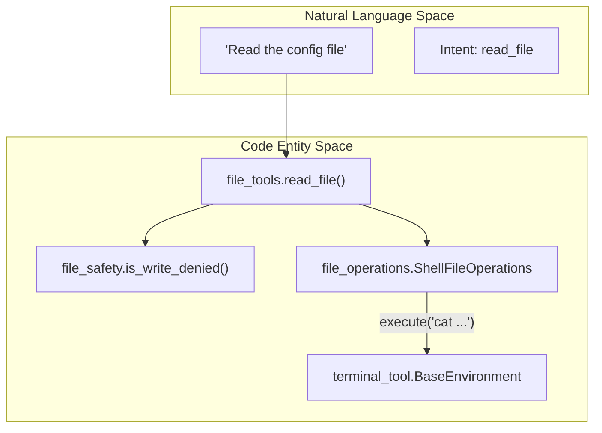
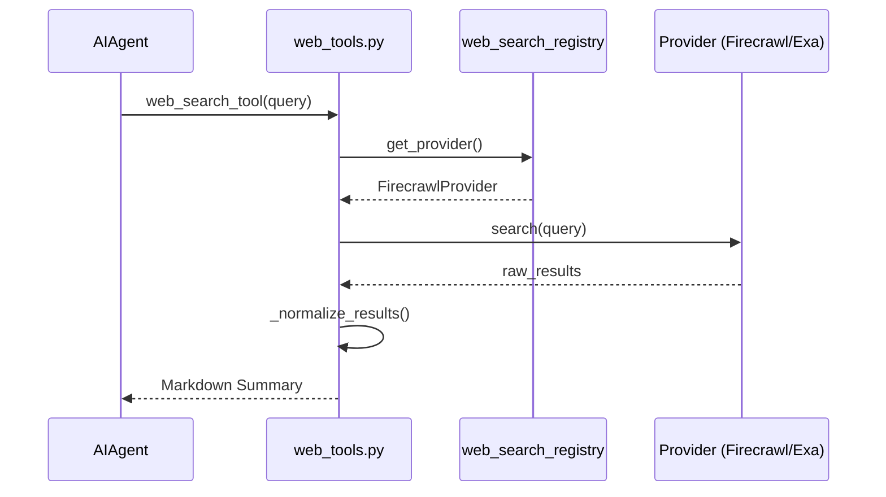
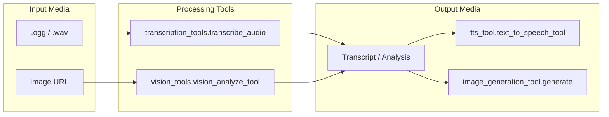

# File, Web & Vision Tools

Relevant source files

The following files were used as context for generating this wiki page:

- [agent/display.py](../agent/display.py)
- [agent/file_safety.py](../agent/file_safety.py)
- [agent/image_gen_provider.py](../agent/image_gen_provider.py)
- contributors/emails/valda68k@gmail.com
- [hermes_cli/checkpoints.py](../hermes_cli/checkpoints.py)
- [hermes_cli/dep_ensure.py](../hermes_cli/dep_ensure.py)
- [plugins/image_gen/fal/__init__.py](../plugins/image_gen/fal/__init__.py)
- [plugins/image_gen/krea/__init__.py](../plugins/image_gen/krea/__init__.py)
- [plugins/image_gen/krea/plugin.yaml](../plugins/image_gen/krea/plugin.yaml)
- [plugins/image_gen/openai-codex/__init__.py](../plugins/image_gen/openai-codex/__init__.py)
- [plugins/image_gen/openai-codex/plugin.yaml](../plugins/image_gen/openai-codex/plugin.yaml)
- [plugins/web/ddgs/__init__.py](../plugins/web/ddgs/__init__.py)
- [plugins/web/ddgs/_search_worker.py](../plugins/web/ddgs/_search_worker.py)
- [plugins/web/ddgs/plugin.yaml](../plugins/web/ddgs/plugin.yaml)
- [plugins/web/ddgs/provider.py](../plugins/web/ddgs/provider.py)
- [plugins/web/exa/__init__.py](../plugins/web/exa/__init__.py)
- [plugins/web/exa/plugin.yaml](../plugins/web/exa/plugin.yaml)
- [plugins/web/exa/provider.py](../plugins/web/exa/provider.py)
- [plugins/web/firecrawl/__init__.py](../plugins/web/firecrawl/__init__.py)
- [plugins/web/firecrawl/plugin.yaml](../plugins/web/firecrawl/plugin.yaml)
- [plugins/web/firecrawl/provider.py](../plugins/web/firecrawl/provider.py)
- [plugins/web/parallel/provider.py](../plugins/web/parallel/provider.py)
- [plugins/web/searxng/__init__.py](../plugins/web/searxng/__init__.py)
- [plugins/web/searxng/plugin.yaml](../plugins/web/searxng/plugin.yaml)
- [plugins/web/searxng/provider.py](../plugins/web/searxng/provider.py)
- [plugins/web/xai/provider.py](../plugins/web/xai/provider.py)
- [skills/social-media/xurl/SKILL.md](../skills/social-media/xurl/SKILL.md)
- [skills/software-development/dogfood/SKILL.md](../skills/software-development/dogfood/SKILL.md)
- [skills/software-development/dogfood/references/issue-taxonomy.md](../skills/software-development/dogfood/references/issue-taxonomy.md)
- [skills/software-development/dogfood/templates/dogfood-report-template.md](../skills/software-development/dogfood/templates/dogfood-report-template.md)
- [skills/software-development/hermes-agent-skill-authoring/SKILL.md](../skills/software-development/hermes-agent-skill-authoring/SKILL.md)
- [tests/agent/lsp/test_shell_linter_lsp_skip.py](../tests/agent/lsp/test_shell_linter_lsp_skip.py)
- [tests/agent/test_auxiliary_config_bridge.py](../tests/agent/test_auxiliary_config_bridge.py)
- [tests/agent/test_display.py](../tests/agent/test_display.py)
- [tests/agent/test_display_todo_progress.py](../tests/agent/test_display_todo_progress.py)
- [tests/agent/test_file_safety.py](../tests/agent/test_file_safety.py)
- [tests/agent/test_file_safety_credentials.py](../tests/agent/test_file_safety_credentials.py)
- [tests/agent/test_file_safety_session_state.py](../tests/agent/test_file_safety_session_state.py)
- [tests/agent/test_reasoning_stale_timeout_floor.py](../tests/agent/test_reasoning_stale_timeout_floor.py)
- [tests/hermes_cli/test_config.py](../tests/hermes_cli/test_config.py)
- [tests/hermes_cli/test_dep_ensure.py](../tests/hermes_cli/test_dep_ensure.py)
- [tests/hermes_cli/test_plugin_auxiliary_tasks.py](../tests/hermes_cli/test_plugin_auxiliary_tasks.py)
- [tests/hermes_cli/test_update_zip_symlink_reject.py](../tests/hermes_cli/test_update_zip_symlink_reject.py)
- [tests/integration/test_vision_docker_resolve.py](../tests/integration/test_vision_docker_resolve.py)
- [tests/integration/test_web_tools.py](../tests/integration/test_web_tools.py)
- [tests/plugins/image_gen/test_krea_provider.py](../tests/plugins/image_gen/test_krea_provider.py)
- [tests/plugins/image_gen/test_openai_codex_provider.py](../tests/plugins/image_gen/test_openai_codex_provider.py)
- [tests/plugins/web/test_web_search_provider_plugins.py](../tests/plugins/web/test_web_search_provider_plugins.py)
- [tests/run_agent/repro_48013_image_shrink_brick.py](../tests/run_agent/repro_48013_image_shrink_brick.py)
- [tests/run_agent/test_image_shrink_recovery.py](../tests/run_agent/test_image_shrink_recovery.py)
- [tests/skills/test_xurl_article_ingestion_docs.py](../tests/skills/test_xurl_article_ingestion_docs.py)
- [tests/skills/test_xurl_x_search_routing.py](../tests/skills/test_xurl_x_search_routing.py)
- [tests/test_install_sh_browser_install.py](../tests/test_install_sh_browser_install.py)
- [tests/test_toolsets.py](../tests/test_toolsets.py)
- [tests/tools/conftest.py](../tests/tools/conftest.py)
- [tests/tools/test_browser_camofox.py](../tests/tools/test_browser_camofox.py)
- [tests/tools/test_browser_camofox_persistence.py](../tests/tools/test_browser_camofox_persistence.py)
- [tests/tools/test_browser_camofox_private_page_guard.py](../tests/tools/test_browser_camofox_private_page_guard.py)
- [tests/tools/test_browser_camofox_state.py](../tests/tools/test_browser_camofox_state.py)
- [tests/tools/test_browser_chromium_check.py](../tests/tools/test_browser_chromium_check.py)
- [tests/tools/test_browser_cleanup.py](../tests/tools/test_browser_cleanup.py)
- [tests/tools/test_browser_console.py](../tests/tools/test_browser_console.py)
- [tests/tools/test_browser_hardening.py](../tests/tools/test_browser_hardening.py)
- [tests/tools/test_browser_homebrew_paths.py](../tests/tools/test_browser_homebrew_paths.py)
- [tests/tools/test_browser_type_redaction.py](../tests/tools/test_browser_type_redaction.py)
- [tests/tools/test_checkpoint_manager.py](../tests/tools/test_checkpoint_manager.py)
- [tests/tools/test_container_cwd_sanitize.py](../tests/tools/test_container_cwd_sanitize.py)
- [tests/tools/test_file_operations.py](../tests/tools/test_file_operations.py)
- [tests/tools/test_file_operations_edge_cases.py](../tests/tools/test_file_operations_edge_cases.py)
- [tests/tools/test_file_read_guards.py](../tests/tools/test_file_read_guards.py)
- [tests/tools/test_file_staleness.py](../tests/tools/test_file_staleness.py)
- [tests/tools/test_file_tools.py](../tests/tools/test_file_tools.py)
- [tests/tools/test_file_tools_container_config.py](../tests/tools/test_file_tools_container_config.py)
- [tests/tools/test_file_tools_cwd_resolution.py](../tests/tools/test_file_tools_cwd_resolution.py)
- [tests/tools/test_file_tools_tilde_profile.py](../tests/tools/test_file_tools_tilde_profile.py)
- [tests/tools/test_file_write_safety.py](../tests/tools/test_file_write_safety.py)
- [tests/tools/test_fuzzy_match.py](../tests/tools/test_fuzzy_match.py)
- [tests/tools/test_image_generation.py](../tests/tools/test_image_generation.py)
- [tests/tools/test_image_generation_artifacts.py](../tests/tools/test_image_generation_artifacts.py)
- [tests/tools/test_image_generation_env.py](../tests/tools/test_image_generation_env.py)
- [tests/tools/test_image_generation_image_to_image.py](../tests/tools/test_image_generation_image_to_image.py)
- [tests/tools/test_image_source.py](../tests/tools/test_image_source.py)
- [tests/tools/test_line_ending_preservation.py](../tests/tools/test_line_ending_preservation.py)
- [tests/tools/test_modal_sandbox_fixes.py](../tests/tools/test_modal_sandbox_fixes.py)
- [tests/tools/test_patch_failure_tracking.py](../tests/tools/test_patch_failure_tracking.py)
- [tests/tools/test_patch_parser.py](../tests/tools/test_patch_parser.py)
- [tests/tools/test_read_loop_detection.py](../tests/tools/test_read_loop_detection.py)
- [tests/tools/test_resolve_path.py](../tests/tools/test_resolve_path.py)
- [tests/tools/test_session_cwd_store.py](../tests/tools/test_session_cwd_store.py)
- [tests/tools/test_session_search.py](../tests/tools/test_session_search.py)
- [tests/tools/test_terminal_task_cwd.py](../tests/tools/test_terminal_task_cwd.py)
- [tests/tools/test_tool_search.py](../tests/tools/test_tool_search.py)
- [tests/tools/test_transcription.py](../tests/tools/test_transcription.py)
- [tests/tools/test_transcription_dotenv_fallback.py](../tests/tools/test_transcription_dotenv_fallback.py)
- [tests/tools/test_transcription_tools.py](../tests/tools/test_transcription_tools.py)
- [tests/tools/test_tts_command_providers.py](../tests/tools/test_tts_command_providers.py)
- [tests/tools/test_tts_deepinfra.py](../tests/tools/test_tts_deepinfra.py)
- [tests/tools/test_tts_dotenv_fallback.py](../tests/tools/test_tts_dotenv_fallback.py)
- [tests/tools/test_tts_mistral.py](../tests/tools/test_tts_mistral.py)
- [tests/tools/test_tts_piper.py](../tests/tools/test_tts_piper.py)
- [tests/tools/test_video_analyze.py](../tests/tools/test_video_analyze.py)
- [tests/tools/test_vision_native_fast_path.py](../tests/tools/test_vision_native_fast_path.py)
- [tests/tools/test_vision_tools.py](../tests/tools/test_vision_tools.py)
- [tests/tools/test_web_providers.py](../tests/tools/test_web_providers.py)
- [tests/tools/test_web_providers_brave_free.py](../tests/tools/test_web_providers_brave_free.py)
- [tests/tools/test_web_providers_ddgs.py](../tests/tools/test_web_providers_ddgs.py)
- [tests/tools/test_web_providers_searxng.py](../tests/tools/test_web_providers_searxng.py)
- [tests/tools/test_web_providers_xai.py](../tests/tools/test_web_providers_xai.py)
- [tests/tools/test_web_tools_config.py](../tests/tools/test_web_tools_config.py)
- [tests/tools/test_web_tools_dict_urls.py](../tests/tools/test_web_tools_dict_urls.py)
- [tests/tools/test_web_tools_tavily.py](../tests/tools/test_web_tools_tavily.py)
- [tests/tools/test_web_tools_truncate.py](../tests/tools/test_web_tools_truncate.py)
- [tests/tools/test_website_policy.py](../tests/tools/test_website_policy.py)
- [tests/tools/test_write_deny.py](../tests/tools/test_write_deny.py)
- [tests/tools/test_x_search_tool.py](../tests/tools/test_x_search_tool.py)
- [tools/browser_camofox.py](../tools/browser_camofox.py)
- [tools/browser_tool.py](../tools/browser_tool.py)
- [tools/checkpoint_manager.py](../tools/checkpoint_manager.py)
- [tools/file_operations.py](../tools/file_operations.py)
- [tools/file_tools.py](../tools/file_tools.py)
- [tools/fuzzy_match.py](../tools/fuzzy_match.py)
- [tools/image_generation_tool.py](../tools/image_generation_tool.py)
- [tools/image_source.py](../tools/image_source.py)
- [tools/patch_parser.py](../tools/patch_parser.py)
- [tools/session_search_tool.py](../tools/session_search_tool.py)
- [tools/tool_search.py](../tools/tool_search.py)
- [tools/transcription_tools.py](../tools/transcription_tools.py)
- [tools/tts_tool.py](../tools/tts_tool.py)
- [tools/vision_tools.py](../tools/vision_tools.py)
- [tools/web_tools.py](../tools/web_tools.py)
- [tools/website_policy.py](../tools/website_policy.py)
- [tools/x_search_tool.py](../tools/x_search_tool.py)
- [tools/xai_http.py](../tools/xai_http.py)
- [website/docs/developer-guide/image-gen-provider-plugin.md](../website/docs/developer-guide/image-gen-provider-plugin.md)
- [website/docs/integrations/index.md](../website/docs/integrations/index.md)
- [website/docs/reference/tools-reference.md](../website/docs/reference/tools-reference.md)
- [website/docs/reference/toolsets-reference.md](../website/docs/reference/toolsets-reference.md)
- [website/docs/user-guide/checkpoints-and-rollback.md](../website/docs/user-guide/checkpoints-and-rollback.md)
- [website/docs/user-guide/features/browser.md](../website/docs/user-guide/features/browser.md)
- [website/docs/user-guide/features/image-generation.md](../website/docs/user-guide/features/image-generation.md)
- [website/docs/user-guide/features/overview.md](../website/docs/user-guide/features/overview.md)
- [website/docs/user-guide/features/tool-gateway.md](../website/docs/user-guide/features/tool-gateway.md)
- [website/docs/user-guide/features/tool-search.md](../website/docs/user-guide/features/tool-search.md)
- [website/docs/user-guide/features/tools.md](../website/docs/user-guide/features/tools.md)
- [website/docs/user-guide/features/tts.md](../website/docs/user-guide/features/tts.md)
- [website/docs/user-guide/features/x-search.md](../website/docs/user-guide/features/x-search.md)
- [website/docs/user-guide/git-worktrees.md](../website/docs/user-guide/git-worktrees.md)
- [website/docs/user-guide/skills/bundled/social-media/social-media-xurl.md](../website/docs/user-guide/skills/bundled/social-media/social-media-xurl.md)
- [website/docs/user-guide/skills/bundled/software-development/software-development-dogfood.md](../website/docs/user-guide/skills/bundled/software-development/software-development-dogfood.md)
- [website/docs/user-guide/skills/bundled/software-development/software-development-hermes-agent-skill-authoring.md](../website/docs/user-guide/skills/bundled/software-development/software-development-hermes-agent-skill-authoring.md)
- [website/docs/user-guide/skills/optional/dogfood/dogfood-adversarial-ux-test.md](../website/docs/user-guide/skills/optional/dogfood/dogfood-adversarial-ux-test.md)
- [website/i18n/zh-Hans/docusaurus-plugin-content-docs/current/user-guide/features/web-search.md](../website/i18n/zh-Hans/docusaurus-plugin-content-docs/current/user-guide/features/web-search.md)
- [website/i18n/zh-Hans/docusaurus-plugin-content-docs/current/user-guide/features/x-search.md](../website/i18n/zh-Hans/docusaurus-plugin-content-docs/current/user-guide/features/x-search.md)

This section covers the specialized toolsets Hermes Agent uses to interact with the physical and digital world beyond the terminal. These include robust file manipulation with safety guards, web navigation and content extraction, vision-based image analysis, and media generation (TTS, Image Gen).

## File Manipulation & Safety

Hermes provides a multi-layered file API that abstracts the underlying environment (local, Docker, SSH) into a unified set of operations.

### Architecture and Data Flow

File operations are split between high-level agent tools and low-level execution shims.

1.  **`file_tools.py`**: The entry point for the agent. It handles path resolution, character budgets, and safety checks before dispatching to the backend [tools/file_tools.py:2-20](../tools/file_tools.py#L2-L20).
2.  **`file_operations.py`**: Provides `ShellFileOperations`, which translates file requests (read, write, patch) into shell commands compatible with the active `BaseEnvironment` [tools/file_operations.py:8-26](../tools/file_operations.py#L8-L26).
3.  **`file_safety.py`**: A centralized policy engine that enforces a write-denylist for sensitive files like `~/.ssh/config`, `.env`, and system files [agent/file_safety.py:28-61](../agent/file_safety.py#L28-L61).

### Path Resolution and Worktrees
Paths are resolved relative to the `TERMINAL_CWD` of the current task. This ensures that if an agent is working in a git worktree, `read_file("main.py")` targets the worktree version rather than the primary repository [tools/file_tools.py:151-166](../tools/file_tools.py#L151-L166).

### File System Interaction Diagram

"Natural Language Space" to "Code Entity Space" mapping for file operations:

Sources: [tools/file_tools.py:1-25](../tools/file_tools.py#L1-L25), [tools/file_operations.py:1-26](../tools/file_operations.py#L1-L26), [agent/file_safety.py:1-10](../agent/file_safety.py#L1-L10)

### Key Safety Guards
*   **Character Budget**: Reads are capped at `file_read_max_chars` (default 100,000) to prevent context window exhaustion [tools/file_tools.py:60-84](../tools/file_tools.py#L60-L84).
*   **Device Blocklist**: Prevents reading from infinite or blocking devices like `/dev/urandom` or `/dev/tty` [tools/file_tools.py:139-148](../tools/file_tools.py#L139-L148).
*   **Write Denylist**: Blocks modifications to credentials, shell configs, and the Hermes `state.db` [agent/file_safety.py:101-147](../agent/file_safety.py#L101-L147).

---

## Web Search & Extraction

Hermes utilizes a pluggable web system supporting multiple backends for searching and scraping.

### Provider Registry
Web capabilities are managed via a registry that selects the best available provider based on API keys:
*   **Firecrawl**: Primary for high-quality extraction and search [tools/web_tools.py:46-60](../tools/web_tools.py#L46-L60).
*   **Exa / Tavily / Parallel**: Alternative search and crawl providers [tools/web_tools.py:15-18](../tools/web_tools.py#L15-L18).
*   **SearXNG / Brave**: Privacy-focused or free-tier alternatives [tools/web_tools.py:171-172](../tools/web_tools.py#L171-L172).

### Browser Automation (`browser_tool.py`)
For complex interactions, Hermes uses `agent-browser` to drive a headless Chromium instance.
*   **AriaSnapshots**: Uses accessibility trees to provide a text-based representation of the page, allowing non-vision models to "see" the UI [tools/browser_tool.py:11-13](../tools/browser_tool.py#L11-L13).
*   **CamoFox**: An optional anti-detection backend that routes browser operations through a REST API to bypass bot detection [tools/browser_tool.py:146-149](../tools/browser_tool.py#L146-L149).

### Web Tool Data Flow

Sources: [tools/web_tools.py:5-37](../tools/web_tools.py#L5-L37), [tools/web_tools.py:121-172](../tools/web_tools.py#L121-L172)

---

## Vision & Media Tools

### Vision Analysis (`vision_tools.py`)
The `vision_analyze_tool` allows the agent to describe and analyze images from URLs.
*   **Concurrency Control**: To prevent CPU exhaustion during base64 encoding/resizing, vision tasks are offloaded to a dedicated `ThreadPoolExecutor` sized to the host's CPU count [tools/vision_tools.py:98-108, 170-173](../tools/vision_tools.py#L98-L108).
*   **Auxiliary Routing**: Uses `async_call_llm` to route vision requests to specialized models (e.g., GPT-4o, Claude 3.5 Sonnet) independently of the main conversation model [tools/vision_tools.py:43, 25-29](../tools/vision_tools.py#L43).

### Media Generation and Processing
| Category | Tool / Module | Key Providers |
| :--- | :--- | :--- |
| **TTS** | `tts_tool.py` | Edge (Free), ElevenLabs, OpenAI, Piper (Local) [tools/tts_tool.py:5-15](../tools/tts_tool.py#L5-L15) |
| **STT** | `transcription_tools.py` | Faster-Whisper (Local), Groq, Mistral, xAI [tools/transcription_tools.py:7-14](../tools/transcription_tools.py#L7-L14) |
| **Image Gen** | `image_generation_tool.py` | FAL.ai (Flux, Z-Image, Recraft) [tools/image_generation_tool.py:97-127](../tools/image_generation_tool.py#L97-L127) |

### X (Twitter) Search
The `x_search_tool` (integrated via skills) allows the agent to query real-time social media data using the X API or specialized scrapers [skills/social-media/xurl/SKILL.md](../skills/social-media/xurl/SKILL.md).

### Media Pipeline Diagram

Sources: [tools/transcription_tools.py:23-28](../tools/transcription_tools.py#L23-L28), [tools/vision_tools.py:25-29](../tools/vision_tools.py#L25-L29), [tools/tts_tool.py:31-35](../tools/tts_tool.py#L31-L35), [tools/image_generation_tool.py:1-8](../tools/image_generation_tool.py#L1-L8)

---
