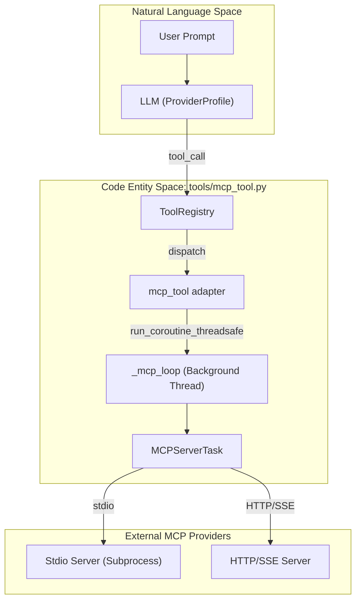
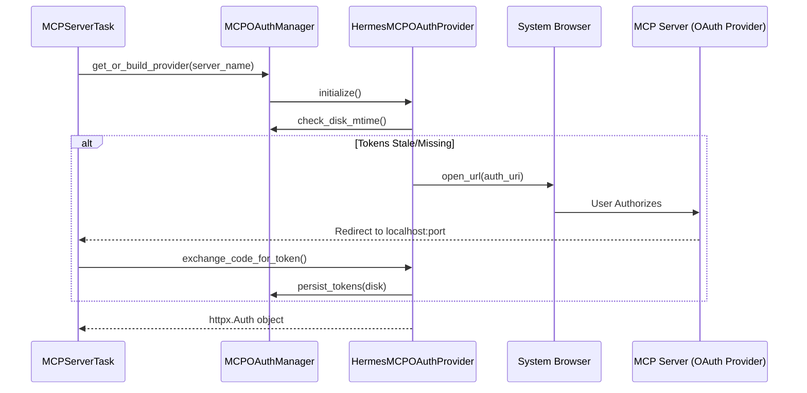

# MCP (Model Context Protocol) Integration

Relevant source files

The following files were used as context for generating this wiki page:

- [agent/transports/codex_event_projector.py](../agent/transports/codex_event_projector.py)
- [apps/desktop/src/lib/mcp-dashboard-oauth.test.ts](../apps/desktop/src/lib/mcp-dashboard-oauth.test.ts)
- [apps/desktop/src/lib/mcp-dashboard-oauth.ts](../apps/desktop/src/lib/mcp-dashboard-oauth.ts)
- [hermes_cli/mcp_config.py](../hermes_cli/mcp_config.py)
- [hermes_cli/subcommands/mcp.py](../hermes_cli/subcommands/mcp.py)
- [tests/hermes_cli/test_apply_profile_override.py](../tests/hermes_cli/test_apply_profile_override.py)
- [tests/hermes_cli/test_auth_toctou_file_modes.py](../tests/hermes_cli/test_auth_toctou_file_modes.py)
- [tests/hermes_cli/test_mcp_add_command_dest.py](../tests/hermes_cli/test_mcp_add_command_dest.py)
- [tests/hermes_cli/test_mcp_config.py](../tests/hermes_cli/test_mcp_config.py)
- [tests/hermes_cli/test_mcp_dashboard_oauth.py](../tests/hermes_cli/test_mcp_dashboard_oauth.py)
- [tests/tools/test_browser_orphan_reaper.py](../tests/tools/test_browser_orphan_reaper.py)
- [tests/tools/test_mcp_bridge_single_failure.py](../tests/tools/test_mcp_bridge_single_failure.py)
- [tests/tools/test_mcp_circuit_breaker.py](../tests/tools/test_mcp_circuit_breaker.py)
- [tests/tools/test_mcp_dashboard_oauth.py](../tests/tools/test_mcp_dashboard_oauth.py)
- [tests/tools/test_mcp_dynamic_discovery.py](../tests/tools/test_mcp_dynamic_discovery.py)
- [tests/tools/test_mcp_oauth.py](../tests/tools/test_mcp_oauth.py)
- [tests/tools/test_mcp_oauth_integration.py](../tests/tools/test_mcp_oauth_integration.py)
- [tests/tools/test_mcp_oauth_manager.py](../tests/tools/test_mcp_oauth_manager.py)
- [tests/tools/test_mcp_preflight_content_type.py](../tests/tools/test_mcp_preflight_content_type.py)
- [tests/tools/test_mcp_probe.py](../tests/tools/test_mcp_probe.py)
- [tests/tools/test_mcp_reconnect_signal.py](../tests/tools/test_mcp_reconnect_signal.py)
- [tests/tools/test_mcp_stability.py](../tests/tools/test_mcp_stability.py)
- [tests/tools/test_mcp_stdio_watchdog.py](../tests/tools/test_mcp_stdio_watchdog.py)
- [tests/tools/test_mcp_tool.py](../tests/tools/test_mcp_tool.py)
- [tests/tools/test_mcp_tool_401_handling.py](../tests/tools/test_mcp_tool_401_handling.py)
- [tests/tools/test_mcp_tool_issue_948.py](../tests/tools/test_mcp_tool_issue_948.py)
- [tests/tools/test_mcp_tool_session_expired.py](../tests/tools/test_mcp_tool_session_expired.py)
- [tools/mcp_dashboard_oauth.py](../tools/mcp_dashboard_oauth.py)
- [tools/mcp_oauth.py](../tools/mcp_oauth.py)
- [tools/mcp_oauth_manager.py](../tools/mcp_oauth_manager.py)
- [tools/mcp_stdio_watchdog.py](../tools/mcp_stdio_watchdog.py)
- [tools/mcp_tool.py](../tools/mcp_tool.py)
- [web/src/lib/mcp-dashboard-oauth.test.ts](../web/src/lib/mcp-dashboard-oauth.test.ts)
- [web/src/lib/mcp-dashboard-oauth.ts](../web/src/lib/mcp-dashboard-oauth.ts)

The Model Context Protocol (MCP) integration allows Hermes to connect to external tool providers via a standardized protocol. This subsystem handles the discovery, lifecycle management, and execution of tools hosted on remote or local MCP servers, effectively extending the agent's capabilities beyond its built-in toolset.

## Architecture & Data Flow

Hermes implements an MCP client that supports multiple transport layers (Stdio, HTTP, SSE) and manages long-lived connections to various servers defined in the user configuration.

### System Overview Diagram

The following diagram illustrates how MCP servers are integrated into the Hermes tool registry and the path a tool call takes from the LLM to an external provider.

**Diagram: MCP Integration and Tool Dispatch**

Sources: `[tools/mcp_tool.py:75-90](../tools/mcp_tool.py#L75-L90)`, `[tools/mcp_tool.py:1053-1070](../tools/mcp_tool.py#L1053-L1070)`

## Implementation Details

### MCP Tool Adapter
The `mcp_tool.py` module serves as the primary bridge. It reads configuration from `config.yaml` under the `mcp_servers` key `[tools/mcp_tool.py:15-30](../tools/mcp_tool.py#L15-L30)`. A dedicated background event loop, `_mcp_loop`, runs in a daemon thread to manage asynchronous transport operations without blocking the main agent execution `[tools/mcp_tool.py:76-79](../tools/mcp_tool.py#L76-L79)`.

### Server Lifecycle & Discovery
Each configured server is managed by an `MCPServerTask` `[tools/mcp_tool.py:44-48](../tools/mcp_tool.py#L44-L48)`.
1.  **Discovery**: Upon startup or manual refresh, Hermes connects to the server and calls `list_tools` to populate the `ToolRegistry` `[tools/mcp_tool.py:1053-1060](../tools/mcp_tool.py#L1053-L1060)`.
2.  **Stdio Watchdog**: For local subprocesses, a watchdog monitors the health of the pipe. If the subprocess crashes, the `mcp_stdio_watchdog.py` ensures cleanup and prevents orphaned processes `[tools/mcp_stdio_watchdog.py:1-15](../tools/mcp_stdio_watchdog.py#L1-L15)`.
3.  **Circuit Breaker**: To prevent "thundering herd" failures, a circuit breaker trips after `_CIRCUIT_BREAKER_THRESHOLD` consecutive failures `[tests/tools/test_mcp_circuit_breaker.py:3-12](../tests/tools/test_mcp_circuit_breaker.py#L3-L12)`. It enters a "half-open" state after a cooldown period to probe if the server has recovered `[tests/tools/test_mcp_circuit_breaker.py:104-112](../tests/tools/test_mcp_circuit_breaker.py#L104-L112)`.

### Transport Security & Redirection
- **Stderr Isolation**: Stdio MCP servers often write logs to `stderr`. To prevent terminal corruption in the TUI, Hermes redirects all MCP `stderr` to a shared log file at `~/.hermes/logs/mcp-stderr.log` `[tools/mcp_tool.py:130-142](../tools/mcp_tool.py#L130-L142)`.
- **Environment Filtering**: Only specific environment variables are passed to MCP subprocesses to prevent credential leakage `[tools/mcp_tool.py:66-67](../tools/mcp_tool.py#L66-L67)`.

## OAuth 2.1 Integration

For MCP servers requiring dynamic authentication, Hermes implements a full OAuth 2.1 flow with PKCE (Proof Key for Code Exchange).

**Diagram: MCP OAuth Flow**

Sources: `[tools/mcp_oauth.py:3-19](../tools/mcp_oauth.py#L3-L19)`, `[tools/mcp_oauth_manager.py:106-130](../tools/mcp_oauth_manager.py#L106-L130)`

### Token Management
- **`HermesTokenStorage`**: Persists tokens to `~/.hermes/mcp-tokens/` with strict `0o600` file permissions to prevent unauthorized access `[tools/mcp_oauth.py:134-145](../tools/mcp_oauth.py#L134-L145)`, `[tests/tools/test_mcp_oauth.py:65-72](../tests/tools/test_mcp_oauth.py#L65-L72)`.
- **`MCPOAuthManager`**: A process-wide singleton that handles 401 deduplication. If multiple concurrent tool calls receive a 401 Unauthorized error, the manager ensures only one re-authentication flow is triggered `[tools/mcp_oauth_manager.py:2-15](../tools/mcp_oauth_manager.py#L2-L15)`.
- **Cross-Process Sync**: The manager uses `mtime`-based disk watching to detect if tokens were refreshed by another Hermes instance or a cron job `[tools/mcp_oauth_manager.py:7-9](../tools/mcp_oauth_manager.py#L7-L9)`.

## Session Handling & Stability

| Feature | Implementation | Purpose |
| :--- | :--- | :--- |
| **Session Expiry Recovery** | `_is_session_expired_error` | Detects "Invalid session" JSON-RPC errors and triggers a transport-level reconnect without losing the tool call `[tests/tools/test_mcp_tool_session_expired.py:3-12](../tests/tools/test_mcp_tool_session_expired.py#L3-L12)`. |
| **Preflight Check** | `_preflight_content_type` | Probes HTTP endpoints before connection to ensure they actually speak MCP (JSON/SSE) rather than serving a generic HTML landing page `[tests/tools/test_mcp_preflight_content_type.py:1-10](../tests/tools/test_mcp_preflight_content_type.py#L1-L10)`. |
| **Stdio Recycling** | `idle_timeout_seconds` | Automatically shuts down idle stdio subprocesses to save system resources, restarting them transparently on the next tool call `[tools/mcp_tool.py:26-27](../tools/mcp_tool.py#L26-L27)`. |
| **Orphan Reaper** | `_kill_orphaned_mcp_children` | Ensures that if the main Hermes process is killed (SIGKILL), the MCP child processes are also terminated `[tests/tools/test_mcp_stability.py:108-115](../tests/tools/test_mcp_stability.py#L108-L115)`. |

## Configuration CLI

The `hermes mcp` subcommand provides an interactive interface for managing these servers.

- **`hermes mcp add`**: Guides the user through configuring a server, including probing for available tools and setting up Bearer or OAuth authentication `[hermes_cli/mcp_config.py:183-196](../hermes_cli/mcp_config.py#L183-L196)`.
- **`hermes mcp list`**: Displays configured servers, their connection status, and which tools are currently enabled `[tests/hermes_cli/test_mcp_config.py:83-90](../tests/hermes_cli/test_mcp_config.py#L83-L90)`.
- **`hermes mcp remove`**: Deletes the server configuration and associated OAuth tokens from disk `[tests/hermes_cli/test_mcp_config.py:157-165](../tests/hermes_cli/test_mcp_config.py#L157-L165)`.

Sources: `[hermes_cli/mcp_config.py:1-9](../hermes_cli/mcp_config.py#L1-L9)`, `[tools/mcp_tool.py:1-90](../tools/mcp_tool.py#L1-L90)`, `[tools/mcp_oauth.py:1-35](../tools/mcp_oauth.py#L1-L35)`.

---
