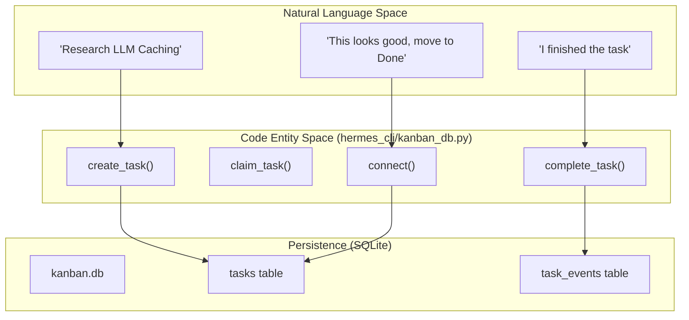
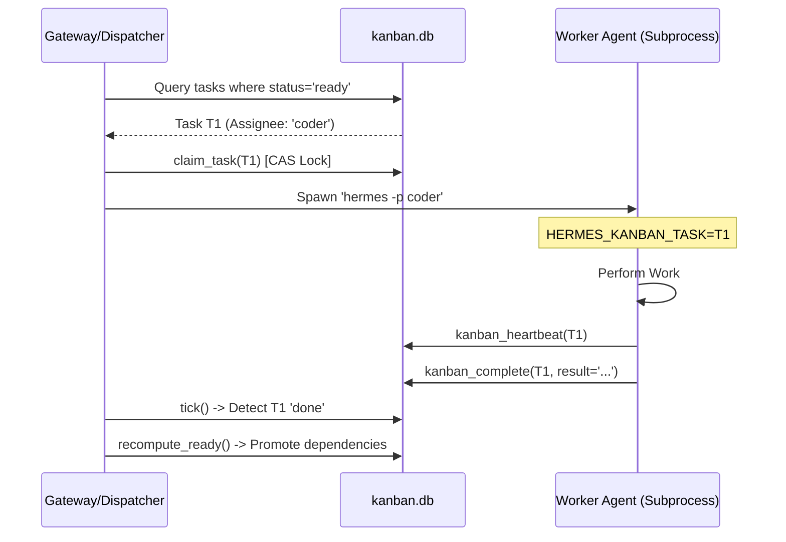

# Delegation, Kanban & Multi-Agent Coordination

Relevant source files

The following files were used as context for generating this wiki page:

- contributors/emails/hello@ianks.com
- [gateway/channel_directory.py](../gateway/channel_directory.py)
- [gateway/mirror.py](../gateway/mirror.py)
- [gateway/session_context.py](../gateway/session_context.py)
- [hermes_cli/kanban.py](../hermes_cli/kanban.py)
- [hermes_cli/kanban_db.py](../hermes_cli/kanban_db.py)
- [hermes_cli/kanban_diagnostics.py](../hermes_cli/kanban_diagnostics.py)
- [mcp_serve.py](../mcp_serve.py)
- [plugins/kanban/dashboard/dist/index.js](../plugins/kanban/dashboard/dist/index.js)
- [plugins/kanban/dashboard/dist/style.css](../plugins/kanban/dashboard/dist/style.css)
- [plugins/kanban/dashboard/plugin_api.py](../plugins/kanban/dashboard/plugin_api.py)
- [tests/agent/test_memory_boundary_commit.py](../tests/agent/test_memory_boundary_commit.py)
- [tests/cli/test_cli_new_session.py](../tests/cli/test_cli_new_session.py)
- [tests/gateway/test_35809_auto_reset_clean_context.py](../tests/gateway/test_35809_auto_reset_clean_context.py)
- [tests/gateway/test_async_delivery_capability.py](../tests/gateway/test_async_delivery_capability.py)
- [tests/gateway/test_async_session_db.py](../tests/gateway/test_async_session_db.py)
- [tests/gateway/test_channel_directory.py](../tests/gateway/test_channel_directory.py)
- [tests/gateway/test_completion_delivery.py](../tests/gateway/test_completion_delivery.py)
- [tests/gateway/test_mirror.py](../tests/gateway/test_mirror.py)
- [tests/gateway/test_session_env.py](../tests/gateway/test_session_env.py)
- [tests/gateway/test_title_command.py](../tests/gateway/test_title_command.py)
- [tests/hermes_cli/test_kanban_cli.py](../tests/hermes_cli/test_kanban_cli.py)
- [tests/hermes_cli/test_kanban_core_functionality.py](../tests/hermes_cli/test_kanban_core_functionality.py)
- [tests/hermes_cli/test_kanban_db.py](../tests/hermes_cli/test_kanban_db.py)
- [tests/hermes_cli/test_kanban_diagnostics.py](../tests/hermes_cli/test_kanban_diagnostics.py)
- [tests/plugins/test_kanban_dashboard_plugin.py](../tests/plugins/test_kanban_dashboard_plugin.py)
- [tests/run_agent/test_commit_memory_session_context_engine.py](../tests/run_agent/test_commit_memory_session_context_engine.py)
- [tests/test_mcp_serve.py](../tests/test_mcp_serve.py)
- [tests/tools/test_async_delegation.py](../tests/tools/test_async_delegation.py)
- [tests/tools/test_delegate.py](../tests/tools/test_delegate.py)
- [tests/tools/test_kanban_tools.py](../tests/tools/test_kanban_tools.py)
- [tests/tools/test_send_message_tool.py](../tests/tools/test_send_message_tool.py)
- [tools/async_delegation.py](../tools/async_delegation.py)
- [tools/delegate_tool.py](../tools/delegate_tool.py)
- [tools/kanban_tools.py](../tools/kanban_tools.py)
- [tools/send_message_tool.py](../tools/send_message_tool.py)
- [website/docs/guides/delegation-patterns.md](../website/docs/guides/delegation-patterns.md)
- [website/docs/user-guide/features/delegation.md](../website/docs/user-guide/features/delegation.md)
- [website/docs/user-guide/features/kanban-tutorial.md](../website/docs/user-guide/features/kanban-tutorial.md)
- [website/docs/user-guide/features/kanban-worker-lanes.md](../website/docs/user-guide/features/kanban-worker-lanes.md)
- [website/docs/user-guide/features/kanban.md](../website/docs/user-guide/features/kanban.md)
- [website/i18n/zh-Hans/docusaurus-plugin-content-docs/current/guides/delegation-patterns.md](../website/i18n/zh-Hans/docusaurus-plugin-content-docs/current/guides/delegation-patterns.md)
- [website/i18n/zh-Hans/docusaurus-plugin-content-docs/current/user-guide/features/delegation.md](../website/i18n/zh-Hans/docusaurus-plugin-content-docs/current/user-guide/features/delegation.md)
- [website/i18n/zh-Hans/docusaurus-plugin-content-docs/current/user-guide/features/kanban.md](../website/i18n/zh-Hans/docusaurus-plugin-content-docs/current/user-guide/features/kanban.md)

Hermes Agent employs a sophisticated multi-agent orchestration system centered around two primary primitives: recursive **Delegation** for hierarchical problem-solving and a SQLite-backed **Kanban Board** for asynchronous task lifecycle management. This architecture allows a single "Orchestrator" agent to spawn specialized "Workers," track their progress, and coordinate complex workflows across different execution environments.

## 1. Subagent Delegation (`delegate_tool`)

The `delegate_tool` allows an AIAgent instance to spawn child agents. Each child is an independent `AIAgent` instance with its own isolated conversation history and terminal session [tools/delegate_tool.py:3-18](../tools/delegate_tool.py#L3-L18).

### Delegation Lifecycle
1.  **Requirement Check**: The system verifies the environment supports delegation [tools/delegate_tool.py:64-66](../tools/delegate_tool.py#L64-L66).
2.  **Schema Customization**: The tool schema is dynamically updated to reflect the current user's `max_concurrent_children` and `max_spawn_depth` limits [tools/delegate_tool.py:91-117](../tools/delegate_tool.py#L91-L117).
3.  **Agent Construction**: The `_build_child_agent` function initializes the subagent, inheriting the parent's toolsets while stripping "blocked" tools like `delegate_task` (to prevent infinite recursion by default), `send_message`, and `cronjob` [tools/delegate_tool.py:45-54](../tools/delegate_tool.py#L45-L54), [tools/delegate_tool.py:115-117](../tools/delegate_tool.py#L115-L117).
4.  **Prompt Assembly**: A focused system prompt is built from the delegated `goal` and `context` provided by the parent [tools/delegate_tool.py:141-153](../tools/delegate_tool.py#L141-L153).
5.  **Execution**: Subagents run within a `ThreadPoolExecutor`.

### Safety & Approval
Subagents inherit a specialized approval callback to prevent deadlocks with the parent TUI's `stdin`. By default, they use `_subagent_auto_deny` for dangerous commands unless `delegation.subagent_auto_approve` is enabled [tools/delegate_tool.py:58-112](../tools/delegate_tool.py#L58-L112).

### Subagent vs. Orchestrator Roles
| Role | Capabilities | Tool Access |
| :--- | :--- | :--- |
| **Worker** | Executes specific leaf tasks. | Terminal, File, Web. Cannot delegate further. |
| **Orchestrator** | Coordinates other agents. | Re-enables `delegate_task` up to `MAX_DEPTH`. [tools/delegate_tool.py:115-117](../tools/delegate_tool.py#L115-L117) |

**Sources:** [tools/delegate_tool.py:1-170](../tools/delegate_tool.py#L1-L170), [tests/tools/test_delegate.py:64-159](../tests/tools/test_delegate.py#L64-L159)

---

## 2. The Kanban Board System

The Kanban system is the primary coordination primitive for persistent, multi-step work. It uses a shared SQLite database (`kanban.db`) located in the Hermes root directory [hermes_cli/kanban_db.py:1-9](../hermes_cli/kanban_db.py#L1-L9).

### Data Flow: Natural Language to Code Entities
This diagram bridges how high-level project concepts map to specific database operations and CLI entities.

**Sources:** [hermes_cli/kanban_db.py:1-69](../hermes_cli/kanban_db.py#L1-L69), [hermes_cli/kanban.py:1-31](../hermes_cli/kanban.py#L1-L31)

### Concurrency & Locking
The system uses **WAL (Write-Ahead Logging)** mode and `BEGIN IMMEDIATE` transactions. Worker claiming is handled via **Compare-and-Swap (CAS)** updates on `tasks.status` and `tasks.claim_lock`, ensuring that only one worker can successfully claim a task even in high-concurrency environments [hermes_cli/kanban_db.py:61-69](../hermes_cli/kanban_db.py#L61-L69).

### Task Lifecycle Statuses
Tasks move through a set of valid statuses [hermes_cli/kanban_db.py:102](../hermes_cli/kanban_db.py#L102):
*   `triage`: Initial ideas.
*   `todo`: Defined tasks waiting for assignment.
*   `ready`: Dependencies satisfied; ready for a worker.
*   `running`: Currently claimed by an agent.
*   `blocked`: Waiting on human input or external capabilities.
*   `done`: Completed.

**Sources:** [hermes_cli/kanban_db.py:102-135](../hermes_cli/kanban_db.py#L102-L135), [hermes_cli/kanban.py:36-44](../hermes_cli/kanban.py#L36-L44)

---

## 3. Multi-Agent Coordination Protocol

When an agent runs as a Kanban worker, it is spawned with specific environment variables: `HERMES_KANBAN_TASK` (the task ID) and `HERMES_KANBAN_RUN_ID` [tools/kanban_tools.py:106-107](../tools/kanban_tools.py#L106-L107), [tools/kanban_tools.py:141-150](../tools/kanban_tools.py#L141-L150).

### Tool Gating Logic
The availability of Kanban tools depends on the agent's context:
*   **Worker Context**: Sees lifecycle tools (`kanban_complete`, `kanban_block`, `kanban_heartbeat`) but is restricted from board-routing tools (`kanban_list`, `kanban_unblock`) to prevent cross-task interference [tools/kanban_tools.py:92-108](../tools/kanban_tools.py#L92-L108), [tools/kanban_tools.py:111-124](../tools/kanban_tools.py#L111-L124).
*   **Orchestrator Context**: (Profile with `kanban` toolset enabled) Sees the full suite of management tools [tools/kanban_tools.py:122-124](../tools/kanban_tools.py#L122-L124).

### The Dispatcher
The dispatcher (embedded in the Gateway) monitors the `tasks` table. On every tick (default 60s), it identifies `ready` tasks and spawns worker subprocesses using the assigned profile [hermes_cli/kanban.py:153-188](../hermes_cli/kanban.py#L153-L188).

### Coordination Diagram: Dispatcher and Workers

**Sources:** [hermes_cli/kanban.py:137-188](../hermes_cli/kanban.py#L137-L188), [hermes_cli/kanban_db.py:61-69](../hermes_cli/kanban_db.py#L61-L69), [tools/kanban_tools.py:92-124](../tools/kanban_tools.py#L92-L124)

---

## 4. Cross-Platform Delivery (`send_message_tool`)

The `send_message_tool` provides a unified interface for agents to communicate across different messaging platforms (Telegram, Discord, Slack, Feishu, etc.) [tools/send_message_tool.py:1-6](../tools/send_message_tool.py#L1-L6).

### Key Implementation Details:
*   **Target Resolution**: Supports complex regex-based resolution for Telegram topics, Slack conversation IDs (`C...`, `G...`, `D...`), and E.164 phone numbers for WhatsApp/Signal [tools/send_message_tool.py:22-58](../tools/send_message_tool.py#L22-L58).
*   **Media Handling**: Automatically detects media types (Image, Video, Audio, Voice) and applies platform-specific logic, such as splitting text into native captions or separate messages based on length limits [tools/send_message_tool.py:64-127](../tools/send_message_tool.py#L64-L127).
*   **Security**: Includes a `_sanitize_error_text` function to redact API keys and tokens from error messages before they are returned to the LLM or user [tools/send_message_tool.py:138-143](../tools/send_message_tool.py#L138-L143).

**Sources:** [tools/send_message_tool.py:1-143](../tools/send_message_tool.py#L1-L143), [tests/tools/test_send_message_tool.py:29-71](../tests/tools/test_send_message_tool.py#L29-L71)

---
