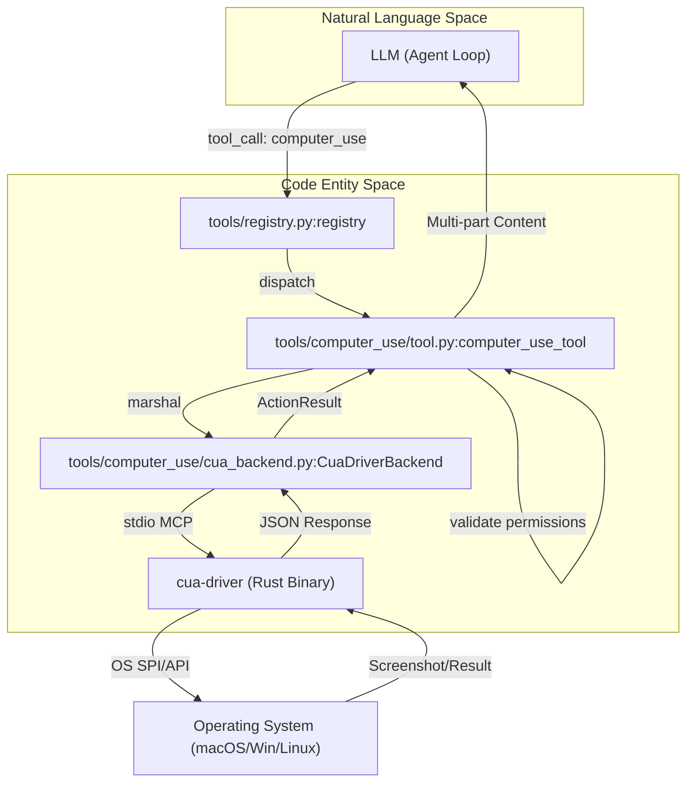
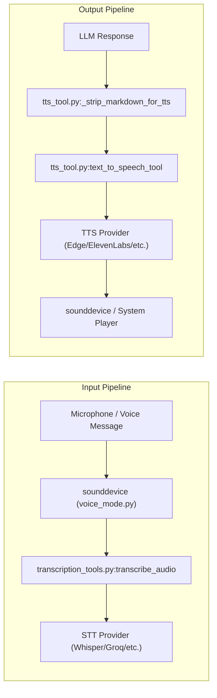

# Computer Use & Voice Mode

Relevant source files

The following files were used as context for generating this wiki page:

- [agent/delegation_context.py](../agent/delegation_context.py)
- [apps/desktop/src/app/settings/computer-use-panel.tsx](../apps/desktop/src/app/settings/computer-use-panel.tsx)
- contributors/emails/dickson.neoh@gmail.com
- [plugins/web/xai/provider.py](../plugins/web/xai/provider.py)
- [tests/computer_use/test_cua_cli_fallback_env.py](../tests/computer_use/test_cua_cli_fallback_env.py)
- [tests/computer_use/test_cua_no_overlay.py](../tests/computer_use/test_cua_no_overlay.py)
- [tests/computer_use/test_cua_perf_knobs.py](../tests/computer_use/test_cua_perf_knobs.py)
- [tests/computer_use/test_cua_spawn_env_sanitization.py](../tests/computer_use/test_cua_spawn_env_sanitization.py)
- [tests/computer_use/test_doctor.py](../tests/computer_use/test_doctor.py)
- [tests/computer_use/test_permissions_resolution.py](../tests/computer_use/test_permissions_resolution.py)
- [tests/hermes_cli/test_xai_model_flow.py](../tests/hermes_cli/test_xai_model_flow.py)
- [tests/tools/conftest.py](../tests/tools/conftest.py)
- [tests/tools/test_computer_use.py](../tests/tools/test_computer_use.py)
- [tests/tools/test_computer_use_capture_routing.py](../tests/tools/test_computer_use_capture_routing.py)
- [tests/tools/test_computer_use_cua_backend_linux.py](../tests/tools/test_computer_use_cua_backend_linux.py)
- [tests/tools/test_computer_use_delivery_ladder.py](../tests/tools/test_computer_use_delivery_ladder.py)
- [tests/tools/test_computer_use_vision_routing.py](../tests/tools/test_computer_use_vision_routing.py)
- [tests/tools/test_delegate_kanban_isolation.py](../tests/tools/test_delegate_kanban_isolation.py)
- [tests/tools/test_execute_code_approval_cluster.py](../tests/tools/test_execute_code_approval_cluster.py)
- [tests/tools/test_hermes_subprocess_env.py](../tests/tools/test_hermes_subprocess_env.py)
- [tests/tools/test_transcription.py](../tests/tools/test_transcription.py)
- [tests/tools/test_transcription_dotenv_fallback.py](../tests/tools/test_transcription_dotenv_fallback.py)
- [tests/tools/test_transcription_tools.py](../tests/tools/test_transcription_tools.py)
- [tests/tools/test_tts_command_providers.py](../tests/tools/test_tts_command_providers.py)
- [tests/tools/test_tts_deepinfra.py](../tests/tools/test_tts_deepinfra.py)
- [tests/tools/test_tts_dotenv_fallback.py](../tests/tools/test_tts_dotenv_fallback.py)
- [tests/tools/test_tts_mistral.py](../tests/tools/test_tts_mistral.py)
- [tests/tools/test_tts_piper.py](../tests/tools/test_tts_piper.py)
- [tests/tools/test_voice_cli_integration.py](../tests/tools/test_voice_cli_integration.py)
- [tests/tools/test_voice_mode.py](../tests/tools/test_voice_mode.py)
- [tests/tools/test_web_providers_xai.py](../tests/tools/test_web_providers_xai.py)
- [tools/computer_use/backend.py](../tools/computer_use/backend.py)
- [tools/computer_use/cua_backend.py](../tools/computer_use/cua_backend.py)
- [tools/computer_use/doctor.py](../tools/computer_use/doctor.py)
- [tools/computer_use/permissions.py](../tools/computer_use/permissions.py)
- [tools/computer_use/schema.py](../tools/computer_use/schema.py)
- [tools/computer_use/tool.py](../tools/computer_use/tool.py)
- [tools/computer_use/vision_routing.py](../tools/computer_use/vision_routing.py)
- [tools/transcription_tools.py](../tools/transcription_tools.py)
- [tools/tts_tool.py](../tools/tts_tool.py)
- [tools/voice_mode.py](../tools/voice_mode.py)
- [tools/xai_http.py](../tools/xai_http.py)
- [website/docs/user-guide/features/tts.md](../website/docs/user-guide/features/tts.md)
- [website/i18n/zh-Hans/docusaurus-plugin-content-docs/current/user-guide/features/web-search.md](../website/i18n/zh-Hans/docusaurus-plugin-content-docs/current/user-guide/features/web-search.md)

This section covers the Hermes Agent's capabilities for direct desktop interaction and high-fidelity audio processing. These systems bridge the gap between abstract LLM reasoning and physical/digital interaction via the Computer Use Agent (CUA) and a robust Voice/TTS pipeline.

## Computer Use Agent (CUA)

The Computer Use Agent allows Hermes to control a host machine's desktop environment (macOS, Windows, or Linux) using a universal tool schema. Unlike Anthropic-native implementations, Hermes uses a standard OpenAI function-calling schema, allowing any capable model to drive the desktop [tools/computer_use/tool.py:1-7](../tools/computer_use/tool.py#L1-L7).

### CUA Architecture & Driver
The backend is powered by `cua-driver`, a cross-platform Rust binary that exposes an MCP (Model Context Protocol) interface over stdio [tools/computer_use/cua_backend.py:1-11](../tools/computer_use/cua_backend.py#L1-L11).

*   **Platform Support**: Uses private SkyLight SPIs on macOS and stable Win32 APIs (SendInput + UI Automation) on Windows [tools/computer_use/cua_backend.py:29-34](../tools/computer_use/cua_backend.py#L29-L34). Linux support is provided via X11/Wayland AT-SPI [tools/computer_use/tool.py:8-12](../tools/computer_use/tool.py#L8-L12).
*   **Execution Model**: Python marshals sync calls through a dedicated asyncio event loop running on a background thread to interact with the asynchronous MCP SDK [tools/computer_use/cua_backend.py:3-5](../tools/computer_use/cua_backend.py#L3-L5).
*   **Safety Layers**: Actions are categorized into `_SAFE_ACTIONS` (e.g., `capture`, `wait`) and `_DESTRUCTIVE_ACTIONS` (e.g., `click`, `type`, `key`) [tools/computer_use/tool.py:80-86](../tools/computer_use/tool.py#L80-L86). Destructive actions require explicit approval unless a session-scoped override is active [tools/computer_use/tool.py:144-153](../tools/computer_use/tool.py#L144-L153).

### CUA Data Flow

The following diagram illustrates the flow from a model's tool call to the OS-level execution via `cua-driver`.

**CUA Tool Execution Flow**

Sources: [tools/computer_use/tool.py:1-50](../tools/computer_use/tool.py#L1-L50), [tools/computer_use/cua_backend.py:1-40](../tools/computer_use/cua_backend.py#L1-L40), [tools/registry.py:1-20](../tools/registry.py#L1-L20)

### Key Components
| Component | Role | File Reference |
| :--- | :--- | :--- |
| `COMPUTER_USE_SCHEMA` | Defines universal parameters (`action`, `coordinate`, `element`, `pid`) | [tools/computer_use/schema.py](../tools/computer_use/schema.py) |
| `CuaDriverBackend` | Manages the lifecycle of the `cua-driver` subprocess and MCP transport | [tools/computer_use/cua_backend.py:162-163](../tools/computer_use/cua_backend.py#L162-L163) |
| `ActionResult` | Standardized container for driver verdicts, including `verified` and `effect` | [tools/computer_use/cua_backend.py:111-123](../tools/computer_use/cua_backend.py#L111-L123) |
| `_BLOCKED_KEY_COMBOS` | Hard-coded blocklist for destructive keys (e.g., Cmd+Shift+Q) | [tools/computer_use/tool.py:90-103](../tools/computer_use/tool.py#L90-L103) |

## Voice Mode & Audio Pipeline

Hermes provides a full-duplex voice experience in the CLI and automated transcription for messaging gateways.

### Transcription (STT)
The `transcribe_audio` function acts as a router for multiple providers [tools/transcription_tools.py:23-28](../tools/transcription_tools.py#L23-L28).
*   **Local**: Uses `faster-whisper` for on-device, zero-cost transcription [tools/transcription_tools.py:7-8](../tools/transcription_tools.py#L7-L8).
*   **Cloud**: Supports Groq, OpenAI, Mistral, xAI, and ElevenLabs APIs [tools/transcription_tools.py:9-15](../tools/transcription_tools.py#L9-L15).
*   **Fallback Logic**: The system prefers `local` if available, then falls back to `groq` (free tier) before `openai` (paid) [tests/tools/test_transcription_tools.py:105-119](../tests/tools/test_transcription_tools.py#L105-L119).

### Text-to-Speech (TTS)
The `text_to_speech_tool` converts LLM responses into audio files [tools/tts_tool.py:32-35](../tools/tts_tool.py#L32-L35).
*   **Providers**: Includes Edge TTS (default), ElevenLabs, OpenAI, MiniMax, Mistral, Gemini, xAI, and local engines like Piper and KittenTTS [tools/tts_tool.py:5-15](../tools/tts_tool.py#L5-L15).
*   **CLI Integration**: In the REPL, responses are stripped of Markdown before being sent to the TTS engine to ensure natural speech [tests/tools/test_voice_cli_integration.py:47-64](../tests/tools/test_voice_cli_integration.py#L47-L64).

### Audio Pipeline Diagram

**Audio Processing Pipeline**

Sources: [tools/voice_mode.py:1-10](../tools/voice_mode.py#L1-L10), [tools/transcription_tools.py:1-28](../tools/transcription_tools.py#L1-L28), [tools/tts_tool.py:1-35](../tools/tts_tool.py#L1-L35)

## Daemon Pool & Non-blocking Execution

To prevent UI blocking during long-running tool operations (like generating long TTS audio or waiting for CUA actions), Hermes utilizes a background execution model.

*   **Async Marshalling**: The CUA backend runs a dedicated `asyncio` loop on a background thread to handle MCP communication without blocking the main agent loop [tools/computer_use/cua_backend.py:3-5](../tools/computer_use/cua_backend.py#L3-L5).
*   **Voice Processing**: Audio recording and playback in the CLI use a `_voice_lock` to protect state transitions (e.g., `_voice_recording`, `_voice_processing`) across threads [tests/tools/test_voice_cli_integration.py:23-34](../tests/tools/test_voice_cli_integration.py#L23-L34).
*   **Streaming TTS**: When enabled, the CLI engages a streaming gate that processes sentences as they are generated by the LLM, allowing for lower-latency playback [tests/tools/test_voice_cli_integration.py:180-196](../tests/tools/test_voice_cli_integration.py#L180-L196).

Sources: [tools/computer_use/cua_backend.py:1-50](../tools/computer_use/cua_backend.py#L1-L50), [tests/tools/test_voice_cli_integration.py:20-40](../tests/tools/test_voice_cli_integration.py#L20-L40), [tools/voice_mode.py:20-50](../tools/voice_mode.py#L20-L50)

---
