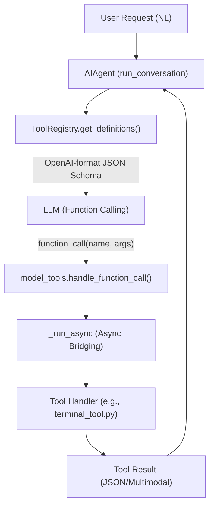
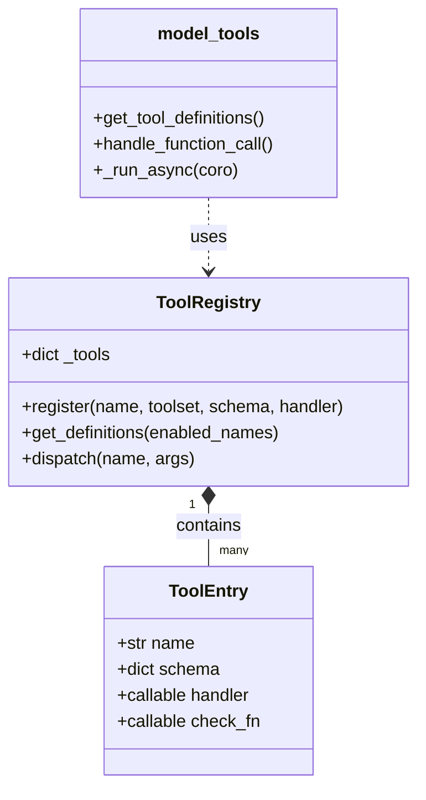

# Tool System

Relevant source files

The following files were used as context for generating this wiki page:

- [agent/shell_hooks.py](../agent/shell_hooks.py)
- [agent/verify_hooks.py](../agent/verify_hooks.py)
- [batch_runner.py](../batch_runner.py)
- contributors/emails/adrian.soto6@gmail.com
- contributors/emails/yuntianqing@yahoo.com
- [docs/middleware/README.md](../docs/middleware/README.md)
- [gateway/builtin_hooks/__init__.py](../gateway/builtin_hooks/__init__.py)
- [gateway/hooks.py](../gateway/hooks.py)
- [hermes_cli/hooks.py](../hermes_cli/hooks.py)
- [hermes_cli/middleware.py](../hermes_cli/middleware.py)
- [hermes_cli/nous_account.py](../hermes_cli/nous_account.py)
- [hermes_cli/nous_subscription.py](../hermes_cli/nous_subscription.py)
- [hermes_cli/plugins.py](../hermes_cli/plugins.py)
- [hermes_cli/tools_config.py](../hermes_cli/tools_config.py)
- [model_tools.py](../model_tools.py)
- [tests/agent/test_shell_hooks.py](../tests/agent/test_shell_hooks.py)
- [tests/agent/test_shell_hooks_consent.py](../tests/agent/test_shell_hooks_consent.py)
- [tests/agent/test_subagent_stop_hook.py](../tests/agent/test_subagent_stop_hook.py)
- [tests/hermes_cli/test_image_gen_picker.py](../tests/hermes_cli/test_image_gen_picker.py)
- [tests/hermes_cli/test_install_cua_driver.py](../tests/hermes_cli/test_install_cua_driver.py)
- [tests/hermes_cli/test_nous_subscription.py](../tests/hermes_cli/test_nous_subscription.py)
- [tests/hermes_cli/test_plugins.py](../tests/hermes_cli/test_plugins.py)
- [tests/hermes_cli/test_setup.py](../tests/hermes_cli/test_setup.py)
- [tests/hermes_cli/test_setup_model_provider.py](../tests/hermes_cli/test_setup_model_provider.py)
- [tests/hermes_cli/test_status_model_provider.py](../tests/hermes_cli/test_status_model_provider.py)
- [tests/hermes_cli/test_tools_config.py](../tests/hermes_cli/test_tools_config.py)
- [tests/hermes_cli/test_video_gen_picker.py](../tests/hermes_cli/test_video_gen_picker.py)
- [tests/run_agent/test_concurrent_interrupt.py](../tests/run_agent/test_concurrent_interrupt.py)
- [tests/run_agent/test_image_rejection_fallback.py](../tests/run_agent/test_image_rejection_fallback.py)
- [tests/test_batch_runner_checkpoint.py](../tests/test_batch_runner_checkpoint.py)
- [tests/test_model_tools.py](../tests/test_model_tools.py)
- [tests/tools/test_approval_plugin_hooks.py](../tests/tools/test_approval_plugin_hooks.py)
- [tests/tools/test_local_tempdir.py](../tests/tools/test_local_tempdir.py)
- [tests/tools/test_registry.py](../tests/tools/test_registry.py)
- [tests/tools/test_tool_backend_helpers.py](../tests/tools/test_tool_backend_helpers.py)
- [tests/tools/test_tool_result_storage.py](../tests/tools/test_tool_result_storage.py)
- [tools/__init__.py](../tools/__init__.py)
- [tools/binary_extensions.py](../tools/binary_extensions.py)
- [tools/registry.py](../tools/registry.py)
- [tools/tool_backend_helpers.py](../tools/tool_backend_helpers.py)
- [tools/tool_result_storage.py](../tools/tool_result_storage.py)
- [toolsets.py](../toolsets.py)
- [website/docs/user-guide/features/hooks.md](../website/docs/user-guide/features/hooks.md)
- [website/docs/user-guide/features/plugins.md](../website/docs/user-guide/features/plugins.md)

The Hermes Tool System is a high-level orchestration layer that enables the agent to interact with the physical and digital world. It provides a unified interface for tool discovery, configuration, and execution across diverse environments, from local terminals to remote serverless backends.

## Architecture Overview

The tool system is built on a "Narrow Waist" design. Tools are defined in self-registering modules that provide their own schemas, handlers, and availability checks. These are aggregated by a central registry and exposed to the agent through a thin orchestration layer.

### Key Components

*   **`ToolRegistry`**: The single source of truth for all available tools. It handles tool registration, schema generation for LLMs, and dispatching calls to handlers [tools/registry.py:87-118](../tools/registry.py#L87-L118).
*   **`model_tools.py`**: The public API used by the conversation loop to fetch tool definitions and execute function calls [model_tools.py:11-21](../model_tools.py#L11-L21).
*   **`toolsets.py`**: Defines logical groupings of tools (e.g., `web`, `terminal`, `browser`) to simplify configuration and permission management [toolsets.py:96-185](../toolsets.py#L96-L185).
*   **`tools_config.py`**: Manages user-facing tool configuration, including platform-specific toolsets and API key setup [hermes_cli/tools_config.py:91-121](../hermes_cli/tools_config.py#L91-L121).

### Tool Execution Flow

The following diagram illustrates how a natural language request is transformed into a code execution via the tool system.

**Diagram: Natural Language to Tool Execution**

Sources: [model_tools.py:11-21](../model_tools.py#L11-L21), [tools/registry.py:87-118](../tools/registry.py#L87-L118), [model_tools.py:97-116](../model_tools.py#L97-L116)

## Tool Registry & Discovery

Tools are discovered dynamically by scanning the `tools/` directory for Python modules that invoke `registry.register()`.

*   **Dynamic Discovery**: The system uses AST (Abstract Syntax Tree) parsing to identify tool-registering modules before importing them, preventing unnecessary side effects [tools/registry.py:30-65](../tools/registry.py#L30-L65).
*   **Availability Checks (`check_fn`)**: Each tool can define a check function that determines if the tool is available in the current environment (e.g., checking for a Docker daemon or API keys). These results are cached for 30 seconds to balance performance and responsiveness [tools/registry.py:120-148](../tools/registry.py#L120-L148).
*   **Multimodal Support**: The registry supports returning rich content, such as images or structured data, which is handled via the `_multimodal` flag in the tool result [tests/tools/test_registry.py:50-64](../tests/tools/test_registry.py#L50-L64).

Sources: [tools/registry.py:67-85](../tools/registry.py#L67-L85), [tools/registry.py:154-180](../tools/registry.py#L154-L180)

## Toolsets and Configuration

Tools are grouped into **Toolsets** to allow users to enable or disable entire categories of functionality.

| Toolset | Key Tools | Description |
| :--- | :--- | :--- |
| `web` | `web_search`, `web_extract` | Search and scraping [toolsets.py:98-102](../toolsets.py#L98-L102) |
| `terminal` | `terminal`, `process` | Shell and process management [toolsets.py:163-167](../toolsets.py#L163-L167) |
| `file` | `read_file`, `write_file`, `patch` | Filesystem operations [toolsets.py:31-41](../toolsets.py#L31-L41) |
| `browser` | `browser_navigate`, `browser_click` | Playwright-based automation [toolsets.py:175-185](../toolsets.py#L175-L185) |
| `computer_use` | `computer_use` | OS-level desktop control [toolsets.py:153-161](../toolsets.py#L153-L161) |

### Platform-Specific Constraints
Toolsets can be tailored per platform. For example, the `whatsapp` platform includes `web` tools by default, while `webhook` environments are restricted to "safe" tools to prevent prompt injection [toolsets.py:86-91](../toolsets.py#L86-L91), [tests/hermes_cli/test_tools_config.py:186-191](../tests/hermes_cli/test_tools_config.py#L186-L191).

Sources: [toolsets.py:31-81](../toolsets.py#L31-L81), [hermes_cli/tools_config.py:95-121](../hermes_cli/tools_config.py#L95-L121)

## Plugin System & Extensibility

The plugin system allows developers to add custom tools, hooks, and slash commands without modifying the core codebase.

*   **Plugin Discovery**: Hermes loads plugins from bundled directories, `~/.hermes/plugins/`, and pip-installed packages [hermes_cli/plugins.py:5-14](../hermes_cli/plugins.py#L5-L14).
*   **Lifecycle Hooks**: Plugins can tap into the agent's lifecycle using hooks like `pre_tool_call`, `post_tool_call`, and `transform_llm_output` [hermes_cli/plugins.py:135-180](../hermes_cli/plugins.py#L135-L180).
*   **Middleware**: Specialized hooks for intercepting and modifying LLM requests or tool execution arguments [hermes_cli/middleware.py:1-20](../hermes_cli/middleware.py#L1-L20).

For details, see [Plugin System & Extensibility](#8).

Sources: [hermes_cli/plugins.py:19-32](../hermes_cli/plugins.py#L19-L32), [website/docs/user-guide/features/plugins.md:98-117](../website/docs/user-guide/features/plugins.md#L98-L117)

## Sub-Systems and Detailed Categories

The tool system is further divided into specialized categories covered in child pages:

### [Terminal & Code Execution](#3.1)
Covers the `terminal_tool` and `execute_code` abstractions, supporting local execution, Docker, SSH, and serverless backends like Modal.

### [Security & Command Approval](#3.2)
Details the multi-layered guard system, including pattern-based blocking (`HARDLINE_PATTERNS`) and the interactive approval gateway.

### [File, Web & Vision Tools](#3.3)
Covers filesystem manipulation, Playwright browser automation, web scraping, and multimodal tools for vision and image generation.

### [MCP (Model Context Protocol) Integration](#3.4)
Explains the integration with Anthropic's Model Context Protocol, allowing Hermes to act as an MCP client or host.

### [Delegation, Kanban & Multi-Agent Coordination](#3.5)
Covers the `delegate_task` tool for spawning sub-agents and the SQLite-backed Kanban system for multi-agent task management.

### [Computer Use & Voice Mode](#3.6)
Details the `computer_use` tool for desktop control and the integration of TTS (Text-to-Speech) and transcription.

---

**Diagram: Code Entity Space - Registry & Dispatch**

Sources: [tools/registry.py:87-118](../tools/registry.py#L87-L118), [model_tools.py:11-21](../model_tools.py#L11-L21)

---
