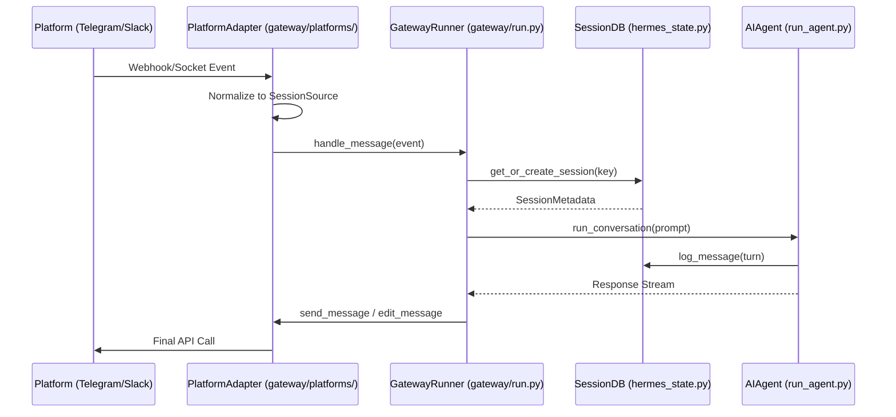
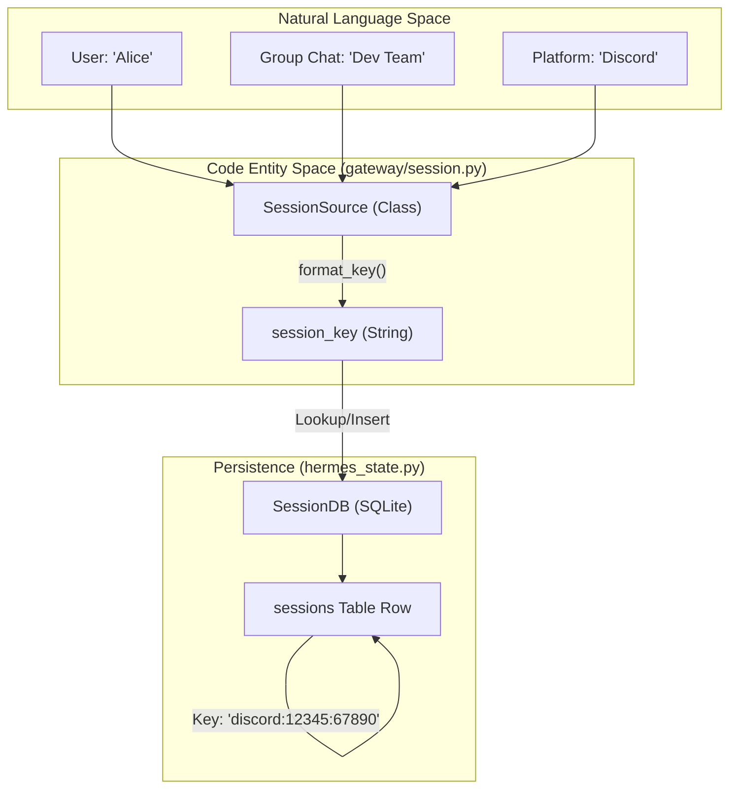

# Gateway Architecture & Session Management

Relevant source files

The following files were used as context for generating this wiki page:

- [.env.example](../.env.example)
- [.github/pr-screenshots/telegram-overflow/topic-final-response-clipped.jpg](../.github/pr-screenshots/telegram-overflow/topic-final-response-clipped.jpg)
- [AGENTS.md](../AGENTS.md)
- [README.md](../README.md)
- [cli-config.yaml.example](../cli-config.yaml.example)
- [cli.py](../cli.py)
- contributors/emails/matvey.sakhnenko03@icloud.com
- [docs/plans/2026-06-09-003-fix-telegram-stream-overflow-continuations-plan.md](../docs/plans/2026-06-09-003-fix-telegram-stream-overflow-continuations-plan.md)
- [docs/profile-routing.md](../docs/profile-routing.md)
- [docs/relay-connector-contract.md](../docs/relay-connector-contract.md)
- [gateway/authz_mixin.py](../gateway/authz_mixin.py)
- [gateway/config.py](../gateway/config.py)
- [gateway/pairing.py](../gateway/pairing.py)
- [gateway/platforms/base.py](../gateway/platforms/base.py)
- [gateway/profile_routing.py](../gateway/profile_routing.py)
- [gateway/relay/__init__.py](../gateway/relay/__init__.py)
- [gateway/relay/adapter.py](../gateway/relay/adapter.py)
- [gateway/relay/auth.py](../gateway/relay/auth.py)
- [gateway/relay/descriptor.py](../gateway/relay/descriptor.py)
- [gateway/relay/transport.py](../gateway/relay/transport.py)
- [gateway/relay/ws_transport.py](../gateway/relay/ws_transport.py)
- [gateway/run.py](../gateway/run.py)
- [gateway/session.py](../gateway/session.py)
- [gateway/stream_consumer.py](../gateway/stream_consumer.py)
- [hermes_cli/commands.py](../hermes_cli/commands.py)
- [hermes_cli/config.py](../hermes_cli/config.py)
- [hermes_cli/dashboard_register.py](../hermes_cli/dashboard_register.py)
- [hermes_cli/gateway_enroll.py](../hermes_cli/gateway_enroll.py)
- [hermes_cli/pairing.py](../hermes_cli/pairing.py)
- [hermes_state.py](../hermes_state.py)
- [run_agent.py](../run_agent.py)
- [tests/agent/test_none_deref_guards.py](../tests/agent/test_none_deref_guards.py)
- [tests/gateway/relay/__init__.py](../tests/gateway/relay/__init__.py)
- [tests/gateway/relay/stub_connector.py](../tests/gateway/relay/stub_connector.py)
- [tests/gateway/relay/test_auth.py](../tests/gateway/relay/test_auth.py)
- [tests/gateway/relay/test_channel_context_consume.py](../tests/gateway/relay/test_channel_context_consume.py)
- [tests/gateway/relay/test_descriptor.py](../tests/gateway/relay/test_descriptor.py)
- [tests/gateway/relay/test_descriptor_from_entry.py](../tests/gateway/relay/test_descriptor_from_entry.py)
- [tests/gateway/relay/test_identity_token_resolver.py](../tests/gateway/relay/test_identity_token_resolver.py)
- [tests/gateway/relay/test_relay_adapter.py](../tests/gateway/relay/test_relay_adapter.py)
- [tests/gateway/relay/test_relay_follow_up.py](../tests/gateway/relay/test_relay_follow_up.py)
- [tests/gateway/relay/test_relay_going_idle.py](../tests/gateway/relay/test_relay_going_idle.py)
- [tests/gateway/relay/test_relay_interrupt.py](../tests/gateway/relay/test_relay_interrupt.py)
- [tests/gateway/relay/test_relay_multiplatform.py](../tests/gateway/relay/test_relay_multiplatform.py)
- [tests/gateway/relay/test_relay_passthrough.py](../tests/gateway/relay/test_relay_passthrough.py)
- [tests/gateway/relay/test_relay_policy_send.py](../tests/gateway/relay/test_relay_policy_send.py)
- [tests/gateway/relay/test_relay_registration.py](../tests/gateway/relay/test_relay_registration.py)
- [tests/gateway/relay/test_relay_roundtrip.py](../tests/gateway/relay/test_relay_roundtrip.py)
- [tests/gateway/relay/test_relay_roundtrip_telegram.py](../tests/gateway/relay/test_relay_roundtrip_telegram.py)
- [tests/gateway/relay/test_relay_sheds_crypto.py](../tests/gateway/relay/test_relay_sheds_crypto.py)
- [tests/gateway/relay/test_self_provision.py](../tests/gateway/relay/test_self_provision.py)
- [tests/gateway/relay/test_ws_transport.py](../tests/gateway/relay/test_ws_transport.py)
- [tests/gateway/test_config.py](../tests/gateway/test_config.py)
- [tests/gateway/test_config_driven_access_policy.py](../tests/gateway/test_config_driven_access_policy.py)
- [tests/gateway/test_feishu_sdk_executor.py](../tests/gateway/test_feishu_sdk_executor.py)
- [tests/gateway/test_multiplex_adapter_registry.py](../tests/gateway/test_multiplex_adapter_registry.py)
- [tests/gateway/test_multiplex_profile_authz.py](../tests/gateway/test_multiplex_profile_authz.py)
- [tests/gateway/test_pairing.py](../tests/gateway/test_pairing.py)
- [tests/gateway/test_pairing_allowlist_bypass.py](../tests/gateway/test_pairing_allowlist_bypass.py)
- [tests/gateway/test_platform_base.py](../tests/gateway/test_platform_base.py)
- [tests/gateway/test_profile_resolution.py](../tests/gateway/test_profile_resolution.py)
- [tests/gateway/test_profile_routing.py](../tests/gateway/test_profile_routing.py)
- [tests/gateway/test_relay_upstream_authz.py](../tests/gateway/test_relay_upstream_authz.py)
- [tests/gateway/test_session.py](../tests/gateway/test_session.py)
- [tests/gateway/test_session_reset_notify.py](../tests/gateway/test_session_reset_notify.py)
- [tests/gateway/test_shared_group_sender_prefix.py](../tests/gateway/test_shared_group_sender_prefix.py)
- [tests/gateway/test_slack_relay_parent_command.py](../tests/gateway/test_slack_relay_parent_command.py)
- [tests/gateway/test_stream_consumer.py](../tests/gateway/test_stream_consumer.py)
- [tests/gateway/test_stream_consumer_fresh_final.py](../tests/gateway/test_stream_consumer_fresh_final.py)
- [tests/gateway/test_stream_consumer_thread_routing.py](../tests/gateway/test_stream_consumer_thread_routing.py)
- [tests/gateway/test_telegram_overflow_partial.py](../tests/gateway/test_telegram_overflow_partial.py)
- [tests/gateway/test_tts_media_routing.py](../tests/gateway/test_tts_media_routing.py)
- [tests/hermes_cli/test_commands.py](../tests/hermes_cli/test_commands.py)
- [tests/hermes_cli/test_dashboard_register.py](../tests/hermes_cli/test_dashboard_register.py)
- [tests/test_hermes_state.py](../tests/test_hermes_state.py)
- [website/docs/user-guide/multi-profile-gateways.md](../website/docs/user-guide/multi-profile-gateways.md)

The Hermes Messaging Gateway is a multi-platform bridge that enables asynchronous, long-running agent interactions over chat interfaces like Telegram, Discord, Slack, and WhatsApp. It decouples the user interface from the execution environment, allowing the agent to persist on a remote server or cloud backend while remaining accessible from mobile and desktop messaging apps.

## GatewayRunner Lifecycle

The `GatewayRunner` is the central orchestrator responsible for initializing platform adapters, managing the global agent cache, and supervising the asynchronous event loop that processes incoming messages.

### Initialization & Startup
The gateway is typically started via `python -m gateway.run` or the `hermes gateway start` CLI command [gateway/run.py:9-14](../gateway/run.py#L9-L14). Upon startup, it:
1.  **Loads Configuration:** Reads `config.yaml` to identify enabled platforms and their respective credentials [gateway/run.py:69-70](../gateway/run.py#L69-L70).
2.  **Initializes Adapters:** Instantiates classes inheriting from `BasePlatformAdapter` for each configured service [gateway/run.py:5](../gateway/run.py#L5).
3.  **Manages Agent Cache:** Maintains an LRU (Least Recently Used) cache of `AIAgent` instances to prevent memory exhaustion in long-lived processes [gateway/run.py:72-78](../gateway/run.py#L72-L78).

### The Event Loop
The runner uses `asyncio` to multiplex connections. It handles OS signals (SIGINT, SIGTERM) to ensure a "drain-aware" shutdown, allowing active tool executions or message deliveries to finalize before exiting [gateway/run.py:38](../gateway/run.py#L38).

**Sources:** `gateway/run.py` 1-115, `gateway/config.py` 1-23

---

## BasePlatformAdapter Interface

All messaging integrations must implement the `BasePlatformAdapter` abstract base class. This ensures a consistent contract between the platform-specific APIs and the Hermes core.

### Key Responsibilities
*   **Authentication:** Handling bot tokens, OAuth flows, or socket connections.
*   **Message Normalization:** Converting platform-specific events (e.g., Slack Block Kit, Telegram Updates) into a standard `SessionSource` object [gateway/platforms/base.py:148-157](../gateway/platforms/base.py#L148-L157).
*   **Delivery:** Implementing `send_message`, `send_media`, and `edit_message` methods.
*   **Streaming:** Managing the lifecycle of streamed responses, including incremental edits or native streaming chunks [gateway/platforms/base.py:131-152](../gateway/platforms/base.py#L131-L152).

### Media Routing
The adapter determines how to deliver media based on platform capabilities. For example, Telegram requires different endpoints for Voice (`.ogg`) vs. Audio (`.mp3`) [gateway/platforms/base.py:131-151](../gateway/platforms/base.py#L131-L151).

**Sources:** `gateway/platforms/base.py` 1-160, `gateway/run.py` 79-85

---

## Session Management & Keying

Hermes uses a structured session keying system to isolate conversations across different platforms and users.

### Session Key Structure
A session is uniquely identified by a composite key following the pattern:
`platform:chat_id:user_id`

This ensures that:
1.  The same user in two different Telegram groups has distinct sessions.
2.  Different users in the same Discord channel can (optionally) have isolated state.
3.  Direct messages (DMs) are isolated from group contexts.

### SessionStore (SessionDB)
The `SessionDB` (implemented in `hermes_state.py`) is a SQLite-backed store using **WAL (Write-Ahead Logging)** mode to support concurrent access from multiple gateway adapters and the CLI [hermes_state.py:10-15](../hermes_state.py#L10-L15).

| Feature | Implementation |
| :--- | :--- |
| **Persistence** | SQLite with FTS5 for full-text search [hermes_state.py:5-7](../hermes_state.py#L5-L7) |
| **Lineage** | Parent-child relationships for `/branch` and compression [hermes_state.py:133-145](../hermes_state.py#L133-L145) |
| **Isolation** | `source` tagging (e.g., 'telegram', 'discord') [hermes_state.py:14-15](../hermes_state.py#L14-L15) |

### Session Reset Policies
The gateway evaluates `SessionResetPolicy` to determine when a conversation should be "freshened" (started with a new ID).
*   **Timed Expiry:** Resets after a period of inactivity.
*   **Manual Reset:** Triggered by slash commands like `/new` or `/reset` [hermes_cli/commands.py:68-69](../hermes_cli/commands.py#L68-L69).
*   **Auto-Continue:** A freshness window (default 1 hour) determines if an interrupted session should be resumed upon a new message [gateway/session.py:31-37](../gateway/session.py#L31-L37).

**Sources:** `hermes_state.py` 1-160, `gateway/session.py` 1-150, `gateway/config.py` 198-204

---

## Streaming Delivery & StreamConsumer

Hermes supports real-time streaming of LLM responses to chat platforms, even those that do not natively support Server-Sent Events (SSE).

### StreamConsumer Lifecycle
The `StreamConsumer` manages the delivery of tokens from the agent to the adapter. It handles:
1.  **Token Buffering:** Aggregating small chunks to avoid hitting platform rate limits (e.g., Telegram's message edit limits).
2.  **Edit-Based Streaming:** For platforms like Discord/Telegram, it periodically calls `edit_message` to update the response [gateway/platforms/base.py:169-173](../gateway/platforms/base.py#L169-L173).
3.  **Native Streaming:** For platforms that support it, it forwards chunks immediately.

### Delivery Ledger
To ensure reliability, the gateway maintains a "delivery ledger" to track which messages have been successfully sent and which require retries or "resumed" markers after a process restart [gateway/run.py:101-115](../gateway/run.py#L101-L115).

**Sources:** `gateway/stream_consumer.py` 1-100, `gateway/run.py` 81-115

---

## System Architecture Diagrams

### Data Flow: Message Ingress to Agent Execution
This diagram illustrates how a message travels from a platform (e.g., Telegram) through the `GatewayRunner` and `SessionDB` to the `AIAgent`.

**Sources:** `gateway/run.py` 5-15, `gateway/platforms/base.py` 148-157, `hermes_state.py` 85-98, `run_agent.py` 19-21

### Session Identity & Keying
This diagram bridges the natural language concept of "User in a Chat" to the code entities used for keying and storage.

**Sources:** `gateway/session.py` 148-175, `hermes_state.py` 85-98

---

## Relay Connector Contract

The **Relay Connector** is a specialized contract that allows a Hermes instance to act as a "Relay" for other agents. This is used in multi-profile and distributed environments.

*   **RelayAdapter:** A platform adapter that forwards messages to a remote Hermes Relay via WebSockets or HTTP [gateway/relay/adapter.py](../gateway/relay/adapter.py).
*   **Authentication:** Uses JWT (JSON Web Tokens) or pre-shared keys defined in `config.yaml`.
*   **Capabilities:** Supports full streaming and tool-call approval forwarding across the relay boundary.

**Sources:** `gateway/relay/adapter.py` 1-50, `gateway/relay/ws_transport.py` 1-40

---
