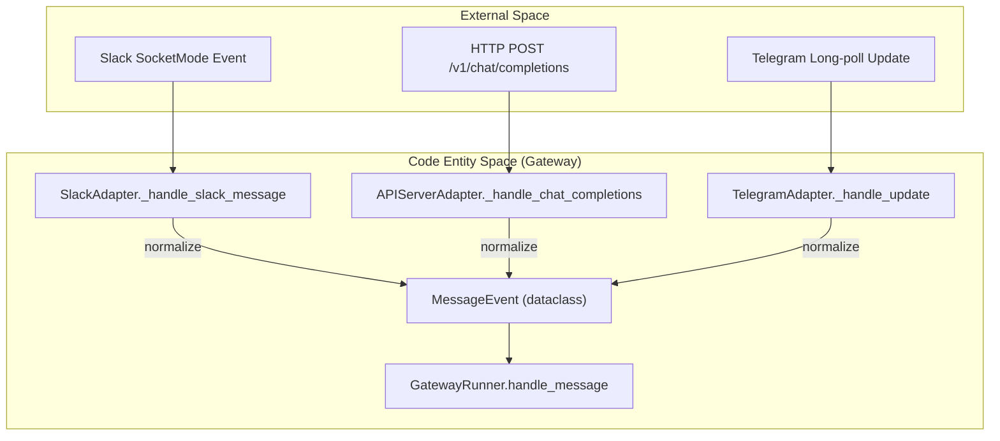
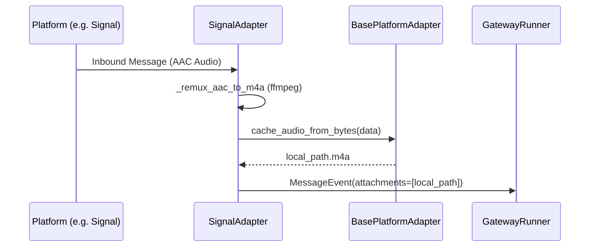

# Platform Adapters

Relevant source files

The following files were used as context for generating this wiki page:

- [acp_adapter/permissions.py](../acp_adapter/permissions.py)
- [agent/verification_evidence.py](../agent/verification_evidence.py)
- [agent/verification_stop.py](../agent/verification_stop.py)
- [apps/desktop/src/components/assistant-ui/tool/approval.test.tsx](../apps/desktop/src/components/assistant-ui/tool/approval.test.tsx)
- contributors/emails/cjwang@sowork.tw
- contributors/emails/kamon@gao-ai.com
- contributors/emails/lg_329@163.com
- contributors/emails/nwadwa@gmail.com
- contributors/emails/nyaruko@hermes
- [gateway/delivery_ledger.py](../gateway/delivery_ledger.py)
- [gateway/platform_registry.py](../gateway/platform_registry.py)
- [gateway/platforms/ADDING_A_PLATFORM.md](../gateway/platforms/ADDING_A_PLATFORM.md)
- [gateway/platforms/api_server.py](../gateway/platforms/api_server.py)
- [gateway/platforms/helpers.py](../gateway/platforms/helpers.py)
- [gateway/platforms/qqbot/__init__.py](../gateway/platforms/qqbot/__init__.py)
- [gateway/platforms/qqbot/adapter.py](../gateway/platforms/qqbot/adapter.py)
- [gateway/platforms/qqbot/chunked_upload.py](../gateway/platforms/qqbot/chunked_upload.py)
- [gateway/platforms/qqbot/constants.py](../gateway/platforms/qqbot/constants.py)
- [gateway/platforms/qqbot/crypto.py](../gateway/platforms/qqbot/crypto.py)
- [gateway/platforms/qqbot/keyboards.py](../gateway/platforms/qqbot/keyboards.py)
- [gateway/platforms/qqbot/onboard.py](../gateway/platforms/qqbot/onboard.py)
- [gateway/platforms/qqbot/utils.py](../gateway/platforms/qqbot/utils.py)
- [gateway/platforms/signal.py](../gateway/platforms/signal.py)
- [gateway/platforms/signal_format.py](../gateway/platforms/signal_format.py)
- [gateway/platforms/webhook.py](../gateway/platforms/webhook.py)
- [gateway/platforms/webhook_filters.py](../gateway/platforms/webhook_filters.py)
- [gateway/platforms/weixin.py](../gateway/platforms/weixin.py)
- [gateway/platforms/whatsapp_cloud.py](../gateway/platforms/whatsapp_cloud.py)
- [gateway/platforms/whatsapp_common.py](../gateway/platforms/whatsapp_common.py)
- [gateway/platforms/yuanbao_media.py](../gateway/platforms/yuanbao_media.py)
- [gateway/readiness.py](../gateway/readiness.py)
- [gateway/shutdown_forensics.py](../gateway/shutdown_forensics.py)
- [gateway/whatsapp_identity.py](../gateway/whatsapp_identity.py)
- [hermes_cli/build_info.py](../hermes_cli/build_info.py)
- [hermes_cli/dump.py](../hermes_cli/dump.py)
- [hermes_cli/logs.py](../hermes_cli/logs.py)
- [hermes_cli/setup_whatsapp_cloud.py](../hermes_cli/setup_whatsapp_cloud.py)
- [hermes_cli/slack_cli.py](../hermes_cli/slack_cli.py)
- [hermes_cli/subcommands/slack.py](../hermes_cli/subcommands/slack.py)
- [hermes_cli/subcommands/webhook.py](../hermes_cli/subcommands/webhook.py)
- [hermes_cli/webhook.py](../hermes_cli/webhook.py)
- [hermes_logging.py](../hermes_logging.py)
- [plugins/platforms/discord/adapter.py](../plugins/platforms/discord/adapter.py)
- [plugins/platforms/discord/recovery.py](../plugins/platforms/discord/recovery.py)
- [plugins/platforms/feishu/adapter.py](../plugins/platforms/feishu/adapter.py)
- [plugins/platforms/google_chat/__init__.py](../plugins/platforms/google_chat/__init__.py)
- [plugins/platforms/google_chat/adapter.py](../plugins/platforms/google_chat/adapter.py)
- [plugins/platforms/google_chat/oauth.py](../plugins/platforms/google_chat/oauth.py)
- [plugins/platforms/google_chat/plugin.yaml](../plugins/platforms/google_chat/plugin.yaml)
- [plugins/platforms/irc/adapter.py](../plugins/platforms/irc/adapter.py)
- [plugins/platforms/irc/plugin.yaml](../plugins/platforms/irc/plugin.yaml)
- [plugins/platforms/matrix/adapter.py](../plugins/platforms/matrix/adapter.py)
- [plugins/platforms/mattermost/adapter.py](../plugins/platforms/mattermost/adapter.py)
- [plugins/platforms/photon/README.md](../plugins/platforms/photon/README.md)
- [plugins/platforms/photon/adapter.py](../plugins/platforms/photon/adapter.py)
- [plugins/platforms/photon/auth.py](../plugins/platforms/photon/auth.py)
- [plugins/platforms/photon/cli.py](../plugins/platforms/photon/cli.py)
- [plugins/platforms/photon/plugin.yaml](../plugins/platforms/photon/plugin.yaml)
- [plugins/platforms/photon/sidecar/index.mjs](../plugins/platforms/photon/sidecar/index.mjs)
- [plugins/platforms/photon/sidecar/package-lock.json](../plugins/platforms/photon/sidecar/package-lock.json)
- [plugins/platforms/photon/sidecar/package.json](../plugins/platforms/photon/sidecar/package.json)
- [plugins/platforms/photon/sidecar/patch-spectrum-mixed-attachments.mjs](../plugins/platforms/photon/sidecar/patch-spectrum-mixed-attachments.mjs)
- [plugins/platforms/slack/adapter.py](../plugins/platforms/slack/adapter.py)
- [plugins/platforms/slack/block_kit.py](../plugins/platforms/slack/block_kit.py)
- [plugins/platforms/teams/__init__.py](../plugins/platforms/teams/__init__.py)
- [plugins/platforms/teams/adapter.py](../plugins/platforms/teams/adapter.py)
- [plugins/platforms/teams/plugin.yaml](../plugins/platforms/teams/plugin.yaml)
- [plugins/platforms/telegram/adapter.py](../plugins/platforms/telegram/adapter.py)
- [plugins/platforms/telegram/telegram_network.py](../plugins/platforms/telegram/telegram_network.py)
- [plugins/platforms/wecom/adapter.py](../plugins/platforms/wecom/adapter.py)
- [plugins/platforms/whatsapp/adapter.py](../plugins/platforms/whatsapp/adapter.py)
- [scripts/whatsapp-bridge/allowlist.js](../scripts/whatsapp-bridge/allowlist.js)
- [scripts/whatsapp-bridge/allowlist.test.mjs](../scripts/whatsapp-bridge/allowlist.test.mjs)
- [scripts/whatsapp-bridge/bridge.js](../scripts/whatsapp-bridge/bridge.js)
- [scripts/whatsapp-bridge/outbound_ids.js](../scripts/whatsapp-bridge/outbound_ids.js)
- [scripts/whatsapp-bridge/outbound_ids.test.mjs](../scripts/whatsapp-bridge/outbound_ids.test.mjs)
- [skills/autonomous-ai-agents/hermes-agent/references/webhooks.md](../skills/autonomous-ai-agents/hermes-agent/references/webhooks.md)
- [skills/productivity/google-workspace/SKILL.md](../skills/productivity/google-workspace/SKILL.md)
- [skills/productivity/google-workspace/references/gmail-search-syntax.md](../skills/productivity/google-workspace/references/gmail-search-syntax.md)
- [skills/productivity/google-workspace/scripts/_hermes_home.py](../skills/productivity/google-workspace/scripts/_hermes_home.py)
- [skills/productivity/google-workspace/scripts/google_api.py](../skills/productivity/google-workspace/scripts/google_api.py)
- [skills/productivity/google-workspace/scripts/gws_bridge.py](../skills/productivity/google-workspace/scripts/gws_bridge.py)
- [skills/productivity/google-workspace/scripts/setup.py](../skills/productivity/google-workspace/scripts/setup.py)
- [tests/acp/test_permissions.py](../tests/acp/test_permissions.py)
- [tests/agent/test_verification_evidence.py](../tests/agent/test_verification_evidence.py)
- [tests/agent/test_verification_stop.py](../tests/agent/test_verification_stop.py)
- [tests/docker/test_dump_build_sha.py](../tests/docker/test_dump_build_sha.py)
- [tests/e2e/__init__.py](../tests/e2e/__init__.py)
- [tests/e2e/conftest.py](../tests/e2e/conftest.py)
- [tests/e2e/test_discord_adapter.py](../tests/e2e/test_discord_adapter.py)
- [tests/e2e/test_platform_commands.py](../tests/e2e/test_platform_commands.py)
- [tests/gateway/conftest.py](../tests/gateway/conftest.py)
- [tests/gateway/test_api_server.py](../tests/gateway/test_api_server.py)
- [tests/gateway/test_api_server_bind_guard.py](../tests/gateway/test_api_server_bind_guard.py)
- [tests/gateway/test_api_server_runs.py](../tests/gateway/test_api_server_runs.py)
- [tests/gateway/test_code_fence_tracking.py](../tests/gateway/test_code_fence_tracking.py)
- [tests/gateway/test_delivery_ledger.py](../tests/gateway/test_delivery_ledger.py)
- [tests/gateway/test_delivery_ledger_producer.py](../tests/gateway/test_delivery_ledger_producer.py)
- [tests/gateway/test_discord_clarify_buttons.py](../tests/gateway/test_discord_clarify_buttons.py)
- [tests/gateway/test_discord_component_auth.py](../tests/gateway/test_discord_component_auth.py)
- [tests/gateway/test_discord_connect.py](../tests/gateway/test_discord_connect.py)
- [tests/gateway/test_discord_free_response.py](../tests/gateway/test_discord_free_response.py)
- [tests/gateway/test_discord_missed_message_backfill.py](../tests/gateway/test_discord_missed_message_backfill.py)
- [tests/gateway/test_discord_model_picker.py](../tests/gateway/test_discord_model_picker.py)
- [tests/gateway/test_discord_plugin_setup.py](../tests/gateway/test_discord_plugin_setup.py)
- [tests/gateway/test_discord_prompt_content_siblings.py](../tests/gateway/test_discord_prompt_content_siblings.py)
- [tests/gateway/test_discord_roles_dm_scope.py](../tests/gateway/test_discord_roles_dm_scope.py)
- [tests/gateway/test_discord_slash_auth.py](../tests/gateway/test_discord_slash_auth.py)
- [tests/gateway/test_discord_slash_commands.py](../tests/gateway/test_discord_slash_commands.py)
- [tests/gateway/test_discord_thread_persistence.py](../tests/gateway/test_discord_thread_persistence.py)
- [tests/gateway/test_feishu.py](../tests/gateway/test_feishu.py)
- [tests/gateway/test_feishu_onboard.py](../tests/gateway/test_feishu_onboard.py)
- [tests/gateway/test_gateway_command_help.py](../tests/gateway/test_gateway_command_help.py)
- [tests/gateway/test_gateway_inactivity_timeout.py](../tests/gateway/test_gateway_inactivity_timeout.py)
- [tests/gateway/test_google_chat.py](../tests/gateway/test_google_chat.py)
- [tests/gateway/test_irc_adapter.py](../tests/gateway/test_irc_adapter.py)
- [tests/gateway/test_matrix.py](../tests/gateway/test_matrix.py)
- [tests/gateway/test_matrix_mention.py](../tests/gateway/test_matrix_mention.py)
- [tests/gateway/test_matrix_plugin_setup.py](../tests/gateway/test_matrix_plugin_setup.py)
- [tests/gateway/test_matrix_voice.py](../tests/gateway/test_matrix_voice.py)
- [tests/gateway/test_mattermost.py](../tests/gateway/test_mattermost.py)
- [tests/gateway/test_mattermost_plugin_setup.py](../tests/gateway/test_mattermost_plugin_setup.py)
- [tests/gateway/test_media_download_retry.py](../tests/gateway/test_media_download_retry.py)
- [tests/gateway/test_message_deduplicator.py](../tests/gateway/test_message_deduplicator.py)
- [tests/gateway/test_platform_reconnect.py](../tests/gateway/test_platform_reconnect.py)
- [tests/gateway/test_platform_registry.py](../tests/gateway/test_platform_registry.py)
- [tests/gateway/test_proxy_mode.py](../tests/gateway/test_proxy_mode.py)
- [tests/gateway/test_qqbot.py](../tests/gateway/test_qqbot.py)
- [tests/gateway/test_readiness.py](../tests/gateway/test_readiness.py)
- [tests/gateway/test_runner_fatal_adapter.py](../tests/gateway/test_runner_fatal_adapter.py)
- [tests/gateway/test_session_api.py](../tests/gateway/test_session_api.py)
- [tests/gateway/test_session_race_guard.py](../tests/gateway/test_session_race_guard.py)
- [tests/gateway/test_setup_feishu.py](../tests/gateway/test_setup_feishu.py)
- [tests/gateway/test_shutdown_forensics.py](../tests/gateway/test_shutdown_forensics.py)
- [tests/gateway/test_signal.py](../tests/gateway/test_signal.py)
- [tests/gateway/test_signal_format.py](../tests/gateway/test_signal_format.py)
- [tests/gateway/test_slack.py](../tests/gateway/test_slack.py)
- [tests/gateway/test_slack_approval_buttons.py](../tests/gateway/test_slack_approval_buttons.py)
- [tests/gateway/test_slack_block_kit.py](../tests/gateway/test_slack_block_kit.py)
- [tests/gateway/test_slack_block_kit_adapter.py](../tests/gateway/test_slack_block_kit_adapter.py)
- [tests/gateway/test_slack_download_ssrf.py](../tests/gateway/test_slack_download_ssrf.py)
- [tests/gateway/test_slack_group_dm_scope_warning.py](../tests/gateway/test_slack_group_dm_scope_warning.py)
- [tests/gateway/test_slack_mention.py](../tests/gateway/test_slack_mention.py)
- [tests/gateway/test_table_helpers.py](../tests/gateway/test_table_helpers.py)
- [tests/gateway/test_teams.py](../tests/gateway/test_teams.py)
- [tests/gateway/test_telegram_conflict.py](../tests/gateway/test_telegram_conflict.py)
- [tests/gateway/test_telegram_group_gating.py](../tests/gateway/test_telegram_group_gating.py)
- [tests/gateway/test_telegram_init_deadline.py](../tests/gateway/test_telegram_init_deadline.py)
- [tests/gateway/test_telegram_network.py](../tests/gateway/test_telegram_network.py)
- [tests/gateway/test_telegram_network_reconnect.py](../tests/gateway/test_telegram_network_reconnect.py)
- [tests/gateway/test_telegram_polling_progress.py](../tests/gateway/test_telegram_polling_progress.py)
- [tests/gateway/test_telegram_rich_messages.py](../tests/gateway/test_telegram_rich_messages.py)
- [tests/gateway/test_telegram_send_path_health.py](../tests/gateway/test_telegram_send_path_health.py)
- [tests/gateway/test_webhook_adapter.py](../tests/gateway/test_webhook_adapter.py)
- [tests/gateway/test_webhook_deliver_only.py](../tests/gateway/test_webhook_deliver_only.py)
- [tests/gateway/test_webhook_integration.py](../tests/gateway/test_webhook_integration.py)
- [tests/gateway/test_webhook_session_close.py](../tests/gateway/test_webhook_session_close.py)
- [tests/gateway/test_wecom.py](../tests/gateway/test_wecom.py)
- [tests/gateway/test_weixin.py](../tests/gateway/test_weixin.py)
- [tests/gateway/test_whatsapp_allowlist_lid_resolution.py](../tests/gateway/test_whatsapp_allowlist_lid_resolution.py)
- [tests/gateway/test_whatsapp_bridge_pidfile.py](../tests/gateway/test_whatsapp_bridge_pidfile.py)
- [tests/gateway/test_whatsapp_cloud.py](../tests/gateway/test_whatsapp_cloud.py)
- [tests/gateway/test_whatsapp_connect.py](../tests/gateway/test_whatsapp_connect.py)
- [tests/gateway/test_whatsapp_formatting.py](../tests/gateway/test_whatsapp_formatting.py)
- [tests/gateway/test_whatsapp_from_owner.py](../tests/gateway/test_whatsapp_from_owner.py)
- [tests/gateway/test_whatsapp_group_gating.py](../tests/gateway/test_whatsapp_group_gating.py)
- [tests/gateway/test_whatsapp_identity.py](../tests/gateway/test_whatsapp_identity.py)
- [tests/gateway/test_whatsapp_text_batching.py](../tests/gateway/test_whatsapp_text_batching.py)
- [tests/gateway/test_whatsapp_to_jid.py](../tests/gateway/test_whatsapp_to_jid.py)
- [tests/hermes_cli/test_banner_git_state.py](../tests/hermes_cli/test_banner_git_state.py)
- [tests/hermes_cli/test_build_info.py](../tests/hermes_cli/test_build_info.py)
- [tests/hermes_cli/test_copilot_in_model_list.py](../tests/hermes_cli/test_copilot_in_model_list.py)
- [tests/hermes_cli/test_dump_git_commit.py](../tests/hermes_cli/test_dump_git_commit.py)
- [tests/hermes_cli/test_gateway_wsl.py](../tests/hermes_cli/test_gateway_wsl.py)
- [tests/hermes_cli/test_logs.py](../tests/hermes_cli/test_logs.py)
- [tests/hermes_cli/test_ollama_cloud_provider.py](../tests/hermes_cli/test_ollama_cloud_provider.py)
- [tests/hermes_cli/test_setup_matrix_e2ee.py](../tests/hermes_cli/test_setup_matrix_e2ee.py)
- [tests/hermes_cli/test_setup_noninteractive.py](../tests/hermes_cli/test_setup_noninteractive.py)
- [tests/hermes_cli/test_setup_openclaw_migration.py](../tests/hermes_cli/test_setup_openclaw_migration.py)
- [tests/hermes_cli/test_setup_prompt_menus.py](../tests/hermes_cli/test_setup_prompt_menus.py)
- [tests/hermes_cli/test_setup_reconfigure.py](../tests/hermes_cli/test_setup_reconfigure.py)
- [tests/hermes_cli/test_slack_cli.py](../tests/hermes_cli/test_slack_cli.py)
- [tests/hermes_cli/test_webhook_cli.py](../tests/hermes_cli/test_webhook_cli.py)
- [tests/plugins/platforms/photon/test_auth.py](../tests/plugins/platforms/photon/test_auth.py)
- [tests/plugins/platforms/photon/test_inbound.py](../tests/plugins/platforms/photon/test_inbound.py)
- [tests/plugins/platforms/photon/test_markdown.py](../tests/plugins/platforms/photon/test_markdown.py)
- [tests/plugins/platforms/photon/test_mention_gating.py](../tests/plugins/platforms/photon/test_mention_gating.py)
- [tests/plugins/platforms/photon/test_overflow_recovery.py](../tests/plugins/platforms/photon/test_overflow_recovery.py)
- [tests/plugins/platforms/photon/test_reactions.py](../tests/plugins/platforms/photon/test_reactions.py)
- [tests/plugins/platforms/photon/test_setup_access.py](../tests/plugins/platforms/photon/test_setup_access.py)
- [tests/plugins/platforms/photon/test_spectrum_patch.py](../tests/plugins/platforms/photon/test_spectrum_patch.py)
- [tests/plugins/test_discord_runtime_failure.py](../tests/plugins/test_discord_runtime_failure.py)
- [tests/skills/test_google_workspace_api.py](../tests/skills/test_google_workspace_api.py)
- [tests/skills/test_google_workspace_credential_files.py](../tests/skills/test_google_workspace_credential_files.py)
- [tests/test_atomic_replace_symlinks.py](../tests/test_atomic_replace_symlinks.py)
- [tests/test_credential_file_permissions.py](../tests/test_credential_file_permissions.py)
- [tests/test_hermes_logging.py](../tests/test_hermes_logging.py)
- [tests/test_telegram_polling_progress_ptb.py](../tests/test_telegram_polling_progress_ptb.py)
- [tests/tools/test_browser_secret_exfil.py](../tests/tools/test_browser_secret_exfil.py)
- [tests/tools/test_browser_ssrf_local.py](../tests/tools/test_browser_ssrf_local.py)
- [tests/tools/test_skill_bundle_provenance.py](../tests/tools/test_skill_bundle_provenance.py)
- [tests/tools/test_url_safety.py](../tests/tools/test_url_safety.py)
- [tools/url_safety.py](../tools/url_safety.py)
- [utils.py](../utils.py)
- [website/.gitignore](../website/.gitignore)
- [website/README.md](../website/README.md)
- [website/docs/developer-guide/_category_.json](../website/docs/developer-guide/_category_.json)
- [website/docs/developer-guide/adding-platform-adapters.md](../website/docs/developer-guide/adding-platform-adapters.md)
- [website/docs/developer-guide/extending-the-cli.md](../website/docs/developer-guide/extending-the-cli.md)
- [website/docs/getting-started/_category_.json](../website/docs/getting-started/_category_.json)
- [website/docs/guides/github-pr-review-agent.md](../website/docs/guides/github-pr-review-agent.md)
- [website/docs/guides/webhook-github-pr-review.md](../website/docs/guides/webhook-github-pr-review.md)
- [website/docs/user-guide/features/api-server.md](../website/docs/user-guide/features/api-server.md)
- [website/docs/user-guide/features/goals.md](../website/docs/user-guide/features/goals.md)
- [website/docs/user-guide/messaging/feishu.md](../website/docs/user-guide/messaging/feishu.md)
- [website/docs/user-guide/messaging/google_chat.md](../website/docs/user-guide/messaging/google_chat.md)
- [website/docs/user-guide/messaging/matrix.md](../website/docs/user-guide/messaging/matrix.md)
- [website/docs/user-guide/messaging/mattermost.md](../website/docs/user-guide/messaging/mattermost.md)
- [website/docs/user-guide/messaging/open-webui.md](../website/docs/user-guide/messaging/open-webui.md)
- [website/docs/user-guide/messaging/photon.md](../website/docs/user-guide/messaging/photon.md)
- [website/docs/user-guide/messaging/signal.md](../website/docs/user-guide/messaging/signal.md)
- [website/docs/user-guide/messaging/slack.md](../website/docs/user-guide/messaging/slack.md)
- [website/docs/user-guide/messaging/telegram.md](../website/docs/user-guide/messaging/telegram.md)
- [website/docs/user-guide/messaging/webhooks.md](../website/docs/user-guide/messaging/webhooks.md)
- [website/docs/user-guide/messaging/weixin.md](../website/docs/user-guide/messaging/weixin.md)
- [website/docs/user-guide/skills/google-workspace.md](../website/docs/user-guide/skills/google-workspace.md)
- [website/i18n/zh-Hans/docusaurus-plugin-content-docs/current/reference/cli-commands.md](../website/i18n/zh-Hans/docusaurus-plugin-content-docs/current/reference/cli-commands.md)
- [website/i18n/zh-Hans/docusaurus-plugin-content-docs/current/reference/environment-variables.md](../website/i18n/zh-Hans/docusaurus-plugin-content-docs/current/reference/environment-variables.md)
- [website/i18n/zh-Hans/docusaurus-plugin-content-docs/current/user-guide/features/api-server.md](../website/i18n/zh-Hans/docusaurus-plugin-content-docs/current/user-guide/features/api-server.md)
- [website/i18n/zh-Hans/docusaurus-plugin-content-docs/current/user-guide/messaging/open-webui.md](../website/i18n/zh-Hans/docusaurus-plugin-content-docs/current/user-guide/messaging/open-webui.md)
- [website/i18n/zh-Hans/docusaurus-plugin-content-docs/current/user-guide/messaging/slack.md](../website/i18n/zh-Hans/docusaurus-plugin-content-docs/current/user-guide/messaging/slack.md)
- [website/i18n/zh-Hans/docusaurus-plugin-content-docs/current/user-guide/messaging/telegram.md](../website/i18n/zh-Hans/docusaurus-plugin-content-docs/current/user-guide/messaging/telegram.md)
- [website/i18n/zh-Hans/docusaurus-plugin-content-docs/current/user-guide/messaging/webhooks.md](../website/i18n/zh-Hans/docusaurus-plugin-content-docs/current/user-guide/messaging/webhooks.md)
- [website/scripts/generate-llms-txt.py](../website/scripts/generate-llms-txt.py)

The Hermes Messaging Gateway employs a pluggable architecture of **Platform Adapters** to bridge the gap between various messaging protocols and the internal `AIAgent` execution logic. Each adapter inherits from the `BasePlatformAdapter` and is responsible for message normalization, media handling, and protocol-specific features like Slack's Block Kit or Discord's Slash Commands.

## Architecture Overview

Platform adapters function as bidirectional translators. They consume platform-specific events (Webhooks, WebSockets, or Long-polling) and produce standardized `MessageEvent` objects for the `GatewayRunner`. Conversely, they take `SendResult` instructions from the agent and format them into platform-native payloads.

### Data Flow: Platform to Code Entity

The following diagram illustrates how a raw event from a platform like Slack or an API request is transformed into code entities within the Hermes Gateway.

**Platform Event Normalization Flow**

Sources: `plugins/platforms/slack/adapter.py:180-188`(), `gateway/platforms/api_server.py:67-70`(), `plugins/platforms/telegram/adapter.py:98-110`()

## Supported Adapters

### 1. Slack (Socket Mode)
The `SlackAdapter` uses the `slack-bolt` library to maintain a WebSocket connection, eliminating the need for public HTTP endpoints. It supports complex UI elements via **Block Kit**.

*   **Implementation**: Utilizes `AsyncApp` and `AsyncSocketModeHandler` [plugins/platforms/slack/adapter.py:26-27](../plugins/platforms/slack/adapter.py#L26-L27).
*   **Key Function**: `_handle_slack_message` processes incoming payloads and converts them to `MessageEvent` [plugins/platforms/slack/adapter.py:180-188](../plugins/platforms/slack/adapter.py#L180-L188).
*   **Formatting**: The adapter includes a custom markdown table preprocessor because Slack's `mrkdwn` does not natively support GFM pipe tables [plugins/platforms/slack/adapter.py:142-150](../plugins/platforms/slack/adapter.py#L142-L150).

Sources: `plugins/platforms/slack/adapter.py:4-9`(), `plugins/platforms/slack/adapter.py:148-151`()

### 2. Discord
The `DiscordAdapter` leverages `discord.py` for server and DM interactions.

*   **Slash Commands**: Implements a sophisticated command sync policy (`safe`, `bulk`, or `off`) to manage Discord's 100-command limit [plugins/platforms/discord/adapter.py:51-63](../plugins/platforms/discord/adapter.py#L51-L63).
*   **Media Handling**: Includes an SSRF redirect guard for image URLs to prevent internal network probing [plugins/platforms/discord/adapter.py:141-150](../plugins/platforms/discord/adapter.py#L141-L150).

Sources: `plugins/platforms/discord/adapter.py:6-10`(), `plugins/platforms/discord/adapter.py:141-150`()

### 3. Telegram
The `TelegramAdapter` uses `python-telegram-bot`. A unique feature is the "wall-clock deadline" watchdog used during initialization to prevent the event loop from hanging during network-level stalls [plugins/platforms/telegram/adapter.py:59-70](../plugins/platforms/telegram/adapter.py#L59-L70).

Sources: `plugins/platforms/telegram/adapter.py:4-8`(), `plugins/platforms/telegram/adapter.py:80-90`()

### 4. OpenAI-Compatible API Server
The `APIServerAdapter` allows Hermes to act as an LLM provider for other UIs (e.g., Open WebUI, LibreChat).

*   **Endpoints**: Implements `/v1/chat/completions` (stateless) and `/v1/responses` (stateful) [gateway/platforms/api_server.py:4-8](../gateway/platforms/api_server.py#L4-L8).
*   **Session Continuity**: Uses the `X-Hermes-Session-Id` header to maintain conversation state across stateless HTTP calls [gateway/platforms/api_server.py:5-6](../gateway/platforms/api_server.py#L5-L6).
*   **Security**: All error messages are passed through `_redact_api_error_text` to prevent leaking internal environment variables in 500 responses [tests/gateway/test_api_server.py:56-60](../tests/gateway/test_api_server.py#L56-L60).

Sources: `gateway/platforms/api_server.py:4-23`(), `tests/gateway/test_api_server.py:62-65`()

### 5. Webhooks
The `WebhookAdapter` is a generic receiver for external services like GitHub, GitLab, or JIRA.

*   **Routing**: Routes are defined in `config.yaml` with specific HMAC secrets for validation [gateway/platforms/webhook.py:8-12](../gateway/platforms/webhook.py#L8-L12).
*   **Deliver-Only Mode**: Supports skipping the LLM entirely to use Hermes as a sub-second notification relay [gateway/platforms/webhook.py:16-19](../gateway/platforms/webhook.py#L16-L19).

Sources: `gateway/platforms/webhook.py:3-20`()

### 6. Specialized & Regional Platforms
*   **WhatsApp**: Implemented via a Node.js bridge [scripts/whatsapp-bridge/bridge.js](../scripts/whatsapp-bridge/bridge.js).
*   **Weixin (WeChat)**: Uses Tencent's iLink Bot API with AES-128-ECB encrypted CDN protocols for media [gateway/platforms/weixin.py:4-10](../gateway/platforms/weixin.py#L4-L10).
*   **Feishu**: Supports interactive cards and "merge forward" message types [tests/gateway/test_feishu.py:96-100](../tests/gateway/test_feishu.py#L96-L100).
*   **Signal**: Connects to `signal-cli` via JSON-RPC and SSE. Includes an `ffmpeg` remuxer to convert Android voice notes (ADTS AAC) to M4A for LLM compatibility [gateway/platforms/signal.py:3-12](../gateway/platforms/signal.py#L3-L12), [gateway/platforms/signal.py:141-152](../gateway/platforms/signal.py#L141-L152).
*   **Matrix**: Built on `mautrix-python`, supporting End-to-End Encryption (E2EE) via `OlmMachine` [tests/gateway/test_matrix.py:159-165](../tests/gateway/test_matrix.py#L159-L165).

## Media Handling Pipeline

Adapters are responsible for downloading and caching media before passing it to the agent. This ensures that the agent receives local file paths or standardized byte streams regardless of the platform's storage mechanism.

**Media Processing Lifecycle**

Sources: `gateway/platforms/signal.py:141-152`(), `gateway/platforms/base.py:65-68`()

## Implementation Details

### Base Class: `BasePlatformAdapter`
All adapters must implement the interface defined in `gateway/platforms/base.py`. Key requirements include:
*   `send(chat_id, text, ...)`: Delivering text messages [gateway/platforms/base.py:122](../gateway/platforms/base.py#L122).
*   `handle_message(event)`: A callback provided by `GatewayRunner` to inject normalized events into the core [gateway/platforms/base.py:157](../gateway/platforms/base.py#L157).
*   `SendResult`: A standardized return object containing `success`, `message_id`, and `error` codes [gateway/platforms/base.py:88-91](../gateway/platforms/base.py#L88-L91).

### Security & Redaction
To prevent sensitive information (like API keys) from leaking into chat logs or platform-side error consoles, adapters use the `redact_sensitive_text` utility. For example, the Telegram adapter redacts transport errors before they are logged [plugins/platforms/telegram/adapter.py:28-39](../plugins/platforms/telegram/adapter.py#L28-L39).

Sources: `gateway/platforms/base.py:45-50`(), `plugins/platforms/telegram/adapter.py:28-39`()

---
