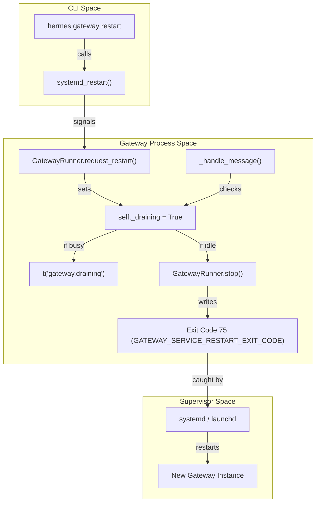
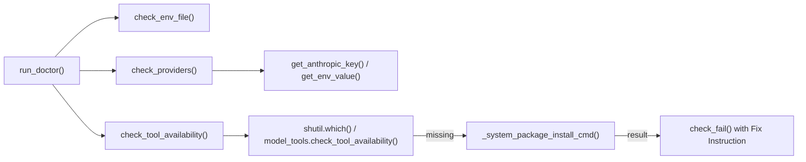

# Gateway Lifecycle & Service Management

Relevant source files

The following files were used as context for generating this wiki page:

- [.github/pr-screenshots/45449/billing-confirm.png](../.github/pr-screenshots/45449/billing-confirm.png)
- [.github/pr-screenshots/45449/billing-overview.png](../.github/pr-screenshots/45449/billing-overview.png)
- contributors/emails/phixxation@gmail.com
- [gateway/status.py](../gateway/status.py)
- [hermes_cli/_subprocess_compat.py](../hermes_cli/_subprocess_compat.py)
- [hermes_cli/doctor.py](../hermes_cli/doctor.py)
- [hermes_cli/gateway.py](../hermes_cli/gateway.py)
- [hermes_cli/gateway_windows.py](../hermes_cli/gateway_windows.py)
- [hermes_cli/profiles.py](../hermes_cli/profiles.py)
- [hermes_cli/status.py](../hermes_cli/status.py)
- [tests/cli/test_destructive_slash_confirm.py](../tests/cli/test_destructive_slash_confirm.py)
- [tests/cli/test_destructive_slash_inline_skip_e2e.py](../tests/cli/test_destructive_slash_inline_skip_e2e.py)
- [tests/cli/test_prompt_text_input_thread_safety.py](../tests/cli/test_prompt_text_input_thread_safety.py)
- [tests/gateway/restart_test_helpers.py](../tests/gateway/restart_test_helpers.py)
- [tests/gateway/test_destructive_slash_confirm.py](../tests/gateway/test_destructive_slash_confirm.py)
- [tests/gateway/test_discord_document_handling.py](../tests/gateway/test_discord_document_handling.py)
- [tests/gateway/test_discord_send.py](../tests/gateway/test_discord_send.py)
- [tests/gateway/test_document_cache.py](../tests/gateway/test_document_cache.py)
- [tests/gateway/test_gateway_command_line_matcher.py](../tests/gateway/test_gateway_command_line_matcher.py)
- [tests/gateway/test_gateway_shutdown.py](../tests/gateway/test_gateway_shutdown.py)
- [tests/gateway/test_matrix_project_context_isolation.py](../tests/gateway/test_matrix_project_context_isolation.py)
- [tests/gateway/test_restart_drain.py](../tests/gateway/test_restart_drain.py)
- [tests/gateway/test_restart_notification.py](../tests/gateway/test_restart_notification.py)
- [tests/gateway/test_runner_startup_failures.py](../tests/gateway/test_runner_startup_failures.py)
- [tests/gateway/test_send_image_file.py](../tests/gateway/test_send_image_file.py)
- [tests/gateway/test_session_boundary_security_state.py](../tests/gateway/test_session_boundary_security_state.py)
- [tests/gateway/test_status.py](../tests/gateway/test_status.py)
- [tests/gateway/test_telegram_documents.py](../tests/gateway/test_telegram_documents.py)
- [tests/gateway/test_update_command.py](../tests/gateway/test_update_command.py)
- [tests/gateway/test_update_streaming.py](../tests/gateway/test_update_streaming.py)
- [tests/gateway/test_usage_command.py](../tests/gateway/test_usage_command.py)
- [tests/hermes_cli/test_billing_portal_url.py](../tests/hermes_cli/test_billing_portal_url.py)
- [tests/hermes_cli/test_config_validation.py](../tests/hermes_cli/test_config_validation.py)
- [tests/hermes_cli/test_destructive_slash_confirm_gate.py](../tests/hermes_cli/test_destructive_slash_confirm_gate.py)
- [tests/hermes_cli/test_doctor.py](../tests/hermes_cli/test_doctor.py)
- [tests/hermes_cli/test_gateway.py](../tests/hermes_cli/test_gateway.py)
- [tests/hermes_cli/test_gateway_linger.py](../tests/hermes_cli/test_gateway_linger.py)
- [tests/hermes_cli/test_gateway_proc_fallback.py](../tests/hermes_cli/test_gateway_proc_fallback.py)
- [tests/hermes_cli/test_gateway_service.py](../tests/hermes_cli/test_gateway_service.py)
- [tests/hermes_cli/test_gateway_windows.py](../tests/hermes_cli/test_gateway_windows.py)
- [tests/hermes_cli/test_profiles.py](../tests/hermes_cli/test_profiles.py)
- [tests/run_agent/test_turn_completion_explainer.py](../tests/run_agent/test_turn_completion_explainer.py)
- [tests/tools/test_windows_native_support.py](../tests/tools/test_windows_native_support.py)
- [website/docs/reference/profile-commands.md](../website/docs/reference/profile-commands.md)
- [website/docs/user-guide/profile-distributions.md](../website/docs/user-guide/profile-distributions.md)
- [website/docs/user-guide/profiles.md](../website/docs/user-guide/profiles.md)

The Hermes Gateway is a long-running background process responsible for bridging the AIAgent with various messaging platforms. The lifecycle of this service is managed via the `hermes gateway` CLI, which abstracts the complexity of platform-specific service managers (systemd, launchd, and Windows Task Scheduler) and provides mechanisms for safe restarts, diagnostic health checks, and process isolation.

## 1. Gateway CLI Interface

The primary entry point for managing the gateway is the `hermes gateway` subcommand defined in `hermes_cli/gateway.py`. It provides a unified interface across Linux, macOS, and Windows.

| Command | Description |
| :--- | :--- |
| `hermes gateway run` | Runs the gateway in the foreground (interactive mode). |
| `hermes gateway start` | Installs and starts the gateway as a background service. |
| `hermes gateway stop` | Stops the background service. |
| `hermes gateway restart` | Performs a drain-aware restart of the service. |
| `hermes gateway status` | Displays the current runtime state and PID information. |
| `hermes gateway install` | Registers the gateway with the OS service manager. |
| `hermes gateway doctor` | Runs the diagnostic pipeline to identify configuration issues. |

Sources: `[hermes_cli/gateway.py:1-17](../hermes_cli/gateway.py#L1-L17)`, `[hermes_cli/status.py:105-112](../hermes_cli/status.py#L105-L112)`

## 2. Service Manager Integration

Hermes integrates natively with host operating systems to ensure the gateway persists across reboots and auto-restarts on failure.

### 2.1 Linux (systemd)
On Linux, Hermes uses `systemd` user units. The CLI generates a unit file (e.g., `hermes-gateway.service`) and manages it via `systemctl --user` `[hermes_cli/gateway.py:108-110](../hermes_cli/gateway.py#L108-L110)`. It includes preflight checks to ensure the D-Bus session bus is reachable `[tests/hermes_cli/test_gateway_service.py:22-30](../tests/hermes_cli/test_gateway_service.py#L22-L30)`.

### 2.2 macOS (launchd)
On macOS, the gateway is managed via `launchd` using `launchctl`. It identifies services using a specific label (typically `ai.hermes.gateway`) and parses `launchctl list` output to track PIDs `[hermes_cli/gateway.py:145-155](../hermes_cli/gateway.py#L145-L155)`.

### 2.3 Windows (Scheduled Tasks & Startup)
Windows management is handled in `hermes_cli/gateway_windows.py`. It primarily attempts to create a Scheduled Task using `schtasks.exe` with `/SC ONLOGON` and `/RL LIMITED` to run without elevation `[hermes_cli/gateway_windows.py:11-14](../hermes_cli/gateway_windows.py#L11-L14)`. If `schtasks` is blocked (e.g., corporate environments), it falls back to dropping a `.vbs` launcher in the user's Startup folder `[hermes_cli/gateway_windows.py:51-56](../hermes_cli/gateway_windows.py#L51-L56)`.

Sources: `[hermes_cli/gateway.py:97-174](../hermes_cli/gateway.py#L97-L174)`, `[hermes_cli/gateway_windows.py:1-26](../hermes_cli/gateway_windows.py#L1-L26)`, `[tests/hermes_cli/test_gateway_service.py:42-65](../tests/hermes_cli/test_gateway_service.py#L42-L65)`

## 3. Process Locking & Identity

To prevent multiple instances of the same profile from conflicting, Hermes uses a multi-layered locking strategy.

### 3.1 PID File Locking
The gateway maintains a `gateway.pid` file in `HERMES_HOME`. This file contains a JSON payload including the PID, start time, and command-line arguments `[gateway/status.py:157-161](../gateway/status.py#L157-L161)`. 
- **Atomic Writes**: Uses `O_CREAT | O_EXCL` to ensure only one process can successfully claim the PID file during startup `[tests/gateway/test_status.py:25-31](../tests/gateway/test_status.py#L25-L31)`.
- **Stale Cleanup**: If a PID file exists but the process is dead, the CLI automatically unlinks it `[tests/gateway/test_status.py:57-61](../tests/gateway/test_status.py#L57-L61)`.

### 3.2 Runtime Mutual Exclusion
Beyond the PID file, a `gateway.lock` file is used for advisory or mandatory locking (depending on OS). On Windows, it uses byte-range locks via `msvcrt` `[gateway/status.py:30-31](../gateway/status.py#L30-L31)`, while POSIX systems use `fcntl` `[gateway/status.py:32-33](../gateway/status.py#L32-L33)`.

### 3.3 Respawn-Storm Breaker
To prevent infinite crash loops from consuming system resources, the `record_start_and_check_storm` function tracks start timestamps in `gateway-starts.log` `[gateway/status.py:62-66](../gateway/status.py#L62-L66)`. If more than 5 starts occur within 120 seconds, it enforces an exponential backoff `[gateway/status.py:116-121](../gateway/status.py#L116-L121)`.

Sources: `[gateway/status.py:1-50](../gateway/status.py#L1-L50)`, `[gateway/status.py:69-121](../gateway/status.py#L69-L121)`, `[tests/gateway/test_status.py:13-48](../tests/gateway/test_status.py#L13-L48)`

## 4. Drain-Aware Restart Lifecycle

Hermes implements a "graceful drain" mechanism to ensure that restarts do not interrupt active LLM turns or tool executions.

### 4.1 The Restart Flow
When a restart is requested (via `/restart` or CLI), the `GatewayRunner` enters a `draining` state `[tests/gateway/test_restart_drain.py:50-54](../tests/gateway/test_restart_drain.py#L50-L54)`.
1. **Draining State**: The gateway stops accepting new sessions `[tests/gateway/test_restart_drain.py:75-90](../tests/gateway/test_restart_drain.py#L75-L90)`.
2. **Busy Handling**: If a session is currently in a turn, the gateway waits for the turn to complete. Depending on `busy_input_mode` (interrupt, queue, or steer), follow-up messages are either queued or rejected with a notification `[tests/gateway/test_restart_drain.py:92-118](../tests/gateway/test_restart_drain.py#L92-L118)`.
3. **Planned Stop Marker**: Before exiting, the process can write a "planned stop marker" to notify the supervisor (systemd/launchd) that this exit was intentional, preventing it from being treated as a crash `[tests/hermes_cli/test_gateway_service.py:130-142](../tests/hermes_cli/test_gateway_service.py#L130-L142)`.

### 4.2 Code Entity Mapping: Restart Logic

Title: Gateway Restart and Drain Logic

Sources: `[gateway/restart.py:34-41](../gateway/restart.py#L34-L41)`, `[tests/gateway/test_restart_drain.py:18-48](../tests/gateway/test_restart_drain.py#L18-L48)`, `[hermes_cli/gateway.py:34-41](../hermes_cli/gateway.py#L34-L41)`

## 5. The Doctor Diagnostic Pipeline

The `hermes doctor` command (implemented in `hermes_cli/doctor.py`) is a comprehensive diagnostic suite used to validate the environment before or during gateway operation.

### 5.1 Diagnostic Checks
The pipeline executes several categories of checks:
- **Environment**: Validates `.env` existence and UTF-8 encoding integrity `[hermes_cli/doctor.py:122-124](../hermes_cli/doctor.py#L122-L124)`, `[tests/hermes_cli/test_doctor.py:78-85](../tests/hermes_cli/test_doctor.py#L78-L85)`.
- **API Connectivity**: Probes configured providers (OpenRouter, Anthropic, etc.) to ensure keys are valid and endpoints are reachable `[hermes_cli/doctor.py:32-57](../hermes_cli/doctor.py#L32-L57)`.
- **Tool Availability**: Checks if external dependencies (e.g., `ffmpeg`, `node`, `ripgrep`) are installed `[hermes_cli/doctor.py:67-72](../hermes_cli/doctor.py#L67-L72)`.
- **Platform Hints**: Provides specific commands for fixing issues based on the OS (e.g., `pkg install` for Termux vs `apt install` for Linux) `[hermes_cli/doctor.py:63-72](../hermes_cli/doctor.py#L63-L72)`.

### 5.2 Code Entity Mapping: Doctor Pipeline

Title: Doctor Diagnostic Flow

Sources: `[hermes_cli/doctor.py:1-30](../hermes_cli/doctor.py#L1-L30)`, `[hermes_cli/doctor.py:179-190](../hermes_cli/doctor.py#L179-L190)`, `[tests/hermes_cli/test_doctor.py:1-35](../tests/hermes_cli/test_doctor.py#L1-L35)`

## 6. Profile Isolation

The gateway lifecycle is strictly bound to Hermes Profiles. Each profile (e.g., `default`, `coder`) maintains its own:
- **`gateway.pid`**: Ensures only one instance per profile `[hermes_cli/profiles.py:71-78](../hermes_cli/profiles.py#L71-L78)`.
- **Service Name**: Systemd/launchd services are named `hermes-gateway-<profile>` to allow concurrent execution of different agents `[hermes_cli/profiles.py:11-20](../hermes_cli/profiles.py#L11-L20)`.
- **Environment**: `.env` and `config.yaml` are loaded from the profile-specific `HERMES_HOME` `[hermes_cli/profiles.py:4-6](../hermes_cli/profiles.py#L4-L6)`.

Sources: `[hermes_cli/profiles.py:1-20](../hermes_cli/profiles.py#L1-L20)`, `[hermes_cli/profiles.py:39-54](../hermes_cli/profiles.py#L39-L54)`, `[gateway/status.py:7-12](../gateway/status.py#L7-L12)`

---
