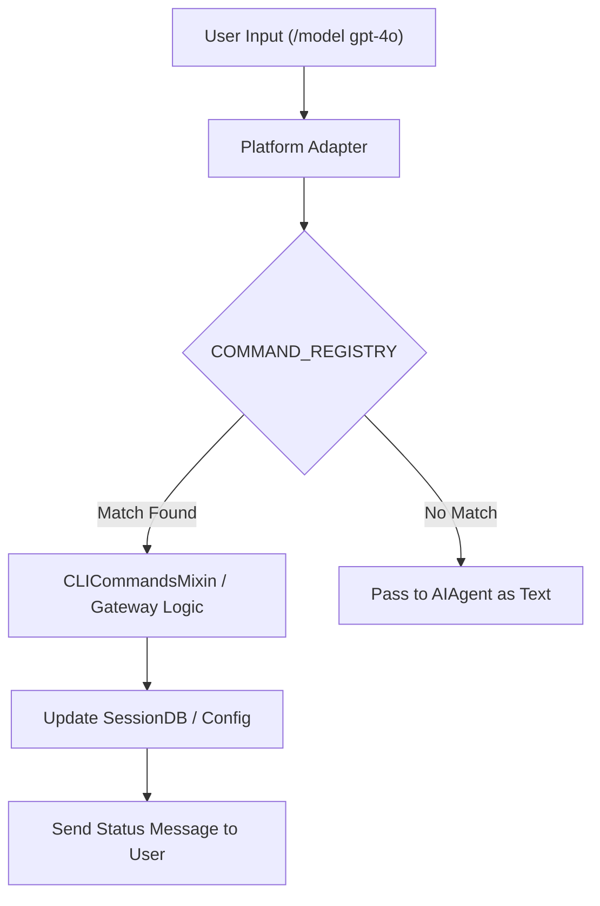
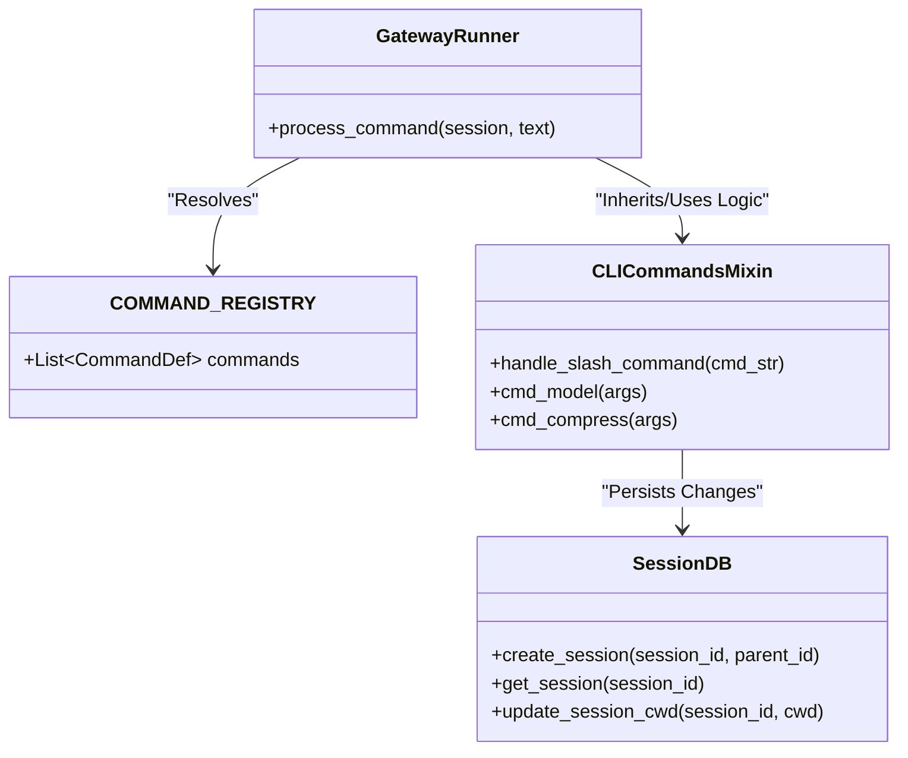

# Slash Commands & Gateway Interactions

Relevant source files

The following files were used as context for generating this wiki page:

- [.env.example](../.env.example)
- [AGENTS.md](../AGENTS.md)
- [README.md](../README.md)
- [agent/manual_compression_feedback.py](../agent/manual_compression_feedback.py)
- [cli-config.yaml.example](../cli-config.yaml.example)
- [cli.py](../cli.py)
- [gateway/config.py](../gateway/config.py)
- [gateway/platforms/base.py](../gateway/platforms/base.py)
- [gateway/run.py](../gateway/run.py)
- [gateway/session.py](../gateway/session.py)
- [gateway/slash_commands.py](../gateway/slash_commands.py)
- [hermes_cli/browser_connect.py](../hermes_cli/browser_connect.py)
- [hermes_cli/cli_commands_mixin.py](../hermes_cli/cli_commands_mixin.py)
- [hermes_cli/commands.py](../hermes_cli/commands.py)
- [hermes_cli/config.py](../hermes_cli/config.py)
- [hermes_cli/session_listing.py](../hermes_cli/session_listing.py)
- [hermes_cli/write_approval_commands.py](../hermes_cli/write_approval_commands.py)
- [hermes_state.py](../hermes_state.py)
- [run_agent.py](../run_agent.py)
- [tests/agent/test_manual_compression_feedback.py](../tests/agent/test_manual_compression_feedback.py)
- [tests/cli/test_branch_command.py](../tests/cli/test_branch_command.py)
- [tests/cli/test_cli_browser_connect.py](../tests/cli/test_cli_browser_connect.py)
- [tests/cli/test_cli_resume_command.py](../tests/cli/test_cli_resume_command.py)
- [tests/cli/test_manual_compress.py](../tests/cli/test_manual_compress.py)
- [tests/gateway/test_compress_command.py](../tests/gateway/test_compress_command.py)
- [tests/gateway/test_config.py](../tests/gateway/test_config.py)
- [tests/gateway/test_platform_base.py](../tests/gateway/test_platform_base.py)
- [tests/gateway/test_resume_command.py](../tests/gateway/test_resume_command.py)
- [tests/gateway/test_session.py](../tests/gateway/test_session.py)
- [tests/gateway/test_session_hygiene.py](../tests/gateway/test_session_hygiene.py)
- [tests/gateway/test_session_reset_notify.py](../tests/gateway/test_session_reset_notify.py)
- [tests/gateway/test_shared_group_sender_prefix.py](../tests/gateway/test_shared_group_sender_prefix.py)
- [tests/gateway/test_tts_media_routing.py](../tests/gateway/test_tts_media_routing.py)
- [tests/hermes_cli/test_browser_connect_dual_stack.py](../tests/hermes_cli/test_browser_connect_dual_stack.py)
- [tests/hermes_cli/test_commands.py](../tests/hermes_cli/test_commands.py)
- [tests/hermes_cli/test_session_listing.py](../tests/hermes_cli/test_session_listing.py)
- [tests/test_hermes_state.py](../tests/test_hermes_state.py)
- [tests/tools/test_memory_tool.py](../tests/tools/test_memory_tool.py)
- [tests/tools/test_memory_tool_schema.py](../tests/tools/test_memory_tool_schema.py)
- [tests/tools/test_write_approval.py](../tests/tools/test_write_approval.py)
- [tests/tui_gateway/test_compress_lock_skip.py](../tests/tui_gateway/test_compress_lock_skip.py)
- [tools/memory_tool.py](../tools/memory_tool.py)
- [tools/write_approval.py](../tools/write_approval.py)
- [website/docs/user-guide/features/memory.md](../website/docs/user-guide/features/memory.md)

Hermes Agent provides a unified command system that bridges the gap between interactive terminal sessions and multi-platform messaging gateways. This system is driven by a central registry that ensures consistent behavior for operations like session branching, context compression, and model switching across all interfaces.

## 1. The Central Command Registry

The `COMMAND_REGISTRY` in `hermes_cli/commands.py` is the single source of truth for all slash commands. Every consumer—including CLI autocomplete, Telegram `BotCommands`, and Slack subcommand dispatch—derives its definitions from this list of `CommandDef` objects [hermes_cli/commands.py:3-9](../hermes_cli/commands.py#L3-L9).

### Command Definition Structure
Each `CommandDef` defines the canonical name, description, category, and availability constraints for a command [hermes_cli/commands.py:45-58](../hermes_cli/commands.py#L45-L58).

| Field | Description |
| :--- | :--- |
| `name` | Canonical name without the slash (e.g., `"compress"`) |
| `aliases` | Alternative names (e.g., `("compact",)`) |
| `args_hint` | Placeholder for arguments (e.g., `"[here [N]]"`) |
| `cli_only` | If `True`, hidden from messaging platforms |
| `gateway_only` | If `True`, only available in messaging adapters (e.g., `/approve`) |

**Sources:** [hermes_cli/commands.py:45-58](../hermes_cli/commands.py#L45-L58), [hermes_cli/commands.py:64-150](../hermes_cli/commands.py#L64-L150)

---

## 2. Gateway Slash Commands & Data Flow

When a user sends a message starting with `/` on a platform like Telegram or Discord, the `GatewayRunner` intercepts it before it reaches the `AIAgent`.

### Interaction Lifecycle
1.  **Intercept**: The platform adapter (e.g., `TelegramAdapter`) receives a message and identifies it as a command using `_TELEGRAM_COMMAND_MENTION_RE` [gateway/run.py:82](../gateway/run.py#L82).
2.  **Resolve**: The `resolve_command` function matches the input against `COMMAND_REGISTRY` [hermes_cli/commands.py:28-30](../hermes_cli/commands.py#L28-L30).
3.  **Dispatch**:
    *   **Internal Commands**: Commands like `/model` or `/yolo` update the session state or configuration directly [gateway/run.py:1120-1150](../gateway/run.py#L1120-L1150).
    *   **Agent Commands**: Commands like `/retry` or `/undo` manipulate the message history in the `SessionDB` before re-triggering the conversation loop [gateway/run.py:1080-1100](../gateway/run.py#L1080-L1100).

### Key Gateway Commands
*   `/retry`: Re-runs the last user turn by stripping the previous assistant response and re-invoking `agent.run_conversation` [hermes_cli/commands.py:80](../hermes_cli/commands.py#L80).
*   `/undo [N]`: Removes the last `N` turns from the `SessionDB` [hermes_cli/commands.py:83-84](../hermes_cli/commands.py#L83-L84).
*   `/compress`: Manually triggers the `ContextCompressor` to summarize history and free up the context window [hermes_cli/commands.py:91-92](../hermes_cli/commands.py#L91-L92).
*   `/yolo`: Toggles "You Only Live Once" mode, which bypasses security confirmations for dangerous commands [hermes_cli/commands.py:137](../hermes_cli/commands.py#L137).
*   `/branch`: Creates a new session ID forked from the current state, allowing the user to explore a different path without polluting the main history [hermes_cli/commands.py:89-90](../hermes_cli/commands.py#L89-L90).

### Command Resolution Logic
Title: Command Dispatch Flow

**Sources:** [gateway/run.py:1050-1150](../gateway/run.py#L1050-L1150), [hermes_cli/commands.py:64-150](../hermes_cli/commands.py#L64-L150), [hermes_cli/cli_commands_mixin.py:1-50](../hermes_cli/cli_commands_mixin.py#L1-L50)

---

## 3. Session & Memory Interactions

### The Memory Tool
The `memory_tool` allows the agent to persist long-term knowledge across sessions. It interacts with the `memory_manager` to store "snippets" of information in the `SessionDB` or a vector provider [tools/memory_tool.py:1-30](../tools/memory_tool.py#L1-L30).
*   **Data Flow**: `AIAgent` calls `memory_tool` -> `memory_manager` writes to `SessionDB` -> Information is injected into the "Volatile Tier" of the system prompt in future turns [agent/prompt_builder.py:163-170](../agent/prompt_builder.py#L163-L170).

### Browser Connect Integration
The `/browser` command (or `browser_connect` integration) allows the agent to link to a running browser instance for debugging or complex web automation [hermes_cli/browser_connect.py:1-20](../hermes_cli/browser_connect.py#L1-L20).
*   It establishes a connection via CDP (Chrome DevTools Protocol) and exposes the `browser_tool` capabilities to the agent [tools/browser_tool.py:145](../tools/browser_tool.py#L145).

**Sources:** [tools/memory_tool.py:1-30](../tools/memory_tool.py#L1-L30), [hermes_cli/browser_connect.py:1-20](../hermes_cli/browser_connect.py#L1-L20), [hermes_state.py:1-15](../hermes_state.py#L1-L15)

---

## 4. Technical Implementation: CLI & Gateway Mixins

The logic for executing these commands is shared between the CLI and the Gateway via Mixin classes.

### `CLICommandsMixin`
This class, defined in `hermes_cli/cli_commands_mixin.py`, contains the implementation for commands that require terminal interaction or local filesystem access.
*   **`handle_slash_command`**: The primary entry point that parses arguments using `shlex` and dispatches to specific methods like `cmd_model` or `cmd_compress` [hermes_cli/cli_commands_mixin.py:100-150](../hermes_cli/cli_commands_mixin.py#L100-L150).

### `SessionDB` Integration
Commands that affect session state (like `/branch` or `/resume`) interact directly with `hermes_state.py`.
*   **Branching**: When `/branch` is called, `SessionDB.create_session` is invoked with a `parent_session_id`. The new session inherits the `cwd` and `git_repo_root` from the parent [hermes_state.py:142-153](../hermes_state.py#L142-L153).
*   **Resuming**: The `/resume [name]` command queries the `sessions` table in SQLite to find a session with a matching title or ID and reloads the conversation history [hermes_state.py:84-98](../hermes_state.py#L84-L98).

Title: Code Entity Space - Command Logic Mapping

**Sources:** [hermes_cli/commands.py:64-150](../hermes_cli/commands.py#L64-L150), [hermes_cli/cli_commands_mixin.py:1-50](../hermes_cli/cli_commands_mixin.py#L1-L50), [hermes_state.py:84-170](../hermes_state.py#L84-L170), [gateway/run.py:1050-1100](../gateway/run.py#L1050-L1100)

---

## 5. Security & Write Approval

For commands involving dangerous patterns (e.g., `rm -rf`), Hermes enters a "Pending Approval" state.
*   **Gateway Interaction**: The gateway sends an interactive message (e.g., Telegram buttons) to the user [gateway/run.py:112-115](../gateway/run.py#L112-L115).
*   **Commands**:
    *   `/approve`: Sets the internal `WriteApproval` state to `APPROVED`, allowing the `terminal_tool` to proceed [tools/write_approval.py:1-20](../tools/write_approval.py#L1-L20).
    *   `/deny`: Cancels the execution and returns an error to the agent [hermes_cli/commands.py:100-101](../hermes_cli/commands.py#L100-L101).

**Sources:** [tools/write_approval.py:1-20](../tools/write_approval.py#L1-L20), [hermes_cli/write_approval_commands.py:1-30](../hermes_cli/write_approval_commands.py#L1-L30), [gateway/run.py:112-115](../gateway/run.py#L112-L115)

---
