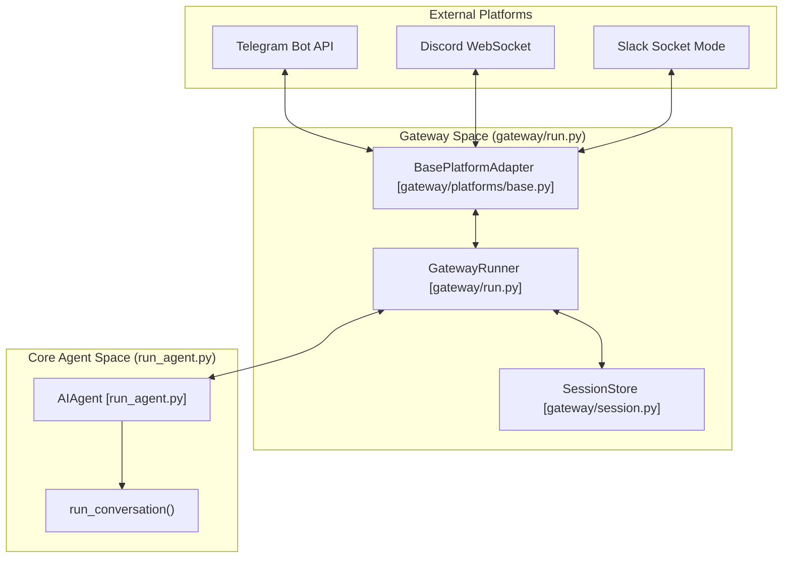
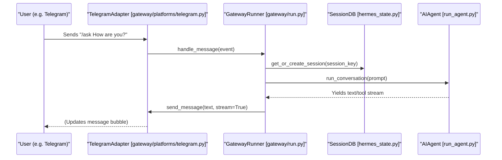

# Messaging Gateway

Relevant source files

The following files were used as context for generating this wiki page:

- [.env.example](../.env.example)
- [AGENTS.md](../AGENTS.md)
- [README.md](../README.md)
- [cli-config.yaml.example](../cli-config.yaml.example)
- [cli.py](../cli.py)
- contributors/emails/phixxation@gmail.com
- [gateway/config.py](../gateway/config.py)
- [gateway/platforms/base.py](../gateway/platforms/base.py)
- [gateway/run.py](../gateway/run.py)
- [gateway/session.py](../gateway/session.py)
- [gateway/status.py](../gateway/status.py)
- [hermes_cli/_subprocess_compat.py](../hermes_cli/_subprocess_compat.py)
- [hermes_cli/commands.py](../hermes_cli/commands.py)
- [hermes_cli/config.py](../hermes_cli/config.py)
- [hermes_cli/doctor.py](../hermes_cli/doctor.py)
- [hermes_cli/gateway.py](../hermes_cli/gateway.py)
- [hermes_cli/gateway_windows.py](../hermes_cli/gateway_windows.py)
- [hermes_cli/profiles.py](../hermes_cli/profiles.py)
- [hermes_cli/status.py](../hermes_cli/status.py)
- [hermes_state.py](../hermes_state.py)
- [run_agent.py](../run_agent.py)
- [tests/gateway/test_config.py](../tests/gateway/test_config.py)
- [tests/gateway/test_discord_document_handling.py](../tests/gateway/test_discord_document_handling.py)
- [tests/gateway/test_discord_send.py](../tests/gateway/test_discord_send.py)
- [tests/gateway/test_document_cache.py](../tests/gateway/test_document_cache.py)
- [tests/gateway/test_gateway_command_line_matcher.py](../tests/gateway/test_gateway_command_line_matcher.py)
- [tests/gateway/test_platform_base.py](../tests/gateway/test_platform_base.py)
- [tests/gateway/test_runner_startup_failures.py](../tests/gateway/test_runner_startup_failures.py)
- [tests/gateway/test_send_image_file.py](../tests/gateway/test_send_image_file.py)
- [tests/gateway/test_session.py](../tests/gateway/test_session.py)
- [tests/gateway/test_session_reset_notify.py](../tests/gateway/test_session_reset_notify.py)
- [tests/gateway/test_shared_group_sender_prefix.py](../tests/gateway/test_shared_group_sender_prefix.py)
- [tests/gateway/test_status.py](../tests/gateway/test_status.py)
- [tests/gateway/test_telegram_documents.py](../tests/gateway/test_telegram_documents.py)
- [tests/gateway/test_tts_media_routing.py](../tests/gateway/test_tts_media_routing.py)
- [tests/hermes_cli/test_commands.py](../tests/hermes_cli/test_commands.py)
- [tests/hermes_cli/test_config_validation.py](../tests/hermes_cli/test_config_validation.py)
- [tests/hermes_cli/test_doctor.py](../tests/hermes_cli/test_doctor.py)
- [tests/hermes_cli/test_gateway.py](../tests/hermes_cli/test_gateway.py)
- [tests/hermes_cli/test_gateway_linger.py](../tests/hermes_cli/test_gateway_linger.py)
- [tests/hermes_cli/test_gateway_proc_fallback.py](../tests/hermes_cli/test_gateway_proc_fallback.py)
- [tests/hermes_cli/test_gateway_service.py](../tests/hermes_cli/test_gateway_service.py)
- [tests/hermes_cli/test_gateway_windows.py](../tests/hermes_cli/test_gateway_windows.py)
- [tests/hermes_cli/test_profiles.py](../tests/hermes_cli/test_profiles.py)
- [tests/test_hermes_state.py](../tests/test_hermes_state.py)
- [tests/tools/test_windows_native_support.py](../tests/tools/test_windows_native_support.py)
- [website/docs/reference/profile-commands.md](../website/docs/reference/profile-commands.md)
- [website/docs/user-guide/profile-distributions.md](../website/docs/user-guide/profile-distributions.md)
- [website/docs/user-guide/profiles.md](../website/docs/user-guide/profiles.md)

The Messaging Gateway is a multi-platform bridge that allows the Hermes AIAgent to communicate across various messaging services like Telegram, Discord, Slack, and WhatsApp. It transforms the local, terminal-centric agent into a persistent, multi-user service capable of handling concurrent conversations and long-running tasks.

The gateway is managed by the `GatewayRunner` class, which orchestrates the lifecycle of platform adapters, session state, and message delivery.

## System Architecture

The gateway operates as a daemon process that multiplexes between multiple messaging platforms. Each platform is integrated via a dedicated adapter that inherits from a common interface.

### Gateway Connectivity Diagram
This diagram illustrates how the `GatewayRunner` acts as the central hub between external messaging platforms and the internal `AIAgent` logic.

Sources: [gateway/run.py:6-14](../gateway/run.py#L6-L14), [gateway/platforms/base.py:4-6](../gateway/platforms/base.py#L4-L6), [run_agent.py:17-21](../run_agent.py#L17-L21)

## Key Components

### GatewayRunner
The `GatewayRunner` is the primary entry point for the messaging bridge. It handles the initialization of all configured platform adapters and maintains the global agent cache to prevent memory exhaustion in long-lived sessions.
*   **Agent Cache:** Limits the number of active `AIAgent` instances using `_AGENT_CACHE_MAX_SIZE` (default 128) and evicts idle agents after `_AGENT_CACHE_IDLE_TTL_SECS` (1 hour).
*   **Status Filtering:** Automatically suppresses "noisy" system messages (like routine compression updates) on chat platforms unless explicitly enabled via `compression.progress_notices`.

### Session Management
Sessions in the gateway are identified by a composite key, typically formatted as `platform:chat_id:user_id`. This allows Hermes to maintain distinct conversation histories for different users within the same group or across different platforms.
*   **SessionStore:** Manages the persistence of these conversations using the SQLite-backed `hermes_state.py`.
*   **Reset Policies:** Evaluates when a session should be cleared or branched based on idle time or explicit user commands.

### Platform Adapters
All platform integrations (e.g., `TelegramAdapter`, `DiscordAdapter`) must implement the `BasePlatformAdapter` interface. This ensures a consistent contract for:
*   **Message Routing:** Sending text, images, and audio files.
*   **Formatting:** Translating Markdown to platform-specific formats (e.g., Telegram's HTML or Slack's Block Kit).
*   **Thread Management:** Handling replies and thread-local context.

Sources: [gateway/run.py:72-78](../gateway/run.py#L72-L78), [gateway/run.py:160-166](../gateway/run.py#L160-L166), [gateway/platforms/base.py:40-43](../gateway/platforms/base.py#L40-L43), [gateway/session.py:149-158](../gateway/session.py#L149-L158), [hermes_state.py:3-15](../hermes_state.py#L3-L15)

## Code Entity Mapping

The following table and diagram bridge the gap between high-level gateway concepts and their implementation in the codebase.

| Concept | Code Entity | File Path |
| :--- | :--- | :--- |
| **Main Entry Point** | `start_gateway()` | [gateway/run.py:5-5](../gateway/run.py#L5) |
| **Adapter Interface** | `BasePlatformAdapter` | [gateway/platforms/base.py:21-21](../gateway/platforms/base.py#L21) |
| **Persistence Layer** | `SessionDB` | [hermes_state.py:3-15](../hermes_state.py#L3-L15) |
| **CLI Subcommand** | `hermes gateway` | [hermes_cli/gateway.py:4-5](../hermes_cli/gateway.py#L4-L5) |
| **Command Registry** | `COMMAND_REGISTRY` | [hermes_cli/commands.py:64-64](../hermes_cli/commands.py#L64) |

### Gateway Interaction Flow
This diagram shows the sequence of a message entering the gateway and being processed by the agent.

Sources: [gateway/run.py:5-14](../gateway/run.py#L5-L14), [gateway/session.py:149-158](../gateway/session.py#L149-L158), [run_agent.py:17-21](../run_agent.py#L17-L21), [hermes_state.py:3-15](../hermes_state.py#L3-L15)

## Sub-Topics

### [4.1 Gateway Architecture & Session Management](#)
Details on the `GatewayRunner` lifecycle, how the `SessionStore` keys conversations by platform and user, and the mechanics of streaming delivery (edit-based vs. native). For details, see [Gateway Architecture & Session Management](#4.1).

### [4.2 Platform Adapters](#)
Comprehensive coverage of all supported messaging platforms including Telegram, Discord, Slack, WhatsApp, Matrix, and Signal. Includes configuration for webhooks and socket mode. For details, see [Platform Adapters](#4.2).

### [4.3 Gateway Lifecycle & Service Management](#)
Documentation on the `hermes gateway` CLI commands (`start`, `stop`, `restart`) and integration with system supervisors like `systemd` (Linux) and `launchd` (macOS). For details, see [Gateway Lifecycle & Service Management](#4.3).

### [4.4 Slash Commands & Gateway Interactions](#)
Overview of the `COMMAND_REGISTRY` and how slash commands (like `/retry`, `/undo`, and `/model`) are parsed and executed within the messaging environment. For details, see [Slash Commands & Gateway Interactions](#4.4).

---
