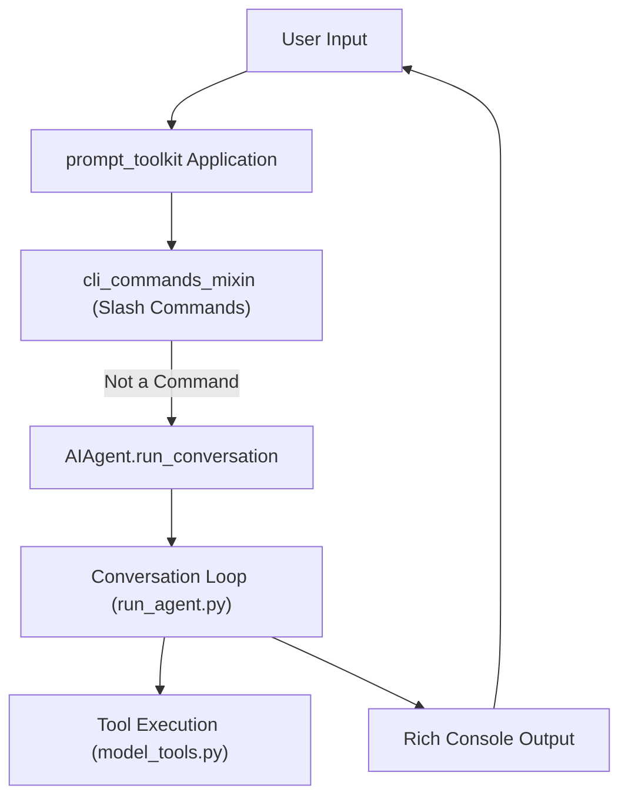

# CLI & REPL (HermesCLI)

Relevant source files

The following files were used as context for generating this wiki page:

- [.env.example](../.env.example)
- [AGENTS.md](../AGENTS.md)
- [README.md](../README.md)
- [acp_adapter/entry.py](../acp_adapter/entry.py)
- [agent/auxiliary_client.py](../agent/auxiliary_client.py)
- [agent/credential_pool.py](../agent/credential_pool.py)
- [agent/onboarding.py](../agent/onboarding.py)
- [apps/desktop/src/lib/runtime-readiness.test.ts](../apps/desktop/src/lib/runtime-readiness.test.ts)
- [apps/desktop/src/lib/runtime-readiness.ts](../apps/desktop/src/lib/runtime-readiness.ts)
- [apps/desktop/src/store/onboarding.test.ts](../apps/desktop/src/store/onboarding.test.ts)
- [apps/desktop/src/store/onboarding.ts](../apps/desktop/src/store/onboarding.ts)
- [cli-config.yaml.example](../cli-config.yaml.example)
- [cli.py](../cli.py)
- contributors/emails/mattshapsss@gmail.com
- [gateway/assets/status_phrases.yaml](../gateway/assets/status_phrases.yaml)
- [gateway/config.py](../gateway/config.py)
- [gateway/display_config.py](../gateway/display_config.py)
- [gateway/platforms/base.py](../gateway/platforms/base.py)
- [gateway/run.py](../gateway/run.py)
- [gateway/session.py](../gateway/session.py)
- [gateway/status_phrases.py](../gateway/status_phrases.py)
- [hermes_bootstrap.py](../hermes_bootstrap.py)
- [hermes_cli/auth.py](../hermes_cli/auth.py)
- [hermes_cli/auth_commands.py](../hermes_cli/auth_commands.py)
- [hermes_cli/banner.py](../hermes_cli/banner.py)
- [hermes_cli/commands.py](../hermes_cli/commands.py)
- [hermes_cli/config.py](../hermes_cli/config.py)
- [hermes_cli/main.py](../hermes_cli/main.py)
- [hermes_cli/models.py](../hermes_cli/models.py)
- [hermes_cli/proxy/adapters/base.py](../hermes_cli/proxy/adapters/base.py)
- [hermes_cli/proxy/adapters/nous_portal.py](../hermes_cli/proxy/adapters/nous_portal.py)
- [hermes_cli/pt_input_extras.py](../hermes_cli/pt_input_extras.py)
- [hermes_cli/runtime_provider.py](../hermes_cli/runtime_provider.py)
- [hermes_cli/setup.py](../hermes_cli/setup.py)
- [hermes_state.py](../hermes_state.py)
- [run_agent.py](../run_agent.py)
- [tests/acp/test_entry.py](../tests/acp/test_entry.py)
- [tests/agent/test_auxiliary_client.py](../tests/agent/test_auxiliary_client.py)
- [tests/agent/test_credential_pool.py](../tests/agent/test_credential_pool.py)
- [tests/agent/test_credential_pool_oauth_writethrough.py](../tests/agent/test_credential_pool_oauth_writethrough.py)
- [tests/agent/test_onboarding.py](../tests/agent/test_onboarding.py)
- [tests/cli/test_cli_init.py](../tests/cli/test_cli_init.py)
- [tests/cli/test_cli_shift_enter_newline.py](../tests/cli/test_cli_shift_enter_newline.py)
- [tests/cli/test_cli_terminal_shortcuts.py](../tests/cli/test_cli_terminal_shortcuts.py)
- [tests/cli/test_cpr_local_leak.py](../tests/cli/test_cpr_local_leak.py)
- [tests/cli/test_ctrl_enter_newline.py](../tests/cli/test_ctrl_enter_newline.py)
- [tests/gateway/test_busy_session_ack.py](../tests/gateway/test_busy_session_ack.py)
- [tests/gateway/test_config.py](../tests/gateway/test_config.py)
- [tests/gateway/test_display_config.py](../tests/gateway/test_display_config.py)
- [tests/gateway/test_platform_base.py](../tests/gateway/test_platform_base.py)
- [tests/gateway/test_run_progress_topics.py](../tests/gateway/test_run_progress_topics.py)
- [tests/gateway/test_session.py](../tests/gateway/test_session.py)
- [tests/gateway/test_session_reset_notify.py](../tests/gateway/test_session_reset_notify.py)
- [tests/gateway/test_shared_group_sender_prefix.py](../tests/gateway/test_shared_group_sender_prefix.py)
- [tests/gateway/test_status_phrases.py](../tests/gateway/test_status_phrases.py)
- [tests/gateway/test_tts_media_routing.py](../tests/gateway/test_tts_media_routing.py)
- [tests/gateway/test_verbose_command.py](../tests/gateway/test_verbose_command.py)
- [tests/hermes_cli/test_auth_commands.py](../tests/hermes_cli/test_auth_commands.py)
- [tests/hermes_cli/test_auth_nous_provider.py](../tests/hermes_cli/test_auth_nous_provider.py)
- [tests/hermes_cli/test_auth_profile_fallback.py](../tests/hermes_cli/test_auth_profile_fallback.py)
- [tests/hermes_cli/test_banner.py](../tests/hermes_cli/test_banner.py)
- [tests/hermes_cli/test_commands.py](../tests/hermes_cli/test_commands.py)
- [tests/hermes_cli/test_managed_installs.py](../tests/hermes_cli/test_managed_installs.py)
- [tests/hermes_cli/test_model_validation.py](../tests/hermes_cli/test_model_validation.py)
- [tests/hermes_cli/test_pip_install_detection.py](../tests/hermes_cli/test_pip_install_detection.py)
- [tests/hermes_cli/test_proxy.py](../tests/hermes_cli/test_proxy.py)
- [tests/hermes_cli/test_runtime_provider_resolution.py](../tests/hermes_cli/test_runtime_provider_resolution.py)
- [tests/hermes_cli/test_update_check.py](../tests/hermes_cli/test_update_check.py)
- [tests/hermes_cli/test_web_oauth_dispatch.py](../tests/hermes_cli/test_web_oauth_dispatch.py)
- [tests/test_hermes_bootstrap.py](../tests/test_hermes_bootstrap.py)
- [tests/test_hermes_state.py](../tests/test_hermes_state.py)
- [tests/test_install_sh_install_method_stamp.py](../tests/test_install_sh_install_method_stamp.py)
- [tests/tools/test_dockerfile_immutable_install.py](../tests/tools/test_dockerfile_immutable_install.py)
- [tests/tools/test_lazy_deps_durable_target.py](../tests/tools/test_lazy_deps_durable_target.py)
- [tests/tui_gateway/test_entry_sys_path.py](../tests/tui_gateway/test_entry_sys_path.py)
- [ui-tui/src/__tests__/textInputPassThrough.test.ts](../ui-tui/src/__tests__/textInputPassThrough.test.ts)
- [website/docs/developer-guide/acp-internals.md](../website/docs/developer-guide/acp-internals.md)
- [website/docs/user-guide/features/acp.md](../website/docs/user-guide/features/acp.md)

The **HermesCLI** is the primary interactive interface for Hermes Agent, providing a high-performance REPL (Read-Eval-Print Loop) built on `prompt_toolkit`. It serves as the local entry point for executing agentic workflows, managing configurations, and orchestrating multi-platform gateways.

## Entrypoint & Argparse

The main entry point for the Hermes suite is `hermes_cli/main.py`. This script handles command routing for interactive chat, gateway management, setup wizards, and maintenance utilities.

### Windows UTF-8 Bootstrap
To ensure cross-platform compatibility, Hermes employs a specific bootstrap sequence on Windows. `hermes_bootstrap` is imported at the very top of entry points to set up UTF-8 stdio, preventing `UnicodeEncodeError` when the agent outputs non-ASCII characters or emojis [hermes_cli/main.py:46-62](../hermes_cli/main.py#L46-L62). It also neutralizes CPython's `platform._syscmd_ver` to prevent visible console flashes during windowless operations [hermes_cli/main.py:64-71](../hermes_cli/main.py#L64-L71).

### One-Shot Mode
Hermes supports "one-shot" execution where a prompt is passed directly via CLI arguments. In this mode, the agent executes the task and exits. To prevent native extension finalizers from crashing the process during CPython's `Py_FinalizeEx`, Hermes uses `os._exit` after flushing streams to bypass standard interpreter finalization [hermes_cli/main.py:96-122](../hermes_cli/main.py#L96-L122).

### CLI Command Routing
| Command | Functionality |
| :--- | :--- |
| `hermes chat` | Launches the interactive REPL [hermes_cli/main.py:7](../hermes_cli/main.py#L7). |
| `hermes gateway` | Manages the messaging platform bridge (start/stop/status) [hermes_cli/main.py:8-13](../hermes_cli/main.py#L8-L13). |
| `hermes setup` | Launches the interactive configuration wizard [hermes_cli/main.py:14](../hermes_cli/main.py#L14). |
| `hermes sessions` | Interactive session browser and search [hermes_cli/main.py:41](../hermes_cli/main.py#L41). |
| `hermes doctor` | Diagnostic tool for configuration and dependencies [hermes_cli/main.py:20](../hermes_cli/main.py#L20). |

**Sources:** [hermes_cli/main.py:1-44](../hermes_cli/main.py#L1-L44), [hermes_cli/main.py:46-122](../hermes_cli/main.py#L46-L122).

## Interactive REPL (cli.py)

The interactive REPL is implemented in `cli.py` using `prompt_toolkit`. It provides a "Fixed Input Area" TUI experience similar to modern AI coding interfaces.

### REPL Architecture
The REPL uses a split layout:
1.  **HSplit**: Vertically stacks the conversation history and the input area [cli.py:65](../cli.py#L65).
2.  **Key Bindings**: Custom bindings for `Shift+Enter` (newline) vs `Enter` (submit) [cli.py:81-89](../cli.py#L81-L89).
3.  **History**: Persistent command history via `FileHistory` [cli.py:61](../cli.py#L61).

### Visual Formatting & Branding
Hermes uses `rich` and `prompt_toolkit` for formatting.
-   **Banner**: Displays ASCII art and version information upon startup.
-   **Update Checks**: Performs asynchronous checks for newer versions of the agent [hermes_cli/main.py:38](../hermes_cli/main.py#L38).
-   **Reverse Aliasing**: The TUI translates internal model IDs (like long Palantir RIDs) into friendly aliases defined in `config.yaml` for display [cli.py:129-165](../cli.py#L129-L165).

### REPL Data Flow
The following diagram illustrates the flow from user input in the REPL to agent execution.

**REPL Execution Flow**

**Sources:** [cli.py:60-78](../cli.py#L60-L78), [cli.py:129-165](../cli.py#L129-L165), [run_agent.py:17-20](../run_agent.py#L17-L20).

## Session Management & State

Hermes utilizes a SQLite-backed state store (`SessionDB`) to persist conversation history and metadata.

### Session Switching
The CLI allows users to resume previous sessions or branch from them. 
-   **`--resume <id>`**: Loads a specific session ID from `SessionDB`.
-   **`--branch`**: Creates a new session using the state of an existing one as a starting point [hermes_state.py:133-140](../hermes_state.py#L133-L140).

### SQLite State Store (`hermes_state.py`)
The state store uses WAL (Write-Ahead Logging) mode to support concurrent readers (e.g., the Web Dashboard) and a single writer (the CLI or Gateway) [hermes_state.py:10](../hermes_state.py#L10).
-   **FTS5 Search**: Provides full-text search capabilities across all historical messages [hermes_state.py:11](../hermes_state.py#L11).
-   **Compression Chains**: When context compression occurs, the session is split, and the new "tip" session references the old one via `parent_session_id` [hermes_state.py:12](../hermes_state.py#L12).

**Sources:** [hermes_state.py:1-15](../hermes_state.py#L1-L15), [hermes_state.py:133-160](../hermes_state.py#L133-L160).

## Configuration & Authentication

### Config Hierarchy
Configuration is resolved through a fallback chain:
1.  **CLI Flags**: Highest precedence (e.g., `--model`).
2.  **Environment Variables**: Loaded via `load_hermes_dotenv` [run_agent.py:119-132](../run_agent.py#L119-L132).
3.  **`config.yaml`**: User-defined settings in `~/.hermes/` [hermes_cli/config.py:5](../hermes_cli/config.py#L5).
4.  **`DEFAULT_CONFIG`**: Hardcoded defaults.

### Authentication (`auth.py`)
Hermes manages multiple authentication types for different providers:
-   **OAuth Device Code**: Used for Nous Portal and xAI [hermes_cli/auth.py:164-174](../hermes_cli/auth.py#L164-L174).
-   **API Keys**: Standard Bearer token auth for OpenRouter or custom OpenAI-compatible endpoints.
-   **Token Refresh**: Handles automatic background refresh of short-lived tokens (e.g., xAI tokens refreshed 1 hour before expiry) [hermes_cli/auth.py:120](../hermes_cli/auth.py#L120).

**Natural Language to Code Entity Mapping**
| System Concept | Code Entity (File/Class/Function) |
| :--- | :--- |
| Configuration Loader | `hermes_cli.config.load_config` |
| Auth Persistence | `~/.hermes/auth.json` |
| Credential Provider | `hermes_cli.auth.resolve_provider` |
| CLI Mixins | `CLIAgentSetupMixin`, `CLICommandsMixin` [cli.py:56-57](../cli.py#L56-L57) |

**Sources:** [hermes_cli/config.py:1-15](../hermes_cli/config.py#L1-L15), [hermes_cli/auth.py:1-17](../hermes_cli/auth.py#L1-L17), [hermes_cli/auth.py:159-174](../hermes_cli/auth.py#L159-L174).

## Auxiliary Client Routing

For non-conversation tasks like context compression, title generation, or vision analysis, Hermes uses an **Auxiliary Client** system. This ensures that even if the primary model is specialized (e.g., a reasoning model), side tasks use cost-effective or capability-specific models [agent/auxiliary_client.py:1-7](../agent/auxiliary_client.py#L1-L7).

### Resolution Order
The `resolve_provider_client` function follows a priority chain to find an available backend:
1. User's Main Provider.
2. OpenRouter (if `OPENROUTER_API_KEY` exists).
3. Nous Portal.
4. Custom OpenAI endpoints.

**Sources:** [agent/auxiliary_client.py:1-41](../agent/auxiliary_client.py#L1-L41), [agent/auxiliary_client.py:134-159](../agent/auxiliary_client.py#L134-L159).

---
