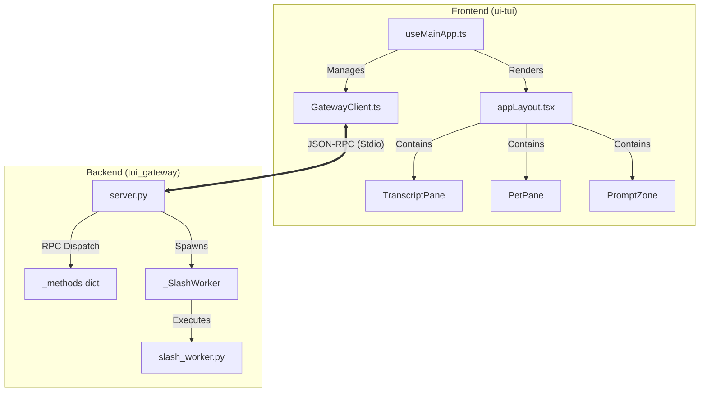
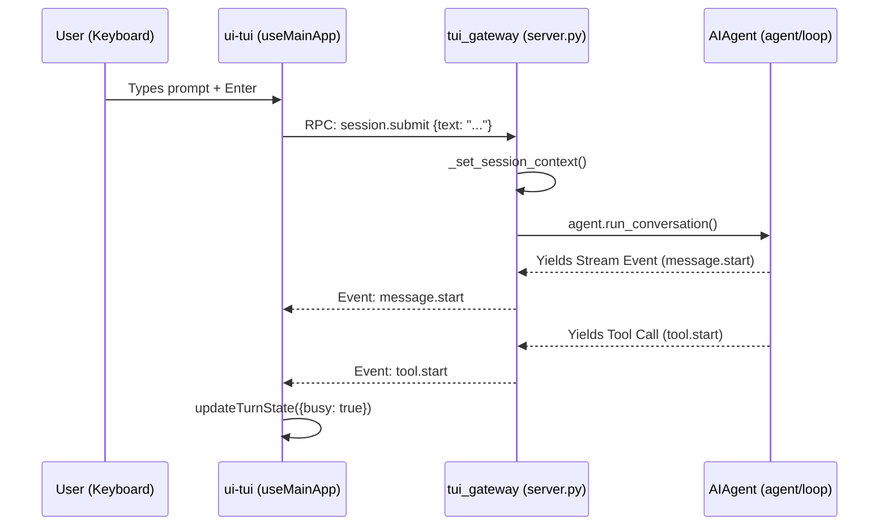

# Ink TUI (Terminal User Interface)

Relevant source files

The following files were used as context for generating this wiki page:

- [agent/learning_graph_render.py](../agent/learning_graph_render.py)
- [agent/markdown_tables.py](../agent/markdown_tables.py)
- [apps/desktop/src/app/starmap/node-context-menu.tsx](../apps/desktop/src/app/starmap/node-context-menu.tsx)
- [apps/desktop/src/components/chat/json-document-editor.tsx](../apps/desktop/src/components/chat/json-document-editor.tsx)
- [apps/shared/src/skin.ts](../apps/shared/src/skin.ts)
- [hermes_cli/colors.py](../hermes_cli/colors.py)
- [hermes_cli/journey.py](../hermes_cli/journey.py)
- [hermes_cli/mcp_startup.py](../hermes_cli/mcp_startup.py)
- [hermes_cli/oneshot.py](../hermes_cli/oneshot.py)
- [hermes_cli/skin_engine.py](../hermes_cli/skin_engine.py)
- [scripts/check_subprocess_stdin.py](../scripts/check_subprocess_stdin.py)
- [tests/agent/test_custom_provider_extra_body_matching.py](../tests/agent/test_custom_provider_extra_body_matching.py)
- [tests/agent/test_learning_graph_render.py](../tests/agent/test_learning_graph_render.py)
- [tests/agent/test_markdown_tables.py](../tests/agent/test_markdown_tables.py)
- [tests/cli/test_cli_markdown_rendering.py](../tests/cli/test_cli_markdown_rendering.py)
- [tests/hermes_cli/test_journey_render.py](../tests/hermes_cli/test_journey_render.py)
- [tests/hermes_cli/test_mcp_startup.py](../tests/hermes_cli/test_mcp_startup.py)
- [tests/hermes_cli/test_skin_engine.py](../tests/hermes_cli/test_skin_engine.py)
- [tests/hermes_cli/test_tui_resume_flow.py](../tests/hermes_cli/test_tui_resume_flow.py)
- [tests/run_agent/test_summarize_api_error.py](../tests/run_agent/test_summarize_api_error.py)
- [tests/test_cli_skin_integration.py](../tests/test_cli_skin_integration.py)
- [tests/test_model_picker_scroll.py](../tests/test_model_picker_scroll.py)
- [tests/test_slash_worker_watchdog.py](../tests/test_slash_worker_watchdog.py)
- [tests/test_tui_entry_mcp_owner.py](../tests/test_tui_entry_mcp_owner.py)
- [tests/test_tui_gateway_server.py](../tests/test_tui_gateway_server.py)
- [tests/tools/test_refresh_agent_mcp_tools.py](../tests/tools/test_refresh_agent_mcp_tools.py)
- [tests/tui_gateway/test_compute_host_phase1.py](../tests/tui_gateway/test_compute_host_phase1.py)
- [tests/tui_gateway/test_goal_command.py](../tests/tui_gateway/test_goal_command.py)
- [tests/tui_gateway/test_mcp_late_refresh_thread_owner.py](../tests/tui_gateway/test_mcp_late_refresh_thread_owner.py)
- [tests/tui_gateway/test_protocol.py](../tests/tui_gateway/test_protocol.py)
- [tests/tui_gateway/test_review_summary_callback.py](../tests/tui_gateway/test_review_summary_callback.py)
- [tests/tui_gateway/test_slash_worker_ansi.py](../tests/tui_gateway/test_slash_worker_ansi.py)
- [tests/tui_gateway/test_slash_worker_sys_path.py](../tests/tui_gateway/test_slash_worker_sys_path.py)
- [tui_gateway/_stdin_recovery.py](../tui_gateway/_stdin_recovery.py)
- [tui_gateway/compute_host.py](../tui_gateway/compute_host.py)
- [tui_gateway/entry.py](../tui_gateway/entry.py)
- [tui_gateway/host_supervisor.py](../tui_gateway/host_supervisor.py)
- [tui_gateway/server.py](../tui_gateway/server.py)
- [tui_gateway/slash_worker.py](../tui_gateway/slash_worker.py)
- [ui-tui/README.md](../ui-tui/README.md)
- [ui-tui/packages/hermes-ink/src/ink/events/cmd-shortcuts.test.ts](../ui-tui/packages/hermes-ink/src/ink/events/cmd-shortcuts.test.ts)
- [ui-tui/packages/hermes-ink/src/ink/hit-test.test.ts](../ui-tui/packages/hermes-ink/src/ink/hit-test.test.ts)
- [ui-tui/packages/hermes-ink/src/ink/log-update.test.ts](../ui-tui/packages/hermes-ink/src/ink/log-update.test.ts)
- [ui-tui/packages/hermes-ink/src/ink/log-update.ts](../ui-tui/packages/hermes-ink/src/ink/log-update.ts)
- [ui-tui/packages/hermes-ink/src/ink/terminal-background.test.ts](../ui-tui/packages/hermes-ink/src/ink/terminal-background.test.ts)
- [ui-tui/packages/hermes-ink/src/ink/terminal.test.ts](../ui-tui/packages/hermes-ink/src/ink/terminal.test.ts)
- [ui-tui/packages/hermes-ink/src/ink/terminal.ts](../ui-tui/packages/hermes-ink/src/ink/terminal.ts)
- [ui-tui/packages/hermes-ink/src/ink/wrap-text.test.ts](../ui-tui/packages/hermes-ink/src/ink/wrap-text.test.ts)
- [ui-tui/src/__tests__/activeSessionSwitcher.test.ts](../ui-tui/src/__tests__/activeSessionSwitcher.test.ts)
- [ui-tui/src/__tests__/appChromeStatusRule.test.tsx](../ui-tui/src/__tests__/appChromeStatusRule.test.tsx)
- [ui-tui/src/__tests__/approvalAction.test.ts](../ui-tui/src/__tests__/approvalAction.test.ts)
- [ui-tui/src/__tests__/clipboard.test.ts](../ui-tui/src/__tests__/clipboard.test.ts)
- [ui-tui/src/__tests__/completionApply.test.ts](../ui-tui/src/__tests__/completionApply.test.ts)
- [ui-tui/src/__tests__/createGatewayEventHandler.test.ts](../ui-tui/src/__tests__/createGatewayEventHandler.test.ts)
- [ui-tui/src/__tests__/createSlashHandler.test.ts](../ui-tui/src/__tests__/createSlashHandler.test.ts)
- [ui-tui/src/__tests__/externalLink.test.ts](../ui-tui/src/__tests__/externalLink.test.ts)
- [ui-tui/src/__tests__/gatewayClient.test.ts](../ui-tui/src/__tests__/gatewayClient.test.ts)
- [ui-tui/src/__tests__/gracefulExit.test.ts](../ui-tui/src/__tests__/gracefulExit.test.ts)
- [ui-tui/src/__tests__/journeyCommand.test.ts](../ui-tui/src/__tests__/journeyCommand.test.ts)
- [ui-tui/src/__tests__/loaders.test.ts](../ui-tui/src/__tests__/loaders.test.ts)
- [ui-tui/src/__tests__/markdown.test.ts](../ui-tui/src/__tests__/markdown.test.ts)
- [ui-tui/src/__tests__/modelPicker.test.ts](../ui-tui/src/__tests__/modelPicker.test.ts)
- [ui-tui/src/__tests__/orchestratorPromptSession.test.ts](../ui-tui/src/__tests__/orchestratorPromptSession.test.ts)
- [ui-tui/src/__tests__/osc52.test.ts](../ui-tui/src/__tests__/osc52.test.ts)
- [ui-tui/src/__tests__/overlayPrimitives.test.ts](../ui-tui/src/__tests__/overlayPrimitives.test.ts)
- [ui-tui/src/__tests__/platform.test.ts](../ui-tui/src/__tests__/platform.test.ts)
- [ui-tui/src/__tests__/prompt.test.ts](../ui-tui/src/__tests__/prompt.test.ts)
- [ui-tui/src/__tests__/providers.test.ts](../ui-tui/src/__tests__/providers.test.ts)
- [ui-tui/src/__tests__/slashParity.test.ts](../ui-tui/src/__tests__/slashParity.test.ts)
- [ui-tui/src/__tests__/subagentTree.test.ts](../ui-tui/src/__tests__/subagentTree.test.ts)
- [ui-tui/src/__tests__/syntax.test.ts](../ui-tui/src/__tests__/syntax.test.ts)
- [ui-tui/src/__tests__/terminalParity.test.ts](../ui-tui/src/__tests__/terminalParity.test.ts)
- [ui-tui/src/__tests__/terminalSetup.test.ts](../ui-tui/src/__tests__/terminalSetup.test.ts)
- [ui-tui/src/__tests__/termux.test.ts](../ui-tui/src/__tests__/termux.test.ts)
- [ui-tui/src/__tests__/termuxComposerLayout.test.ts](../ui-tui/src/__tests__/termuxComposerLayout.test.ts)
- [ui-tui/src/__tests__/text.test.ts](../ui-tui/src/__tests__/text.test.ts)
- [ui-tui/src/__tests__/textInputFastEcho.test.ts](../ui-tui/src/__tests__/textInputFastEcho.test.ts)
- [ui-tui/src/__tests__/theme.test.ts](../ui-tui/src/__tests__/theme.test.ts)
- [ui-tui/src/__tests__/themeBoot.test.ts](../ui-tui/src/__tests__/themeBoot.test.ts)
- [ui-tui/src/__tests__/useComposerState.test.ts](../ui-tui/src/__tests__/useComposerState.test.ts)
- [ui-tui/src/__tests__/useConfigSync.test.ts](../ui-tui/src/__tests__/useConfigSync.test.ts)
- [ui-tui/src/__tests__/useInputHandlers.test.ts](../ui-tui/src/__tests__/useInputHandlers.test.ts)
- [ui-tui/src/__tests__/useSessionLifecycle.test.ts](../ui-tui/src/__tests__/useSessionLifecycle.test.ts)
- [ui-tui/src/__tests__/virtualHistoryOffsetCache.test.ts](../ui-tui/src/__tests__/virtualHistoryOffsetCache.test.ts)
- [ui-tui/src/__tests__/widgetGrid.test.ts](../ui-tui/src/__tests__/widgetGrid.test.ts)
- [ui-tui/src/__tests__/widgetGridComponent.test.tsx](../ui-tui/src/__tests__/widgetGridComponent.test.tsx)
- [ui-tui/src/app.tsx](../ui-tui/src/app.tsx)
- [ui-tui/src/app/createGatewayEventHandler.ts](../ui-tui/src/app/createGatewayEventHandler.ts)
- [ui-tui/src/app/interfaces.ts](../ui-tui/src/app/interfaces.ts)
- [ui-tui/src/app/overlayStore.ts](../ui-tui/src/app/overlayStore.ts)
- [ui-tui/src/app/slash/commands/core.ts](../ui-tui/src/app/slash/commands/core.ts)
- [ui-tui/src/app/slash/commands/ops.ts](../ui-tui/src/app/slash/commands/ops.ts)
- [ui-tui/src/app/slash/commands/session.ts](../ui-tui/src/app/slash/commands/session.ts)
- [ui-tui/src/app/slash/registry.ts](../ui-tui/src/app/slash/registry.ts)
- [ui-tui/src/app/turnController.ts](../ui-tui/src/app/turnController.ts)
- [ui-tui/src/app/uiStore.ts](../ui-tui/src/app/uiStore.ts)
- [ui-tui/src/app/useComposerState.ts](../ui-tui/src/app/useComposerState.ts)
- [ui-tui/src/app/useConfigSync.ts](../ui-tui/src/app/useConfigSync.ts)
- [ui-tui/src/app/useInputHandlers.ts](../ui-tui/src/app/useInputHandlers.ts)
- [ui-tui/src/app/useMainApp.ts](../ui-tui/src/app/useMainApp.ts)
- [ui-tui/src/app/useSessionLifecycle.ts](../ui-tui/src/app/useSessionLifecycle.ts)
- [ui-tui/src/banner.ts](../ui-tui/src/banner.ts)
- [ui-tui/src/components/activeSessionSwitcher.tsx](../ui-tui/src/components/activeSessionSwitcher.tsx)
- [ui-tui/src/components/agentsOverlay.tsx](../ui-tui/src/components/agentsOverlay.tsx)
- [ui-tui/src/components/appChrome.tsx](../ui-tui/src/components/appChrome.tsx)
- [ui-tui/src/components/appLayout.tsx](../ui-tui/src/components/appLayout.tsx)
- [ui-tui/src/components/appOverlays.tsx](../ui-tui/src/components/appOverlays.tsx)
- [ui-tui/src/components/branding.tsx](../ui-tui/src/components/branding.tsx)
- [ui-tui/src/components/gridStreamsDemo.tsx](../ui-tui/src/components/gridStreamsDemo.tsx)
- [ui-tui/src/components/gridTestOverlay.tsx](../ui-tui/src/components/gridTestOverlay.tsx)
- [ui-tui/src/components/journey.tsx](../ui-tui/src/components/journey.tsx)
- [ui-tui/src/components/loaders.tsx](../ui-tui/src/components/loaders.tsx)
- [ui-tui/src/components/markdown.tsx](../ui-tui/src/components/markdown.tsx)
- [ui-tui/src/components/maskedPrompt.tsx](../ui-tui/src/components/maskedPrompt.tsx)
- [ui-tui/src/components/messageLine.tsx](../ui-tui/src/components/messageLine.tsx)
- [ui-tui/src/components/modelPicker.tsx](../ui-tui/src/components/modelPicker.tsx)
- [ui-tui/src/components/overlayControls.tsx](../ui-tui/src/components/overlayControls.tsx)
- [ui-tui/src/components/overlayPrimitives.tsx](../ui-tui/src/components/overlayPrimitives.tsx)
- [ui-tui/src/components/petPicker.tsx](../ui-tui/src/components/petPicker.tsx)
- [ui-tui/src/components/pluginsHub.tsx](../ui-tui/src/components/pluginsHub.tsx)
- [ui-tui/src/components/prompts.tsx](../ui-tui/src/components/prompts.tsx)
- [ui-tui/src/components/skillsHub.tsx](../ui-tui/src/components/skillsHub.tsx)
- [ui-tui/src/components/textInput.tsx](../ui-tui/src/components/textInput.tsx)
- [ui-tui/src/components/thinking.tsx](../ui-tui/src/components/thinking.tsx)
- [ui-tui/src/components/widgetGrid.tsx](../ui-tui/src/components/widgetGrid.tsx)
- [ui-tui/src/config/env.ts](../ui-tui/src/config/env.ts)
- [ui-tui/src/content/hotkeys.ts](../ui-tui/src/content/hotkeys.ts)
- [ui-tui/src/domain/providers.ts](../ui-tui/src/domain/providers.ts)
- [ui-tui/src/domain/slash.ts](../ui-tui/src/domain/slash.ts)
- [ui-tui/src/entry.tsx](../ui-tui/src/entry.tsx)
- [ui-tui/src/gatewayClient.ts](../ui-tui/src/gatewayClient.ts)
- [ui-tui/src/gatewayTypes.ts](../ui-tui/src/gatewayTypes.ts)
- [ui-tui/src/hooks/useVirtualHistory.ts](../ui-tui/src/hooks/useVirtualHistory.ts)
- [ui-tui/src/lib/circularBuffer.ts](../ui-tui/src/lib/circularBuffer.ts)
- [ui-tui/src/lib/clipboard.ts](../ui-tui/src/lib/clipboard.ts)
- [ui-tui/src/lib/color.ts](../ui-tui/src/lib/color.ts)
- [ui-tui/src/lib/editor.test.ts](../ui-tui/src/lib/editor.test.ts)
- [ui-tui/src/lib/editor.ts](../ui-tui/src/lib/editor.ts)
- [ui-tui/src/lib/externalLink.ts](../ui-tui/src/lib/externalLink.ts)
- [ui-tui/src/lib/gracefulExit.ts](../ui-tui/src/lib/gracefulExit.ts)
- [ui-tui/src/lib/history.ts](../ui-tui/src/lib/history.ts)
- [ui-tui/src/lib/memory.ts](../ui-tui/src/lib/memory.ts)
- [ui-tui/src/lib/memoryMonitor.ts](../ui-tui/src/lib/memoryMonitor.ts)
- [ui-tui/src/lib/osc52.ts](../ui-tui/src/lib/osc52.ts)
- [ui-tui/src/lib/platform.ts](../ui-tui/src/lib/platform.ts)
- [ui-tui/src/lib/prompt.ts](../ui-tui/src/lib/prompt.ts)
- [ui-tui/src/lib/starmapPalette.ts](../ui-tui/src/lib/starmapPalette.ts)
- [ui-tui/src/lib/subagentTree.ts](../ui-tui/src/lib/subagentTree.ts)
- [ui-tui/src/lib/syntax.ts](../ui-tui/src/lib/syntax.ts)
- [ui-tui/src/lib/terminalParity.ts](../ui-tui/src/lib/terminalParity.ts)
- [ui-tui/src/lib/terminalSetup.ts](../ui-tui/src/lib/terminalSetup.ts)
- [ui-tui/src/lib/termux.ts](../ui-tui/src/lib/termux.ts)
- [ui-tui/src/lib/text.ts](../ui-tui/src/lib/text.ts)
- [ui-tui/src/lib/themeBoot.ts](../ui-tui/src/lib/themeBoot.ts)
- [ui-tui/src/lib/widgetGrid.ts](../ui-tui/src/lib/widgetGrid.ts)
- [ui-tui/src/theme.ts](../ui-tui/src/theme.ts)
- [ui-tui/src/types.ts](../ui-tui/src/types.ts)
- [website/docs/user-guide/features/skins.md](../website/docs/user-guide/features/skins.md)

The Hermes TUI provides a rich, interactive terminal experience built on **React** and **Ink**. It bridges the gap between a simple CLI and a full GUI by offering real-time streaming, virtualized history, a subagent process tree, and a "Pet" mascot system.

## Architecture Overview

The TUI architecture is split into two primary processes communicating via a JSON-RPC 2.0 bridge:
1.  **`tui_gateway` (Python):** The backend server that manages agent lifecycles, session databases, and tool execution.
2.  **`ui-tui` (TypeScript/React):** The frontend built with the Ink library, responsible for rendering the layout, handling keyboard/mouse input, and managing local UI state.

### The JSON-RPC Bridge
Communication occurs over `stdin`/`stdout` using the `StdioTransport` [tui_gateway/server.py:33-38](../tui_gateway/server.py#L33-L38). The gateway uses a thread pool for "long handlers" (e.g., `session.resume`, `slash.exec`) to prevent blocking the main RPC loop [tui_gateway/server.py:170-185](../tui_gateway/server.py#L170-L185).

### Component Relationship Diagram
This diagram maps the high-level TUI concepts to their respective code entities.

"TUI Component Mapping"

Sources: [ui-tui/src/app/useMainApp.ts:151-160](../ui-tui/src/app/useMainApp.ts#L151-L160), [tui_gateway/server.py:129-140](../tui_gateway/server.py#L129-L140), [ui-tui/src/components/appLayout.tsx:138-145](../ui-tui/src/components/appLayout.tsx#L138-L145).

## Backend: tui_gateway

The gateway server acts as the orchestration layer for TUI sessions.

### Session Management
*   **Isolation:** The gateway supports `turn_isolation`, which can dispatch turns to a separate compute host if configured [tui_gateway/server.py:196-200](../tui_gateway/server.py#L196-L200).
*   **Orphan Reaping:** To prevent leaked processes (e.g., from WebSocket disconnects), the server reaps orphaned sessions after a grace period defined by `_WS_ORPHAN_REAP_GRACE_S` [tui_gateway/server.py:160-166](../tui_gateway/server.py#L160-L166).
*   **Panic Handling:** A specialized `_panic_hook` captures unhandled exceptions and writes them to `tui_gateway_crash.log` while emitting a summary to `stderr` for the TUI to display in the Activity log [tui_gateway/server.py:60-86](../tui_gateway/server.py#L60-L86).

### Slash Worker Subprocess
For slash commands that require heavy processing or external CLI execution, the gateway spawns a `_SlashWorker` [tui_gateway/server.py:155-159](../tui_gateway/server.py#L155-L159). This isolation ensures that a hanging slash command doesn't crash the main gateway or the TUI.

## Frontend: ui-tui

The frontend uses React's reconciliation model to manage terminal frames.

### Transcript Virtualization
To handle thousands of messages without performance degradation, the TUI implements "Transcript Virtualization" via `useVirtualHistory` [ui-tui/src/app/useMainApp.ts:32](../ui-tui/src/app/useMainApp.ts#L32).
*   **Height Estimation:** Message heights are estimated and cached in `virtualHeights.ts` to allow for smooth scrolling in a fixed-height terminal buffer [ui-tui/src/app/useMainApp.ts:40](../ui-tui/src/app/useMainApp.ts#L40).
*   **Scroll Management:** The `TranscriptPane` uses a `ScrollBox` with `stickyScroll` enabled to keep the latest assistant output in view [ui-tui/src/components/appLayout.tsx:183-194](../ui-tui/src/components/appLayout.tsx#L183-L194).

### Theme Boot & Polarity Detection
The TUI detects terminal background colors using **OSC-11** probes [ui-tui/src/app/createGatewayEventHandler.ts:40-45](../ui-tui/src/app/createGatewayEventHandler.ts#L40-L45).
*   **Theme Polarity:** Themes are derived based on the detected background (light/dark). If a skin provides `light_colors` or `dark_colors`, they are overlaid on the base palette [ui-tui/src/app/createGatewayEventHandler.ts:52-64](../ui-tui/src/app/createGatewayEventHandler.ts#L52-L64).
*   **Flash-free Boot:** The resolved theme is persisted via `writeBootTheme` so the next launch can render the first frame immediately without waiting for the gateway's CSS/Skin resolution [ui-tui/src/app/createGatewayEventHandler.ts:97-102](../ui-tui/src/app/createGatewayEventHandler.ts#L97-L102).

### Subagent Spawn Tree
The TUI renders a recursive tree of subagents during complex tasks.
*   **Hotness Tracking:** The `SubagentAccordion` uses a "hotness" metric to color the tree stems, highlighting active or high-usage branches [ui-tui/src/components/thinking.tsx:267-278](../ui-tui/src/components/thinking.tsx#L267-L278).
*   **Thinking Modes:** Reasoning and tool calls are rendered inside nested accordions that can be expanded or collapsed globally [ui-tui/src/components/thinking.tsx:280-300](../ui-tui/src/components/thinking.tsx#L280-L300).

### Pet Mascot System
The `PetPane` renders a floating mascot (either a "Kitty" or a "Sprite") in the bottom-right corner [ui-tui/src/components/appLayout.tsx:57-75](../ui-tui/src/components/appLayout.tsx#L57-L75).
*   **Layout Reservation:** The mascot publishes its footprint to `$petBox`. The `TranscriptPane` responsively reserves a right gutter (on wide terminals) or bottom rows (on narrow terminals) to prevent text from overlapping the pet [ui-tui/src/components/appLayout.tsx:148-155](../ui-tui/src/components/appLayout.tsx#L148-L155).

## Data Flow: Prompt Submission

"Prompt Execution Lifecycle"

Sources: [ui-tui/src/app/useMainApp.ts:146-149](../ui-tui/src/app/useMainApp.ts#L146-L149), [tui_gateway/server.py:104-108](../tui_gateway/server.py#L104-L108), [ui-tui/src/app/createGatewayEventHandler.ts:32-34](../ui-tui/src/app/createGatewayEventHandler.ts#L32-L34).

## Key Components & Functions

| Component / Function | File Path | Description |
| :--- | :--- | :--- |
| `useMainApp` | `ui-tui/src/app/useMainApp.ts` | The root hook managing TUI state, history, and gateway events. |
| `createGatewayEventHandler` | `ui-tui/src/app/createGatewayEventHandler.ts` | Maps JSON-RPC events (e.g., `message.complete`, `tool.start`) to UI state updates. |
| `TranscriptPane` | `ui-tui/src/components/appLayout.tsx` | Manages the virtualized scrollable list of messages. |
| `TextInput` | `ui-tui/src/components/textInput.tsx` | A custom Ink input component supporting multi-line, bracketed paste, and syntax highlighting. |
| `_panic_hook` | `tui_gateway/server.py` | Global exception handler for the gateway process. |
| `reapplyTheme` | `ui-tui/src/app/createGatewayEventHandler.ts` | Force-recalculates the UI palette when terminal background or config changes. |

Sources: [ui-tui/src/app/useMainApp.ts:151](../ui-tui/src/app/useMainApp.ts#L151), [ui-tui/src/app/createGatewayEventHandler.ts:3](../ui-tui/src/app/createGatewayEventHandler.ts#L3), [ui-tui/src/components/appLayout.tsx:138](../ui-tui/src/components/appLayout.tsx#L138), [ui-tui/src/components/textInput.tsx:28](../ui-tui/src/components/textInput.tsx#L28), [tui_gateway/server.py:60](../tui_gateway/server.py#L60).

---
