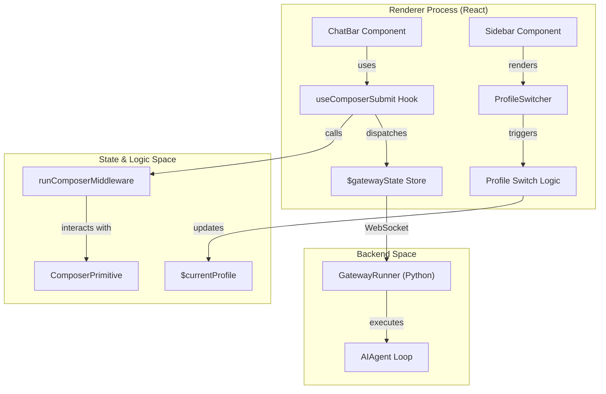
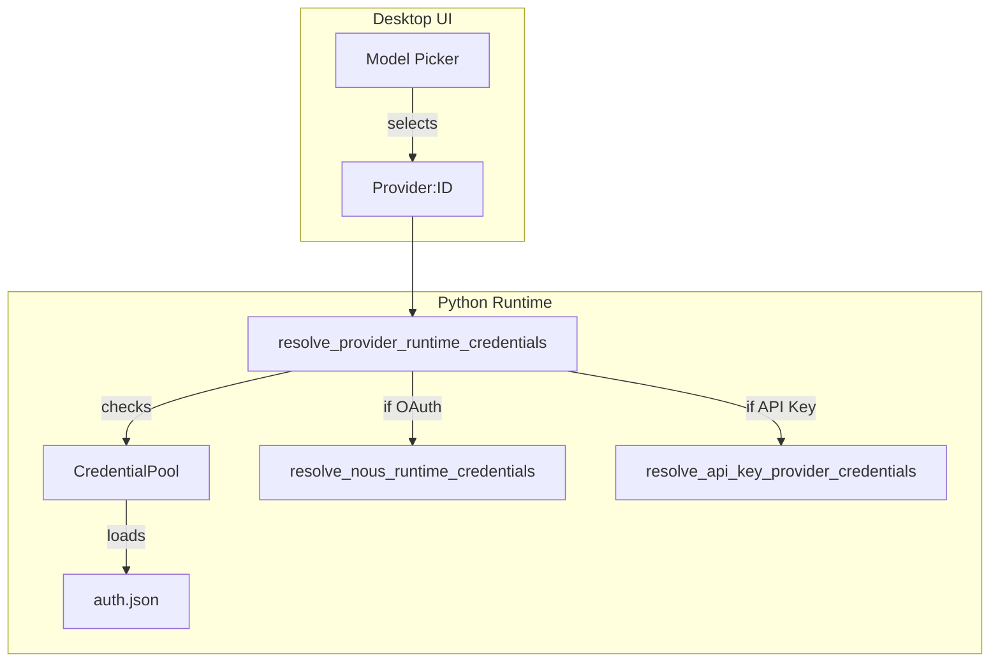

# Desktop Application (Electron)

Relevant source files

The following files were used as context for generating this wiki page:

- [.github/workflows/js-tests.yml](../.github/workflows/js-tests.yml)
- [.prettierignore](../.prettierignore)
- [.prettierrc](../.prettierrc)
- [agent/auxiliary_client.py](../agent/auxiliary_client.py)
- [agent/credential_pool.py](../agent/credential_pool.py)
- [apps/bootstrap-installer/eslint.config.mjs](../apps/bootstrap-installer/eslint.config.mjs)
- [apps/bootstrap-installer/package.json](../apps/bootstrap-installer/package.json)
- [apps/desktop/e2e/correction-session-switch.spec.ts](../apps/desktop/e2e/correction-session-switch.spec.ts)
- [apps/desktop/e2e/queue-turn-boundary.spec.ts](../apps/desktop/e2e/queue-turn-boundary.spec.ts)
- [apps/desktop/electron/main.ts](../apps/desktop/electron/main.ts)
- [apps/desktop/electron/preload.ts](../apps/desktop/electron/preload.ts)
- [apps/desktop/electron/zoom.test.ts](../apps/desktop/electron/zoom.test.ts)
- [apps/desktop/electron/zoom.ts](../apps/desktop/electron/zoom.ts)
- [apps/desktop/eslint.config.mjs](../apps/desktop/eslint.config.mjs)
- [apps/desktop/package.json](../apps/desktop/package.json)
- [apps/desktop/scripts/test-desktop.mjs](../apps/desktop/scripts/test-desktop.mjs)
- [apps/desktop/src/app/artifacts/artifact-utils.ts](../apps/desktop/src/app/artifacts/artifact-utils.ts)
- [apps/desktop/src/app/artifacts/index.test.ts](../apps/desktop/src/app/artifacts/index.test.ts)
- [apps/desktop/src/app/artifacts/index.tsx](../apps/desktop/src/app/artifacts/index.tsx)
- [apps/desktop/src/app/chat/composer/composer-utils.test.ts](../apps/desktop/src/app/chat/composer/composer-utils.test.ts)
- [apps/desktop/src/app/chat/composer/composer-utils.ts](../apps/desktop/src/app/chat/composer/composer-utils.ts)
- [apps/desktop/src/app/chat/composer/controls.test.tsx](../apps/desktop/src/app/chat/composer/controls.test.tsx)
- [apps/desktop/src/app/chat/composer/controls.tsx](../apps/desktop/src/app/chat/composer/controls.tsx)
- [apps/desktop/src/app/chat/composer/hooks/use-composer-draft.ts](../apps/desktop/src/app/chat/composer/hooks/use-composer-draft.ts)
- [apps/desktop/src/app/chat/composer/hooks/use-composer-metrics.ts](../apps/desktop/src/app/chat/composer/hooks/use-composer-metrics.ts)
- [apps/desktop/src/app/chat/composer/hooks/use-composer-submit.ts](../apps/desktop/src/app/chat/composer/hooks/use-composer-submit.ts)
- [apps/desktop/src/app/chat/composer/index.tsx](../apps/desktop/src/app/chat/composer/index.tsx)
- [apps/desktop/src/app/chat/composer/model-pill.test.tsx](../apps/desktop/src/app/chat/composer/model-pill.test.tsx)
- [apps/desktop/src/app/chat/composer/model-pill.tsx](../apps/desktop/src/app/chat/composer/model-pill.tsx)
- [apps/desktop/src/app/chat/index.tsx](../apps/desktop/src/app/chat/index.tsx)
- [apps/desktop/src/app/chat/session-view.tsx](../apps/desktop/src/app/chat/session-view.tsx)
- [apps/desktop/src/app/chat/sidebar/index.tsx](../apps/desktop/src/app/chat/sidebar/index.tsx)
- [apps/desktop/src/app/chat/sidebar/profile-switcher.tsx](../apps/desktop/src/app/chat/sidebar/profile-switcher.tsx)
- [apps/desktop/src/app/chat/sidebar/session-row-state.test.ts](../apps/desktop/src/app/chat/sidebar/session-row-state.test.ts)
- [apps/desktop/src/app/chat/sidebar/session-row-state.ts](../apps/desktop/src/app/chat/sidebar/session-row-state.ts)
- [apps/desktop/src/app/chat/sidebar/session-row.tsx](../apps/desktop/src/app/chat/sidebar/session-row.tsx)
- [apps/desktop/src/app/command-center/index.tsx](../apps/desktop/src/app/command-center/index.tsx)
- [apps/desktop/src/app/contrib/hooks/use-background-sync.test.ts](../apps/desktop/src/app/contrib/hooks/use-background-sync.test.ts)
- [apps/desktop/src/app/contrib/hooks/use-desktop-integrations.ts](../apps/desktop/src/app/contrib/hooks/use-desktop-integrations.ts)
- [apps/desktop/src/app/contrib/wiring.tsx](../apps/desktop/src/app/contrib/wiring.tsx)
- [apps/desktop/src/app/cron/index.tsx](../apps/desktop/src/app/cron/index.tsx)
- [apps/desktop/src/app/gateway/hooks/use-gateway-boot.test.tsx](../apps/desktop/src/app/gateway/hooks/use-gateway-boot.test.tsx)
- [apps/desktop/src/app/layout-constants.ts](../apps/desktop/src/app/layout-constants.ts)
- [apps/desktop/src/app/messaging/index.tsx](../apps/desktop/src/app/messaging/index.tsx)
- [apps/desktop/src/app/model-picker-overlay.tsx](../apps/desktop/src/app/model-picker-overlay.tsx)
- [apps/desktop/src/app/overlays/overlay-chrome.tsx](../apps/desktop/src/app/overlays/overlay-chrome.tsx)
- [apps/desktop/src/app/overlays/overlay-split-layout.tsx](../apps/desktop/src/app/overlays/overlay-split-layout.tsx)
- [apps/desktop/src/app/page-search-shell.tsx](../apps/desktop/src/app/page-search-shell.tsx)
- [apps/desktop/src/app/profiles/delete-profile-dialog.tsx](../apps/desktop/src/app/profiles/delete-profile-dialog.tsx)
- [apps/desktop/src/app/profiles/index.tsx](../apps/desktop/src/app/profiles/index.tsx)
- [apps/desktop/src/app/profiles/rename-profile-dialog.tsx](../apps/desktop/src/app/profiles/rename-profile-dialog.tsx)
- [apps/desktop/src/app/right-sidebar/review/index.tsx](../apps/desktop/src/app/right-sidebar/review/index.tsx)
- [apps/desktop/src/app/session-switcher.tsx](../apps/desktop/src/app/session-switcher.tsx)
- [apps/desktop/src/app/session/hooks/session-context-drift.test.ts](../apps/desktop/src/app/session/hooks/session-context-drift.test.ts)
- [apps/desktop/src/app/session/hooks/session-context-drift.ts](../apps/desktop/src/app/session/hooks/session-context-drift.ts)
- [apps/desktop/src/app/session/hooks/use-message-stream/gateway-event.ts](../apps/desktop/src/app/session/hooks/use-message-stream/gateway-event.ts)
- [apps/desktop/src/app/session/hooks/use-message-stream/index.ts](../apps/desktop/src/app/session/hooks/use-message-stream/index.ts)
- [apps/desktop/src/app/session/hooks/use-message-stream/interim-sealing.test.tsx](../apps/desktop/src/app/session/hooks/use-message-stream/interim-sealing.test.tsx)
- [apps/desktop/src/app/session/hooks/use-message-stream/moa-reference-event.test.tsx](../apps/desktop/src/app/session/hooks/use-message-stream/moa-reference-event.test.tsx)
- [apps/desktop/src/app/session/hooks/use-message-stream/utils.test.ts](../apps/desktop/src/app/session/hooks/use-message-stream/utils.test.ts)
- [apps/desktop/src/app/session/hooks/use-message-stream/utils.ts](../apps/desktop/src/app/session/hooks/use-message-stream/utils.ts)
- [apps/desktop/src/app/session/hooks/use-model-controls.test.tsx](../apps/desktop/src/app/session/hooks/use-model-controls.test.tsx)
- [apps/desktop/src/app/session/hooks/use-model-controls.ts](../apps/desktop/src/app/session/hooks/use-model-controls.ts)
- [apps/desktop/src/app/session/hooks/use-prompt-actions/index.test.tsx](../apps/desktop/src/app/session/hooks/use-prompt-actions/index.test.tsx)
- [apps/desktop/src/app/session/hooks/use-prompt-actions/index.ts](../apps/desktop/src/app/session/hooks/use-prompt-actions/index.ts)
- [apps/desktop/src/app/session/hooks/use-prompt-actions/slash.ts](../apps/desktop/src/app/session/hooks/use-prompt-actions/slash.ts)
- [apps/desktop/src/app/session/hooks/use-prompt-actions/submit.ts](../apps/desktop/src/app/session/hooks/use-prompt-actions/submit.ts)
- [apps/desktop/src/app/session/hooks/use-prompt-actions/utils.test.ts](../apps/desktop/src/app/session/hooks/use-prompt-actions/utils.test.ts)
- [apps/desktop/src/app/session/hooks/use-prompt-actions/utils.ts](../apps/desktop/src/app/session/hooks/use-prompt-actions/utils.ts)
- [apps/desktop/src/app/session/hooks/use-session-actions.test.tsx](../apps/desktop/src/app/session/hooks/use-session-actions.test.tsx)
- [apps/desktop/src/app/session/hooks/use-session-actions/index.ts](../apps/desktop/src/app/session/hooks/use-session-actions/index.ts)
- [apps/desktop/src/app/session/hooks/use-session-actions/utils.test.ts](../apps/desktop/src/app/session/hooks/use-session-actions/utils.test.ts)
- [apps/desktop/src/app/session/hooks/use-session-actions/utils.ts](../apps/desktop/src/app/session/hooks/use-session-actions/utils.ts)
- [apps/desktop/src/app/session/hooks/use-session-state-cache.test.tsx](../apps/desktop/src/app/session/hooks/use-session-state-cache.test.tsx)
- [apps/desktop/src/app/session/hooks/use-session-state-cache.ts](../apps/desktop/src/app/session/hooks/use-session-state-cache.ts)
- [apps/desktop/src/app/settings/about-settings.tsx](../apps/desktop/src/app/settings/about-settings.tsx)
- [apps/desktop/src/app/settings/appearance-settings.tsx](../apps/desktop/src/app/settings/appearance-settings.tsx)
- [apps/desktop/src/app/settings/gateway-settings.tsx](../apps/desktop/src/app/settings/gateway-settings.tsx)
- [apps/desktop/src/app/settings/keys-settings.tsx](../apps/desktop/src/app/settings/keys-settings.tsx)
- [apps/desktop/src/app/settings/sessions-settings.tsx](../apps/desktop/src/app/settings/sessions-settings.tsx)
- [apps/desktop/src/app/shell/gateway-menu-panel.tsx](../apps/desktop/src/app/shell/gateway-menu-panel.tsx)
- [apps/desktop/src/app/shell/hooks/use-statusbar-items.tsx](../apps/desktop/src/app/shell/hooks/use-statusbar-items.tsx)
- [apps/desktop/src/app/shell/model-edit-submenu.test.tsx](../apps/desktop/src/app/shell/model-edit-submenu.test.tsx)
- [apps/desktop/src/app/shell/model-edit-submenu.tsx](../apps/desktop/src/app/shell/model-edit-submenu.tsx)
- [apps/desktop/src/app/shell/model-menu-panel.test.tsx](../apps/desktop/src/app/shell/model-menu-panel.test.tsx)
- [apps/desktop/src/app/shell/model-menu-panel.tsx](../apps/desktop/src/app/shell/model-menu-panel.tsx)
- [apps/desktop/src/app/shell/statusbar-controls.tsx](../apps/desktop/src/app/shell/statusbar-controls.tsx)
- [apps/desktop/src/app/shell/titlebar.ts](../apps/desktop/src/app/shell/titlebar.ts)
- [apps/desktop/src/app/skills/index.tsx](../apps/desktop/src/app/skills/index.tsx)
- [apps/desktop/src/app/types.ts](../apps/desktop/src/app/types.ts)
- [apps/desktop/src/app/updates-overlay.tsx](../apps/desktop/src/app/updates-overlay.tsx)
- [apps/desktop/src/components/assistant-ui/directive-text.tsx](../apps/desktop/src/components/assistant-ui/directive-text.tsx)
- [apps/desktop/src/components/assistant-ui/markdown-text.media.test.tsx](../apps/desktop/src/components/assistant-ui/markdown-text.media.test.tsx)
- [apps/desktop/src/components/assistant-ui/markdown-text.test.ts](../apps/desktop/src/components/assistant-ui/markdown-text.test.ts)
- [apps/desktop/src/components/assistant-ui/markdown-text.tsx](../apps/desktop/src/components/assistant-ui/markdown-text.tsx)
- [apps/desktop/src/components/chat/code-card.tsx](../apps/desktop/src/components/chat/code-card.tsx)
- [apps/desktop/src/components/chat/diff-lines.tsx](../apps/desktop/src/components/chat/diff-lines.tsx)
- [apps/desktop/src/components/chat/shiki-highlighter.test.ts](../apps/desktop/src/components/chat/shiki-highlighter.test.ts)
- [apps/desktop/src/components/chat/shiki-highlighter.tsx](../apps/desktop/src/components/chat/shiki-highlighter.tsx)
- [apps/desktop/src/components/desktop-install-overlay.tsx](../apps/desktop/src/components/desktop-install-overlay.tsx)
- [apps/desktop/src/components/model-picker.tsx](../apps/desktop/src/components/model-picker.tsx)
- [apps/desktop/src/components/notifications.tsx](../apps/desktop/src/components/notifications.tsx)
- [apps/desktop/src/components/onboarding/flow.tsx](../apps/desktop/src/components/onboarding/flow.tsx)
- [apps/desktop/src/components/onboarding/glyph.tsx](../apps/desktop/src/components/onboarding/glyph.tsx)
- [apps/desktop/src/components/pane-shell/tree/focus-tab-hijack.test.ts](../apps/desktop/src/components/pane-shell/tree/focus-tab-hijack.test.ts)
- [apps/desktop/src/components/pane-shell/tree/renderer/lone-header.test.ts](../apps/desktop/src/components/pane-shell/tree/renderer/lone-header.test.ts)
- [apps/desktop/src/components/ui/button.tsx](../apps/desktop/src/components/ui/button.tsx)
- [apps/desktop/src/components/ui/codicon.tsx](../apps/desktop/src/components/ui/codicon.tsx)
- [apps/desktop/src/components/ui/confirm-dialog.tsx](../apps/desktop/src/components/ui/confirm-dialog.tsx)
- [apps/desktop/src/components/ui/dropdown-menu.tsx](../apps/desktop/src/components/ui/dropdown-menu.tsx)
- [apps/desktop/src/components/ui/file-type-icon.tsx](../apps/desktop/src/components/ui/file-type-icon.tsx)
- [apps/desktop/src/components/ui/loader.tsx](../apps/desktop/src/components/ui/loader.tsx)
- [apps/desktop/src/components/ui/switch.tsx](../apps/desktop/src/components/ui/switch.tsx)
- [apps/desktop/src/components/ui/tool-icon.tsx](../apps/desktop/src/components/ui/tool-icon.tsx)
- [apps/desktop/src/global.d.ts](../apps/desktop/src/global.d.ts)
- [apps/desktop/src/hermes.test.ts](../apps/desktop/src/hermes.test.ts)
- [apps/desktop/src/i18n/en.ts](../apps/desktop/src/i18n/en.ts)
- [apps/desktop/src/i18n/ja.ts](../apps/desktop/src/i18n/ja.ts)
- [apps/desktop/src/i18n/types.ts](../apps/desktop/src/i18n/types.ts)
- [apps/desktop/src/i18n/zh-hant.ts](../apps/desktop/src/i18n/zh-hant.ts)
- [apps/desktop/src/i18n/zh.ts](../apps/desktop/src/i18n/zh.ts)
- [apps/desktop/src/lib/chat-messages.test.ts](../apps/desktop/src/lib/chat-messages.test.ts)
- [apps/desktop/src/lib/chat-messages.ts](../apps/desktop/src/lib/chat-messages.ts)
- [apps/desktop/src/lib/chat-runtime.test.ts](../apps/desktop/src/lib/chat-runtime.test.ts)
- [apps/desktop/src/lib/chat-runtime.ts](../apps/desktop/src/lib/chat-runtime.ts)
- [apps/desktop/src/lib/desktop-slash-commands.test.ts](../apps/desktop/src/lib/desktop-slash-commands.test.ts)
- [apps/desktop/src/lib/desktop-slash-commands.ts](../apps/desktop/src/lib/desktop-slash-commands.ts)
- [apps/desktop/src/lib/icons.ts](../apps/desktop/src/lib/icons.ts)
- [apps/desktop/src/lib/markdown-code.ts](../apps/desktop/src/lib/markdown-code.ts)
- [apps/desktop/src/lib/markdown-preprocess.ts](../apps/desktop/src/lib/markdown-preprocess.ts)
- [apps/desktop/src/lib/media.remote.test.ts](../apps/desktop/src/lib/media.remote.test.ts)
- [apps/desktop/src/lib/media.ts](../apps/desktop/src/lib/media.ts)
- [apps/desktop/src/lib/model-options.test.ts](../apps/desktop/src/lib/model-options.test.ts)
- [apps/desktop/src/lib/model-options.ts](../apps/desktop/src/lib/model-options.ts)
- [apps/desktop/src/lib/provider-setup-errors.test.ts](../apps/desktop/src/lib/provider-setup-errors.test.ts)
- [apps/desktop/src/lib/provider-setup-errors.ts](../apps/desktop/src/lib/provider-setup-errors.ts)
- [apps/desktop/src/lib/query-client.test.ts](../apps/desktop/src/lib/query-client.test.ts)
- [apps/desktop/src/lib/query-client.ts](../apps/desktop/src/lib/query-client.ts)
- [apps/desktop/src/lib/runtime-readiness.test.ts](../apps/desktop/src/lib/runtime-readiness.test.ts)
- [apps/desktop/src/lib/runtime-readiness.ts](../apps/desktop/src/lib/runtime-readiness.ts)
- [apps/desktop/src/store/agent-notices.test.ts](../apps/desktop/src/store/agent-notices.test.ts)
- [apps/desktop/src/store/agent-notices.ts](../apps/desktop/src/store/agent-notices.ts)
- [apps/desktop/src/store/composer.test.ts](../apps/desktop/src/store/composer.test.ts)
- [apps/desktop/src/store/composer.ts](../apps/desktop/src/store/composer.ts)
- [apps/desktop/src/store/gateway-switch.test.ts](../apps/desktop/src/store/gateway-switch.test.ts)
- [apps/desktop/src/store/gateway-switch.ts](../apps/desktop/src/store/gateway-switch.ts)
- [apps/desktop/src/store/layout.ts](../apps/desktop/src/store/layout.ts)
- [apps/desktop/src/store/model-presets.test.ts](../apps/desktop/src/store/model-presets.test.ts)
- [apps/desktop/src/store/model-presets.ts](../apps/desktop/src/store/model-presets.ts)
- [apps/desktop/src/store/native-notifications.test.ts](../apps/desktop/src/store/native-notifications.test.ts)
- [apps/desktop/src/store/native-notifications.ts](../apps/desktop/src/store/native-notifications.ts)
- [apps/desktop/src/store/notifications.ts](../apps/desktop/src/store/notifications.ts)
- [apps/desktop/src/store/onboarding.test.ts](../apps/desktop/src/store/onboarding.test.ts)
- [apps/desktop/src/store/onboarding.ts](../apps/desktop/src/store/onboarding.ts)
- [apps/desktop/src/store/panes.test.ts](../apps/desktop/src/store/panes.test.ts)
- [apps/desktop/src/store/panes.ts](../apps/desktop/src/store/panes.ts)
- [apps/desktop/src/store/profile.test.ts](../apps/desktop/src/store/profile.test.ts)
- [apps/desktop/src/store/profile.ts](../apps/desktop/src/store/profile.ts)
- [apps/desktop/src/store/provider-collapse.ts](../apps/desktop/src/store/provider-collapse.ts)
- [apps/desktop/src/store/review.test.ts](../apps/desktop/src/store/review.test.ts)
- [apps/desktop/src/store/session-watchdog.test.ts](../apps/desktop/src/store/session-watchdog.test.ts)
- [apps/desktop/src/store/session.test.ts](../apps/desktop/src/store/session.test.ts)
- [apps/desktop/src/store/session.ts](../apps/desktop/src/store/session.ts)
- [apps/desktop/src/store/tool-diffs.test.ts](../apps/desktop/src/store/tool-diffs.test.ts)
- [apps/desktop/src/store/tool-diffs.ts](../apps/desktop/src/store/tool-diffs.ts)
- [apps/desktop/src/store/updates.test.ts](../apps/desktop/src/store/updates.test.ts)
- [apps/desktop/src/store/updates.ts](../apps/desktop/src/store/updates.ts)
- [apps/desktop/src/styles.css](../apps/desktop/src/styles.css)
- [apps/desktop/tsconfig.json](../apps/desktop/tsconfig.json)
- [apps/desktop/vite.config.ts](../apps/desktop/vite.config.ts)
- [apps/shared/eslint.config.mjs](../apps/shared/eslint.config.mjs)
- [apps/shared/package.json](../apps/shared/package.json)
- contributors/emails/theunathi@gmail.com
- [eslint.config.shared.mjs](../eslint.config.shared.mjs)
- [hermes_cli/auth.py](../hermes_cli/auth.py)
- [hermes_cli/auth_commands.py](../hermes_cli/auth_commands.py)
- [hermes_cli/main.py](../hermes_cli/main.py)
- [hermes_cli/models.py](../hermes_cli/models.py)
- [hermes_cli/proxy/adapters/base.py](../hermes_cli/proxy/adapters/base.py)
- [hermes_cli/proxy/adapters/nous_portal.py](../hermes_cli/proxy/adapters/nous_portal.py)
- [hermes_cli/runtime_provider.py](../hermes_cli/runtime_provider.py)
- [hermes_cli/setup.py](../hermes_cli/setup.py)
- [package-lock.json](../package-lock.json)
- [package.json](../package.json)
- [scripts/whatsapp-bridge/package-lock.json](../scripts/whatsapp-bridge/package-lock.json)
- [scripts/whatsapp-bridge/package.json](../scripts/whatsapp-bridge/package.json)
- [tests-js/assistant-ui-tap-compat.test.ts](../tests-js/assistant-ui-tap-compat.test.ts)
- [tests-js/desktop-mac-entitlements.test.ts](../tests-js/desktop-mac-entitlements.test.ts)
- [tests-js/eslint.config.mjs](../tests-js/eslint.config.mjs)
- [tests-js/package-json-lazy-deps.test.ts](../tests-js/package-json-lazy-deps.test.ts)
- [tests-js/package.json](../tests-js/package.json)
- [tests-js/tsconfig.json](../tests-js/tsconfig.json)
- [tests-js/vitest.config.ts](../tests-js/vitest.config.ts)
- [tests/agent/test_auxiliary_client.py](../tests/agent/test_auxiliary_client.py)
- [tests/agent/test_credential_pool.py](../tests/agent/test_credential_pool.py)
- [tests/agent/test_credential_pool_oauth_writethrough.py](../tests/agent/test_credential_pool_oauth_writethrough.py)
- [tests/hermes_cli/test_auth_commands.py](../tests/hermes_cli/test_auth_commands.py)
- [tests/hermes_cli/test_auth_nous_provider.py](../tests/hermes_cli/test_auth_nous_provider.py)
- [tests/hermes_cli/test_auth_profile_fallback.py](../tests/hermes_cli/test_auth_profile_fallback.py)
- [tests/hermes_cli/test_model_validation.py](../tests/hermes_cli/test_model_validation.py)
- [tests/hermes_cli/test_proxy.py](../tests/hermes_cli/test_proxy.py)
- [tests/hermes_cli/test_runtime_provider_resolution.py](../tests/hermes_cli/test_runtime_provider_resolution.py)
- [tests/hermes_cli/test_web_oauth_dispatch.py](../tests/hermes_cli/test_web_oauth_dispatch.py)
- [tests/test_tui_gateway_queue_on_busy.py](../tests/test_tui_gateway_queue_on_busy.py)
- [ui-tui/eslint.config.mjs](../ui-tui/eslint.config.mjs)
- [ui-tui/package.json](../ui-tui/package.json)
- [ui-tui/packages/hermes-ink/ambient.d.ts](../ui-tui/packages/hermes-ink/ambient.d.ts)
- [ui-tui/packages/hermes-ink/index.js](../ui-tui/packages/hermes-ink/index.js)
- [ui-tui/packages/hermes-ink/package.json](../ui-tui/packages/hermes-ink/package.json)
- [ui-tui/packages/hermes-ink/src/ink/components/ScrollBox.tsx](../ui-tui/packages/hermes-ink/src/ink/components/ScrollBox.tsx)
- [ui-tui/packages/hermes-ink/src/ink/dom.ts](../ui-tui/packages/hermes-ink/src/ink/dom.ts)
- [ui-tui/src/__tests__/constants.test.ts](../ui-tui/src/__tests__/constants.test.ts)
- [ui-tui/src/__tests__/messageLine.test.ts](../ui-tui/src/__tests__/messageLine.test.ts)
- [ui-tui/src/__tests__/messages.test.ts](../ui-tui/src/__tests__/messages.test.ts)
- [ui-tui/src/domain/messages.ts](../ui-tui/src/domain/messages.ts)
- [web/package.json](../web/package.json)

The Hermes Desktop application is a cross-platform Electron-based interface that provides a rich, interactive environment for managing AI agents, multi-modal conversations, and system configurations. It bridges the local Electron frontend with the Python-based Hermes backend (Gateway) via an IPC bridge and a WebSocket-based messaging protocol.

## Application Architecture

The application follows a standard Electron main/renderer split, where the main process manages window lifecycles and backend process supervision, while the renderer handles the React-based UI.

### Process Lifecycle and Backend Supervision
The Electron main process is responsible for ensuring the Hermes Python environment is ready. It performs a `RuntimeReadiness` check to verify the presence of the Python interpreter and required dependencies before attempting to spawn the background gateway.

### Data Flow and State Management
The frontend utilizes `nanostores` for lightweight, reactive state management across the React tree. Key stores include:
*   `$gatewayState`: Tracks the WebSocket connection status to the Python backend [apps/desktop/src/store/session.ts](../apps/desktop/src/store/session.ts).
*   `$onboardingState`: Manages the multi-step onboarding flow for new users [apps/desktop/src/store/onboarding.ts](../apps/desktop/src/store/onboarding.ts).
*   `$compactionActive`: Indicates if the backend is currently performing context compression [apps/desktop/src/app/chat/composer/index.tsx:14-14](../apps/desktop/src/app/chat/composer/index.tsx#L14).

### Component Relationship Diagram
This diagram illustrates how the React frontend entities map to the underlying state and communication logic.

**Frontend Entity Mapping**

Sources: [apps/desktop/src/app/chat/composer/index.tsx:85-102](../apps/desktop/src/app/chat/composer/index.tsx#L85-L102), [apps/desktop/src/store/session.ts](../apps/desktop/src/store/session.ts), [hermes_cli/main.py:8-13](../hermes_cli/main.py#L8-L13)

## Onboarding and Runtime Readiness

Before the main interface is accessible, the application executes an onboarding state machine and a backend readiness check.

1.  **RuntimeReadiness**: Verifies that the local environment can execute the `hermes` CLI. If the backend is missing, the app provides a repair/install overlay [apps/desktop/src/i18n/en.ts:83-111](../apps/desktop/src/i18n/en.ts#L83-L111).
2.  **Onboarding Machine**: A sequence of steps defined in `store/onboarding.ts` that guides the user through provider selection (e.g., Nous Portal, OpenRouter, or Custom) and terminal backend configuration.
3.  **Boot Sequence**: The UI displays specific progress steps such as "Connecting live desktop gateway" and "Loading Hermes settings" [apps/desktop/src/i18n/en.ts:67-73](../apps/desktop/src/i18n/en.ts#L67-L73).

## Core UI Components

### Chat Composer
The `ChatBar` is the primary input component. It is a sophisticated editor built on `@assistant-ui/react` and `ComposerPrimitive` [apps/desktop/src/app/chat/composer/index.tsx:1-1](../apps/desktop/src/app/chat/composer/index.tsx#L1).

*   **Middleware Chain**: Every submission passes through `runComposerMiddleware`, allowing for text rewriting, attachment processing, or cancellation before reaching the agent [apps/desktop/src/app/chat/composer/index.tsx:91-102](../apps/desktop/src/app/chat/composer/index.tsx#L91-L102).
*   **Rich Input**: Supports slash commands (via `useSlashCompletions`), at-mentions (via `useAtCompletions`), and multi-modal attachments [apps/desktop/src/app/chat/composer/index.tsx:149-150](../apps/desktop/src/app/chat/composer/index.tsx#L149-L150).
*   **State Integration**: Tracks IME composition for CJK languages and manages "awaiting input" states for tool approvals [apps/desktop/src/app/chat/composer/index.tsx:115-146](../apps/desktop/src/app/chat/composer/index.tsx#L115-L146).

### Session Sidebar & Profile Switcher
*   **Session Sidebar**: Manages the conversation history, allowing users to browse, search, and switch between active sessions [apps/desktop/src/app/chat/sidebar/index.tsx](../apps/desktop/src/app/chat/sidebar/index.tsx).
*   **Profile Switcher**: Facilitates switching between different Hermes profiles. Profiles isolate configurations, environment variables, and session databases [apps/desktop/src/app/chat/sidebar/profile-switcher.tsx](../apps/desktop/src/app/chat/sidebar/profile-switcher.tsx).

### Model Picker
The Model Picker allows users to select from curated lists of models based on the active provider. It pulls data from:
*   `OPENROUTER_MODELS`: A fallback snapshot for OpenRouter [hermes_cli/models.py:41-97](../hermes_cli/models.py#L41-L97).
*   `_codex_curated_models()`: Curated list for OpenAI Codex [hermes_cli/models.py:104-112](../hermes_cli/models.py#L104-L112).
*   `_xai_curated_models()`: Dynamic list for xAI derived from the `models.dev` cache [hermes_cli/models.py:163-182](../hermes_cli/models.py#L163-L182).

## Settings and Configuration Panels

The Desktop app provides a GUI for the `config.yaml` and `.env` settings managed by the Python backend.

| Panel | Responsibility | Key File |
| :--- | :--- | :--- |
| **Gateway** | Configures the API Server URL, API Key, and connection mode (Local vs. Remote). | [apps/desktop/src/app/settings/gateway-settings.tsx](../apps/desktop/src/app/settings/gateway-settings.tsx) |
| **Appearance** | Manages themes, language (i18n), and UI density. | [apps/desktop/src/app/settings/appearance-settings.tsx](../apps/desktop/src/app/settings/appearance-settings.tsx) |
| **Models** | Provider selection, default model ID, and reasoning effort levels. | [hermes_cli/setup.py:73-117](../hermes_cli/setup.py#L73-L117) |
| **Keys** | Direct management of API keys for providers like Anthropic, OpenAI, and Google. | [hermes_cli/auth.py:176-200](../hermes_cli/auth.py#L176-L200) |

## Internationalization (i18n)

The application supports four primary locales: English (`en`), Simplified Chinese (`zh`), Japanese (`ja`), and Traditional Chinese (`zh-hant`).

*   **Implementation**: Translations are defined as TypeScript objects following a strict `Translations` type [apps/desktop/src/i18n/types.ts](../apps/desktop/src/i18n/types.ts).
*   **Scope**: Covers everything from common button labels to complex error messages regarding backend status and microphone permissions [apps/desktop/src/i18n/en.ts:6-175](../apps/desktop/src/i18n/en.ts#L6-L175), [apps/desktop/src/i18n/zh.ts:6-171](../apps/desktop/src/i18n/zh.ts#L6-L171), [apps/desktop/src/i18n/ja.ts:6-176](../apps/desktop/src/i18n/ja.ts#L6-L176).
*   **Resolution**: The app respects the `HERMES_LANGUAGE` environment variable or the user's selection in the Appearance settings.

## Update Overlay

The application includes an integrated update mechanism. It monitors the version of both the Electron wrapper and the underlying Python `hermes-cli` package.
*   **Update Ready**: Notifies users when new changes are available [apps/desktop/src/i18n/en.ts:129-131](../apps/desktop/src/i18n/en.ts#L129-L131).
*   **Version Alignment**: Checks if the backend is older than the desktop build and prompts for an update to ensure compatibility [apps/desktop/src/i18n/en.ts:124-126](../apps/desktop/src/i18n/en.ts#L124-L126).
*   **Store**: Versioning and update status are tracked in `$updateStore` [apps/desktop/src/store/updates.ts](../apps/desktop/src/store/updates.ts).

## Implementation Detail: Credential Resolution

When the Desktop app initiates a session, it relies on the `runtime_provider.py` logic to resolve credentials.

**Credential Resolution Flow**

Sources: [hermes_cli/runtime_provider.py:22-39](../hermes_cli/runtime_provider.py#L22-L39), [agent/credential_pool.py:164-185](../agent/credential_pool.py#L164-L185), [hermes_cli/auth.py:176-200](../hermes_cli/auth.py#L176-L200)

Sources:
*   Electron Main & UI: [apps/desktop/electron/main.ts](../apps/desktop/electron/main.ts), [apps/desktop/src/app/chat/index.tsx](../apps/desktop/src/app/chat/index.tsx)
*   Composer Logic: [apps/desktop/src/app/chat/composer/index.tsx](../apps/desktop/src/app/chat/composer/index.tsx), [apps/desktop/src/app/chat/composer/contrib.ts](../apps/desktop/src/app/chat/composer/contrib.ts)
*   i18n Catalogs: [apps/desktop/src/i18n/en.ts](../apps/desktop/src/i18n/en.ts), [apps/desktop/src/i18n/zh.ts](../apps/desktop/src/i18n/zh.ts), [apps/desktop/src/i18n/ja.ts](../apps/desktop/src/i18n/ja.ts)
*   Backend Interaction: [hermes_cli/runtime_provider.py](../hermes_cli/runtime_provider.py), [agent/credential_pool.py](../agent/credential_pool.py), [hermes_cli/auth.py](../hermes_cli/auth.py)

---
