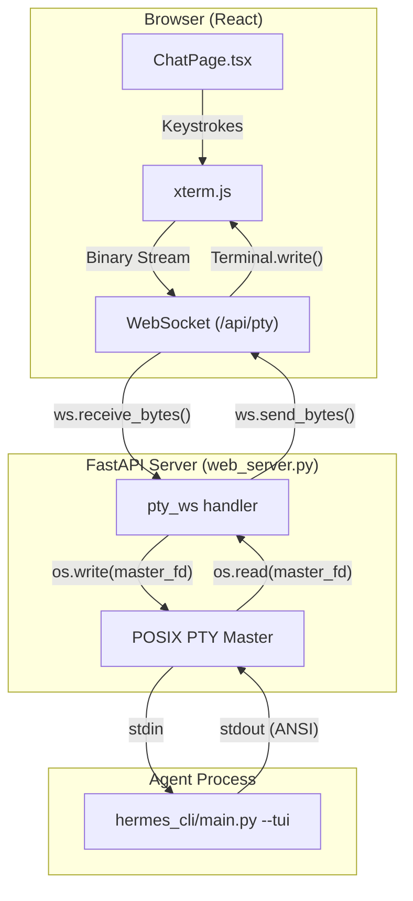
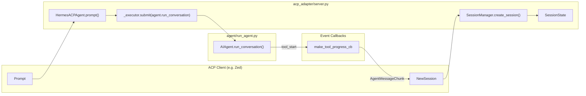

# Web Dashboard

Relevant source files

The following files were used as context for generating this wiki page:

- [.gitattributes](../.gitattributes)
- [acp_adapter/events.py](../acp_adapter/events.py)
- [acp_adapter/server.py](../acp_adapter/server.py)
- [acp_adapter/session.py](../acp_adapter/session.py)
- [acp_adapter/tools.py](../acp_adapter/tools.py)
- [agent/moa_loop.py](../agent/moa_loop.py)
- [apps/desktop/AGENTS.md](../apps/desktop/AGENTS.md)
- [apps/desktop/DESIGN.md](../apps/desktop/DESIGN.md)
- [apps/desktop/README.md](../apps/desktop/README.md)
- [apps/desktop/electron/remote-liveness.test.ts](../apps/desktop/electron/remote-liveness.test.ts)
- [apps/desktop/electron/remote-liveness.ts](../apps/desktop/electron/remote-liveness.ts)
- [apps/desktop/src/app/settings/model-settings.test.tsx](../apps/desktop/src/app/settings/model-settings.test.tsx)
- [apps/desktop/src/app/settings/model-settings.tsx](../apps/desktop/src/app/settings/model-settings.tsx)
- [apps/desktop/src/components/brand-mark.tsx](../apps/desktop/src/components/brand-mark.tsx)
- [apps/desktop/src/hermes.ts](../apps/desktop/src/hermes.ts)
- [apps/desktop/src/types/hermes.ts](../apps/desktop/src/types/hermes.ts)
- contributors/emails/sjq15251852316@gmail.com
- [hermes_cli/moa_cmd.py](../hermes_cli/moa_cmd.py)
- [hermes_cli/moa_config.py](../hermes_cli/moa_config.py)
- [hermes_cli/portal_cli.py](../hermes_cli/portal_cli.py)
- [hermes_cli/web_server.py](../hermes_cli/web_server.py)
- [tests/acp/test_events.py](../tests/acp/test_events.py)
- [tests/acp/test_mcp_e2e.py](../tests/acp/test_mcp_e2e.py)
- [tests/acp/test_server.py](../tests/acp/test_server.py)
- [tests/acp/test_session.py](../tests/acp/test_session.py)
- [tests/acp/test_tools.py](../tests/acp/test_tools.py)
- [tests/acp_adapter/test_acp_commands.py](../tests/acp_adapter/test_acp_commands.py)
- [tests/acp_adapter/test_acp_images.py](../tests/acp_adapter/test_acp_images.py)
- [tests/cli/test_moa_command.py](../tests/cli/test_moa_command.py)
- [tests/hermes_cli/test_gateway_runtime_health.py](../tests/hermes_cli/test_gateway_runtime_health.py)
- [tests/hermes_cli/test_moa_config.py](../tests/hermes_cli/test_moa_config.py)
- [tests/hermes_cli/test_web_server.py](../tests/hermes_cli/test_web_server.py)
- [tests/hermes_cli/test_web_server_messaging_profiles.py](../tests/hermes_cli/test_web_server_messaging_profiles.py)
- [tests/hermes_cli/test_web_server_profile_unification.py](../tests/hermes_cli/test_web_server_profile_unification.py)
- [tests/hermes_cli/test_whatsapp_onboarding.py](../tests/hermes_cli/test_whatsapp_onboarding.py)
- [tests/run_agent/test_moa_fanout_cadence.py](../tests/run_agent/test_moa_fanout_cadence.py)
- [tests/run_agent/test_moa_loop_mode.py](../tests/run_agent/test_moa_loop_mode.py)
- [web/eslint.config.js](../web/eslint.config.js)
- [web/src/App.tsx](../web/src/App.tsx)
- [web/src/components/ChatSidebar.tsx](../web/src/components/ChatSidebar.tsx)
- [web/src/components/OAuthLoginModal.tsx](../web/src/components/OAuthLoginModal.tsx)
- [web/src/components/OAuthProvidersCard.tsx](../web/src/components/OAuthProvidersCard.tsx)
- [web/src/i18n/en.ts](../web/src/i18n/en.ts)
- [web/src/i18n/types.ts](../web/src/i18n/types.ts)
- [web/src/i18n/zh.ts](../web/src/i18n/zh.ts)
- [web/src/lib/api.ts](../web/src/lib/api.ts)
- [web/src/lib/gatewayClient.ts](../web/src/lib/gatewayClient.ts)
- [web/src/lib/pty-mobile-input.test.ts](../web/src/lib/pty-mobile-input.test.ts)
- [web/src/lib/pty-mobile-input.ts](../web/src/lib/pty-mobile-input.ts)
- [web/src/lib/pty-reconnect.test.ts](../web/src/lib/pty-reconnect.test.ts)
- [web/src/lib/pty-reconnect.ts](../web/src/lib/pty-reconnect.ts)
- [web/src/pages/AnalyticsPage.tsx](../web/src/pages/AnalyticsPage.tsx)
- [web/src/pages/ChannelsPage.tsx](../web/src/pages/ChannelsPage.tsx)
- [web/src/pages/ChatPage.tsx](../web/src/pages/ChatPage.tsx)
- [web/src/pages/ConfigPage.tsx](../web/src/pages/ConfigPage.tsx)
- [web/src/pages/CronPage.tsx](../web/src/pages/CronPage.tsx)
- [web/src/pages/EnvPage.tsx](../web/src/pages/EnvPage.tsx)
- [web/src/pages/LogsPage.tsx](../web/src/pages/LogsPage.tsx)
- [web/src/pages/ModelsPage.tsx](../web/src/pages/ModelsPage.tsx)
- [web/src/pages/ProfilesPage.tsx](../web/src/pages/ProfilesPage.tsx)
- [web/src/pages/SessionsPage.tsx](../web/src/pages/SessionsPage.tsx)
- [web/src/pages/SkillsPage.tsx](../web/src/pages/SkillsPage.tsx)
- [website/docs/guides/run-nemotron-3-ultra-free.md](../website/docs/guides/run-nemotron-3-ultra-free.md)
- [website/docs/index.mdx](../website/docs/index.mdx)
- [website/docs/user-guide/desktop.md](../website/docs/user-guide/desktop.md)
- [website/docs/user-guide/features/mixture-of-agents.md](../website/docs/user-guide/features/mixture-of-agents.md)
- [website/docs/user-guide/features/web-dashboard.md](../website/docs/user-guide/features/web-dashboard.md)

The Hermes Web Dashboard is a browser-based management interface providing a centralized surface for configuration, session monitoring, and agent interaction. It is built using a **FastAPI** backend and a **React/Vite** frontend, supporting both local loopback access and secure gated OAuth modes.

## Web Server Architecture

The core of the dashboard is `hermes_cli/web_server.py`, which serves as both the REST API and the WebSocket host for the embedded TUI.

### Security Modes

The server operates in two distinct security modes depending on the bind address and configuration:

1.  **Loopback Mode (Insecure):** When bound to `127.0.0.1`, the server assumes local trust. It uses an ephemeral session token injected into the HTML and sent via the `X-Hermes-Session-Token` header [[hermes_cli/web_server.py:149-157](../hermes_cli/web_server.py#L149-L157), [web/src/lib/api.ts:37-43](../web/src/lib/api.ts#L37-L43)].
2.  **Gated Mode (OAuth):** When bound to public interfaces without the `--insecure` flag, the server engages an OAuth gate (typically via Nous Portal). This mode uses secure cookies and a single-use ticket system (`?ticket=`) for WebSocket upgrades [[web/src/lib/api.ts:30-34](../web/src/lib/api.ts#L30-L34), [web/src/lib/api.ts:109-114](../web/src/lib/api.ts#L109-L114)].

### Profile-Scoped API

The dashboard is a "machine-level" surface that can manage multiple Hermes profiles. The frontend appends a `?profile=<name>` query parameter to requests targeting profile-specific resources [[web/src/lib/api.ts:52-60](../web/src/lib/api.ts#L52-L60), [web/src/lib/api.ts:85-92](../web/src/lib/api.ts#L85-L92)].

| Endpoint Family | Scope | Description |
| :--- | :--- | :--- |
| `/api/config` | Profile | Reads/writes `config.yaml` for the selected profile [[web/src/lib/api.ts:72](../web/src/lib/api.ts#L72)] |
| `/api/env` | Profile | Manages `.env` secrets for the selected profile [[web/src/lib/api.ts:73](../web/src/lib/api.ts#L73)] |
| `/api/sessions` | Profile | Accesses the SQLite `sessions.db` for the profile [[web/src/lib/api.ts:68](../web/src/lib/api.ts#L68)] |
| `/api/model/moa` | Profile | Configures Mixture-of-Agents presets [[web/src/lib/api.ts:81](../web/src/lib/api.ts#L81)] |

**Sources:** `[hermes_cli/web_server.py:1-110](../hermes_cli/web_server.py#L1-L110)`, `[web/src/lib/api.ts:1-114](../web/src/lib/api.ts#L1-L114)`, `[website/docs/user-guide/features/web-dashboard.md:44-69](../website/docs/user-guide/features/web-dashboard.md#L44-L69)`

---

## Embedded Chat (PTY/WebSocket)

The **Chat** tab embeds the full Hermes TUI inside the browser using `xterm.js`. This is achieved by spawning a pseudo-terminal (PTY) on the server that runs the `hermes --tui` process.

### PTY Data Flow

Title: "Web Dashboard Chat PTY Pipeline"

**Key Implementation Details:**
*   **Reattachment:** The frontend generates a stable `PTY_ATTACH_TOKEN` stored in `localStorage`. This allows the user to refresh the page or switch tabs without killing the underlying agent process [[web/src/pages/ChatPage.tsx:67-88](../web/src/pages/ChatPage.tsx#L67-L88)].
*   **Sizing:** The `@xterm/addon-fit` handles terminal resizing. When the browser window changes, the frontend sends a `\x1b[RESIZE:cols;rows]` sequence over the WebSocket, which the backend uses to call `set_winsize` on the PTY [[web/src/pages/ChatPage.tsx:9-10](../web/src/pages/ChatPage.tsx#L9-L10), [web/src/pages/ChatPage.tsx:118-120](../web/src/pages/ChatPage.tsx#L118-L120)].

**Sources:** `[web/src/pages/ChatPage.tsx:1-102](../web/src/pages/ChatPage.tsx#L1-L102)`, `[hermes_cli/web_server.py:185-195](../hermes_cli/web_server.py#L185-L195)`, `[website/docs/user-guide/features/web-dashboard.md:108-122](../website/docs/user-guide/features/web-dashboard.md#L108-L122)`

---

## Management Pages

The React dashboard provides specialized interfaces for core agent subsystems:

### Mixture-of-Agents (MoA) Configuration
The MoA page allows users to define "Presets" consisting of multiple **Reference Models** (advisors) and an **Aggregator Model**. The UI manages the `moa` block in `config.yaml`, supporting fields like `reference_temperature`, `max_tokens`, and `privacy_filter` [[agent/moa_loop.py:74-80](../agent/moa_loop.py#L74-L80), [hermes_cli/moa_config.py:124-140](../hermes_cli/moa_config.py#L124-L140)].

### Cron & Scheduled Tasks
The Cron page aggregates scheduled jobs across all profiles. It interfaces with `jobs.json` and `executions.db` to show job status, schedule (cron expression), and execution history [[web/src/pages/CronPage.tsx:1-20](../web/src/pages/CronPage.tsx#L1-L20), [website/docs/user-guide/features/web-dashboard.md:76-80](../website/docs/user-guide/features/web-dashboard.md#L76-L80)].

### Skills & Plugins
*   **Skills:** Lists all procedural memory files (`.md`) found in the profile's `skills/` directory.
*   **Plugins:** Manages the `plugins.enabled` list in `config.yaml`. The dashboard dynamically mounts API routes and serves static assets for enabled plugins from `dashboard-plugins/` [[tests/hermes_cli/test_web_server.py:70-85](../tests/hermes_cli/test_web_server.py#L70-L85), [tests/hermes_cli/test_web_server.py:104-110](../tests/hermes_cli/test_web_server.py#L104-L110)].

**Sources:** `[hermes_cli/moa_config.py:42-108](../hermes_cli/moa_config.py#L42-L108)`, `[agent/moa_loop.py:1-160](../agent/moa_loop.py#L1-L160)`, `[web/src/pages/CronPage.tsx:1-20](../web/src/pages/CronPage.tsx#L1-L20)`

---

## IDE Integration (ACP Server)

Hermes includes an **Agent Client Protocol (ACP)** server implementation in `acp_adapter/server.py`. This allows IDEs (like Zed) to treat Hermes as a first-class agent.

### HermesACPAgent Implementation
The `HermesACPAgent` class maps ACP protocol requirements to the `AIAgent` core.

Title: "ACP to AIAgent Mapping"

### Key ACP Features
*   **Authentication:** Supports `terminal` setup (running `hermes setup` in the IDE terminal) and provider-specific credential detection [[acp_adapter/server.py:65-72](../acp_adapter/server.py#L65-L72), [acp_adapter/server.py:132-140](../acp_adapter/server.py#L132-L140)].
*   **Resource Handling:** Translates IDE file URIs (e.g., `file:///C:/...`) into local paths, including mapping Windows paths to `/mnt/c/...` for WSL compatibility [[acp_adapter/server.py:158-190](../acp_adapter/server.py#L158-L190)].
*   **Context Compression:** Integrates with `ContextCompressor` to handle long-running IDE sessions by summarizing historical turns [[acp_adapter/server.py:77-80](../acp_adapter/server.py#L77-L80)].

**Sources:** `[acp_adapter/server.py:1-100](../acp_adapter/server.py#L1-L100)`, `[acp_adapter/session.py:1-50](../acp_adapter/session.py#L1-L50)`, `[tests/acp/test_server.py:56-68](../tests/acp/test_server.py#L56-L68)`

---

## Desktop App Bridge

The Electron desktop application (`apps/desktop`) utilizes the same FastAPI backend but communicates via a specialized `HermesGateway` client.

*   **Startup Readiness:** The desktop app performs a `RuntimeReadiness` check before launching the UI to ensure the Python backend is responsive [[apps/desktop/src/hermes.ts:64-75](../apps/desktop/src/hermes.ts#L64-L75)].
*   **Timeout Management:** Specific timeouts are defined for heavy operations:
    *   `STARTUP_REQUEST_TIMEOUT_MS`: 60s (for profile/skill walks) [[apps/desktop/src/hermes.ts:75](../apps/desktop/src/hermes.ts#L75)].
    *   `PROMPT_SUBMIT_REQUEST_TIMEOUT_MS`: 30 minutes (to accommodate deep reasoning/MoA turns) [[apps/desktop/src/hermes.ts:86](../apps/desktop/src/hermes.ts#L86)].

**Sources:** `[apps/desktop/src/hermes.ts:1-110](../apps/desktop/src/hermes.ts#L1-L110)`, `[apps/desktop/src/types/hermes.ts:1-150](../apps/desktop/src/types/hermes.ts#L1-L150)`

---
