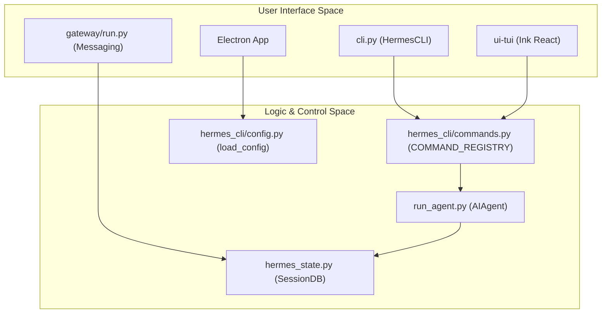
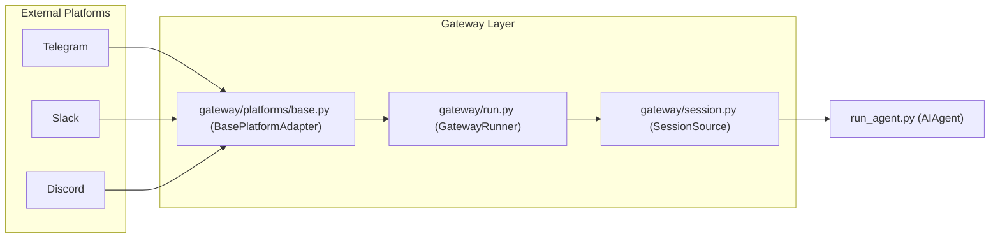

# User Interfaces

Relevant source files

The following files were used as context for generating this wiki page:

- [.env.example](../.env.example)
- [AGENTS.md](../AGENTS.md)
- [README.md](../README.md)
- [apps/desktop/AGENTS.md](../apps/desktop/AGENTS.md)
- [apps/desktop/DESIGN.md](../apps/desktop/DESIGN.md)
- [apps/desktop/README.md](../apps/desktop/README.md)
- [apps/desktop/electron/remote-liveness.test.ts](../apps/desktop/electron/remote-liveness.test.ts)
- [apps/desktop/electron/remote-liveness.ts](../apps/desktop/electron/remote-liveness.ts)
- [apps/desktop/src/components/brand-mark.tsx](../apps/desktop/src/components/brand-mark.tsx)
- [cli-config.yaml.example](../cli-config.yaml.example)
- [cli.py](../cli.py)
- [gateway/config.py](../gateway/config.py)
- [gateway/platforms/base.py](../gateway/platforms/base.py)
- [gateway/run.py](../gateway/run.py)
- [gateway/session.py](../gateway/session.py)
- [hermes_cli/commands.py](../hermes_cli/commands.py)
- [hermes_cli/config.py](../hermes_cli/config.py)
- [hermes_state.py](../hermes_state.py)
- [run_agent.py](../run_agent.py)
- [tests/gateway/test_config.py](../tests/gateway/test_config.py)
- [tests/gateway/test_platform_base.py](../tests/gateway/test_platform_base.py)
- [tests/gateway/test_session.py](../tests/gateway/test_session.py)
- [tests/gateway/test_session_reset_notify.py](../tests/gateway/test_session_reset_notify.py)
- [tests/gateway/test_shared_group_sender_prefix.py](../tests/gateway/test_shared_group_sender_prefix.py)
- [tests/gateway/test_tts_media_routing.py](../tests/gateway/test_tts_media_routing.py)
- [tests/hermes_cli/test_commands.py](../tests/hermes_cli/test_commands.py)
- [tests/test_hermes_state.py](../tests/test_hermes_state.py)
- [website/docs/guides/run-nemotron-3-ultra-free.md](../website/docs/guides/run-nemotron-3-ultra-free.md)
- [website/docs/index.mdx](../website/docs/index.mdx)
- [website/docs/user-guide/desktop.md](../website/docs/user-guide/desktop.md)
- [website/docs/user-guide/features/web-dashboard.md](../website/docs/user-guide/features/web-dashboard.md)

Hermes Agent provides a multi-surface experience designed to bridge high-performance terminal workflows with accessible desktop and mobile interfaces. Whether through a rich CLI, a specialized TUI, a cross-platform desktop application, or a distributed messaging gateway, the user interface layer remains decoupled from the core `AIAgent` execution logic.

## Interface Overview

The interface layer is responsible for session management, rendering streaming responses, and handling user input across different environments. All interfaces share a common configuration schema and persist state to the central `SessionDB` [hermes_state.py:3-15](../hermes_state.py#L3-L15).

### Unified Command System
All user-facing surfaces derive their interaction model from a central command registry. This ensures that slash commands like `/retry`, `/undo`, and `/model` behave consistently across the CLI, Telegram, Discord, and the Web Dashboard [hermes_cli/commands.py:3-9](../hermes_cli/commands.py#L3-L9).

| Interface | Primary Use Case | Key Code Entities |
| :--- | :--- | :--- |
| **CLI / REPL** | Local development and rapid prototyping. | `HermesCLI`, `cli.py` |
| **Ink TUI** | Immersive terminal experience with rich formatting. | `ui-tui`, `tui_gateway.py` |
| **Desktop App** | GUI-based management and multi-profile switching. | `apps/desktop`, `Electron` |
| **Web Dashboard** | Remote monitoring, analytics, and cron management. | `web_server.py`, `React` |

---

## Component Relationship

The following diagram illustrates how different UI components interact with the core Agent and Persistence layers.

### UI to Core Mapping
"Natural Language Space" (User Inputs) to "Code Entity Space" (Internal Logic)

Sources: [cli.py:56-58](../cli.py#L56-L58), [hermes_cli/commands.py:64-140](../hermes_cli/commands.py#L64-L140), [gateway/run.py:4-14](../gateway/run.py#L4-L14), [hermes_state.py:3-15](../hermes_state.py#L3-L15)

---

## Interface Details

### 5.1 CLI & REPL (HermesCLI)
The primary interface for developers. It features a `prompt_toolkit` REPL with multi-line editing, syntax highlighting, and slash-command completion [cli.py:60-72](../cli.py#L60-L72). It supports a "one-shot" mode for pipe-based workflows and handles local environment detection for terminal-based tools.
*   **Key Files:** `cli.py`, `hermes_cli/main.py`.
*   **For details, see [CLI & REPL (HermesCLI)](#5.1)**.

### 5.2 Ink TUI (Terminal User Interface)
A specialized React-based terminal interface built using the Ink library. It provides a more structured visual experience than the standard REPL, including transcript virtualization, subagent spawn trees, and a pet mascot [README.md:24-25](../README.md#L24-L25). It communicates with the agent via a JSON-RPC gateway.
*   **Key Files:** `ui-tui/`, `gateway/tui_gateway.py`.
*   **For details, see [Ink TUI (Terminal User Interface)](#5.2)**.

### 5.3 Desktop Application (Electron)
A cross-platform GUI application that bundles the Hermes runtime. It provides a session sidebar, a visual model picker, and dedicated settings panels for managing providers and API keys [apps/desktop/README.md](../apps/desktop/README.md). It includes a "RuntimeReadiness" check to ensure the underlying Python environment is correctly configured.
*   **Key Files:** `apps/desktop/`, `apps/desktop/electron/`.
*   **For details, see [Desktop Application (Electron)](#5.3)**.

### 5.4 Web Dashboard
A FastAPI-backed web interface used primarily for remote management and analytics. It allows users to view conversation histories, manage scheduled cron jobs, and monitor agent performance through a React-based frontend [website/docs/user-guide/features/web-dashboard.md](../website/docs/user-guide/features/web-dashboard.md).
*   **Key Files:** `agent/web_server.py`, `apps/web-dashboard/`.
*   **For details, see [Web Dashboard](#5.4)**.

---

## Gateway Routing Logic

The Messaging Gateway acts as a "Headless UI," translating external platform events (from Telegram, Slack, etc.) into agent turns.

### Platform Event Flow

Sources: [gateway/run.py:5-7](../gateway/run.py#L5-L7), [gateway/platforms/base.py:4-6](../gateway/platforms/base.py#L4-L6), [gateway/session.py:149-160](../gateway/session.py#L149-L160)

### Multi-Platform Consistency
To maintain a consistent experience, the gateway uses the `SessionSource` dataclass to track where a message originated (e.g., `chat_id`, `user_id`, `platform`) [gateway/session.py:149-178](../gateway/session.py#L149-L178). This allows the agent to "know" which interface the user is currently using and format responses accordingly (e.g., using Markdown for Slack vs. HTML for Telegram) [gateway/platforms/base.py:154-167](../gateway/platforms/base.py#L154-L167).

Sources: [gateway/run.py:72-81](../gateway/run.py#L72-L81), [gateway/session.py:149-180](../gateway/session.py#L149-L180), [hermes_cli/commands.py:46-58](../hermes_cli/commands.py#L46-L58), [README.md:23-31](../README.md#L23-L31)

---
