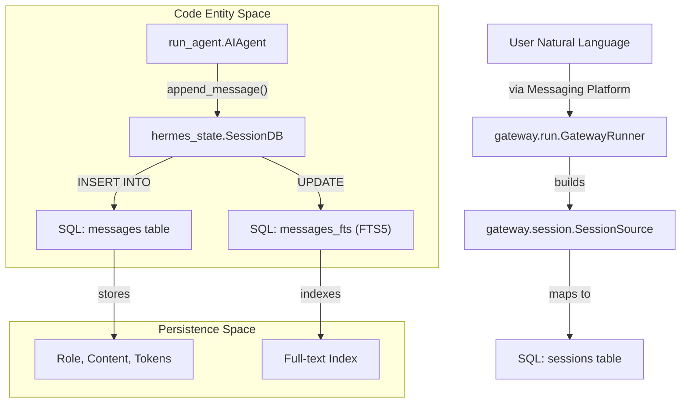
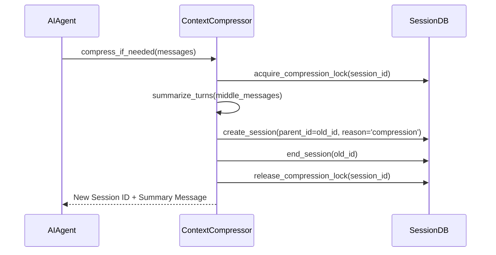

# SessionDB & SQLite State Store

Relevant source files

The following files were used as context for generating this wiki page:

- [.env.example](../.env.example)
- [AGENTS.md](../AGENTS.md)
- [README.md](../README.md)
- [agent/agent_init.py](../agent/agent_init.py)
- [agent/agent_runtime_helpers.py](../agent/agent_runtime_helpers.py)
- [agent/chat_completion_helpers.py](../agent/chat_completion_helpers.py)
- [agent/context_compressor.py](../agent/context_compressor.py)
- [agent/conversation_compression.py](../agent/conversation_compression.py)
- [agent/conversation_loop.py](../agent/conversation_loop.py)
- [agent/tool_executor.py](../agent/tool_executor.py)
- [agent/turn_context.py](../agent/turn_context.py)
- [cli-config.yaml.example](../cli-config.yaml.example)
- [cli.py](../cli.py)
- contributors/emails/lanyusea@gmail.com
- contributors/emails/stanislav@local
- [gateway/config.py](../gateway/config.py)
- [gateway/platforms/base.py](../gateway/platforms/base.py)
- [gateway/run.py](../gateway/run.py)
- [gateway/session.py](../gateway/session.py)
- [hermes_cli/commands.py](../hermes_cli/commands.py)
- [hermes_cli/config.py](../hermes_cli/config.py)
- [hermes_state.py](../hermes_state.py)
- [run_agent.py](../run_agent.py)
- [tests/agent/test_compression_anti_thrash_persistence.py](../tests/agent/test_compression_anti_thrash_persistence.py)
- [tests/agent/test_compression_concurrent_fork.py](../tests/agent/test_compression_concurrent_fork.py)
- [tests/agent/test_compression_rotation_state.py](../tests/agent/test_compression_rotation_state.py)
- [tests/agent/test_context_compressor.py](../tests/agent/test_context_compressor.py)
- [tests/agent/test_credential_pool_routing.py](../tests/agent/test_credential_pool_routing.py)
- [tests/agent/test_idle_compaction_lock_and_guards.py](../tests/agent/test_idle_compaction_lock_and_guards.py)
- [tests/agent/test_turn_context.py](../tests/agent/test_turn_context.py)
- [tests/agent/test_turn_context_overflow_warning.py](../tests/agent/test_turn_context_overflow_warning.py)
- [tests/cli/test_cli_interrupt_ack_race.py](../tests/cli/test_cli_interrupt_ack_race.py)
- [tests/cli/test_cli_shutdown_memory_messages.py](../tests/cli/test_cli_shutdown_memory_messages.py)
- [tests/gateway/test_config.py](../tests/gateway/test_config.py)
- [tests/gateway/test_platform_base.py](../tests/gateway/test_platform_base.py)
- [tests/gateway/test_session.py](../tests/gateway/test_session.py)
- [tests/gateway/test_session_reset_notify.py](../tests/gateway/test_session_reset_notify.py)
- [tests/gateway/test_shared_group_sender_prefix.py](../tests/gateway/test_shared_group_sender_prefix.py)
- [tests/gateway/test_telegram_noise_filter.py](../tests/gateway/test_telegram_noise_filter.py)
- [tests/gateway/test_tts_media_routing.py](../tests/gateway/test_tts_media_routing.py)
- [tests/hermes_cli/test_commands.py](../tests/hermes_cli/test_commands.py)
- [tests/run_agent/test_413_compression.py](../tests/run_agent/test_413_compression.py)
- [tests/run_agent/test_compression_feasibility.py](../tests/run_agent/test_compression_feasibility.py)
- [tests/run_agent/test_credential_pool_interrupt.py](../tests/run_agent/test_credential_pool_interrupt.py)
- [tests/run_agent/test_run_agent.py](../tests/run_agent/test_run_agent.py)
- [tests/test_hermes_state.py](../tests/test_hermes_state.py)
- [tests/test_hermes_state_compression_locks.py](../tests/test_hermes_state_compression_locks.py)
- [tests/tools/test_daemon_pool.py](../tests/tools/test_daemon_pool.py)
- [tools/daemon_pool.py](../tools/daemon_pool.py)

The Hermes Agent utilizes a centralized SQLite-based persistence layer to manage conversation history, session metadata, and concurrency control. This system replaces legacy per-session JSONL files with a robust relational store supporting Write-Ahead Logging (WAL), full-text search, and multi-platform gateway synchronization.

## SessionDB Architecture

The core of the persistence layer is the `SessionDB` class, which manages a SQLite database typically located at `~/.hermes/sessions.db`. It is designed for high-concurrency environments, such as a multi-platform messaging gateway, where multiple adapters may attempt to read or write session state simultaneously.

### Key Database Features
*   **WAL Mode**: The database is initialized in Write-Ahead Logging mode to allow concurrent readers and a single writer without blocking [hermes_state.py:10-10](../hermes_state.py#L10).
*   **FTS5 Full-Text Search**: Conversation messages are indexed using SQLite's FTS5 virtual table, enabling fast searches across historical turns [hermes_state.py:11-11](../hermes_state.py#L11).
*   **CJK Tokenizer Support**: For users in Chinese, Japanese, and Korean locales, the system utilizes a native `fts5_cjk` extension to ensure accurate word segmentation and search relevance [hermes_state.py:5-6](../hermes_state.py#L5-L6).
*   **NFS Fallback**: The database initialization includes logic to handle environments where SQLite locking may fail (e.g., certain NFS mounts), ensuring the agent remains functional [hermes_state.py:10-10](../hermes_state.py#L10).

### Data Flow: Natural Language to Code Entity
The following diagram illustrates how a user's natural language interaction flows into the SQLite persistence entities.

**Turn Persistence Data Flow**

Sources: [hermes_state.py:1-15](../hermes_state.py#L1-L15), [gateway/run.py:5-7](../gateway/run.py#L5-L7), [gateway/session.py:149-158](../gateway/session.py#L149-L158)

---

## Session Lifecycle Management

Sessions in Hermes represent a continuous conversation thread. The lifecycle is managed through several key functions that handle creation, retrieval, and termination.

### Core Functions
| Function | File:Line | Description |
| :--- | :--- | :--- |
| `get_or_create_session` | [gateway/session.py:33-50](../gateway/session.py#L33-L50) | Retrieves an existing session based on platform/chat_id or creates a new one if the reset policy triggers. |
| `create_session` | [hermes_state.py:410-430](../hermes_state.py#L410-L430) | Inserts a new row into the `sessions` table with metadata like `model`, `cwd`, and `system_prompt`. |
| `update_token_counts` | [hermes_state.py:550-565](../hermes_state.py#L550-L565) | Updates the cumulative token usage for a session after each model turn. |
| `end_session` | [hermes_state.py:580-595](../hermes_state.py#L580-L595) | Marks a session as ended and records the `end_reason` (e.g., 'compression', 'manual', 'error'). |

### Cascade Deletion
Hermes supports **Delegate Sessions** (subagents spawned via `delegate_tool`). To prevent orphaned data, the `SessionDB` implements recursive cascade deletion. When a parent session is deleted, all associated delegate sessions (identified by the `_delegate_from` marker in `model_config`) are also removed [hermes_state.py:163-171](../hermes_state.py#L163-L171).

Sources: [hermes_state.py:410-595](../hermes_state.py#L410-L595), [gateway/session.py:33-50](../gateway/session.py#L33-L50), [hermes_state.py:163-171](../hermes_state.py#L163-L171)

---

## Context Compression & Rotation

When a conversation exceeds the model's context window, the `ContextCompressor` performs a "rotation." This process involves summarizing older turns and starting a new "child" session that points to the "parent" session.

### Compression Logic
1.  **Summarization**: An auxiliary model summarizes the middle turns of the conversation [agent/context_compressor.py:3-5](../agent/context_compressor.py#L3-L5).
2.  **Snapshotting**: A `HISTORICAL_TASK_SNAPSHOT` is created to preserve state [agent/context_compressor.py:92-96](../agent/context_compressor.py#L92-L96).
3.  **Locking**: To prevent concurrent compression tasks on the same session, a **Compression Lock** is stored in the database.
    *   Locks are PID-aware. If a process dies without releasing a lock, the system checks if the PID is still alive before reclaiming the lease [hermes_state.py:44-54](../hermes_state.py#L44-L54).

**Session Rotation Diagram**

Sources: [agent/context_compressor.py:1-25](../agent/context_compressor.py#L1-L25), [hermes_state.py:41-54](../hermes_state.py#L41-L54), [hermes_state.py:141-145](../hermes_state.py#L141-L145)

---

## Native FTS5 CJK Extension

Standard SQLite FTS5 does not segment CJK (Chinese, Japanese, Korean) text effectively, treating entire strings as single tokens. Hermes includes a custom CJK tokenizer extension to handle this.

*   **Implementation**: The extension provides a tokenizer that correctly identifies word boundaries in CJK text, enabling the `/search` and `/history` commands to work accurately across languages [hermes_state.py:5-6](../hermes_state.py#L5-L6).
*   **Loading**: The extension is dynamically loaded during the `SessionDB` connection initialization. If the native library is missing, it falls back to standard tokenization [hermes_state.py:10-11](../hermes_state.py#L10-L11).

Sources: [hermes_state.py:1-15](../hermes_state.py#L1-L15), [hermes_cli/commands.py:91-92](../hermes_cli/commands.py#L91-L92)

---
