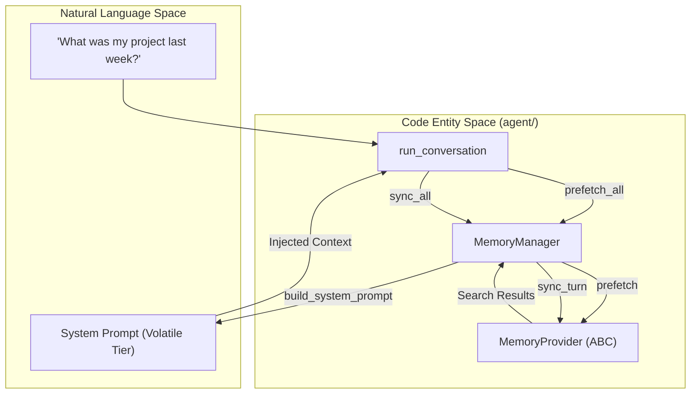
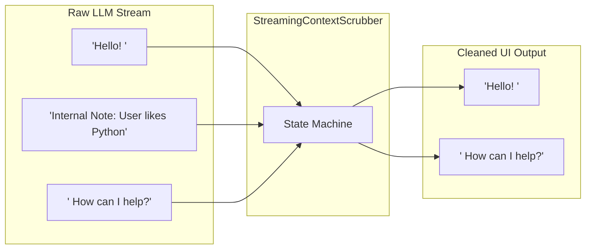

# Memory Providers & Plugins

Relevant source files

The following files were used as context for generating this wiki page:

- [agent/memory_manager.py](../agent/memory_manager.py)
- [agent/memory_provider.py](../agent/memory_provider.py)
- [agent/message_content.py](../agent/message_content.py)
- contributors/emails/ckorhonen@gmail.com
- [hermes_cli/dingtalk_auth.py](../hermes_cli/dingtalk_auth.py)
- [hermes_cli/memory_setup.py](../hermes_cli/memory_setup.py)
- [hermes_cli/secret_prompt.py](../hermes_cli/secret_prompt.py)
- [hermes_time.py](../hermes_time.py)
- [optional-skills/autonomous-ai-agents/honcho/SKILL.md](../optional-skills/autonomous-ai-agents/honcho/SKILL.md)
- [plugins/google_meet/audio_bridge.py](../plugins/google_meet/audio_bridge.py)
- [plugins/google_meet/cli.py](../plugins/google_meet/cli.py)
- [plugins/google_meet/node/cli.py](../plugins/google_meet/node/cli.py)
- [plugins/memory/__init__.py](../plugins/memory/__init__.py)
- [plugins/memory/hindsight/README.md](../plugins/memory/hindsight/README.md)
- [plugins/memory/hindsight/__init__.py](../plugins/memory/hindsight/__init__.py)
- [plugins/memory/hindsight/plugin.yaml](../plugins/memory/hindsight/plugin.yaml)
- [plugins/memory/honcho/README.md](../plugins/memory/honcho/README.md)
- [plugins/memory/honcho/__init__.py](../plugins/memory/honcho/__init__.py)
- [plugins/memory/honcho/cli.py](../plugins/memory/honcho/cli.py)
- [plugins/memory/honcho/client.py](../plugins/memory/honcho/client.py)
- [plugins/memory/honcho/session.py](../plugins/memory/honcho/session.py)
- [plugins/memory/openviking/README.md](../plugins/memory/openviking/README.md)
- [plugins/memory/openviking/__init__.py](../plugins/memory/openviking/__init__.py)
- [plugins/memory/openviking/plugin.yaml](../plugins/memory/openviking/plugin.yaml)
- [plugins/memory/query_rewrite.py](../plugins/memory/query_rewrite.py)
- [plugins/memory/retaindb/__init__.py](../plugins/memory/retaindb/__init__.py)
- [tests/agent/test_memory_async_sync.py](../tests/agent/test_memory_async_sync.py)
- [tests/agent/test_memory_provider.py](../tests/agent/test_memory_provider.py)
- [tests/agent/test_memory_session_switch.py](../tests/agent/test_memory_session_switch.py)
- [tests/agent/test_memory_user_id.py](../tests/agent/test_memory_user_id.py)
- [tests/agent/test_memory_write_bridge.py](../tests/agent/test_memory_write_bridge.py)
- [tests/agent/test_message_content.py](../tests/agent/test_message_content.py)
- [tests/agent/test_streaming_context_scrubber.py](../tests/agent/test_streaming_context_scrubber.py)
- [tests/gateway/test_agent_cache.py](../tests/gateway/test_agent_cache.py)
- [tests/gateway/test_vision_memory_leak.py](../tests/gateway/test_vision_memory_leak.py)
- [tests/hermes_cli/test_dingtalk_auth.py](../tests/hermes_cli/test_dingtalk_auth.py)
- [tests/hermes_cli/test_memory_setup.py](../tests/hermes_cli/test_memory_setup.py)
- [tests/hermes_cli/test_memory_setup_provider_arg.py](../tests/hermes_cli/test_memory_setup_provider_arg.py)
- [tests/hermes_cli/test_memory_status.py](../tests/hermes_cli/test_memory_status.py)
- [tests/hermes_cli/test_secret_prompt.py](../tests/hermes_cli/test_secret_prompt.py)
- [tests/honcho_plugin/test_async_memory.py](../tests/honcho_plugin/test_async_memory.py)
- [tests/honcho_plugin/test_cli.py](../tests/honcho_plugin/test_cli.py)
- [tests/honcho_plugin/test_client.py](../tests/honcho_plugin/test_client.py)
- [tests/honcho_plugin/test_pin_peer_name.py](../tests/honcho_plugin/test_pin_peer_name.py)
- [tests/honcho_plugin/test_query_rewrite.py](../tests/honcho_plugin/test_query_rewrite.py)
- [tests/honcho_plugin/test_session.py](../tests/honcho_plugin/test_session.py)
- [tests/openviking_plugin/test_openviking.py](../tests/openviking_plugin/test_openviking.py)
- [tests/plugins/memory/test_hindsight_provider.py](../tests/plugins/memory/test_hindsight_provider.py)
- [tests/plugins/memory/test_openviking_provider.py](../tests/plugins/memory/test_openviking_provider.py)
- [tests/plugins/memory/test_openviking_shutdown.py](../tests/plugins/memory/test_openviking_shutdown.py)
- [tests/plugins/memory/test_retaindb_provider.py](../tests/plugins/memory/test_retaindb_provider.py)
- [tests/plugins/test_retaindb_plugin.py](../tests/plugins/test_retaindb_plugin.py)
- [tests/run_agent/test_exit_cleanup_interrupt.py](../tests/run_agent/test_exit_cleanup_interrupt.py)
- [tests/run_agent/test_memory_provider_init.py](../tests/run_agent/test_memory_provider_init.py)
- [tests/run_agent/test_memory_sync_interrupted.py](../tests/run_agent/test_memory_sync_interrupted.py)
- [tests/test_honcho_startup_fail_open.py](../tests/test_honcho_startup_fail_open.py)
- [tests/test_timezone.py](../tests/test_timezone.py)
- [website/docs/developer-guide/memory-provider-plugin.md](../website/docs/developer-guide/memory-provider-plugin.md)
- [website/docs/user-guide/features/honcho.md](../website/docs/user-guide/features/honcho.md)
- [website/docs/user-guide/features/memory-providers.md](../website/docs/user-guide/features/memory-providers.md)

Hermes Agent employs a pluggable memory architecture that allows it to maintain long-term state, user preferences, and cross-session knowledge. This system bridges the gap between the stateless nature of LLMs and the need for persistent, evolving agent personas.

## Architecture Overview

The memory subsystem is managed by the `MemoryManager`, which orchestrates one or more `MemoryProvider` implementations. While multiple providers can be registered, the system typically enforces a limit of one primary external provider to prevent tool schema bloat and conflicting memory logic [agent/memory_manager.py:6-9](../agent/memory_manager.py#L6-L9).

### Key Interfaces & Classes

| Class | File Path | Role |
| :--- | :--- | :--- |
| `MemoryManager` | [agent/memory_manager.py:25-40](../agent/memory_manager.py#L25-L40) | Orchestrates prefetching, syncing, and prompt injection across providers. |
| `MemoryProvider` | [agent/memory_provider.py:10-20](../agent/memory_provider.py#L10-L20) | Abstract Base Class (ABC) defining the contract for memory backends. |
| `OpenVikingMemoryProvider` | [plugins/memory/openviking/__init__.py:116-123](../plugins/memory/openviking/__init__.py#L116-L123) | Implementation for ByteDance's OpenViking (filesystem-style hierarchy). |
| `HonchoMemoryProvider` | [plugins/memory/honcho/__init__.py:26-30](../plugins/memory/honcho/__init__.py#L26-L30) | Implementation for Honcho (AI-native user modeling). |
| `HindsightMemoryProvider` | [plugins/memory/hindsight/__init__.py:20-30](../plugins/memory/hindsight/__init__.py#L20-L30) | Implementation for Hindsight (Knowledge Graph & entity resolution). |

### Data Flow: Turn Lifecycle

The `MemoryManager` hooks into the `AIAgent` conversation loop at three critical points:
1.  **Pre-turn (Prefetch):** Retrieves relevant context based on the user's latest message [agent/memory_manager.py:19-19](../agent/memory_manager.py#L19).
2.  **System Prompt Assembly:** Injects retrieved context into the "volatile tier" of the system prompt [agent/memory_manager.py:16-16](../agent/memory_manager.py#L16).
3.  **Post-turn (Sync):** Persists the turn (user message + assistant response) to the memory backend [agent/memory_manager.py:22-22](../agent/memory_manager.py#L22).

**Memory Integration Diagram**

Sources: [agent/memory_manager.py:10-24](../agent/memory_manager.py#L10-L24), [agent/memory_provider.py:10-50](../agent/memory_provider.py#L10-L50)

---

## Memory Providers

### Honcho (AI-Native Memory)
Honcho provides cross-session user modeling using a "dialectic" approach. It represents knowledge through "Peer Cards" and synthesized conclusions.

*   **Session Scoped Memory:** Uses `HonchoSession` to track messages within a specific platform/chat ID [plugins/memory/honcho/session.py:21-28](../plugins/memory/honcho/session.py#L21-L28).
*   **Query Rewrite:** Includes a `query_rewrite` plugin to transform ambiguous user messages into optimized search queries for better retrieval [plugins/memory/query_rewrite.py:1-10](../plugins/memory/query_rewrite.py#L1-L10).
*   **Tools:** Exposes `honcho_profile`, `honcho_search`, `honcho_reasoning`, and `honcho_context` to the agent [plugins/memory/honcho/__init__.py:36-105](../plugins/memory/honcho/__init__.py#L36-L105).

Sources: [plugins/memory/honcho/__init__.py:1-15](../plugins/memory/honcho/__init__.py#L1-L15), [plugins/memory/honcho/client.py:38-43](../plugins/memory/honcho/client.py#L38-L43)

### OpenViking (Tiered Context)
OpenViking (by Volcengine/ByteDance) organizes knowledge into a filesystem hierarchy using `viking://` URIs [plugins/memory/openviking/__init__.py:3-5](../plugins/memory/openviking/__init__.py#L3-L5).

*   **Tiered Loading:** Supports L0 (~100 tokens), L1 (~2k tokens), and L2 (full) context loading [plugins/memory/openviking/__init__.py:20-20](../plugins/memory/openviking/__init__.py#L20).
*   **Automatic Extraction:** Extracts memories into 6 categories (preference, entity, event, case, pattern, etc.) on session commit [plugins/memory/openviking/__init__.py:19-19](../plugins/memory/openviking/__init__.py#L19), [plugins/memory/openviking/__init__.py:105-111](../plugins/memory/openviking/__init__.py#L105-L111).
*   **URI Normalization:** Maps pseudo-files like `.overview.md` to parent directories for consistent retrieval [tests/openviking_plugin/test_openviking.py:131-135](../tests/openviking_plugin/test_openviking.py#L131-L135).

Sources: [plugins/memory/openviking/__init__.py:1-24](../plugins/memory/openviking/__init__.py#L1-L24), [plugins/memory/openviking/__init__.py:116-123](../plugins/memory/openviking/__init__.py#L116-L123)

### Hindsight (Knowledge Graph)
Hindsight focuses on entity resolution and multi-strategy retrieval.

*   **Memory Banks:** Uses `bank_id` to partition memory (e.g., `hermes`) [plugins/memory/hindsight/__init__.py:14-14](../plugins/memory/hindsight/__init__.py#L14).
*   **Observation Scopes:** Supports `per_tag`, `combined`, or `all_combinations` for memory retention [plugins/memory/hindsight/__init__.py:22-22](../plugins/memory/hindsight/__init__.py#L22).
*   **Embedded Mode:** Can run a local embedded daemon managed via `HINDSIGHT_IDLE_TIMEOUT` [plugins/memory/hindsight/__init__.py:19-20](../plugins/memory/hindsight/__init__.py#L19-L20).

Sources: [plugins/memory/hindsight/__init__.py:1-29](../plugins/memory/hindsight/__init__.py#L1-L29), [tests/plugins/memory/test_hindsight_provider.py:19-30](../tests/plugins/memory/test_hindsight_provider.py#L19-L30)

---

## Context Injection & Scrubbing

### System Prompt Injection
Memory providers inject content into the system prompt using the `system_prompt_block()` method. This content is wrapped in `<memory-context>` tags to distinguish it from static instructions [agent/memory_manager.py:163-167](../agent/memory_manager.py#L163-L167).

### Streaming Context Scrubber
To prevent internal memory tags or "thinking" from leaking to the user in streaming responses, Hermes uses a `StreamingContextScrubber`. This state machine tracks partial tags across deltas and discards everything within a memory span [agent/memory_manager.py:182-190](../agent/memory_manager.py#L182-L190).

**Scrubbing Logic Diagram**

Sources: [agent/memory_manager.py:174-190](../agent/memory_manager.py#L174-L190), [tests/agent/test_streaming_context_scrubber.py:1-10](../tests/agent/test_streaming_context_scrubber.py#L1-L10)

---

## RetainDB (Local Simple Memory)
For users not using external services, `RetainDB` provides a lightweight, local persistence layer using SQLite.

*   **Storage:** Stores "retained" facts and observations in a local `retain.db` [plugins/memory/retaindb/__init__.py:1-10](../plugins/memory/retaindb/__init__.py#L1-L10).
*   **Simple Recall:** Performs basic keyword/semantic matching against stored snippets to provide context in the system prompt.

Sources: [plugins/memory/retaindb/__init__.py:1-20](../plugins/memory/retaindb/__init__.py#L1-L20), [tests/plugins/memory/test_retaindb_provider.py:1-15](../tests/plugins/memory/test_retaindb_provider.py#L1-L15)

## Tool Injection
External memory tools are dynamically injected into the agent's toolset via `inject_memory_provider_tools`. This function checks if the "memory" toolset is enabled and appends schemas provided by the active `MemoryProvider` [agent/memory_manager.py:110-140](../agent/memory_manager.py#L110-L140).

*   **Normalization:** `normalize_tool_schema` ensures schemas follow strict OpenAI/DeepSeek formatting to prevent API errors [agent/memory_manager.py:50-68](../agent/memory_manager.py#L50-L68).

Sources: [agent/memory_manager.py:83-109](../agent/memory_manager.py#L83-L109), [agent/memory_manager.py:110-156](../agent/memory_manager.py#L110-L156)

---
