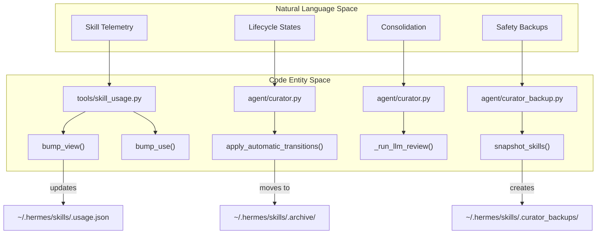
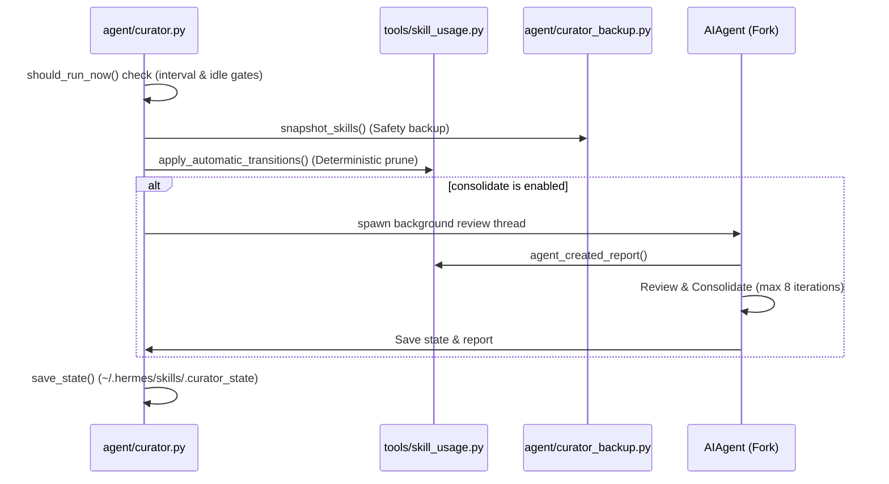

# Curator & Skill Lifecycle

Relevant source files

The following files were used as context for generating this wiki page:

- [agent/curator.py](../agent/curator.py)
- [agent/curator_backup.py](../agent/curator_backup.py)
- [hermes_cli/backup.py](../hermes_cli/backup.py)
- [hermes_cli/curator.py](../hermes_cli/curator.py)
- [hermes_cli/subcommands/update.py](../hermes_cli/subcommands/update.py)
- [tests/agent/test_curator.py](../tests/agent/test_curator.py)
- [tests/agent/test_curator_activity.py](../tests/agent/test_curator_activity.py)
- [tests/agent/test_curator_backup.py](../tests/agent/test_curator_backup.py)
- [tests/agent/test_curator_classification.py](../tests/agent/test_curator_classification.py)
- [tests/agent/test_curator_reports.py](../tests/agent/test_curator_reports.py)
- [tests/cron/test_jobs_crossprocess_lock.py](../tests/cron/test_jobs_crossprocess_lock.py)
- [tests/cron/test_rewrite_skill_refs.py](../tests/cron/test_rewrite_skill_refs.py)
- [tests/hermes_cli/test_backup.py](../tests/hermes_cli/test_backup.py)
- [tests/hermes_cli/test_curator_recent_run_notice.py](../tests/hermes_cli/test_curator_recent_run_notice.py)
- [tests/hermes_cli/test_curator_run.py](../tests/hermes_cli/test_curator_run.py)
- [tests/hermes_cli/test_curator_status.py](../tests/hermes_cli/test_curator_status.py)
- [tests/hermes_cli/test_curator_usage.py](../tests/hermes_cli/test_curator_usage.py)
- [tests/tools/test_skill_provenance.py](../tests/tools/test_skill_provenance.py)
- [tests/tools/test_skill_usage.py](../tests/tools/test_skill_usage.py)
- [tools/skill_provenance.py](../tools/skill_provenance.py)
- [tools/skill_usage.py](../tools/skill_usage.py)
- [website/docs/user-guide/features/curator.md](../website/docs/user-guide/features/curator.md)
- [website/i18n/zh-Hans/docusaurus-plugin-content-docs/current/getting-started/updating.md](../website/i18n/zh-Hans/docusaurus-plugin-content-docs/current/getting-started/updating.md)

The Curator is a background maintenance orchestrator designed to manage the lifecycle of **agent-created skills**. It prevents "skill sprawl" by tracking usage telemetry, transitioning long-unused skills through lifecycle states (Active → Stale → Archived), and optionally spawning an auxiliary LLM agent to consolidate overlapping skills into "umbrellas" [agent/curator.py:1-20](../agent/curator.py#L1-L20).

## System Architecture

The Curator operates as an inactivity-triggered task rather than a persistent daemon. It evaluates execution eligibility during agent idle periods [agent/curator.py:4-7](../agent/curator.py#L4-L7).

### Natural Language Space to Code Entity Space

This diagram maps the high-level Curator concepts to the specific implementation classes and files.

**Curator Component Mapping**

**Sources:** [agent/curator.py:1-20](../agent/curator.py#L1-L20), [tools/skill_usage.py:1-23](../tools/skill_usage.py#L1-L23), [agent/curator_backup.py:1-9](../agent/curator_backup.py#L1-L9)

---

## Skill Telemetry & Provenance

The Curator primarily targets skills created via the `skill_manage` tool (self-improvement loop). It distinguishes these from bundled or hub-installed skills using a provenance tracking system [tools/skill_usage.py:14-17](../tools/skill_usage.py#L14-L17).

### Telemetry Storage
Usage metadata is stored in a sidecar JSON file at `~/.hermes/skills/.usage.json` to avoid polluting the `SKILL.md` frontmatter [tools/skill_usage.py:9-11](../tools/skill_usage.py#L9-L11).

| Field | Description | Code Reference |
| :--- | :--- | :--- |
| `use_count` | Number of times the skill was executed. | [tools/skill_usage.py:129-131](../tools/skill_usage.py#L129-L131) |
| `view_count` | Number of times the skill was read by an agent. | [tools/skill_usage.py:117-125](../tools/skill_usage.py#L117-L125) |
| `patch_count` | Number of times the skill was modified. | [tools/skill_usage.py:135-139](../tools/skill_usage.py#L135-L139) |
| `last_activity_at` | The newest timestamp among use, view, or patch. | [tools/skill_usage.py:146-163](../tools/skill_usage.py#L146-L163) |
| `state` | Current lifecycle state (active, stale, archived). | [tools/skill_usage.py:53-56](../tools/skill_usage.py#L53-L56) |
| `pinned` | Boolean flag to bypass auto-transitions. | [tools/skill_usage.py:22](../tools/skill_usage.py#L22) |

**Sources:** [tools/skill_usage.py:1-56](../tools/skill_usage.py#L1-L56), [tools/skill_usage.py:146-163](../tools/skill_usage.py#L146-L163)

---

## Lifecycle Transitions

The Curator performs deterministic transitions based on inactivity thresholds defined in `config.yaml` [agent/curator.py:138-152](../agent/curator.py#L138-L152).

### Transition Logic
1.  **Active → Stale**: Triggered when a skill has not been used for `stale_after_days` (default: 30) [agent/curator.py:72, 176-181](../agent/curator.py#L72).
2.  **Stale → Archived**: Triggered when a skill has not been used for `archive_after_days` (default: 90) [agent/curator.py:73, 184-189](../agent/curator.py#L73).
3.  **Archival**: Skills are moved to the `~/.hermes/skills/.archive/` directory. They are never deleted [agent/curator.py:17](../agent/curator.py#L17).

### LLM Consolidation (Optional)
When `curator.consolidate: true` is enabled, the system spawns a forked `AIAgent` to perform an opinionated review [agent/curator.py:74-78, 204-212](../agent/curator.py#L74-L78).
- **Tooling**: The review agent uses `skill_view` and `skill_manage` to merge overlapping skills [agent/curator.py:11-12](../agent/curator.py#L11-L12).
- **Classification**: After a run, the system classifies removed skills as either "pruned" (archived for staleness) or "consolidated" (content absorbed into an umbrella skill) [tests/agent/test_curator_classification.py:1-12](../tests/agent/test_curator_classification.py#L1-L12).

**Sources:** [agent/curator.py:70-80](../agent/curator.py#L70-L80), [agent/curator.py:204-212](../agent/curator.py#L204-L212), [tests/agent/test_curator_classification.py:1-12](../tests/agent/test_curator_classification.py#L1-L12)

---

## Curator Execution Flow

The following diagram illustrates the data flow and execution sequence when `maybe_run_curator()` is invoked.

**Execution Sequence**

**Sources:** [agent/curator.py:1-30](../agent/curator.py#L1-L30), [agent/curator_backup.py:1-9](../agent/curator_backup.py#L1-L9), [website/docs/user-guide/features/curator.md:19-41](../website/docs/user-guide/features/curator.md#L19-L41)

---

## Safety & Backups

The Curator includes a dedicated snapshot mechanism to ensure that autonomous skill modifications can be reverted.

### Snapshot Mechanism (`agent/curator_backup.py`)
- **Scope**: Includes `SKILL.md` files, directories (`scripts/`, `assets/`), `.usage.json`, and `.curator_state` [agent/curator_backup.py:11-26](../agent/curator_backup.py#L11-L26).
- **Cron Integration**: It also captures `~/.hermes/cron/jobs.json` to preserve skill references in scheduled tasks [agent/curator_backup.py:28-37](../agent/curator_backup.py#L28-L37).
- **Exclusions**: Specifically excludes `.curator_backups/` (to avoid recursion) and `.hub/` (managed by the skills hub) [agent/curator_backup.py:59-62](../agent/curator_backup.py#L59-L62).
- **Retention**: Keeps the newest `N` snapshots (default: 5) [agent/curator_backup.py:57, 169-176](../agent/curator_backup.py#L57).

### Global Hermes Backup (`hermes_cli/backup.py`)
Separate from the Curator's internal snapshots, the CLI provides a full system backup utility.
- **Exclusion Rules**: It ignores transient files like `gateway.pid`, `__pycache__`, and SQLite sidecars (`.db-wal`, `.db-shm`) to prevent "torn" restores [hermes_cli/backup.py:33-83](../hermes_cli/backup.py#L33-L83).
- **Dependency Pruning**: To prevent massive backup sizes, it excludes regeneratable directories like `.venv`, `node_modules`, and `.cache` [hermes_cli/backup.py:57-69](../hermes_cli/backup.py#L57-L69).

**Sources:** [agent/curator_backup.py:1-62](../agent/curator_backup.py#L1-L62), [hermes_cli/backup.py:30-89](../hermes_cli/backup.py#L30-L89)

---

## CLI Reference

The `hermes curator` subcommand provides manual control over the system [hermes_cli/curator.py:1-4](../hermes_cli/curator.py#L1-L4).

| Command | Function | Code Reference |
| :--- | :--- | :--- |
| `status` | Renders a table of skill activity and curator state. | [hermes_cli/curator.py:39-169](../hermes_cli/curator.py#L39-L169) |
| `run` | Triggers an immediate maintenance pass. | [hermes_cli/curator.py:172-200](../hermes_cli/curator.py#L172-L200) |
| `pin <skill>` | Prevents a skill from being auto-archived. | [hermes_cli/curator.py:4](../hermes_cli/curator.py#L4) |
| `backup` | Creates a manual snapshot of the skills tree. | [agent/curator_backup.py:179-181](../agent/curator_backup.py#L179-L181) |
| `rollback` | Restores the skills tree from a previous snapshot. | [agent/curator_backup.py:7-9](../agent/curator_backup.py#L7-L9) |

**Sources:** [hermes_cli/curator.py:1-172](../hermes_cli/curator.py#L1-L172), [agent/curator_backup.py:1-9](../agent/curator_backup.py#L1-L9)

---
