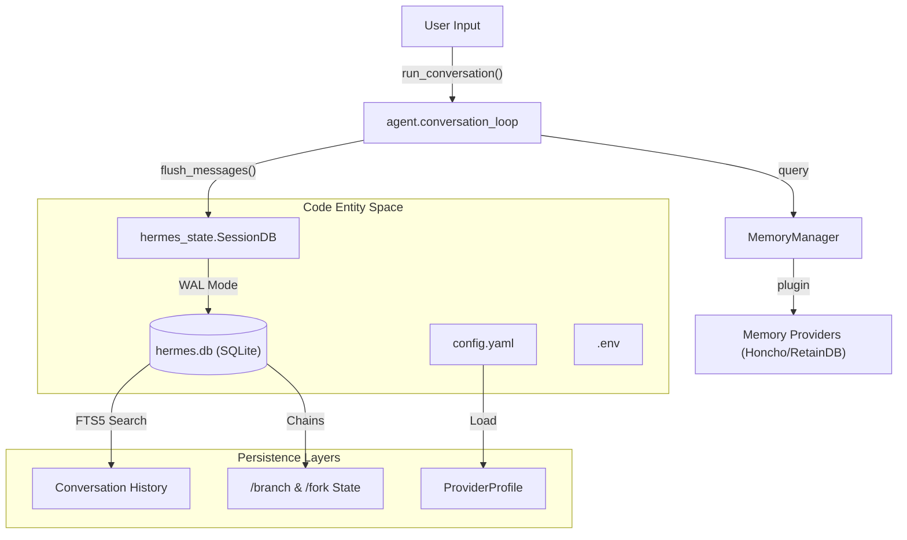
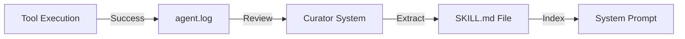

# Persistence & State

Relevant source files

The following files were used as context for generating this wiki page:

- [.env.example](../.env.example)
- [AGENTS.md](../AGENTS.md)
- [README.md](../README.md)
- [agent/agent_init.py](../agent/agent_init.py)
- [agent/agent_runtime_helpers.py](../agent/agent_runtime_helpers.py)
- [agent/chat_completion_helpers.py](../agent/chat_completion_helpers.py)
- [agent/context_compressor.py](../agent/context_compressor.py)
- [agent/conversation_compression.py](../agent/conversation_compression.py)
- [agent/conversation_loop.py](../agent/conversation_loop.py)
- [agent/tool_executor.py](../agent/tool_executor.py)
- [agent/turn_context.py](../agent/turn_context.py)
- [cli-config.yaml.example](../cli-config.yaml.example)
- [cli.py](../cli.py)
- contributors/emails/lanyusea@gmail.com
- contributors/emails/stanislav@local
- [gateway/config.py](../gateway/config.py)
- [gateway/platforms/base.py](../gateway/platforms/base.py)
- [gateway/run.py](../gateway/run.py)
- [gateway/session.py](../gateway/session.py)
- [hermes_cli/commands.py](../hermes_cli/commands.py)
- [hermes_cli/config.py](../hermes_cli/config.py)
- [hermes_state.py](../hermes_state.py)
- [run_agent.py](../run_agent.py)
- [tests/agent/test_compression_anti_thrash_persistence.py](../tests/agent/test_compression_anti_thrash_persistence.py)
- [tests/agent/test_compression_concurrent_fork.py](../tests/agent/test_compression_concurrent_fork.py)
- [tests/agent/test_compression_rotation_state.py](../tests/agent/test_compression_rotation_state.py)
- [tests/agent/test_context_compressor.py](../tests/agent/test_context_compressor.py)
- [tests/agent/test_credential_pool_routing.py](../tests/agent/test_credential_pool_routing.py)
- [tests/agent/test_idle_compaction_lock_and_guards.py](../tests/agent/test_idle_compaction_lock_and_guards.py)
- [tests/agent/test_turn_context.py](../tests/agent/test_turn_context.py)
- [tests/agent/test_turn_context_overflow_warning.py](../tests/agent/test_turn_context_overflow_warning.py)
- [tests/cli/test_cli_interrupt_ack_race.py](../tests/cli/test_cli_interrupt_ack_race.py)
- [tests/cli/test_cli_shutdown_memory_messages.py](../tests/cli/test_cli_shutdown_memory_messages.py)
- [tests/gateway/test_config.py](../tests/gateway/test_config.py)
- [tests/gateway/test_platform_base.py](../tests/gateway/test_platform_base.py)
- [tests/gateway/test_session.py](../tests/gateway/test_session.py)
- [tests/gateway/test_session_reset_notify.py](../tests/gateway/test_session_reset_notify.py)
- [tests/gateway/test_shared_group_sender_prefix.py](../tests/gateway/test_shared_group_sender_prefix.py)
- [tests/gateway/test_telegram_noise_filter.py](../tests/gateway/test_telegram_noise_filter.py)
- [tests/gateway/test_tts_media_routing.py](../tests/gateway/test_tts_media_routing.py)
- [tests/hermes_cli/test_commands.py](../tests/hermes_cli/test_commands.py)
- [tests/run_agent/test_413_compression.py](../tests/run_agent/test_413_compression.py)
- [tests/run_agent/test_compression_feasibility.py](../tests/run_agent/test_compression_feasibility.py)
- [tests/run_agent/test_credential_pool_interrupt.py](../tests/run_agent/test_credential_pool_interrupt.py)
- [tests/run_agent/test_run_agent.py](../tests/run_agent/test_run_agent.py)
- [tests/test_hermes_state.py](../tests/test_hermes_state.py)
- [tests/test_hermes_state_compression_locks.py](../tests/test_hermes_state_compression_locks.py)
- [tests/tools/test_daemon_pool.py](../tests/tools/test_daemon_pool.py)
- [tools/daemon_pool.py](../tools/daemon_pool.py)

Hermes maintains a robust persistence layer to ensure conversation continuity, agent memory, and state recovery across restarts and platform migrations. State is primarily managed through a centralized SQLite database (`hermes.db`), supplemented by pluggable memory providers and an autonomous skill management system.

## Overview of State Management

The Hermes state system is divided into three primary functional areas:
1.  **Session Persistence**: Long-term storage of message history, token usage, and session metadata using SQLite [hermes_state.py:3-15](../hermes_state.py#L3-L15).
2.  **Memory Systems**: Pluggable architectures that inject relevant historical context or long-term facts into the active conversation loop [agent/memory_manager.py:148-149](../agent/memory_manager.py#L148-L149).
3.  **Skill Lifecycle**: The "Curator" system that evolves the agent's capabilities by consolidating successful patterns into persistent skills [agent/prompt_builder.py:165-166](../agent/prompt_builder.py#L165-L166).

### Code-to-Entity Mapping: State Flow

The following diagram illustrates how natural language interactions transition into persisted code entities within the filesystem and database.

**Hermes State Architecture**

Sources: [run_agent.py:136-155](../run_agent.py#L136-L155), [hermes_state.py:1-15](../hermes_state.py#L1-L15), [agent/conversation_loop.py:1-15](../agent/conversation_loop.py#L1-L15), [gateway/session.py:148-170](../gateway/session.py#L148-L170)

---

## 6.1 SessionDB & SQLite State Store
The `SessionDB` class in `hermes_state.py` serves as the primary interface for all persistence operations. It utilizes SQLite with **Write-Ahead Logging (WAL)** to support concurrent access from multiple gateway platforms and the CLI [hermes_state.py:9-15](../hermes_state.py#L9-L15).

*   **Full-Text Search**: Uses the `FTS5` virtual table to allow the agent to search across its entire history efficiently [hermes_state.py:11-12](../hermes_state.py#L11-L12).
*   **Session Chaining**: Supports "compression-triggered session splitting," where long histories are archived into parent sessions, and active work continues in a fresh "tip" session [hermes_state.py:12-13](../hermes_state.py#L12-L13).
*   **Concurrency**: Implements `compression_locks` to prevent multiple processes from attempting to summarize the same session simultaneously [hermes_state.py:41-44](../hermes_state.py#L41-L44).

For details, see [SessionDB & SQLite State Store](#6.1).

Sources: [hermes_state.py:1-44](../hermes_state.py#L1-L44), [agent/context_compressor.py:130-143](../agent/context_compressor.py#L130-L143)

---

## 6.2 Memory Providers & Plugins
Hermes uses a `MemoryManager` to manage the "Volatile" and "Persistent" tiers of an agent's context. Unlike the raw message history in `SessionDB`, Memory Providers (like **Honcho** or **RetainDB**) perform semantic retrieval to inject relevant facts into the system prompt [agent/memory_manager.py:148-149](../agent/memory_manager.py#L148-L149).

*   **Pluggable Interface**: The system supports multiple backends via a unified `memory_provider` contract.
*   **Query Rewriting**: High-tier providers can rewrite user queries to better search historical vector embeddings.
*   **Injection**: Memory is injected into the system prompt during the `build_turn_context` phase of the conversation loop [agent/conversation_loop.py:44-47](../agent/conversation_loop.py#L44-L47).

For details, see [Memory Providers & Plugins](#6.2).

Sources: [agent/memory_manager.py:148-149](../agent/memory_manager.py#L148-L149), [agent/conversation_loop.py:44-49](../agent/conversation_loop.py#L44-L49), [run_agent.py:111-115](../run_agent.py#L111-L115)

---

## 6.3 Curator & Skill Lifecycle
The **Curator** is an autonomous background process that manages the "Procedural Memory" of the agent, known as **Skills**. This system ensures that the agent's state includes not just what was said, but what the agent *learned to do* [agent/prompt_builder.py:163-170](../agent/prompt_builder.py#L163-L170).

*   **Skill Consolidation**: Analyzes successful tool usage and consolidates them into `.md` skill files in the `skills/` directory.
*   **Usage Tracking**: Persists metadata about how often skills are used to prioritize them in the progressive disclosure system.
*   **Provenance**: Tracks the origin of every skill to maintain a chain of trust and allow for easy backups and restores [agent/prompt_builder.py:165-166](../agent/prompt_builder.py#L165-L166).

**Skill State Transition**

For details, see [Curator & Skill Lifecycle](#6.3).

Sources: [agent/prompt_builder.py:163-170](../agent/prompt_builder.py#L163-L170), [run_agent.py:136-140](../run_agent.py#L136-L140), [hermes_cli/commands.py:106-109](../hermes_cli/commands.py#L106-L109)

---
