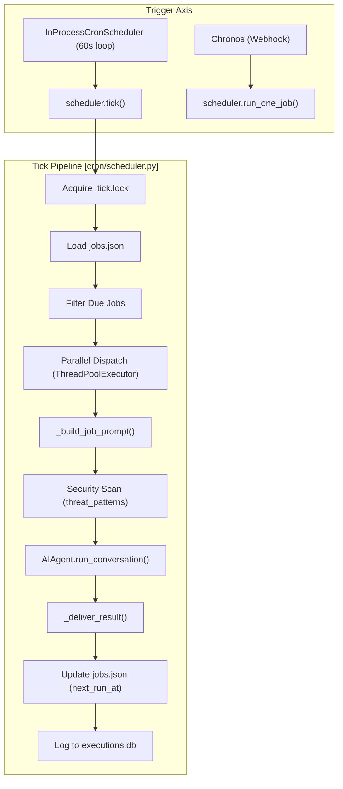
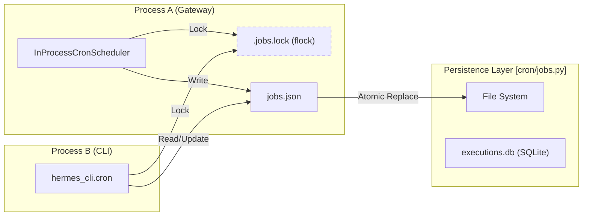

# Cron Scheduler Internals

Relevant source files

The following files were used as context for generating this wiki page:

- [cron/executions.py](../cron/executions.py)
- [cron/jobs.py](../cron/jobs.py)
- [cron/lifecycle_guard.py](../cron/lifecycle_guard.py)
- [cron/scheduler.py](../cron/scheduler.py)
- [cron/scheduler_provider.py](../cron/scheduler_provider.py)
- [gateway/restart_loop_guard.py](../gateway/restart_loop_guard.py)
- [hermes_cli/cron.py](../hermes_cli/cron.py)
- [hermes_cli/subcommands/cron.py](../hermes_cli/subcommands/cron.py)
- [plugins/cron_providers/chronos/__init__.py](../plugins/cron_providers/chronos/__init__.py)
- [tests/cron/test_cron_prompt_injection_skill.py](../tests/cron/test_cron_prompt_injection_skill.py)
- [tests/cron/test_cron_script.py](../tests/cron/test_cron_script.py)
- [tests/cron/test_execution_ledger.py](../tests/cron/test_execution_ledger.py)
- [tests/cron/test_jobs.py](../tests/cron/test_jobs.py)
- [tests/cron/test_scheduler.py](../tests/cron/test_scheduler.py)
- [tests/cron/test_scheduler_mcp_init.py](../tests/cron/test_scheduler_mcp_init.py)
- [tests/cron/test_scheduler_provider.py](../tests/cron/test_scheduler_provider.py)
- [tests/hermes_cli/test_cron.py](../tests/hermes_cli/test_cron.py)
- [tests/hermes_cli/test_gateway_restart_loop.py](../tests/hermes_cli/test_gateway_restart_loop.py)
- [tests/tools/test_cronjob_tools.py](../tests/tools/test_cronjob_tools.py)
- [tools/cronjob_tools.py](../tools/cronjob_tools.py)
- [website/docs/developer-guide/agent-loop.md](../website/docs/developer-guide/agent-loop.md)
- [website/docs/developer-guide/architecture.md](../website/docs/developer-guide/architecture.md)
- [website/docs/developer-guide/cron-internals.md](../website/docs/developer-guide/cron-internals.md)
- [website/docs/developer-guide/gateway-internals.md](../website/docs/developer-guide/gateway-internals.md)
- [website/docs/user-guide/features/cron.md](../website/docs/user-guide/features/cron.md)

The Hermes cron subsystem manages the lifecycle and automated execution of agent tasks. It decouples the **Trigger** (deciding *when* a job fires) from the **Execution** (running the agent and delivering results). This architecture supports both traditional background polling and modern scale-to-zero managed scheduling.

## The Tick Pipeline

The `tick()` function is the central entry point for the built-in scheduler. It follows a structured pipeline to ensure at-most-once execution and parallel processing.

### 1. Claim & Lock
The scheduler uses a file-based lock `~/.hermes/cron/.tick.lock` to ensure only one process executes a tick at a time [cron/scheduler.py:7-9](../cron/scheduler.py#L7-L9). It loads all jobs from `jobs.json` and filters for those where `next_run_at <= now` and `enabled` is true [cron/scheduler.py:4-5](../cron/scheduler.py#L4-L5).

### 2. Parallel Dispatch
Jobs are dispatched using a `ThreadPoolExecutor` [cron/scheduler.py:13](../cron/scheduler.py#L13). 
- **Standard Jobs**: Run in parallel to prevent a long-running job from blocking the rest of the queue.
- **Workdir Jobs**: Jobs with a specified `workdir` are executed sequentially to avoid corrupting the process-global working directory state [website/docs/user-guide/features/cron.md:124-126](../website/docs/user-guide/features/cron.md#L124-L126).

### 3. Prompt Assembly & Security Scanning
Before invocation, the system assembles the final prompt. This includes:
- Injecting the base job prompt.
- Loading any attached **Skills** [website/docs/user-guide/features/cron.md:82-84](../website/docs/user-guide/features/cron.md#L82-L84).
- **Scanning**: The assembled prompt is passed through `_scan_cron_skill_assembled` to detect prompt injection or deceptive directives [tools/cronjob_tools.py:97-102](../tools/cronjob_tools.py#L97-L102). If a violation is found, `CronPromptInjectionBlocked` is raised [cron/scheduler.py:143-153](../cron/scheduler.py#L143-L153).

### 4. Agent Invocation
A fresh `AIAgent` instance is created for every run to ensure session isolation [website/docs/developer-guide/cron-internals.md:174-175](../website/docs/developer-guide/cron-internals.md#L174-L175).
- **Toolset Restriction**: Certain tools like `cronjob`, `messaging`, and `clarify` are hard-blocked in cron context to prevent infinite loops or blocking on interactive input [cron/scheduler.py:159-169](../cron/scheduler.py#L159-L169).
- **Silent Marker**: If the prompt contains the `SILENT_MARKER`, the job executes without sending a notification to the delivery target unless an error occurs [tests/cron/test_scheduler.py:12](../tests/cron/test_scheduler.py#L12).

### 5. Teardown & Ledger
After execution, the scheduler:
- Records the result in `executions.db` via the `ExecutionLedger` [cron/scheduler_provider.py:87-89](../cron/scheduler_provider.py#L87-L89).
- Updates `last_run_at` and calculates the next fire time [website/docs/developer-guide/cron-internals.md:96-98](../website/docs/developer-guide/cron-internals.md#L96-L98).
- Titles the session in the `SessionDB` using `_set_cron_session_title` to prevent untitled sessions in the UI [cron/scheduler.py:51-68](../cron/scheduler.py#L51-L68).

**Data Flow Diagram: The Tick Pipeline**

Sources: [cron/scheduler.py:4-23](../cron/scheduler.py#L4-L23), [cron/scheduler_provider.py:105-114](../cron/scheduler_provider.py#L105-L114), [website/docs/developer-guide/cron-internals.md:86-101](../website/docs/developer-guide/cron-internals.md#L86-L101).

---

## Scheduler Providers

Hermes abstracts the trigger mechanism behind the `CronScheduler` interface [cron/scheduler_provider.py:27-35](../cron/scheduler_provider.py#L27-L35).

| Provider | Class Name | Mechanism | Use Case |
| :--- | :--- | :--- | :--- |
| **Built-in** | `InProcessCronScheduler` | 60s background thread loop in Gateway process. | Default local/server usage. |
| **Chronos** | `ChronosProvider` | Registers one-shot webhooks with Nous Portal. | Scale-to-zero / Serverless deployments. |

### InProcessCronScheduler
This is the default provider. It starts a daemon thread that calls `tick()` every 60 seconds [cron/scheduler_provider.py:162-172](../cron/scheduler_provider.py#L162-L172). It maintains a `ticker_heartbeat` file so that `hermes cron status` can verify the thread is actually looping [cron/jobs.py:72-77](../cron/jobs.py#L72-L77).

### Chronos Managed-Cron
When `cron.provider` is set to `chronos`, Hermes stops polling. Instead:
1. When a job is created/updated, Chronos calls the Nous Portal to arm a managed one-shot [website/docs/developer-guide/cron-internals.md:148-150](../website/docs/developer-guide/cron-internals.md#L148-L150).
2. At the scheduled time, Nous Portal sends a `POST /api/cron/fire` request to the Gateway [website/docs/developer-guide/cron-internals.md:151-152](../website/docs/developer-guide/cron-internals.md#L151-L152).
3. The Gateway validates the JWT and executes the job immediately.

Sources: [cron/scheduler_provider.py:1-19](../cron/scheduler_provider.py#L1-L19), [cron/jobs.py:72-85](../cron/jobs.py#L72-L85), [website/docs/developer-guide/cron-internals.md:132-156](../website/docs/developer-guide/cron-internals.md#L132-L156).

---

## Storage & Locking

### jobs.json & Cross-Process Locking
Jobs are stored in a profile-specific `jobs.json` [cron/jobs.py:66-71](../cron/jobs.py#L66-L71). To prevent corruption when multiple processes (e.g., the Gateway ticker and a CLI `hermes cron create` command) access the file, Hermes uses:
- **`RLock`**: In-process thread safety [cron/jobs.py:90](../cron/jobs.py#L90).
- **`fcntl` / `msvcrt`**: Advisory file locking (`.jobs.lock`) for cross-process synchronization [cron/jobs.py:22-33](../cron/jobs.py#L22-L33).
- **Atomic Writes**: The file is written to a temporary location and then renamed to ensure atomicity [cron/jobs.py:42](../cron/jobs.py#L42).

### Execution Ledger (executions.db)
While `jobs.json` stores the *desired state* and *last result*, the `executions.db` (SQLite) acts as a high-fidelity ledger for every attempt [cron/scheduler_provider.py:87-89](../cron/scheduler_provider.py#L87-L89). It tracks:
- `execution_id`: Unique ID for the specific run.
- `status`: `running`, `success`, `failed`, or `interrupted`.
- `source`: Which provider triggered the fire.

**Code Entity Map: Storage & Locking**

Sources: [cron/jobs.py:4-43](../cron/jobs.py#L4-L43), [cron/jobs.py:87-100](../cron/jobs.py#L87-L100), [cron/scheduler_provider.py:85-90](../cron/scheduler_provider.py#L85-L90).

---

## Multi-Profile Multiplexing

Cron is strictly profile-scoped [cron/jobs.py:54-55](../cron/jobs.py#L54-L55). Each profile has its own:
- `HERMES_HOME/cron/jobs.json`
- `HERMES_HOME/cron/output/`
- Environment variables (`.env`) and `config.yaml`.

The scheduler uses `get_hermes_home()` to anchor all paths, ensuring that a job created in the `research` profile cannot access tools or credentials from the `coding` profile [cron/jobs.py:54-65](../cron/jobs.py#L54-L65). The `use_cron_store` context manager allows the system to temporarily redirect storage operations to a specific profile's directory without mutating global state [cron/jobs.py:156-171](../cron/jobs.py#L156-L171).

Sources: [cron/jobs.py:54-66](../cron/jobs.py#L54-L66), [cron/jobs.py:156-175](../cron/jobs.py#L156-L175).

---
