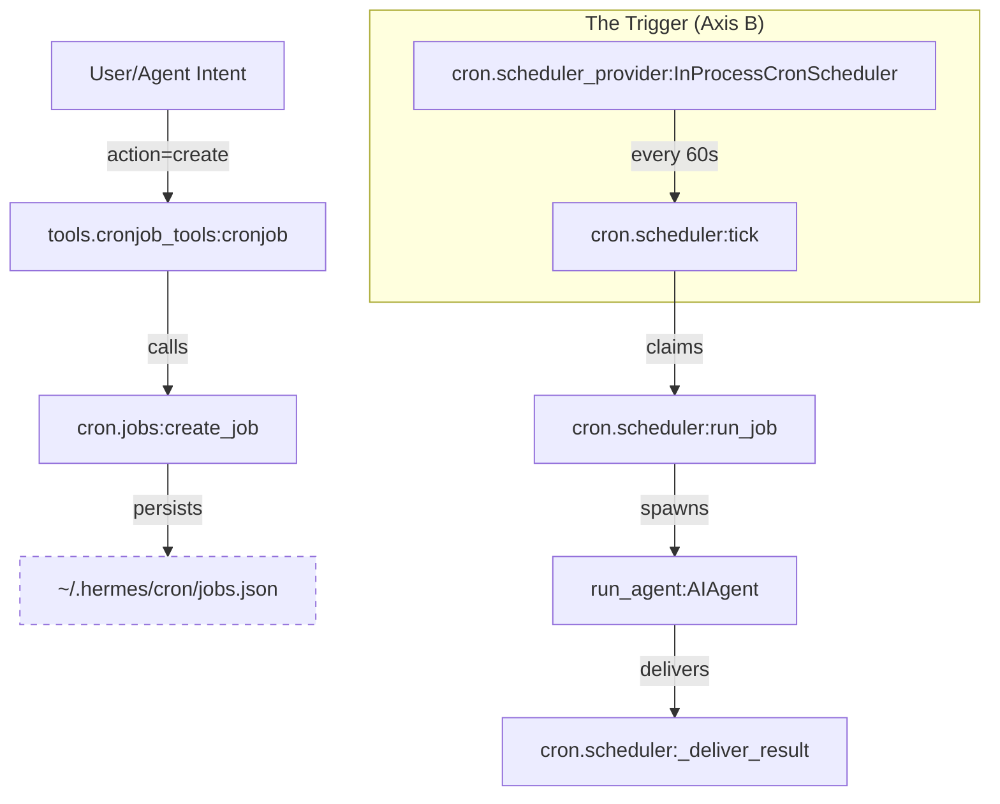
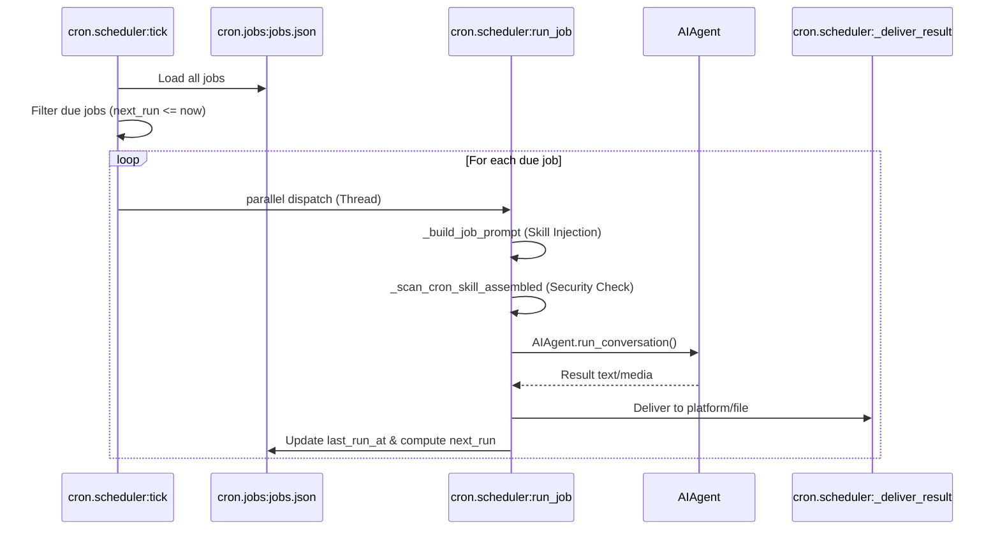

# Cron Job Management & Security

Relevant source files

The following files were used as context for generating this wiki page:

- [cron/executions.py](../cron/executions.py)
- [cron/jobs.py](../cron/jobs.py)
- [cron/lifecycle_guard.py](../cron/lifecycle_guard.py)
- [cron/scheduler.py](../cron/scheduler.py)
- [cron/scheduler_provider.py](../cron/scheduler_provider.py)
- [gateway/restart_loop_guard.py](../gateway/restart_loop_guard.py)
- [hermes_cli/cron.py](../hermes_cli/cron.py)
- [hermes_cli/subcommands/cron.py](../hermes_cli/subcommands/cron.py)
- [plugins/cron_providers/chronos/__init__.py](../plugins/cron_providers/chronos/__init__.py)
- [tests/cron/test_cron_prompt_injection_skill.py](../tests/cron/test_cron_prompt_injection_skill.py)
- [tests/cron/test_cron_script.py](../tests/cron/test_cron_script.py)
- [tests/cron/test_execution_ledger.py](../tests/cron/test_execution_ledger.py)
- [tests/cron/test_jobs.py](../tests/cron/test_jobs.py)
- [tests/cron/test_scheduler.py](../tests/cron/test_scheduler.py)
- [tests/cron/test_scheduler_mcp_init.py](../tests/cron/test_scheduler_mcp_init.py)
- [tests/cron/test_scheduler_provider.py](../tests/cron/test_scheduler_provider.py)
- [tests/hermes_cli/test_cron.py](../tests/hermes_cli/test_cron.py)
- [tests/hermes_cli/test_gateway_restart_loop.py](../tests/hermes_cli/test_gateway_restart_loop.py)
- [tests/tools/test_cronjob_tools.py](../tests/tools/test_cronjob_tools.py)
- [tools/cronjob_tools.py](../tools/cronjob_tools.py)
- [website/docs/developer-guide/agent-loop.md](../website/docs/developer-guide/agent-loop.md)
- [website/docs/developer-guide/architecture.md](../website/docs/developer-guide/architecture.md)
- [website/docs/developer-guide/cron-internals.md](../website/docs/developer-guide/cron-internals.md)
- [website/docs/developer-guide/gateway-internals.md](../website/docs/developer-guide/gateway-internals.md)
- [website/docs/user-guide/features/cron.md](../website/docs/user-guide/features/cron.md)

The Hermes cron system enables automated agent execution via natural language or standard cron expressions. It supports complex scheduling, skill injection, multi-platform delivery, and a robust security model designed to prevent prompt injection and recursive scheduling loops.

## System Architecture

The cron subsystem is split into two primary axes: the **Trigger** (deciding *when* to fire) and the **Orchestrator** (deciding *how* to execute and deliver).

### Natural Language to Code Entity Mapping: Execution Flow
The following diagram bridges the user's intent to the underlying code entities that manage the lifecycle of a job.

"Cron Job Lifecycle: Intent to Execution"

Sources: [cron/scheduler_provider.py:10-19](../cron/scheduler_provider.py#L10-L19), [cron/scheduler.py:4-9](../cron/scheduler.py#L4-L9), [tools/cronjob_tools.py:22-35](../tools/cronjob_tools.py#L22-L35)

## The Cron Tool (`cronjob`)

Hermes exposes management through a unified `cronjob` tool. This tool compresses multiple operations into a single schema to avoid context bloat in the LLM's tool registry.

| Action | Function | Description |
| :--- | :--- | :--- |
| `create` | `cron.jobs:create_job` | Schedules a new task with prompt, schedule, and optional skills. |
| `list` | `cron.jobs:list_jobs` | Returns a list of all active/paused jobs. |
| `update` | `cron.jobs:update_job` | Modifies existing job parameters (schedule, prompt, etc.). |
| `pause` | `cron.jobs:pause_job` | Suspends a job without deleting it. |
| `resume` | `cron.jobs:resume_job` | Re-activates a previously paused job. |
| `run` | `cron.scheduler:run_one_job` | Triggers a job immediately, bypassing the schedule. |
| `remove` | `cron.jobs:remove_job` | Deletes the job and its history. |

Sources: [tools/cronjob_tools.py:22-35](../tools/cronjob_tools.py#L22-L35), [cron/jobs.py:7-26](../cron/jobs.py#L7-L26)

## Security & Safety Guards

### Prompt Injection Scanning
Cron jobs often run unattended with `auto-approve` permissions. To mitigate risks, Hermes employs a two-tiered scanning strategy in `tools/cronjob_tools.py`.

1.  **Strict User Scan (`_scan_cron_prompt`)**: Applied at creation/update time to the user-supplied prompt. It blocks destructive commands (`rm -rf /`), secret exfiltration (`cat ~/.env`), and deception directives [tools/cronjob_tools.py:78-88](../tools/cronjob_tools.py#L78-L88).
2.  **Assembled Scan (`_scan_cron_skill_assembled`)**: Applied at runtime to the final prompt after skill content is injected. This scanner is "looser" to avoid false positives on security documentation or postmortems contained within skills, while still blocking unambiguous injection attacks [tools/cronjob_tools.py:97-102](../tools/cronjob_tools.py#L97-L102).

### Invisible Character Sanitization
The scanner detects and strips dangerous Unicode characters (e.g., U+200B Zero-Width Space, U+202E Bidi Override) used for obfuscation [tools/cronjob_tools.py:125-140](../tools/cronjob_tools.py#L125-L140). It specifically allows **Emoji ZWJ sequences** (Zero-Width Joiners) to ensure legitimate emojis (e.g., 👨‍👩‍👧) do not trip the security guard [tools/cronjob_tools.py:160-168](../tools/cronjob_tools.py#L160-L168).

### Gateway Lifecycle Block
To prevent agents from bricking their own host environment, the `GatewayLifecycleBlocked` guard prevents cron jobs from including commands that stop or uninstall the Hermes gateway [cron/lifecycle_guard.py](../cron/lifecycle_guard.py). This is enforced via `contains_gateway_lifecycle_command` [hermes_cli/cron.py:24-26](../hermes_cli/cron.py#L24-L26).

### Toolset Restrictions
Cron-spawned agents are automatically stripped of interactive toolsets to prevent "hanging" executions:
*   `cronjob`: Prevents recursive scheduling loops [cron/scheduler.py:169](../cron/scheduler.py#L169).
*   `messaging`: Requires a live interactive session [cron/scheduler.py:170](../cron/scheduler.py#L170).
*   `clarify`: Prevents the agent from blocking on user input [cron/scheduler.py:171](../cron/scheduler.py#L171).

Sources: [tools/cronjob_tools.py:49-73](../tools/cronjob_tools.py#L49-L73), [cron/scheduler.py:156-176](../cron/scheduler.py#L156-L176), [hermes_cli/cron.py:24-26](../hermes_cli/cron.py#L24-L26)

## Delivery Targets & "No-Agent" Mode

### Delivery Routing
Jobs can route their output to multiple targets via `_resolve_delivery_target`:
*   **origin**: Delivers back to the platform/chat where the job was created [tests/cron/test_scheduler.py:140-154](../tests/cron/test_scheduler.py#L140-L154).
*   **local**: Saves output as markdown files in `~/.hermes/cron/output/` [cron/jobs.py:101](../cron/jobs.py#L101).
*   **all**: Broadcasts to all configured "home" channels (e.g., `TELEGRAM_HOME_CHANNEL`) [tests/cron/test_scheduler.py:171-185](../tests/cron/test_scheduler.py#L171-L185).

### No-Agent Mode
A job can be configured with `no_agent: true`. In this mode, Hermes bypasses the LLM entirely and executes a shell script defined in the `script` field. The raw `stdout` is captured and delivered directly to the targets [website/docs/user-guide/features/cron.md:20](../website/docs/user-guide/features/cron.md#L20), [hermes_cli/cron.py:161-162](../hermes_cli/cron.py#L161-L162).

## Data Flow: From Tick to Delivery

The `cron.scheduler:tick` function is the heartbeat of the system, typically invoked every 60 seconds by the `GatewayRunner` [cron/scheduler.py:4-9](../cron/scheduler.py#L4-L9).

"Cron Execution Pipeline"

Sources: [cron/scheduler.py:86-140](../cron/scheduler.py#L86-L140), [cron/jobs.py:81-100](../cron/jobs.py#L81-L100), [tests/cron/test_scheduler.py:12-15](../tests/cron/test_scheduler.py#L12-L15)

## CLI Subcommand: `hermes cron`

The `hermes cron` subcommand provides administrative access to the scheduler:

*   `hermes cron list`: Displays all jobs, their status (active/paused/completed), and last run results [hermes_cli/cron.py:99-108](../hermes_cli/cron.py#L99-L108).
*   `hermes cron status`: Checks if the ticker heartbeat file (`~/.hermes/cron/ticker_heartbeat`) is stale [cron/jobs.py:72-77](../cron/jobs.py#L72-L77).
*   `hermes cron tick`: Manually triggers a scheduler cycle [hermes_cli/cron.py:5](../hermes_cli/cron.py#L5).

Sources: [hermes_cli/cron.py:1-6](../hermes_cli/cron.py#L1-L6), [cron/jobs.py:72-85](../cron/jobs.py#L72-L85)

---
