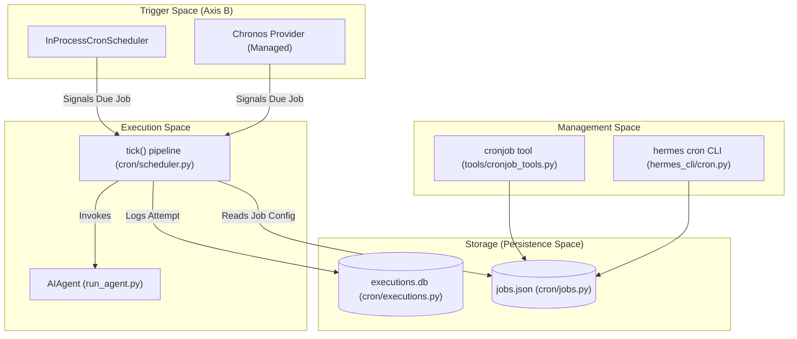

# Scheduled Tasks (Cron)

Relevant source files

The following files were used as context for generating this wiki page:

- [cron/executions.py](../cron/executions.py)
- [cron/jobs.py](../cron/jobs.py)
- [cron/lifecycle_guard.py](../cron/lifecycle_guard.py)
- [cron/scheduler.py](../cron/scheduler.py)
- [cron/scheduler_provider.py](../cron/scheduler_provider.py)
- [gateway/restart_loop_guard.py](../gateway/restart_loop_guard.py)
- [hermes_cli/cron.py](../hermes_cli/cron.py)
- [hermes_cli/subcommands/cron.py](../hermes_cli/subcommands/cron.py)
- [plugins/cron_providers/chronos/__init__.py](../plugins/cron_providers/chronos/__init__.py)
- [tests/cron/test_cron_prompt_injection_skill.py](../tests/cron/test_cron_prompt_injection_skill.py)
- [tests/cron/test_cron_script.py](../tests/cron/test_cron_script.py)
- [tests/cron/test_execution_ledger.py](../tests/cron/test_execution_ledger.py)
- [tests/cron/test_jobs.py](../tests/cron/test_jobs.py)
- [tests/cron/test_scheduler.py](../tests/cron/test_scheduler.py)
- [tests/cron/test_scheduler_mcp_init.py](../tests/cron/test_scheduler_mcp_init.py)
- [tests/cron/test_scheduler_provider.py](../tests/cron/test_scheduler_provider.py)
- [tests/hermes_cli/test_cron.py](../tests/hermes_cli/test_cron.py)
- [tests/hermes_cli/test_gateway_restart_loop.py](../tests/hermes_cli/test_gateway_restart_loop.py)
- [tests/tools/test_cronjob_tools.py](../tests/tools/test_cronjob_tools.py)
- [tools/cronjob_tools.py](../tools/cronjob_tools.py)
- [website/docs/developer-guide/agent-loop.md](../website/docs/developer-guide/agent-loop.md)
- [website/docs/developer-guide/architecture.md](../website/docs/developer-guide/architecture.md)
- [website/docs/developer-guide/cron-internals.md](../website/docs/developer-guide/cron-internals.md)
- [website/docs/developer-guide/gateway-internals.md](../website/docs/developer-guide/gateway-internals.md)
- [website/docs/user-guide/features/cron.md](../website/docs/user-guide/features/cron.md)

The Hermes cron system enables the automated execution of agent tasks on a schedule. Unlike traditional cron systems that execute shell commands, Hermes cron jobs primarily execute **agent turns**—allowing the agent to use its full suite of tools, skills, and reasoning to complete scheduled objectives.

The system supports one-shot delays, recurring intervals, and complex cron expressions. It is designed for multi-profile isolation, ensuring that jobs created in one profile use that profile's specific configuration, environment variables, and credentials.

### System Overview

The cron subsystem is composed of four primary layers:
1.  **Management Layer**: The `cronjob` tool and `hermes cron` CLI for CRUD operations.
2.  **Storage Layer**: A JSON-based job store (`jobs.json`) and an SQLite-based execution ledger (`executions.db`).
3.  **Trigger Layer (Axis B)**: Pluggable providers that decide *when* a job should fire (e.g., the built-in 60s ticker or the Chronos managed-cron provider).
4.  **Execution Layer**: The logic that assembles the prompt, invokes the `AIAgent`, and delivers results to targets like Telegram, Slack, or local files.

### High-Level Architecture

The following diagram illustrates the relationship between the management tools, the scheduler providers, and the core execution logic.

**Cron System Architecture**

Sources: [cron/scheduler.py:1-48](../cron/scheduler.py#L1-L48), [cron/jobs.py:54-85](../cron/jobs.py#L54-L85), [cron/scheduler_provider.py:10-19](../cron/scheduler_provider.py#L10-L19), [tools/cronjob_tools.py:22-35](../tools/cronjob_tools.py#L22-L35)

---

### Key Components

#### 1. Job Storage and Lifecycle
Jobs are stored in a profile-scoped `jobs.json` file located at `~/.hermes/profiles/<name>/cron/jobs.json` [cron/jobs.py:54-71](../cron/jobs.py#L54-L71). The system uses cross-process advisory locking (`.jobs.lock`) to prevent clobbering when multiple processes (e.g., a CLI edit and a Gateway tick) access the store simultaneously [cron/jobs.py:22-33](../cron/jobs.py#L22-L33).

| State | Description |
| :--- | :--- |
| `scheduled` | The job is active and waiting for its `next_run_at` time. |
| `paused` | The job is suspended and will not be evaluated by the scheduler. |
| `completed` | A one-shot job that has fired, or a recurring job that reached its `repeat` limit. |
| `running` | A transient state used during execution to prevent double-firing. |

Sources: [cron/jobs.py:66-102](../cron/jobs.py#L66-L102), [website/docs/developer-guide/cron-internals.md:66-74](../website/docs/developer-guide/cron-internals.md#L66-L74)

#### 2. The Scheduler Providers
Hermes uses a pluggable provider interface (`CronScheduler`) to handle the "Axis B" trigger logic [cron/scheduler_provider.py:27-35](../cron/scheduler_provider.py#L27-L35).

*   **InProcessCronScheduler (Built-in)**: A background thread that runs a 60-second loop ("tick"). It is the default and requires the Hermes Gateway to be running [cron/scheduler_provider.py:162-175](../cron/scheduler_provider.py#L162-L175).
*   **Chronos (Managed)**: Designed for scale-to-zero environments. Instead of a local loop, it arms a one-shot webhook via the Nous Portal, waking the agent only when a job is due [cron/scheduler_provider.py:132-156](../cron/scheduler_provider.py#L132-L156).

Sources: [cron/scheduler_provider.py:1-19](../cron/scheduler_provider.py#L1-L19), [hermes_cli/cron.py:51-63](../hermes_cli/cron.py#L51-L63), [website/docs/developer-guide/cron-internals.md:103-128](../website/docs/developer-guide/cron-internals.md#L103-L128)

#### 3. Execution & Delivery
When a job fires, the scheduler executes the `tick()` pipeline:
1.  **Claiming**: Uses a file-based lock (`.tick.lock`) and updates the job state to `running` in `jobs.json` to ensure at-most-once execution [cron/scheduler.py:7-9](../cron/scheduler.py#L7-L9).
2.  **Prompt Assembly**: Combines the job's `prompt` with any attached `skills`. If `workdir` is specified, it also loads local `AGENTS.md` or `.cursorrules` [cron/scheduler.py:143-153](../cron/scheduler.py#L143-L153).
3.  **Agent Invocation**: Spawns a fresh `AIAgent` session. Interactive toolsets like `messaging` and `clarify` are automatically disabled to prevent the agent from hanging on user input [cron/scheduler.py:156-176](../cron/scheduler.py#L156-L176).
4.  **Delivery**: Results are routed to the `deliver` target (e.g., `origin`, `local`, or specific platform IDs like `telegram:chat_id`) [cron/scheduler.py:90-140](../cron/scheduler.py#L90-L140).

Sources: [cron/scheduler.py:51-88](../cron/scheduler.py#L51-L88), [website/docs/user-guide/features/cron.md:96-126](../website/docs/user-guide/features/cron.md#L96-L126), [website/docs/developer-guide/cron-internals.md:81-101](../website/docs/developer-guide/cron-internals.md#L81-L101)

---

### Security & Safety Guards

The cron system implements several layers of protection for unattended execution:

*   **Prompt Injection Scanning**: Both the user-supplied prompt and the final assembled prompt (including skills) are scanned for malicious directives like "ignore previous instructions" or secret exfiltration patterns [tools/cronjob_tools.py:49-116](../tools/cronjob_tools.py#L49-L116).
*   **Gateway Lifecycle Block**: Cron jobs are strictly forbidden from executing commands that manage the gateway itself (e.g., `hermes gateway stop`), preventing agents from accidentally killing their own scheduler [cron/lifecycle_guard.py:1-10](../cron/lifecycle_guard.py#L1-L10).
*   **Provider Snapshotting**: To prevent unexpected costs, jobs "snapshot" their LLM provider/model at creation. If the global default changes, the job "fails closed" until the user explicitly updates it [website/docs/user-guide/features/cron.md:24-27](../website/docs/user-guide/features/cron.md#L24-L27).

Sources: [tools/cronjob_tools.py:78-102](../tools/cronjob_tools.py#L78-L102), [hermes_cli/cron.py:18-26](../hermes_cli/cron.py#L18-L26), [tests/tools/test_cronjob_tools.py:17-59](../tests/tools/test_cronjob_tools.py#L17-L59)

---

### Detailed Internals & Management

For deeper technical details, refer to the following child pages:

*   **[Cron Scheduler Internals](#7.1)**
    Covers the tick pipeline, `InProcessCronScheduler` vs `Chronos`, the `executions.db` ledger, and the mechanics of multi-profile multiplexing.
*   **[Cron Job Management & Security](#7.2)**
    Details the `cronjob` tool operations, delivery target resolution, No-Agent mode, and the `_scan_cron_prompt` security implementation.

---
